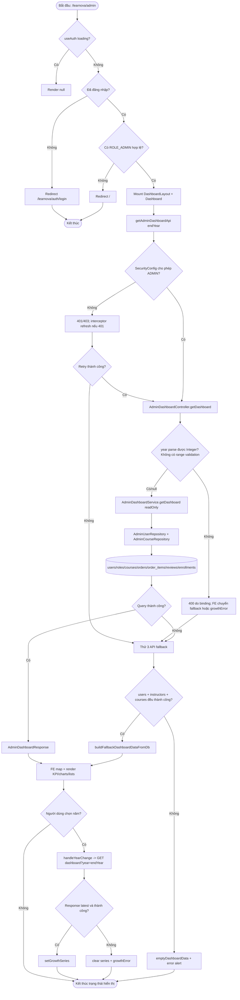

# Detailed Design As-Is — Admin Dashboard

> Phạm vi: màn hình Tổng quan quản trị tại `/learnova/admin`, bao gồm vùng nội dung dashboard và các control dùng được trên admin shell xuất hiện trong ảnh (sidebar, đổi ngôn ngữ, thông báo, cài đặt, menu tài khoản).  
> Quy ước mức xác minh: **Đã xác minh từ code** = có luồng/source trực tiếp; **Suy luận từ ảnh và code** = ghép hành vi hiển thị trong ảnh với source tương ứng; **Chưa xác minh** = không có đủ bằng chứng runtime/data.

## 1. Thông tin màn hình

| Thuộc tính | Nội dung |
| --- | --- |
| Tên màn hình | Tổng quan quản trị / Admin Dashboard |
| Mã màn hình | Không tìm thấy mã màn hình trong ảnh hoặc source — dùng tên kỹ thuật `AdminDashboard` |
| Route/URL | FE: `/learnova/admin`; API chính: `GET /api/learnova/admin/dashboard?year={year}` |
| Actor | Quản trị viên có quyền `ROLE_ADMIN` |
| Mục đích | Hiển thị KPI hệ thống, tăng trưởng người dùng theo tháng, phân bố vai trò, người dùng mới, giảng viên nổi bật và hoạt động gần đây |
| Nguồn phân tích | Ảnh màn hình + FE + BE |
| Loại tài liệu | Reverse-engineered DD – As-Is |
| Mức độ xác minh | Đã xác minh end-to-end cho route, API chính, nhánh fallback, database query, notification và logout; giá trị cụ thể trong ảnh chỉ được suy luận từ dữ liệu runtime |
| File DD | `docs/DD_AdminDashboard.md` |

## 2. Tổng quan chức năng

- `AppRoutes.jsx` gắn index route `/learnova/admin` với `Dashboard` bên trong `RequireRole role="ROLE_ADMIN"` và `DashboardLayout` (`front_end/src/app/routes/AppRoutes.jsx:72-94`).
- FE chặn người chưa đăng nhập bằng redirect `/learnova/auth/login`; người không có `ROLE_ADMIN` bị redirect `/` (`RequireRole.jsx:4-25`). BE kiểm tra lại toàn bộ `/api/learnova/admin/**` bằng `hasRole("ADMIN")` (`SecurityConfig.java:78-80`).
- Khi mở màn hình, `useDashboardData()` gọi `getAdminDashboardApi()` cho năm kết thúc của option hiện tại (`Dashboard.jsx:372-492`). Backend đọc các bảng `users`, `user_role`, `roles`, `courses`, `orders`, `order_items`, `reviews`, `enrollments`, sau đó trả một `AdminDashboardResponse` tổng hợp (`AdminDashboardService.java:37-57`).
- Dữ liệu hiển thị gồm: 4 KPI; biểu đồ cột 12 tháng; biểu đồ doughnut 3 vai trò; tối đa 4 người dùng gần đây; tối đa 4 giảng viên; tối đa 4 hoạt động gần đây (`Dashboard.jsx:516-578`).
- Thao tác nội dung duy nhất là chọn năm. FE gọi lại cùng API với query `year`, chỉ thay `growthSeries`; KPI và các danh sách không đổi theo năm (`Dashboard.jsx:383-404`).
- Nếu API dashboard lỗi, FE gọi song song 3 API `GET /admin/users`, `GET /admin/instructors-management`, `GET /admin/courses-management` rồi tự tổng hợp (`Dashboard.jsx:447-480`). Nếu cả fallback lỗi, FE đặt dữ liệu rỗng và hiện message lỗi.
- Dashboard là read-only: không có thêm/sửa/xóa/export/download trong vùng nội dung. Database chỉ bị đọc. Ngoại lệ là notification có thể cập nhật `notifications.is_read=true`, và logout xóa refresh token/cookie.
- Admin shell cho phép: điều hướng sidebar; đổi `vi/en` và ghi `localStorage`; xem thông báo; đánh dấu thông báo đã đọc; đi đến settings/profile; logout (`Header.jsx:89-168`, `NotificationBell.jsx:13-62`).
- Điểm bắt đầu chính: truy cập route `/learnova/admin`. Điểm kết thúc chính: các state dashboard đã được map và render; hoặc state rỗng + lỗi. Với chọn năm, kết thúc khi biểu đồ tăng trưởng được cập nhật hoặc hiện empty/error message.

## 3. Đối chiếu ảnh với code

| STT | Thành phần trên ảnh | Loại control | File FE | Component/Method | Event/API | Nguồn dữ liệu | Xác minh |
| --: | --- | --- | --- | --- | --- | --- | --- |
| 1 | Logo LearnOva | Image | `SidebarAdmin.jsx:123-129` | `SidebarAdmin` | Không có event | `LogoText.png` | Đã xác minh từ code |
| 2 | Nhóm “CHÍNH” | Section label | `SidebarAdmin.jsx:20-74,131-154` | `adminNavSections` | Không | i18n `admin.main` | Đã xác minh từ code |
| 3 | Bảng điều khiển | NavLink, active | `SidebarAdmin.jsx:24-30,141-149` | `NavLink` | Navigate `/learnova/admin` | Cấu hình tĩnh + i18n | Đã xác minh từ code |
| 4 | Người dùng | NavLink | `SidebarAdmin.jsx:31-36` | `NavLink` | Navigate `/learnova/admin/users` | Cấu hình tĩnh + i18n | Đã xác minh từ code |
| 5 | Giảng viên | NavLink | `SidebarAdmin.jsx:37-42` | `NavLink` | Navigate `/learnova/admin/teachers` | Cấu hình tĩnh + i18n | Đã xác minh từ code |
| 6 | Khóa học | NavLink | `SidebarAdmin.jsx:43-48` | `NavLink` | Navigate `/learnova/admin/courses` | Cấu hình tĩnh + i18n | Đã xác minh từ code |
| 7 | Duyệt khóa học | NavLink | `SidebarAdmin.jsx:49-54` | `NavLink` | Navigate `/learnova/admin/course-approval` | Cấu hình tĩnh + i18n | Đã xác minh từ code |
| 8 | Đơn đăng ký giảng viên | NavLink | `SidebarAdmin.jsx:55-60` | `NavLink` | Navigate `/learnova/admin/teacher-applications` | Cấu hình tĩnh + i18n | Đã xác minh từ code |
| 9 | Danh mục / Thẻ | NavLink | `SidebarAdmin.jsx:61-72` | `NavLink` | Navigate `/categories`, `/tags` | Cấu hình tĩnh + i18n | Đã xác minh từ code |
| 10 | Nhóm “KINH DOANH”, Doanh thu, Mã giảm giá | Section + NavLink | `SidebarAdmin.jsx:75-90` | `adminNavSections` | Navigate `/revenue`, `/vouchers` | Cấu hình tĩnh + i18n | Đã xác minh từ code |
| 11 | Tiêu đề “Tổng quan” | Heading | `Header.jsx:55-92` | `Header` | Theo pathname | i18n `admin.overview` | Đã xác minh từ code |
| 12 | Nút “EN” | Button | `Header.jsx:95-98` | language switch | `i18n.changeLanguage`, `localStorage.setItem` | `i18n.language` | Đã xác minh từ code |
| 13 | Chuông + badge “34” | Button/badge | `NotificationBell.jsx:13-33` | `useNotifications` | `GET /notifications/unread-count` mỗi 45 giây | `notifications` table | Code xác minh; số 34 chỉ suy luận từ runtime ảnh |
| 14 | Nút cài đặt | Link | `Header.jsx:100-106` | `Link` | Navigate `/learnova/admin/settings` | Tĩnh | Đã xác minh từ code |
| 15 | Avatar + “Admin LearnOva” + chevron | Menu button | `Header.jsx:17-34,107-166` | `adminProfile` | Toggle menu; profile/logout | Auth context `currentUser` | Suy luận từ ảnh và code |
| 16 | Tổng số người dùng | KPI card | `Statistics.jsx:10-16,37-63` | `Statistics` | Không | `statistics.totalUsers` | Đã xác minh từ code |
| 17 | Tổng số giảng viên | KPI card | `Statistics.jsx:17-22` | `Statistics` | Không | `statistics.totalTeachers` | Đã xác minh từ code |
| 18 | Tổng số khóa học | KPI card | `Statistics.jsx:23-28` | `Statistics` | Không | `statistics.totalCourses` | Đã xác minh từ code |
| 19 | Tổng doanh thu | KPI card | `Statistics.jsx:29-34` | `Statistics` | Không | `statistics.totalRevenue` | Đã xác minh từ code |
| 20 | Tăng trưởng người dùng | Bar chart | `GrowthChart.jsx:22-145,147-175` | `GrowthChart` | Tooltip Chart.js | `growthSeries[month,value]` | Đã xác minh từ code |
| 21 | “2025 - 2026” | Custom dropdown | `Dashboard.jsx:30-41`; `GrowthChart.jsx:154-162` | `AdminHoverSelect` | `handleYearChange` → dashboard API | 3 option động theo năm hiện tại | Suy luận từ ảnh và code; option ảnh tương ứng năm kết thúc 2026 |
| 22 | Trục Tháng 1…12 | Chart labels | `GrowthChart.jsx:7-39` | `chartLabels` | Không | i18n `admin.months` | Đã xác minh từ code |
| 23 | Phân bố vai trò | Doughnut chart | `RoleDistribution.jsx:6-81` | `RoleDistribution` | Tooltip Chart.js | `roleDistribution` | Đã xác minh từ code |
| 24 | 20 Tổng người dùng giữa doughnut | Center label | `RoleDistribution.jsx:17,94-97` | `totalUsers` | Không | Tổng `item.count` | Code xác minh; số 20 là runtime |
| 25 | Học viên/Giảng viên/Quản trị viên + % + số lượng | Legend | `RoleDistribution.jsx:100-115` | legend map | Không | `name,value,amount` | Đã xác minh từ code |
| 26 | Người dùng gần đây; cột Người dùng/Vai trò | Read-only list | `UserRow.jsx:24-47` | `UserRow` | Không | `recentUsers` tối đa 4 | Đã xác minh từ code |
| 27 | Tên, email, badge role | Text/badge | `UserRow.jsx:6-20` | `UserRowItem` | Không | `RecentUser` response | Đã xác minh từ code |
| 28 | Giảng viên nổi bật | Read-only ranked list | `TeacherRow.jsx:70-113` | `TeacherRow` | Có thể tải avatar URL | `featuredInstructors` tối đa 4 | Đã xác minh từ code |
| 29 | Rank, avatar/initials, tên, số khóa học, rating | Text/image | `TeacherRow.jsx:17-68,83-108` | `TeacherAvatar` | Có thể `GET /courses/video-url` | DB + signed URL | Đã xác minh từ code |
| 30 | Hoạt động gần đây | Read-only activity list | `ActivityRow.jsx:5-40` | `ActivityRow` | Không | `recentActivity` tối đa 4 | Đã xác minh từ code |
| 31 | “NEW USER”, tên, “5 phút trước” | Text | `ActivityRow.jsx:25-35` | `formatActivityTime` | Không | `ActivityItem` | Ảnh và code có nguy cơ lệch casing/localization; xem mục 18 |
| 32 | Popup/dialog | Không thấy trong ảnh | — | — | — | — | Không tồn tại trong dashboard content; header có dropdown ẩn |
| 33 | Download/export | Không thấy | — | — | — | — | Không tìm thấy — từ khóa đã tìm: `download`, `export`; thư mục dashboard đã kiểm tra |

## 4. Danh sách source liên quan

### Frontend — theo thứ tự chạy

| STT | Layer | Đường dẫn file | Class/Component | Method liên quan | Vai trò |
| --: | --- | --- | --- | --- | --- |
| 1 | Route | `front_end/src/app/routes/AppRoutes.jsx` | `App` | admin route lines 72-94 | Mount guard, layout và dashboard |
| 2 | Authorization | `front_end/src/app/routes/RequireRole.jsx` | `RequireRole` | lines 4-25 | FE auth/role redirect |
| 3 | Layout | `front_end/src/app/layouts/admin/DashboardLayout.jsx` | `Dashboard` layout | lines 6-18 | Ghép sidebar, header, outlet |
| 4 | Shell UI | `front_end/src/shared/components/sidebar/sidebar_admin/SidebarAdmin.jsx` | `SidebarAdmin` | lines 20-159 | Menu điều hướng |
| 5 | Shell UI | `front_end/src/shared/components/header/admin_header/Header.jsx` | `Header` | lines 17-172 | Tiêu đề, ngôn ngữ, settings, account/logout |
| 6 | Shell UI | `front_end/src/shared/components/header/admin_header/NotificationBell.jsx` | `NotificationBell` | lines 13-62 | Badge/list/mark read |
| 7 | Hook | `front_end/src/shared/hooks/useNotifications.js` | `useNotifications` | lines 13-78 | Poll count, tải list, mark read |
| 8 | API client | `front_end/src/features/notification/infrastructure/api/NotificationApi.js` | notification APIs | lines 6-46 | HTTP notification |
| 9 | Auth state | `front_end/src/app/providers/AuthContext.jsx` | `logout` | lines 67-79 | Logout và clear state |
| 10 | API client | `front_end/src/features/auth/infrastructure/api/AuthApi.js` | `logoutApi` | lines 19-21 | POST logout |
| 11 | HTTP | `front_end/src/shared/hooks/useAxiosPrivate.js` | `useAxiosPrivate` | lines 11-81 | Retry 401 bằng refresh, logout nếu refresh lỗi |
| 12 | HTTP | `front_end/src/shared/api-client/AxiosClient.js` | `axiosClient` | lines 3-11 | base URL, cookies, JSON header |
| 13 | Page | `front_end/src/features/admin/presentation/dashboard/Dashboard.jsx` | `Dashboard`, `useDashboardData` | lines 372-580 | State, mapping, primary/fallback flow, render |
| 14 | API client | `front_end/src/features/admin/infrastructure/api/DashboardApi.js` | `getAdminDashboardApi` | lines 3-10 | GET dashboard + year |
| 15 | Fallback API | `front_end/src/features/admin/infrastructure/api/AdminUserApi.js` | `getAdminUsersApi` | lines 3-8 | Fallback users |
| 16 | Fallback API | `front_end/src/features/admin/infrastructure/api/InstructorApi.js` | `getAdminInstructorsApi` | lines 3-9 | Fallback instructors |
| 17 | Fallback API | `front_end/src/features/admin/infrastructure/api/CourseApi.js` | `getAdminCoursesApi` | lines 3-6 | Fallback courses |
| 18 | UI | `.../dashboard/statistics/Statistics.jsx` | `Statistics` | lines 10-67 | 4 KPI |
| 19 | UI | `.../dashboard/growth_chart/GrowthChart.jsx` | `GrowthChart` | lines 22-178 | Bar chart + year select |
| 20 | UI shared | `.../presentation/shared/AdminHoverSelect.jsx` | `AdminHoverSelect` | lines 15-88 | Custom dropdown |
| 21 | UI | `.../dashboard/role_distribution/RoleDistribution.jsx` | `RoleDistribution` | lines 6-121 | Doughnut + legend |
| 22 | UI | `.../dashboard/user_row/UserRow.jsx` | `UserRow` | lines 6-51 | Recent users |
| 23 | UI | `.../dashboard/teacher_row/TeacherRow.jsx` | `TeacherRow`, `TeacherAvatar` | lines 17-116 | Featured instructors/avatar |
| 24 | UI | `.../dashboard/activity_row/ActivityRow.jsx` | `ActivityRow` | lines 5-43 | Recent activity |
| 25 | Media API | `front_end/src/shared/api/public/CoursesApi.js` | `getFileUrl` | lines 15-16 | Resolve avatar key |
| 26 | i18n | `front_end/src/app/i18n/locales/vi.json` | `admin` namespace | line 23 | Label tiếng Việt |
| 27 | i18n | `front_end/src/app/i18n/locales/en.json` | `admin` namespace | line 23 | Label tiếng Anh |
| 28-38 | CSS | `DashboardLayout.css`, `Header.css`, `SidebarAdmin.css`, `Dashboard.css`, `Statistics.css`, `GrowthChart.css`, `RoleDistribution.css`, `UserRow.css`, `TeacherRow.css`, `ActivityRow.css`, `AdminHoverSelect.css` | class tương ứng | toàn file | Layout, responsive, style; không chứa nghiệp vụ |

### Backend/Database — theo thứ tự chạy

| STT | Layer | Đường dẫn file | Class/Component | Method liên quan | Vai trò |
| --: | --- | --- | --- | --- | --- |
| 1 | Security | `.../shared/config/SecurityConfig.java` | `SecurityConfig` | `securityFilterChain` lines 41-103 | JWT + ADMIN permission |
| 2 | Controller | `.../admin/adapter/in/web/AdminDashboardController.java` | `AdminDashboardController` | `getDashboard` lines 19-23 | Nhận GET/year |
| 3 | Service | `.../admin/application/AdminDashboardService.java` | `AdminDashboardService` | `getDashboard` và helper lines 37-240 | Business aggregation |
| 4 | Repository | `.../admin/infrastructure/persistence/AdminUserRepository.java` | `AdminUserRepository` | lines 26-109 | User count/growth/role/recent/activity |
| 5 | Repository | `.../admin/infrastructure/persistence/AdminCourseRepository.java` | `AdminCourseRepository` | lines 25-96 | Course count/revenue/featured/activity |
| 6 | DTO | `.../admin/adapter/in/web/dto/AdminDashboardResponse.java` | record | lines 6-59 | Response contract |
| 7 | Fallback | `AdminUserController.java` → `AdminUserService.java` → `AdminUserRepository.java` | `getAllUsers` | controller 29-31; service 33-61 | Users fallback |
| 8 | Fallback | `AdminInstructorController.java` → `AdminInstructorService.java` | `getAllInstructors` | controller 20-24; service 47-168 | Instructors fallback |
| 9 | Fallback | `AdminCourseController.java` → `AdminCourseService.java` | `listAll/getAllCourses` | controller 30-33; service 56-60 | Courses fallback |
| 10 | Fallback repositories | `EnrollmentRepository.java`, `OrderItemRepository.java`, `ReviewRepository.java`, `CourseCategoryRepository.java` | `findByCourseIdIn*` | 18-19; 11-12; 22-23; 14-15 | Instructor totals/rating/category |
| 11 | Entity | `auth/domain/User.java`, `Role.java` | `User`, `Role` | mappings lines 31-125 / 12-28 | `users`, `roles`, `user_role` |
| 12 | Entity | `course/domain/Course.java` | `Course` | lines 30-113 | `courses` |
| 13 | Entity | `commerce/domain/Order.java`, `OrderItem.java` | `Order`, `OrderItem` | mappings | revenue |
| 14 | Entity | `assessment/domain/Review.java` | `Review` | lines 18-61 | rating |
| 15 | Entity | `learning/domain/Enrollment.java` | `Enrollment` | lines 19-54 | student count |
| 16 | Notification | `NotificationController.java` → `NotificationService.java` → `NotificationRepository.java` | list/count/markRead | controller 25-80; service 74-118 | Header bell |
| 17 | Notification DTO/entity | `NotificationResponse.java`, `Notification.java` | records/entity | response 5-13; entity 18-62 | Notification mapping |
| 18 | Shared auth repository | `auth/infrastructure/persistence/UserRepository.java` | `UserRepository` | `findByEmailAndIsDeletedFalse` line 13 | Resolve principal notification/token |
| 19 | Media | `CourseController.java`, `CourseService.java`, `S3Service.java` | `getVideoUrl`, `getHlsMasterPlaylistPathIfReady`, `generateCloudFrontSignedUrl` | controller 29-38; service 381-387; S3 134-166 | Avatar signed URL |
| 20 | Logout | `AuthController.java` → `AuthService.java` → `VerificationTokenService.java` → `VerificationTokenRepository.java` | `logout/verifyRefreshToken/deleteRefreshTokenByUser` | `66-74`; `89-100`; `53-68` | Cookie + refresh token logout |
| 21 | Logout entity | `auth/domain/VerificationToken.java` | `VerificationToken` | lines 18-56 | Map `verification_tokens` |
| 22 | Exception | `GlobalExceptionHandler.java`, `ErrorResponse.java` | handlers | lines 32-117 | JSON error |
| 23 | Database | `back_end/src/main/resources/db/migration/V1__initial_schema.sql` | DDL | relevant ranges 761-818, 849-858, 1040-1113, 1390-1393, 1533-1587 | Bảng/constraint thực tế |

## 5. Thiết kế chi tiết UI

| STT | Label hiển thị | Tên trong code | Control | Kiểu dữ liệu | Bắt buộc | Mặc định | Nguồn dữ liệu | Điều kiện hiển thị | Event |
| --: | --- | --- | --- | --- | --- | --- | --- | --- | --- |
| 1 | Tổng quan | `title` | H1, read-only | string | Có | theo route | i18n | pathname admin index | Không |
| 2 | EN/VI | `i18n.language` | Button | enum `vi/en` | Có | cấu hình i18n | localStorage/i18n | Luôn có | Toggle language |
| 3 | Badge thông báo | `unreadCount` | Badge | integer | Không | 0 | notification API | `>0`; >99 hiện `99+` | Hover tải list |
| 4 | Tổng số người dùng | `totalUsers` | KPI read-only | formatted integer string | Có | `...` lúc loading; `0` khi rỗng | dashboard response | Luôn render | Không |
| 5 | Tổng số giảng viên | `totalTeachers` | KPI read-only | formatted integer string | Có | như trên | dashboard response | Luôn render | Không |
| 6 | Tổng số khóa học | `totalCourses` | KPI read-only | formatted integer string | Có | như trên | dashboard response | Luôn render | Không |
| 7 | Tổng doanh thu | `totalRevenue` | KPI read-only | USD compact string | Có | như trên | dashboard response | Luôn render | Không |
| 8 | Năm tăng trưởng | `selectedYear` | Custom select | string `YYYY-YYYY` | Có | option đầu | FE tạo 3 option | Luôn render | `handleYearChange` |
| 9 | Biểu đồ tăng trưởng | `growthSeries` | Canvas bar chart | `{month,value}[]` | Không | 12 cột 0 | dashboard API | Luôn canvas; empty message nếu tất cả 0 | Tooltip |
| 10 | Phân bố vai trò | `roleDistribution` | Canvas doughnut | `{name,count,value,amount,color}[]` | Không | 3 role 0 | dashboard API + FE mapping | Luôn render | Tooltip |
| 11 | Người dùng gần đây | `recentUsers` | Read-only list/table-like | object[] max 4 | Không | empty message | dashboard API | list nếu length > 0 | Không |
| 12 | Giảng viên nổi bật | `featuredInstructors` | Read-only ranked list | object[] max 4 | Không | empty message | dashboard API | list nếu length > 0 | Avatar API nếu key |
| 13 | Hoạt động gần đây | `recentActivity` | Read-only list | object[] max 4 | Không | empty message | dashboard API/fallback | list nếu length > 0 | Không |
| 14 | Error tổng | `error` | Alert text | string | Không | `""` | caught exception | chỉ khi khác rỗng | Không |
| 15 | Error tăng trưởng | `growthError` | Overlay empty text | string | Không | `""` | caught year API error | chỉ khi chart không có số >0 | Không |

Chi tiết control:

- Không có input text, checkbox, radio, form validation, max length, save/delete, popup xác nhận hoặc export trên dashboard.
- Dropdown năm là controlled component; mở bằng hover/click, đóng khi mouse leave/click ngoài, item active theo `value` (`AdminHoverSelect.jsx:24-83`). Không có trạng thái disabled/loading trong khi gọi API.
- Option năm được tạo động gồm ba khoảng: `(currentYear-1)-currentYear`, lùi 1 và 2 năm (`Dashboard.jsx:30-41`). Query gửi **năm cuối**, do `getYearFromRange()` lấy phần tử thứ hai (`Dashboard.jsx:90-93`).
- `GrowthChart` tạo đủ 12 nhãn; khi series rỗng dùng 12 giá trị 0 và overlay message (`GrowthChart.jsx:35-42,166-171`).
- `RoleDistribution` luôn có 3 role fallback 0; tâm doughnut cộng `count`, không cộng `value` (`RoleDistribution.jsx:10-20,94-115`).
- KPI format: số theo `en-US`; revenue `$x.xx`, `$x.xk`, `$x.xM`, `$x.xxB` (`Dashboard.jsx:56-75`).
- Loading ban đầu chỉ thay KPI bằng `...`; các chart/list render empty tạm thời (`Statistics.jsx:10-34`; `Dashboard.jsx:376-381`).
- Layout desktop: KPI 4 cột (`Statistics.css:32-46`), chart flex 70/30 (`Dashboard.css:37-58`), ba danh sách ngăn bởi separator (`Dashboard.css:60-90`). Responsive chuyển KPI 2/1 cột và dashboard row 1 cột (`Statistics.css:140-155`; `Dashboard.css:93-117`).

## 6. Điểm bắt đầu và điểm kết thúc

| Luồng | File/Method bắt đầu | Điều kiện bắt đầu | Các layer đi qua | File/Method kết thúc | Kết quả |
| --- | --- | --- | --- | --- | --- |
| Mở màn hình | `AppRoutes.jsx` admin index | URL `/learnova/admin` | RequireRole → Layout → Dashboard | `Dashboard.jsx:532-578` | Render shell + empty/loading state |
| Tải dashboard chính | `useDashboardData.loadDashboardDataFromDb` | component mount | DashboardApi → Controller → Service → 2 repositories → DB | `setRawData/setGrowthSeries` | Render KPI/charts/lists |
| Fallback tải dữ liệu | catch tại `Dashboard.jsx:447` | API chính lỗi | 3 FE API → 3 controllers/services → repositories/DB → FE mapping | `setRawData(fallbackDashboard)` | Render dữ liệu FE tự tổng hợp |
| Tải thất bại hoàn toàn | catch fallback | API chính và ít nhất một fallback lỗi | FE error handling | `setError` | Dữ liệu rỗng + alert |
| Đổi năm | `AdminHoverSelect.handleSelect` | chọn option | `handleYearChange` → API chính full response | `setGrowthSeries` | Chỉ chart tăng trưởng đổi |
| Poll badge | `useNotifications.useEffect` | authenticated | NotificationApi → Controller → Service → repo → notifications | `setUnreadCount` | Badge cập nhật mỗi 45s |
| Mở notification | `onMouseEnter` | hover bell | list API → notification DB | `setNotifications` | Dropdown tối đa 20 item |
| Click notification | `NotificationBell.handleClick` | click item | mark-read API → DB; optional navigate | `setNotifications/setUnreadCount` | Đã đọc và/hoặc chuyển link |
| Đổi ngôn ngữ | `Header` button | click EN/VI | i18n + localStorage | React rerender | Label đổi ngôn ngữ |
| Settings/profile/sidebar | `Link/NavLink` | click | React Router | route đích | Rời dashboard |
| Logout | `Header.handleLogout` | click menu logout | AuthContext → AuthApi → AuthController → AuthService | navigate login | Token state/cookies bị xóa |

## 7. Luồng khởi tạo màn hình

1. Browser truy cập `/learnova/admin`; `AppRoutes` match admin parent và index child (`AppRoutes.jsx:73-74`).
2. `RequireRole` đọc `useAuth()`. Trong lúc restore session, trả `null`; chưa đăng nhập redirect login; không có admin redirect `/` (`RequireRole.jsx:4-25`).
3. `DashboardLayout` render `SidebarAdmin`, `Header`, `Outlet` (`DashboardLayout.jsx:6-18`).
4. `Dashboard` gọi `useDashboardData`; state mặc định: object/array rỗng, selected year option đầu, loading true, error rỗng (`Dashboard.jsx:372-381`).
5. `useEffect` gọi `loadDashboardDataFromDb()` và `GET /admin/dashboard?year={năm cuối}` (`Dashboard.jsx:406-415`; `DashboardApi.js:5-9`). Base URL từ `VITE_API_URL=http://localhost:8080/api/learnova`; cookies được gửi (`AxiosClient.js:3-10`).
6. `JwtAuthenticationFilter`/Spring Security xác thực; matcher admin yêu cầu `ROLE_ADMIN` (`SecurityConfig.java:78-102`).
7. `AdminDashboardController.getDashboard(Integer year)` nhận optional query, không có request DTO hoặc Bean Validation (`AdminDashboardController.java:19-23`).
8. `AdminDashboardService.getDashboard` mở transaction read-only và chọn `year` truyền vào hoặc năm UTC hiện tại (`AdminDashboardService.java:37-39`).
9. Service gọi repository lấy tổng user, teacher, course, revenue, growth 12 tháng, role distribution, recent users, featured instructors, recent activity (`AdminDashboardService.java:40-56`).
10. Repository đọc các bảng nêu tại mục 11; không có INSERT/UPDATE/DELETE trong API dashboard.
11. Service map raw `Object[]`/aggregate sang nested record `AdminDashboardResponse` (`AdminDashboardResponse.java:6-59`).
12. Controller trả HTTP 200 JSON.
13. FE giữ `statistics`, role/list; map activity nếu cần; set growth nếu chưa có request đổi năm mới hơn (`Dashboard.jsx:429-446`).
14. `useMemo` format KPI và role distribution (`Dashboard.jsx:494-503`). Child components render Chart.js/list (`Dashboard.jsx:532-578`).
15. Song song, `useNotifications` gọi unread count ngay và mỗi 45 giây nếu authenticated (`useNotifications.js:56-69`).
16. Nếu dashboard API lỗi, FE thử fallback ba API. Nếu fallback thành công, error bị xóa; nếu thất bại, dùng `emptyDashboardData` và message từ `response.data.message` hoặc chuỗi mặc định (`Dashboard.jsx:447-480`).
17. Nếu HTTP 401, interceptor chỉ retry một lần sau refresh; refresh lỗi thì logout (`useAxiosPrivate.js:34-59`).

## 8. Luồng từng thao tác

### 8.1 Chọn khoảng năm

| Bước | Layer | File | Method | Input | Xử lý | Output/Chuyển tiếp |
| ---: | --- | --- | --- | --- | --- | --- |
| 1 | UI | `AdminHoverSelect.jsx:47-50` | `handleSelect` | option.value `YYYY-YYYY` | set internal, gọi onChange, đóng menu | `handleYearChange` |
| 2 | FE | `Dashboard.jsx:383-390` | `handleYearChange` | `nextYear` | tăng request id, set selected, lấy năm cuối | GET dashboard |
| 3 | API | `DashboardApi.js:5-9` | `getAdminDashboardApi` | integer year | query params | HTTP request |
| 4 | Security | `SecurityConfig.java:78-80` | matcher | JWT authority | yêu cầu admin | 401/403 hoặc tiếp tục |
| 5 | Controller | `AdminDashboardController.java:19-23` | `getDashboard` | optional Integer | không validate | gọi service |
| 6 | Service/DB | `AdminDashboardService.java:37-57` | `getDashboard` | year | tính toàn bộ dashboard trong read-only transaction | response full |
| 7 | FE | `Dashboard.jsx:392-402` | success/catch | response | bỏ response stale; chỉ set `growthSeries` | chart mới hoặc empty/error |

Frontend validation: chỉ có option do FE tạo; không validate trực tiếp. Backend validation: không giới hạn year. Permission: ROLE_ADMIN. Database: SELECT only. Không có toast/popup; lỗi được đặt vào `growthError` và chỉ thấy khi chart không có dữ liệu.

### 8.2 Hover chuông và tải danh sách

| Bước | Layer | File | Method | Input | Xử lý | Output/Chuyển tiếp |
| ---: | --- | --- | --- | --- | --- | --- |
| 1 | UI | `NotificationBell.jsx:24-25` | `onMouseEnter` | — | gọi load | hook |
| 2 | FE API | `useNotifications.js:32-42`; `NotificationApi.js:6-13` | `loadNotifications/getMyNotificationsApi` | page 0,size 20 | GET list | Page content → array |
| 3 | Controller | `NotificationController.java:25-35` | `listMine` | page,size, Authentication | 401 nếu unauthenticated | service |
| 4 | Service | `NotificationService.java:74-80` | `listMine` | email,pageable | tìm active user | repository |
| 5 | DB | `NotificationRepository.java:17` | derived query | userId | ORDER BY createdAt DESC | page notification |
| 6 | UI | `NotificationBell.jsx:35-59` | render | array | empty hoặc item | dropdown |

Lỗi bị FE nuốt và set list rỗng; không hiện message lỗi (`useNotifications.js:37-40`).

### 8.3 Click một thông báo

| Bước | Layer | File | Method | Input | Xử lý | Output/Chuyển tiếp |
| ---: | --- | --- | --- | --- | --- | --- |
| 1 | UI | `NotificationBell.jsx:17-22` | `handleClick` | notification | nếu unread gọi markRead | PATCH |
| 2 | Controller | `NotificationController.java:65-72` | `markRead` | path id + auth | 401 nếu thiếu auth | service |
| 3 | Service | `NotificationService.java:91-103` | `markRead` | id,email | kiểm tra notification thuộc user | save |
| 4 | DB | `NotificationRepository` | `findById/save` | id | UPDATE `is_read=true` | 204 |
| 5 | FE | `useNotifications.js:44-48` | state update | id | mark local + giảm count min 0 | optional navigate link |

Nếu PATCH lỗi, `NotificationBell` catch và bỏ qua; sau đó vẫn navigate nếu có link (`NotificationBell.jsx:18-21`).

### 8.4 Đổi ngôn ngữ

| Bước | Layer | File | Method | Input | Xử lý | Output/Chuyển tiếp |
| ---: | --- | --- | --- | --- | --- | --- |
| 1 | UI | `Header.jsx:95-98` | inline onClick | current language | toggle `vi/en` | `i18n.changeLanguage` |
| 2 | Client storage | cùng dòng | `localStorage.setItem` | language code | persist | UI rerender |

Không gọi backend/database. Một số chuỗi hard-code tiếng Anh không đổi hoàn toàn; xem mục 18.

### 8.5 Điều hướng sidebar/settings/profile

| Bước | Layer | File | Method | Input | Xử lý | Output/Chuyển tiếp |
| ---: | --- | --- | --- | --- | --- | --- |
| 1 | UI | `SidebarAdmin.jsx:141-149` / `Header.jsx:100-106,142-151` | NavLink/Link | path | client-side navigation | route đích |
| 2 | Route | `AppRoutes.jsx:75-93` | React Router | path | mount page đích | dashboard kết thúc |

### 8.6 Logout

| Bước | Layer | File | Method | Input | Xử lý | Output/Chuyển tiếp |
| ---: | --- | --- | --- | --- | --- | --- |
| 1 | UI | `Header.jsx:49-53,154-161` | `handleLogout` | — | await auth logout | navigate login |
| 2 | FE auth | `AuthContext.jsx:67-79` | `logout` | cookie | gọi API; finally clear state/event | unauthenticated state |
| 3 | API | `AuthApi.js:19-21` | `logoutApi` | cookie | POST `/auth/logout` | controller |
| 4 | BE | `AuthController.java:66-74` | `logout` | optional refresh cookie | service + clear cookies | HTTP 204 |
| 5 | Service | `AuthService.java:89-100` | `logout` | refresh token | gọi verify/xóa; token null return, mọi lỗi bị catch | token service hoặc return |
| 6 | Token service | `VerificationTokenService.java:53-68` | `verifyRefreshToken/deleteRefreshTokenByUser` | token/user | kiểm REFRESH_TOKEN, unused, expiry; xóa theo user/type | repository |
| 7 | Repository/DB | `VerificationTokenRepository.java:16-18` | derived find/delete | token/user/type | SELECT rồi DELETE `verification_tokens` khi hợp lệ | entity/void |
| 8 | FE | `AuthContext.jsx:72-78`; `Header.jsx:51-52` | `finally`/navigate | mọi kết quả | clear token/user/event | `/learnova/auth/login` |

Logout vẫn clear FE state và chuyển login nếu API/service lỗi do `finally`.

## 9. API specification

| API | HTTP method | Nơi gọi | Controller | Request | Response | Mục đích |
| --- | --- | --- | --- | --- | --- | --- |
| `/api/learnova/admin/dashboard?year={year}` | GET | `DashboardApi.js:5-9` | `AdminDashboardController.getDashboard` | optional integer query | `AdminDashboardResponse` | Tải chính/đổi năm |
| `/api/learnova/admin/users` | GET | `AdminUserApi.js:5-7` | `AdminUserController.getAllUsers` | không body | `List<AdminUserResponse>` | Fallback |
| `/api/learnova/admin/instructors-management` | GET | `InstructorApi.js:3-8` | `AdminInstructorController.getAllInstructors` | không body | `List<AdminInstructorResponse>` | Fallback |
| `/api/learnova/admin/courses-management` | GET | `CourseApi.js:3-5` | `AdminCourseController.listAll` | không body | `List<AdminCourseResponse>` | Fallback |
| `/api/learnova/courses/video-url?fileKey={key}` | GET | `CoursesApi.js:15-16` | `CourseController.getVideoUrl` | required query string | `{url}` | Resolve avatar key |
| `/api/learnova/notifications/unread-count` | GET | `NotificationApi.js:15-18` | `NotificationController.unreadCount` | auth | long | Badge |
| `/api/learnova/notifications?page=0&size=20` | GET | `NotificationApi.js:6-13` | `NotificationController.listMine` | pagination | Page of `NotificationResponse` | Dropdown list |
| `/api/learnova/notifications/{id}/read` | PATCH | `NotificationApi.js:39-42` | `NotificationController.markRead` | path id | 204 no body | Mark read |
| `/api/learnova/auth/logout` | POST | `AuthApi.js:19-21` | `AuthController.logout` | refreshToken cookie optional | 204 | Logout |

Chi tiết API dashboard chính:

- Header FE mặc định: `Content-Type: application/json`; `withCredentials:true`. Token có thể nằm cookie; retry request thêm `Authorization: Bearer {newAccessToken}` sau refresh (`AxiosClient.js:5-10`; `useAxiosPrivate.js:48-55`).
- Path/query: không có path param/body; `year` optional `Integer`. Nếu thiếu, service dùng năm UTC hiện tại.
- Validation: không có annotation/range check cho `year`.
- Permission: `ROLE_ADMIN` tại security matcher.
- Response 200:
  - `statistics {totalUsers,totalTeachers,totalCourses,totalRevenue}`
  - `growthSeries [{month,value}]`
  - `roleDistribution [{name,count}]`
  - `recentUsers [{id,name,email,role}]`
  - `featuredInstructors [{id,name,courses,rating,rank,avatar}]`
  - `recentActivity [{id,label,title,time}]` (`AdminDashboardResponse.java:6-58`).
- Failure: unauthenticated JSON `{"error":"Unauthorized"}` 401 từ security entry point; access denied handler có `ErrorResponse.message` 403; generic exception 500 `An unexpected error occurred...` (`SecurityConfig.java:83-88`; `GlobalExceptionHandler.java:74-78,108-117`).
- FE success: map/set state; FE failure: fallback 3 APIs. Với đổi năm, không fallback và chỉ xóa growth series + set `growthError`.

## 10. Backend processing

| Layer | File | Class | Method | Input | Xử lý | Gọi tiếp | Output |
| --- | --- | --- | --- | --- | --- | --- | --- |
| Security | `SecurityConfig.java` | `SecurityConfig` | `securityFilterChain` | request/JWT | stateless auth, admin matcher | filter/controller | allow/401/403 |
| Controller | `AdminDashboardController.java` | Controller | `getDashboard` | Integer year | pass-through | service | ResponseEntity 200 |
| Service | `AdminDashboardService.java` | Service | `getDashboard` | year | default UTC year, aggregate | user/course repo | response record |
| Service | cùng file | — | `getGrowthSeries` | year | fill đủ 12 tháng | `countActiveUsersByMonth` | 12 point |
| Service | cùng file | — | `getRoleDistribution` | — | default 3 role zero | role count query | 3 items |
| Service | cùng file | — | `getRecentUsers` | — | fallback name/email/role label | recent query | max 4 |
| Service | cùng file | — | `getFeaturedInstructors` | — | round rating 1 decimal, rank | featured query | max 4 |
| Service | cùng file | — | `getRecentActivity` | — | merge user/course, sort desc, max 4, relative time | 2 queries | max 4 |
| Repository | `AdminUserRepository.java` | JPA repo | lines 26-109 | filters/year | derived/native SQL | PostgreSQL | aggregates/rows |
| Repository | `AdminCourseRepository.java` | JPA repo | lines 25-96 | — | derived/native SQL | PostgreSQL | aggregates/rows |
| Service | `VerificationTokenService.java` | Token service | `verifyRefreshToken/deleteRefreshTokenByUser` lines 53-68 | refresh token/user | kiểm type/unused/expiry; delete | token repository | entity/void |
| Repository | `VerificationTokenRepository.java` | JPA repo | derived find/delete lines 16-18 | token/user/type | SELECT/DELETE | PostgreSQL | token/void |
| Transaction | `AdminDashboardService.java:37` | — | `@Transactional(readOnly=true)` | toàn API | một read-only service transaction | repositories | commit/rollback tự động |
| Exception | `GlobalExceptionHandler.java` | advice | handlers | exception | map JSON/status | client | `ErrorResponse` |

Không có mapper class riêng; service tự tạo nested record. Không có request DTO cho dashboard. Không có business exception chủ động trong dashboard service; lỗi thường đến từ conversion/query/database.

## 11. Database và query

| Bảng | Cột sử dụng | Mục đích | Thao tác | File/Method truy cập |
| --- | --- | --- | --- | --- |
| `users` | `user_id,full_name,email,avatar,is_deleted,created_at,updated_at,is_active` | KPI, growth, roles, recent, activity, instructor | SELECT/COUNT/GROUP/SORT | `AdminUserRepository`; `AdminCourseRepository.findFeaturedInstructorRows` |
| `roles` | `role_id,role_name` | teacher count/role distribution/label | JOIN/EXISTS/GROUP | `AdminUserRepository`; `AdminCourseRepository` |
| `user_role` | `user_id,role_id` | many-to-many role | JOIN | cùng repository |
| `courses` | `course_id,title,instructor_id,is_deleted,created_at,published_at,status` | KPI, revenue filter, featured, activity | COUNT/JOIN/subquery/sort | `AdminCourseRepository` |
| `orders` | `order_id,status` | chỉ tính order PAID | JOIN + WHERE | `sumPaidRevenue`, featured query |
| `order_items` | `order_id,course_id,price` | tổng doanh thu | SUM/JOIN | `AdminCourseRepository` |
| `reviews` | `course_id,rating` | rating giảng viên | AVG/JOIN | `findFeaturedInstructorRows` |
| `enrollments` | `course_id,user_id` | distinct students để xếp hạng | COUNT DISTINCT/JOIN | `findFeaturedInstructorRows` |
| `notifications` | `notification_id,user_id,title,content,type,link,is_read,created_at` | header bell | SELECT/COUNT/UPDATE | `NotificationRepository` |
| `verification_tokens` | `token_id,user_id,token,token_type,expired_at,is_used` | logout refresh token | SELECT/DELETE | `VerificationTokenService` → `VerificationTokenRepository` |

Query As-Is:

- Tổng user: Spring Data `countByIsDeletedFalse()` → `WHERE is_deleted=false` về nghĩa; không lọc `is_active` (`AdminUserRepository.java:26`).
- Tổng teacher: join `users → user_role → roles`, `u.is_deleted=false AND role_name='ROLE_TEACHER'`, `COUNT DISTINCT` (`AdminUserRepository.java:28-36`).
- Tổng course: `countByIsDeletedFalse()`; không lọc status/hidden (`AdminCourseRepository.java:25`).
- Revenue: `SUM(order_items.price)` join `orders,courses`, `orders.status='PAID'`, `courses.is_deleted=false`; `COALESCE(...,0)` (`AdminCourseRepository.java:27-35`).
- Growth: PostgreSQL `generate_series(1,12)`, left join user theo khoảng `[đầu tháng, đầu tháng+1 month)`, `is_deleted=false`, group/order month (`AdminUserRepository.java:92-109`).
- Role: CTE chọn một primary role mỗi user theo ưu tiên ADMIN > TEACHER > USER bằng `BOOL_OR`, sau đó group (`AdminUserRepository.java:38-57`).
- Recent users: user chưa deleted; left join role; `COALESCE(MIN(role_name),'ROLE_USER')`; group; `ORDER BY created_at DESC LIMIT 4` (`AdminUserRepository.java:59-73`).
- Featured instructors: teacher chưa deleted; correlated subquery course count, average review, paid revenue, distinct enrollment; order revenue desc → students desc → course count desc → created_at desc; limit 4 (`AdminCourseRepository.java:49-96`).
- Recent activity: mỗi query user/course mới nhất limit 4, service merge, sort desc, limit 4 (`AdminUserRepository.java:75-90`; `AdminCourseRepository.java:37-47`; `AdminDashboardService.java:127-161`).
- Null/empty: service chuyển revenue null thành zero, conversion number null thành zero, name/email/avatar có fallback; các tháng/role thiếu được fill 0.
- Không có INSERT/UPDATE/DELETE trong API dashboard. Notification click UPDATE `notifications.is_read`. Logout tìm token `REFRESH_TOKEN` chưa used, kiểm `expired_at`, rồi DELETE token theo user/type; token null/invalid/expired vẫn kết thúc thành công vì `AuthService.logout` return/catch (`VerificationTokenService.java:53-68`; `VerificationTokenRepository.java:16-18`).
- DDL xác nhận PK/FK/unique/check: `users.email` unique, `user_role` composite PK, `reviews(user_id,course_id)` unique, `order_items(order_id,course_id)` unique, rating 1..5; xem migration lines 1710-2150 và FK lines 2632-3056.

## 12. Mapping dữ liệu FE–BE–DB

| Dữ liệu | UI field | FE variable | Request field | Backend DTO | Service/Repository | Table.Column | Response field | UI hiển thị |
| --- | --- | --- | --- | --- | --- | --- | --- | --- |
| Năm | dropdown | `selectedYear` | query `year` = phần cuối | `Integer year` | `countActiveUsersByMonth` | `users.created_at` | ảnh hưởng growth only | `YYYY - YYYY` |
| Tổng user | KPI | `statistics.totalUsers` | — | `Statistics.totalUsers` | `countByIsDeletedFalse` | `users.is_deleted` | number | format integer |
| Tổng teacher | KPI | `totalTeachers` | — | cùng tên | `countActiveTeachers` | users/user_role/roles | number | format integer |
| Tổng course | KPI | `totalCourses` | — | cùng tên | `countByIsDeletedFalse` | `courses.is_deleted` | number | format integer |
| Revenue | KPI | `totalRevenue` | — | BigDecimal | `sumPaidRevenue` | `order_items.price`, `orders.status`, `courses.is_deleted` | decimal | USD compact |
| Growth month | bar | `growthSeries` | year | `GrowthPoint` | monthly native query | `users.created_at,is_deleted` | `month,value` | translated month/bar |
| Role count | doughnut | `roleDistribution` | — | `RoleDistributionItem` | role CTE | `roles.role_name` | `name,count` | FE adds %, color, amount |
| Recent user | list | `recentUsers` | — | `RecentUser` | recent query | users + roles | id,name,email,role | name/email/badge |
| Instructor name | featured list | `instructor.name` | — | `FeaturedInstructor.name` | featured query | `users.full_name,email` | name | text |
| Course count | featured list | `instructor.courses` | — | `FeaturedInstructor.courses` | correlated COUNT | `courses.instructor_id,is_deleted` | courses | `n khóa học` |
| Rating | featured list | `instructor.rating` | — | double | AVG reviews | `reviews.rating` | rating | star + number |
| Rank | featured list | `rank` | — | int | row index after SQL sort | revenue/student/course/created | rank | badge 1..4 |
| Avatar | image | `avatar` | query `fileKey` | String avatar then `{url}` | featured query → media signing | `users.avatar` | key/url | image or initials |
| Activity | activity list | `recentActivity` | — | `ActivityItem` | merge queries/relative time | users/courses created_at | label,title,time | label/name/time |
| Notification count | header badge | `unreadCount` | auth user | long | count unread | `notifications.user_id,is_read` | number | badge |
| Notification read | dropdown item | `notification.id` | path id | no body | ownership + save | `notifications.is_read` | 204 | local read/count state |
| Refresh token logout | account menu | cookie `refreshToken` | cookie | không request DTO | verify rồi delete theo user/type | `verification_tokens.token,user_id,token_type,is_used,expired_at` | 204 | clear auth state + login route |

## 13. Business rule rút ra từ code

| ID | Business rule hiện tại | Điều kiện | File/Method | Khi đúng | Khi sai | Mức xác minh |
| --- | --- | --- | --- | --- | --- | --- |
| BR-01 | Chỉ admin vào route/API admin | role admin hợp lệ | `RequireRole`; `SecurityConfig` | cho truy cập | redirect/401/403 | Đã xác minh |
| BR-02 | “Tổng user” = user chưa soft-delete | `is_deleted=false` | `countByIsDeletedFalse` | được đếm | bỏ qua | Đã xác minh |
| BR-03 | “Tổng teacher” = user chưa deleted có role teacher | role membership | `countActiveTeachers` | được đếm distinct | bỏ qua | Đã xác minh |
| BR-04 | “Tổng course” = course chưa deleted, không phụ thuộc status/hidden | `is_deleted=false` | course count | được đếm | bỏ qua | Đã xác minh |
| BR-05 | Revenue = giá item của order PAID và course chưa deleted | status/is_deleted | `sumPaidRevenue` | cộng `oi.price` | không cộng | Đã xác minh |
| BR-06 | Growth đếm user tạo trong calendar year gửi lên, theo UTC FE mapping/fallback và SQL timestamp | created_at month/year | `countActiveUsersByMonth` | tăng tháng | bỏ qua | Đã xác minh |
| BR-07 | Role chính ưu tiên ADMIN > TEACHER > USER | user đa role | role CTE | vào một nhóm duy nhất | mặc định USER | Đã xác minh |
| BR-08 | Recent users tối đa 4 theo created_at giảm dần | chưa deleted | recent query | map role/name | empty list | Đã xác minh |
| BR-09 | Featured instructor xếp revenue, students, course count, created date | teacher chưa deleted | featured query | rank 1..4 | không hiện | Đã xác minh |
| BR-10 | Recent activity trộn user/course và lấy 4 mới nhất | createdAt khác null | service helper | format relative time | bỏ row null | Đã xác minh |
| BR-11 | Đổi năm chỉ cập nhật growth chart | request thành công và latest id | `handleYearChange` | set series | giữ/clear theo catch | Đã xác minh |
| BR-12 | Request đổi năm cũ không được ghi đè request mới | request id lệch | `Dashboard.jsx:392,396` | bỏ response stale | apply latest | Đã xác minh |
| BR-13 | API chính lỗi thì FE dựng fallback | primary rejects | `Dashboard.jsx:447-480` | gọi 3 API | empty + error | Đã xác minh |
| BR-14 | Notification chỉ user sở hữu mới mark read | notification.userId = current user | `NotificationService.markRead` | update | BusinessException 400 | Đã xác minh |
| BR-15 | Badge unread refresh ngay và mỗi 45 giây | authenticated | `useNotifications` | update count | lỗi bị bỏ qua | Đã xác minh |

## 14. Validation, permission và message

| Loại | Điều kiện | FE/BE | File/Method | Mã/Nội dung message | Hành vi |
| --- | --- | --- | --- | --- | --- |
| Auth route | chưa login | FE | `RequireRole:9-10` | không message | redirect login |
| Role route | không admin | FE | `RequireRole:21-22` | không message | redirect `/` |
| Auth API | thiếu/sai token | BE | `SecurityConfig:83-88` | 401 `{"error":"Unauthorized"}` | FE interceptor thử refresh |
| Permission | không ADMIN gọi `/admin/**` | BE | `SecurityConfig:78-80` | 403 handler permission message khi vào advice | reject |
| Year | giá trị ngoài option | FE | `AdminHoverSelect` | không có | UI không sinh giá trị khác |
| Year | Integer null | BE | `getDashboard:39` | không có | dùng năm UTC hiện tại |
| Year range/type | invalid trực tiếp | BE | Controller | không có explicit validation | binding/query exception |
| Dashboard load | primary lỗi, fallback OK | FE | `Dashboard:447-470` | không message | hiển thị fallback |
| Dashboard load | primary + fallback lỗi | FE | `Dashboard:471-479` | response message hoặc `Failed to load dashboard data.` | alert + empty |
| Growth | year call lỗi | FE | `Dashboard:395-402` | response message hoặc `User growth data is not available...` | clear chart + overlay |
| Growth empty | tất cả value=0 | FE | `GrowthChart:169-170` | `No user growth data for the selected year.` | overlay |
| Recent users empty | array rỗng | FE | `UserRow:41` | `Chưa có người dùng gần đây.` | empty text |
| Instructor empty | array rỗng | FE | `TeacherRow:82` | `Chưa có giảng viên.` | empty text |
| Activity empty | array rỗng | FE | `ActivityRow:22-24` | `Chưa có dữ liệu hoạt động.` | empty text |
| Notification polling lỗi | API lỗi | FE | `useNotifications:23-29` | không message | giữ count hiện tại |
| Notification list lỗi | API lỗi | FE | `useNotifications:32-40` | không message | list rỗng |
| Mark read ownership | khác user | BE | `NotificationService:98-100` | `You don't have permission...` | 400 BusinessException |
| Avatar lỗi | URL/load lỗi | FE | `TeacherRow:26-66` | không message | initials placeholder |
| Generic DB/service | exception | BE | `GlobalExceptionHandler:108-117` | 500 `An unexpected error occurred...` | JSON error |

Database constraints liên quan: NOT NULL cho các trường chính; `users.email` unique; rating 1–5; monetary values >=0; composite uniqueness nêu tại mục 11. API dashboard không ghi dữ liệu nên duplicate constraint không được kích hoạt trong luồng chính.

## 15. Mermaid sequence toàn bộ màn hình

```mermaid
sequenceDiagram
    actor Admin
    participant Route as "AppRoutes + RequireRole"
    participant Shell as "DashboardLayout/Header/SidebarAdmin"
    participant UI as "Dashboard.jsx/useDashboardData"
    participant FEAPI as "DashboardApi.getAdminDashboardApi"
    participant Sec as "SecurityConfig/JWT"
    participant Ctrl as "AdminDashboardController.getDashboard"
    participant Svc as "AdminDashboardService.getDashboard"
    participant URepo as "AdminUserRepository"
    participant CRepo as "AdminCourseRepository"
    participant DB as "PostgreSQL users/roles/courses/orders/..."
    participant Bell as "useNotifications/NotificationBell"
    participant NSvc as "NotificationController/Service/Repository"
    participant Auth as "AuthController/AuthService/VerificationTokenService"
    participant TRepo as "VerificationTokenRepository"

    Admin->>Route: GET /learnova/admin
    Route->>Route: RequireRole(ROLE_ADMIN)
    Route->>Shell: Mount DashboardLayout
    Shell->>UI: Outlet mount Dashboard
    par Dashboard data
        UI->>FEAPI: getAdminDashboardApi(endYear)
        FEAPI->>Sec: GET /api/learnova/admin/dashboard?year=...
        Sec->>Ctrl: ROLE_ADMIN allowed
        Ctrl->>Svc: getDashboard(year)
        Svc->>URepo: counts/growth/roles/recent/activity
        URepo->>DB: SELECT users + user_role + roles
        DB-->>URepo: aggregates/rows
        Svc->>CRepo: count/revenue/featured/activity
        CRepo->>DB: SELECT courses + orders + reviews + enrollments
        DB-->>CRepo: aggregates/rows
        Svc-->>Ctrl: AdminDashboardResponse
        Ctrl-->>FEAPI: HTTP 200 JSON
        FEAPI-->>UI: response.data
        UI-->>Admin: KPI + charts + lists
    and Unread notification count
        Bell->>NSvc: GET /notifications/unread-count
        NSvc->>DB: COUNT notifications WHERE user_id AND is_read=false
        DB-->>NSvc: unreadCount
        NSvc-->>Bell: count
        Bell-->>Admin: badge
    end

    alt Dashboard API lỗi
        UI->>UI: Promise.all(users,instructors,courses APIs)
        UI->>DB: Qua các controller/service/repository fallback
        DB-->>UI: 3 danh sách
        UI->>UI: buildFallbackDashboardDataFromDb
        UI-->>Admin: Dashboard fallback
    else Cả fallback lỗi
        UI-->>Admin: Alert + empty states
    end

    opt Admin chọn năm khác
        Admin->>UI: AdminHoverSelect.handleSelect(range)
        UI->>FEAPI: getAdminDashboardApi(endYear)
        FEAPI->>Ctrl: GET dashboard?year=endYear
        Ctrl->>Svc: getDashboard(endYear)
        Svc->>URepo: countActiveUsersByMonth(endYear)
        URepo->>DB: generate_series + monthly count
        DB-->>UI: Qua BE/FE API
        UI-->>Admin: Cập nhật riêng growth chart
    end

    opt Admin mở và chọn notification chưa đọc
        Admin->>Bell: hover/click chuông, click item
        Bell->>NSvc: GET /notifications rồi PATCH /notifications/{id}/read
        NSvc->>DB: SELECT notification; kiểm user; UPDATE is_read=true
        DB-->>NSvc: notification đã lưu
        NSvc-->>Bell: 204
        Bell-->>Admin: giảm badge và navigate link nếu có
    end

    opt Admin đổi ngôn ngữ
        Admin->>Shell: click EN/VI
        Shell->>Shell: i18n.changeLanguage + localStorage
        Shell-->>Admin: render lại label
    end

    opt Admin logout
        Admin->>Shell: Header.handleLogout
        Shell->>Auth: POST /api/learnova/auth/logout + refresh cookie
        Auth->>TRepo: SELECT token hợp lệ; DELETE theo user/type
        TRepo->>DB: verification_tokens
        DB-->>Auth: kết quả hoặc exception bị logout bỏ qua
        Auth-->>Shell: 204 + clear cookies
        Shell-->>Admin: clear state; navigate /learnova/auth/login
    end
```

## 16. Mermaid flowchart



## 17. Phân tích từng source trong cùng file DD

### File: `front_end/src/app/routes/AppRoutes.jsx`

- Layer route; `App` khai báo admin parent được bọc `RequireRole` và index `Dashboard` (`72-94`). Input là URL, output là component tree. Không tự gọi API; ảnh hưởng quyết định màn hình nào mount.

### File: `front_end/src/app/routes/RequireRole.jsx`

- Layer authorization; đọc `isAuthenticated/currentUser/loading`, kiểm tra `activeRole` còn thuộc `roles`, rồi cho render hoặc redirect (`4-25`). Không message; chặn stale active role (`13-19`).

### File: `front_end/src/app/layouts/admin/DashboardLayout.jsx`

- Layer layout; ghép `SidebarAdmin`, `Header`, `Outlet` (`6-18`). Không state/API/validation.

### File: `front_end/src/shared/components/sidebar/sidebar_admin/SidebarAdmin.jsx`

- Shell navigation; `adminNavSections` định nghĩa path/icon (`20-103`), translate (`105-119`), render `NavLink` và active class (`120-154`). Không database/API.

### File: `front_end/src/shared/components/header/admin_header/Header.jsx`

- Shell header; lấy profile từ AuthContext (`17-34`), derive title theo pathname (`55-87`), đổi ngôn ngữ/settings/profile/logout (`89-168`). Avatar lỗi dùng ảnh mặc định; dropdown đóng khi click ngoài (`36-47`).

### File: `front_end/src/shared/components/header/admin_header/NotificationBell.jsx`

- Shell notification; dùng hook để render count/list (`13-62`). Hover tải list, click mark read rồi optional navigate (`17-25`). Không hiện lỗi API.

### File: `front_end/src/shared/hooks/useNotifications.js`

- Notification state/orchestration; count poll 45s (`11,23-30,56-69`), list page 0 size 20 (`32-42`), optimistic-local state sau mark read (`44-54`). API error list/count bị bỏ qua.

### File: `front_end/src/features/notification/infrastructure/api/NotificationApi.js`

- HTTP wrapper cho list/count/read (`6-18,39-46`); normalize nhiều hình dạng page content. Dashboard không gọi `createSelf`/markAllRead trực tiếp.

### File: `front_end/src/app/providers/AuthContext.jsx`

- Auth state; `logout` tăng session version, gọi API, luôn clear access/current user và phát event trong `finally` (`67-79`).

### File: `front_end/src/features/auth/infrastructure/api/AuthApi.js`

- `logoutApi()` POST `/auth/logout` (`19-21`). Không request body.

### File: `front_end/src/shared/hooks/useAxiosPrivate.js`

- Axios response interceptor; một 401 non-auth request được refresh/retry; refresh lỗi gọi logout (`22-64`). Đây là cơ chế auth cho dashboard và notification.

### File: `front_end/src/shared/api-client/AxiosClient.js`

- Axios singleton; base URL từ env, `withCredentials`, JSON content type (`3-11`).

### File: `front_end/src/features/admin/presentation/dashboard/Dashboard.jsx`

- Page/hook trung tâm. Helper format/map tại `15-369`; state và primary/fallback fetching tại `372-514`; render tại `516-580`. Không form mutation. Các fallback field có chuỗi fallback để tránh null.

### File: `front_end/src/features/admin/infrastructure/api/DashboardApi.js`

- Gọi `GET /admin/dashboard`, chỉ gắn `year` nếu truthy, trả `response.data` (`3-10`).

### File: `front_end/src/features/admin/infrastructure/api/AdminUserApi.js`

- Dashboard chỉ dùng `getAdminUsersApi` (`3-8`) khi API chính lỗi. Các mutation cùng file không thuộc thao tác dashboard.

### File: `front_end/src/features/admin/infrastructure/api/InstructorApi.js`

- Dashboard dùng `getAdminInstructorsApi`; normalize null→[], object→[object] (`3-9`).

### File: `front_end/src/features/admin/infrastructure/api/CourseApi.js`

- Dashboard chỉ dùng `getAdminCoursesApi` (`3-6`) cho fallback.

### File: `front_end/src/features/admin/presentation/dashboard/statistics/Statistics.jsx`

- Tạo 4 card với icon/translation; loading hiện `...` (`10-63`). Không tương tác.

### File: `front_end/src/features/admin/presentation/dashboard/growth_chart/GrowthChart.jsx`

- Chart.js bar; map tháng sang i18n, data rỗng→12 zero, tooltip, destroy chart cleanup (`22-145`). Render dropdown/canvas/empty overlay (`147-175`).

### File: `front_end/src/features/admin/presentation/shared/AdminHoverSelect.jsx`

- Custom select controlled/uncontrolled; mở hover/click, đóng click ngoài; `handleSelect` gọi parent (`15-83`). Không keyboard Arrow/Escape handler riêng.

### File: `front_end/src/features/admin/presentation/dashboard/role_distribution/RoleDistribution.jsx`

- Chart.js doughnut; fallback 3 role zero, center total từ `count`, tooltip dùng `value%`, legend dùng `amount` (`6-115`).

### File: `front_end/src/features/admin/presentation/dashboard/user_row/UserRow.jsx`

- Render list read-only; field `name,email,role`; empty i18n (`6-47`). Không click handler.

### File: `front_end/src/features/admin/presentation/dashboard/teacher_row/TeacherRow.jsx`

- `TeacherAvatar` phân biệt URL trực tiếp và storage key, fetch signed URL, fallback initials (`17-68`). `TeacherRow` render rank/name/course/rating (`70-113`).

### File: `front_end/src/features/admin/presentation/dashboard/activity_row/ActivityRow.jsx`

- Render activity; dịch regex `Nm/Nh/Nd ago` sang Việt, chỉ translate label khi chính xác `"NEW USER"` (`5-35`).

### File: `front_end/src/shared/api/public/CoursesApi.js`

- `getFileUrl(fileKey)` gọi endpoint `/courses/video-url` và lấy `.url` (`15-16`). Được dùng cho avatar key dù endpoint đặt tên video.

### File: `front_end/src/app/i18n/locales/vi.json`

- Namespace `admin` line 23 chứa label dashboard, tháng, empty message, sidebar/header.

### File: `front_end/src/app/i18n/locales/en.json`

- Namespace `admin` line 23 là bản tiếng Anh tương ứng.

### File: `front_end/src/app/layouts/admin/DashboardLayout.css`

- Layer presentation; nhận class từ `DashboardLayout.jsx`, tạo grid sidebar/content và nền admin. Output là bố cục; không event, validation, API hay exception; ảnh hưởng toàn khung màn hình.

### File: `front_end/src/shared/components/header/admin_header/Header.css`

- Layer presentation; được `Header.jsx` dùng cho topbar, icon, badge và account dropdown. Chỉ tạo style/trạng thái class mở; không xử lý input/output nghiệp vụ, validation hay exception.

### File: `front_end/src/shared/components/sidebar/sidebar_admin/SidebarAdmin.css`

- Layer presentation; được `SidebarAdmin.jsx` dùng cho menu, mục active và responsive. Output là sidebar trong ảnh; không gọi tiếp layer nào và không có validation/exception.

### File: `front_end/src/features/admin/presentation/dashboard/Dashboard.css`

- Layer presentation dashboard; bố trí vùng chart và ba danh sách, gồm breakpoint `1200px/900px` (`37-90`). Nhận DOM/class từ `Dashboard.jsx`; không state/API/validation.

### File: `front_end/src/features/admin/presentation/dashboard/statistics/Statistics.css`

- Layer presentation KPI; grid bốn cột, xuống hai/một cột tại breakpoint (`32-46`). Input là markup `Statistics`; output là bốn card như ảnh; không business logic/exception.

### File: `front_end/src/features/admin/presentation/dashboard/growth_chart/GrowthChart.css`

- Layer presentation chart; định kích thước header, canvas, empty overlay và responsive. Được `GrowthChart.jsx` gọi qua class; không kiểm dữ liệu hay gọi API.

### File: `front_end/src/features/admin/presentation/dashboard/role_distribution/RoleDistribution.css`

- Layer presentation doughnut; style canvas, số tổng giữa vòng và legend. Được `RoleDistribution.jsx` dùng; không input nghiệp vụ, validation hay exception.

### File: `front_end/src/features/admin/presentation/dashboard/user_row/UserRow.css`

- Layer presentation list user; style header, row, email và role badge. Output là cột “Người dùng gần đây”; không event/API.

### File: `front_end/src/features/admin/presentation/dashboard/teacher_row/TeacherRow.css`

- Layer presentation list teacher; style rank/avatar/course/rating. Được `TeacherRow.jsx` dùng; lỗi ảnh được JSX xử lý, CSS không xử lý exception.

### File: `front_end/src/features/admin/presentation/dashboard/activity_row/ActivityRow.css`

- Layer presentation activity; style timeline dot, label/title/time và divider. Không điều khiển mapping hay message; chỉ ảnh hưởng hiển thị cột hoạt động.

### File: `front_end/src/features/admin/presentation/shared/AdminHoverSelect.css`

- Layer presentation dropdown; style trigger cao `40px`, menu ẩn/mở và option (`1-113`). State class do `AdminHoverSelect.jsx` cấp; không validation/API.

### File: `back_end/src/main/java/com/example/back_end/shared/config/SecurityConfig.java`

- Security layer; stateless, JWT filter trước username/password filter, admin matcher `hasRole("ADMIN")`, 401 JSON entry point (`41-103`).

### File: `back_end/src/main/java/com/example/back_end/admin/adapter/in/web/AdminDashboardController.java`

- REST controller; base `/api/learnova/admin/dashboard`, `GET`, optional `Integer year`; pass-through service và HTTP 200 (`12-24`). Không Bean Validation.

### File: `back_end/src/main/java/com/example/back_end/admin/application/AdminDashboardService.java`

- Business aggregation read-only. Input optional year; output `AdminDashboardResponse`. Gọi `AdminUserRepository` và `AdminCourseRepository`; helper xử lý null/format/role/rank/activity (`37-240`). Query exception propagate tới global handler.

### File: `back_end/src/main/java/com/example/back_end/admin/infrastructure/persistence/AdminUserRepository.java`

- JPA repository truy cập user/role. Dashboard dùng derived count và 5 native query: teacher count, role distribution, recent users, activity, monthly growth (`26-109`).

### File: `back_end/src/main/java/com/example/back_end/admin/infrastructure/persistence/AdminCourseRepository.java`

- JPA repository truy cập course/revenue/featured/activity. Dashboard dùng `countByIsDeletedFalse`, `sumPaidRevenue`, `findRecentCourseActivityRows`, `findFeaturedInstructorRows` (`25-96`).

### File: `back_end/src/main/java/com/example/back_end/admin/adapter/in/web/dto/AdminDashboardResponse.java`

- Response record duy nhất của API chính; sáu nhóm dữ liệu và nested record (`6-59`). Không request DTO.

### File: `back_end/src/main/java/com/example/back_end/admin/adapter/in/web/AdminUserController.java`

- Fallback controller; `getAllUsers()` nhận GET không body, gọi `AdminUserService.getAllUsers()` và trả 200 (`29-31`). Permission kế thừa `/admin/**`; exception chuyển global handler.

### File: `back_end/src/main/java/com/example/back_end/admin/application/AdminUserService.java`

- Fallback service; `getAllUsers()` nhận không tham số, gọi `AdminUserRepository.findAll`, ưu tiên/map role, status và thời gian thành `AdminUserResponse` (`33-61`). Không lọc deleted ở truy vấn này; lỗi propagate.

### File: `back_end/src/main/java/com/example/back_end/admin/adapter/in/web/dto/AdminUserResponse.java`

- Fallback response DTO (`8-22`); output chứa id, identity, role/status, `isDeleted`, `createdAt`, `updatedAt`. Không validation hoặc exception; FE dùng cho statistics/recent/growth/activity fallback.

### File: `back_end/src/main/java/com/example/back_end/admin/adapter/in/web/AdminInstructorController.java`

- Fallback controller; `getAllInstructors()` gọi service và trả danh sách (`20-24`). Input không body; ADMIN permission ở security, lỗi qua global handler.

### File: `back_end/src/main/java/com/example/back_end/admin/application/AdminInstructorService.java`

- Fallback aggregation; `getAllInstructors()` tải teacher/course/enrollment/order item/review/category, tính course/student/revenue/rating và gọi `createResponse` (`47-168,292-319`). Output `AdminInstructorResponse`; transaction đọc, exception propagate.

### File: `back_end/src/main/java/com/example/back_end/admin/adapter/in/web/dto/AdminInstructorResponse.java`

- Fallback response DTO (`11-43`); mang identity/avatar, count, revenue, rating, deleted/time và danh sách course. FE đọc các field tổng hợp và avatar; không validation.

### File: `back_end/src/main/java/com/example/back_end/admin/adapter/in/web/AdminCourseController.java`

- Fallback controller; `listAll()` gọi `AdminCourseService.getAllCourses()` và trả 200 (`30-33`). Không request DTO; permission `/admin/**`, lỗi qua global handler.

### File: `back_end/src/main/java/com/example/back_end/admin/application/AdminCourseService.java`

- Fallback service; `getAllCourses()` gọi `findAllWithInstructor` (`56-60`), mapper tạo `AdminCourseResponse` (`164-194`). Query không lọc deleted; DTO giữ cờ deleted nhưng thiếu created/updated cho activity fallback.

### File: `back_end/src/main/java/com/example/back_end/admin/adapter/in/web/dto/AdminCourseResponse.java`

- Fallback output (`6-19`): id/title/instructor/status/price/published/deleted... FE dùng count và có thể dựng activity; không request validation hoặc exception.

### File: `back_end/src/main/java/com/example/back_end/learning/infrastructure/persistence/EnrollmentRepository.java`

- Persistence fallback; `findByCourseIdIn` nhận danh sách course id, đọc enrollment và trả entity (`18-19`) để service đếm student. Empty list được service tránh gọi; DB exception propagate.

### File: `back_end/src/main/java/com/example/back_end/commerce/infrastructure/persistence/OrderItemRepository.java`

- Persistence fallback; `findByCourseIdInWithOrder` (`11-12`) join-fetch order để service chỉ cộng item thuộc order `PAID`. Input course IDs, output order items; không tự validate.

### File: `back_end/src/main/java/com/example/back_end/assessment/infrastructure/persistence/ReviewRepository.java`

- Persistence fallback; `findByCourseIdIn` (`22-23`) trả review để tính rating instructor. Constraint rating do DB/entity; repository không xử lý exception.

### File: `back_end/src/main/java/com/example/back_end/course/infrastructure/persistence/CourseCategoryRepository.java`

- Persistence fallback; `findByCourseIdInWithCategory` (`14-15`) lấy category theo course. Dashboard mapper chính không cần category; dữ liệu này nằm trong response instructor fallback.

### File: `back_end/src/main/java/com/example/back_end/auth/domain/User.java`

- ORM entity `users` (`31-125`), quan hệ roles qua `user_role`; cung cấp full name/email/avatar/active/deleted/created. Repository đọc trực tiếp/native; không UI validation, constraint nằm annotations/DDL.

### File: `back_end/src/main/java/com/example/back_end/auth/domain/Role.java`

- ORM entity `roles` (`12-28`), field `roleName`; được User và SQL role distribution dùng. Input/output persistence; duplicate name do DB unique constraint.

### File: `back_end/src/main/java/com/example/back_end/course/domain/Course.java`

- ORM entity `courses` (`30-113`), map title/status/instructor/deleted/hidden/date/thumbnail. Dashboard đọc count/activity/featured/revenue; API dashboard không sửa entity.

### File: `back_end/src/main/java/com/example/back_end/commerce/domain/Order.java`

- ORM entity `orders` (`21-75`), đặc biệt `status`; revenue chỉ nhận `PAID`. Được fallback order-item join và native SQL sử dụng; không mutation từ dashboard.

### File: `back_end/src/main/java/com/example/back_end/commerce/domain/OrderItem.java`

- ORM entity `order_items` (`13-42`) nối order/course và `price`; là nguồn revenue. Null/constraint theo mapping/DDL, lỗi persistence propagate.

### File: `back_end/src/main/java/com/example/back_end/assessment/domain/Review.java`

- ORM entity `reviews` (`16-61`) nối course/user và rating; featured instructor lấy AVG. Rating DB giới hạn 1..5; dashboard chỉ đọc.

### File: `back_end/src/main/java/com/example/back_end/learning/domain/Enrollment.java`

- ORM entity `enrollments` (`17-54`) nối user/course/order; featured/fallback dùng count distinct student. Dashboard không insert/update/delete.

### File: `back_end/src/main/java/com/example/back_end/notification/adapter/in/web/NotificationController.java`

- Header controller; list/count nhận `Authentication`, page/size hoặc không tham số; mark read nhận path id (`25-80`). Thiếu principal trả 401; gọi service và trả page/count/void.

### File: `back_end/src/main/java/com/example/back_end/notification/application/NotificationService.java`

- Business/persistence orchestration; tìm user non-deleted theo email, list/count (`74-88`), kiểm notification ownership rồi save read (`91-103`), map response (`125-134`). Transaction bao quanh method; not found/forbidden propagate handler.

### File: `back_end/src/main/java/com/example/back_end/notification/infrastructure/persistence/NotificationRepository.java`

- Repository derived query (`17-19`): list theo user order `createdAt DESC`, đếm unread, và entity lookup khi mark. Output page/count/entity; DB exception propagate.

### File: `back_end/src/main/java/com/example/back_end/notification/domain/Notification.java`

- ORM entity bảng `notifications` (`18-62`) gồm user/type/title/content/link/isRead/createdAt. Header mark-read thay `isRead`; validation/constraint tại entity/DDL.

### File: `back_end/src/main/java/com/example/back_end/notification/adapter/in/web/dto/NotificationResponse.java`

- Response record notification (`5-13`); service map entity rồi FE hiển thị title/content/time/link. Không request validation hay logic.

### File: `back_end/src/main/java/com/example/back_end/auth/infrastructure/persistence/UserRepository.java`

- Shared auth persistence; `findByEmailAndIsDeletedFalse` (`13`) nhận email principal và trả optional user cho NotificationService/VerificationTokenService. Không tìm thấy dẫn đến resource error ở service; repository chỉ SELECT `users`.

### File: `back_end/src/main/java/com/example/back_end/course/adapter/in/web/CourseController.java`

- Media controller; `getVideoUrl(fileKey)` nhận query parameter, hỏi CourseService HLS rồi gọi S3 signer nếu chưa sẵn sàng (`29-38`). Output map chứa URL; route này được security permit-all.

### File: `back_end/src/main/java/com/example/back_end/course/application/CourseService.java`

- Media business lookup; `getHlsMasterPlaylistPathIfReady` tìm lesson theo video key và chỉ trả playlist khi HLS `READY` (`381-387`). Empty dẫn controller sang signed original URL; lỗi propagate.

### File: `back_end/src/main/java/com/example/back_end/media/infrastructure/storage/S3Service.java`

- Storage adapter; `generateCloudFrontSignedUrl`/presigned fallback nhận key và ký URL mặc định một giờ (`134-166`). Output URL cho avatar; signer/config exception truyền lên.

### File: `back_end/src/main/java/com/example/back_end/auth/adapter/in/web/AuthController.java`

- Logout controller; lấy optional refresh cookie, gọi service, clear refresh/access cookies và trả 204 (`66-74`). Không yêu cầu body; side effect cookie ở response.

### File: `back_end/src/main/java/com/example/back_end/auth/application/AuthService.java`

- `logout` thử gọi `VerificationTokenService.verifyRefreshToken` rồi `deleteRefreshTokenByUser`, nhưng nuốt exception để luôn hoàn tất (`89-100`). Input token có thể null; output void; transaction bao quanh luồng.

### File: `back_end/src/main/java/com/example/back_end/auth/application/VerificationTokenService.java`

- Token business service; `verifyRefreshToken` tìm token type `REFRESH_TOKEN`, `isUsed=false` và kiểm expiry (`53-63`); `deleteRefreshTokenByUser` xóa theo user/type trong transaction (`65-68`). BusinessException bị AuthService logout bắt.

### File: `back_end/src/main/java/com/example/back_end/auth/infrastructure/persistence/VerificationTokenRepository.java`

- JPA repository; derived `findByTokenAndTokenTypeAndIsUsedFalse` và `deleteByUserAndTokenType` (`16-18`). Input token/type/user; output optional/void; thực thi SELECT/DELETE, DB exception bị AuthService logout catch.

### File: `back_end/src/main/java/com/example/back_end/auth/domain/VerificationToken.java`

- ORM entity bảng `verification_tokens` (`18-56`), map user/token/type/created/expired/isUsed. Constraint NOT NULL, unique token và FK được xác nhận trong migration; logout chỉ đọc/xóa entity.

### File: `back_end/src/main/java/com/example/back_end/shared/exception/GlobalExceptionHandler.java`

- Map resource/business/validation/permission/data-integrity/status/generic exception thành JSON `ErrorResponse` (`32-117`). Dashboard không throw business exception trực tiếp.

### File: `back_end/src/main/java/com/example/back_end/shared/adapter/in/web/dto/ErrorResponse.java`

- Error response record (`3`); output chuẩn hóa payload lỗi được global handler trả cho FE. Dashboard FE chủ yếu đọc `message/error` nếu có, nếu không dùng chuỗi fallback.

### File: `back_end/src/main/resources/db/migration/V1__initial_schema.sql`

- DDL nguồn xác minh bảng/cột/check/FK/unique. Relevant: reviews/courses `761-818`; enrollments `849-858`; notifications/orders `1040-1113`; roles `1390-1393`; user_role/users/verification_tokens `1533-1587`; constraints `1710-2166`, FK `2632-3056`.

## 18. Rủi ro kỹ thuật

| Mức độ | File/Method | Vấn đề | Bằng chứng | Ảnh hưởng | Cách kiểm tra |
| --- | --- | --- | --- | --- | --- |
| Cao | `Dashboard.jsx:30-41,90-93` + BE monthly query | UI ghi khoảng `2025-2026` nhưng gửi/chỉ thống kê calendar year 2026 | lấy phần sau dấu `-`; SQL make_date(year,month,1) | Người dùng có thể hiểu sai phạm vi | Seed user ở 2025 và 2026, chọn 2025-2026 |
| Cao | `Dashboard.jsx:345-369` | Fallback growth/activity dùng `safeUsers`/raw arrays, không loại deleted trong hai mapping đó | stats dùng active arrays nhưng line 360,364 dùng safe arrays | Deleted record có thể xuất hiện/được đếm khi API chính lỗi | Force dashboard 500, seed deleted users |
| Cao | `AdminUserRepository:26-36` | Method tên “active” nhưng chỉ lọc `is_deleted=false`, không `is_active=true` | SQL không có `is_active` | KPI có thể gồm tài khoản inactive | Seed inactive non-deleted user/teacher |
| Trung bình | `AdminCourseRepository:25,27-35` | Total course không lọc hidden/status; revenue loại course đã deleted khỏi lịch sử paid revenue | query hiện tại | KPI semantics có thể gây bất ngờ | Seed archived/hidden/deleted paid course |
| Trung bình | `ActivityRow.jsx:30` vs `AdminDashboardService:132,145` | Component chỉ translate exact `NEW USER`; BE trả `New user`/`New instructor`/`New course` | casing khác | Tiếng Việt có label tiếng Anh; ảnh “NEW USER” không khớp code BE hiện tại | Chạy locale vi với API chính |
| Trung bình | `mapRecentActivityFromDashboard:212-234` + DTO dashboard | Nếu BE trả recentActivity rỗng, FE fallback từ recentUsers/instructors nhưng DTO không có createdAt; courses không có trong response | response record không có `courses/createdAt` | FE sinh thời gian giả 5 phút/lần | Mock recentActivity=[] |
| Trung bình | `AdminCourseResponse.java:6-19` + `mapRecentActivityFromDb:190-199` | Courses fallback không có createdAt/updatedAt; draft course dùng synthetic date | DTO chỉ publishedAt | Hoạt động fallback không phản ánh DB | Force fallback với draft course |
| Trung bình | `Dashboard.jsx:383-404` | Đổi năm không có loading/disable; response full nhưng FE bỏ tất cả ngoài growth | không state loading riêng | UI thiếu feedback; backend query thừa | Throttle network và đổi năm liên tục |
| Trung bình | `CourseController:29-38`; `SecurityConfig:53` | Endpoint ký URL được permitAll và nhận fileKey bất kỳ; dashboard dùng nó cho avatar | không kiểm ownership/type trong controller | Có thể ký key ngoài avatar nếu biết key | Gọi endpoint anonymous với key hợp lệ |
| Thấp | `AdminUserRepository:59-73` | Recent user role dùng `MIN(role_name)` thay vì cùng priority CTE | multi-role có thể phụ thuộc thứ tự enum text | Badge role có thể khác role distribution nếu enum thay đổi | Seed multi-role, đổi enum/value |
| Thấp | `useNotifications.js:23-40` | Poll/list error bị nuốt | catch không message | Badge/list trông như 0/rỗng khi API lỗi | Mock notification 500 |
| Thấp | `Header.jsx:11-14` | Tên role header lấy `roles[0]`, không dùng activeRole/priority | formatRoleName | Dropdown profile có thể hiển thị role không chính | User multi-role với order khác nhau |
| Thấp | `GrowthChart.jsx:145`, `RoleDistribution.jsx:81` | Dependencies dùng arrays tạo lại mỗi render; Chart.js có thể destroy/create lại thường xuyên | effect dependency arrays | Chi phí render | React profiler |
| Thấp | Ảnh vs code/layout runtime | Ảnh cho thấy activity uppercase English trong locale Việt; source hiện tại không đảm bảo output đó | source evidence trên | Ảnh có thể từ data/revision khác | Chạy đúng commit và capture response |

Không kết luận các điểm trên là “sai yêu cầu”; đây là khác biệt/risks có thể xác minh từ code As-Is.

## 19. Test case rút ra từ code

| ID | Chức năng | Tiền điều kiện | Thao tác | Input | Kết quả mong đợi theo code | File/Method |
| --- | --- | --- | --- | --- | --- | --- |
| TC-01 | Route unauthenticated | chưa login | mở admin | URL | redirect login | `RequireRole` |
| TC-02 | Route non-admin | login user | mở admin | ROLE_USER | redirect `/` | `RequireRole` |
| TC-03 | API forbidden | token non-admin | gọi dashboard | year hợp lệ | 403 | `SecurityConfig` |
| TC-04 | Load happy path | admin + DB data | mở trang | default option | HTTP 200; render 4 KPI/2 chart/3 list | full flow |
| TC-05 | Default year | admin | mở trang | không manual select | FE gửi năm cuối option đầu | `getYearFromRange` |
| TC-06 | Đổi năm | admin | chọn option thứ 2 | `YYYY-YYYY` | chỉ growth series đổi | `handleYearChange` |
| TC-07 | Rapid year change | network delay | chọn liên tiếp 2 năm | A rồi B | response A stale bị bỏ; B thắng | request id refs |
| TC-08 | Growth no data | năm không user | chọn năm | 12 zero | canvas zero + empty message | `GrowthChart` |
| TC-09 | Dashboard primary error/fallback OK | mock dashboard 500, 3 API 200 | mở trang | — | không alert; FE dựng dashboard fallback | `Dashboard:447-470` |
| TC-10 | All load error | dashboard + fallback lỗi | mở trang | — | empty + message lỗi | `Dashboard:471-479` |
| TC-11 | Null revenue | không paid order | mở trang | — | BE/FE hiển thị `$0.00` | service + formatUsd |
| TC-12 | Deleted user | user is_deleted=true | mở primary | — | không count/growth/recent/activity | repository queries |
| TC-13 | Inactive user | is_active=false,is_deleted=false | mở primary | — | vẫn được count theo query hiện tại | repository queries |
| TC-14 | Multi-role user | admin+teacher+user | mở trang | — | role distribution ưu tiên admin | role CTE |
| TC-15 | Recent users | >4 active users | mở | — | 4 newest by created_at | recent query |
| TC-16 | Featured ranking | nhiều teacher | mở | revenue ties | revenue→student→course→created ordering | featured query |
| TC-17 | Avatar key | featured avatar là storage key | mở | key | gọi video-url; hiện ảnh signed | TeacherAvatar/media |
| TC-18 | Avatar error | URL 404/API fail | mở | bad key | initials placeholder | TeacherAvatar |
| TC-19 | Notification badge | admin authenticated | chờ mount | unread rows | count hiện; refresh mỗi 45s | useNotifications |
| TC-20 | Badge >99 | unread=120 | mở | — | badge `99+` | NotificationBell |
| TC-21 | Notification dropdown | có notification | hover bell | page0,size20 | newest list | notification flow |
| TC-22 | Mark owned notification | unread thuộc admin | click | id | DB is_read true; count giảm; optional navigate | markRead flow |
| TC-23 | Mark foreign notification | id thuộc user khác | call API | id | 400 BusinessException | NotificationService |
| TC-24 | Notification API error | mock 500 | hover/poll | — | list rỗng/count không báo lỗi | hook catches |
| TC-25 | Language | locale vi | click EN | — | i18n en + persisted localStorage | Header |
| TC-26 | Settings/profile nav | admin | click control | path | mount route đích | Header/AppRoutes |
| TC-27 | Logout normal | refresh cookie | logout | — | delete token, clear cookies/state, login route | logout flow |
| TC-28 | Logout invalid token | invalid/expired | logout | — | vẫn 204/clear/navigate | AuthService catch |
| TC-29 | DB exception | DB unavailable | mở | — | BE 500; FE fallback thử rồi alert nếu cũng lỗi | Global handler/FE catch |
| TC-30 | Direct invalid year | admin | gọi API trực tiếp | non-integer/invalid range | binding/DB error; không có custom validation | Controller/service |
| TC-31 | Responsive | authenticated | viewport 1200/900/640 | — | KPI 2/1 col, lists stack | CSS media rules |
| TC-32 | Export/download | admin | tìm action | — | không có control/API | source search |

## 20. Kết luận End-to-End

- Chức năng bắt đầu tại route `AppRoutes.jsx:73-74`, được kiểm soát bởi `RequireRole.jsx:4-25`, rồi render qua `DashboardLayout.jsx:6-18` đến `Dashboard.jsx:516-580`.
- Khởi tạo dữ liệu bắt đầu ở `useDashboardData.loadDashboardDataFromDb` (`Dashboard.jsx:406-487`), gọi `DashboardApi.getAdminDashboardApi` → `AdminDashboardController.getDashboard` → `AdminDashboardService.getDashboard`.
- Business logic tổng hợp nằm trong `AdminDashboardService.java:37-240`; truy vấn thật nằm trong `AdminUserRepository.java:26-109` và `AdminCourseRepository.java:25-96`.
- Database được đọc từ `users`, `roles`, `user_role`, `courses`, `orders`, `order_items`, `reviews`, `enrollments`. API dashboard không ghi DB. Header notification đọc `notifications` và click item có thể cập nhật `is_read`; logout có thể xóa refresh token.
- Backend trả `AdminDashboardResponse`; FE format KPI, bổ sung percent/color cho role, tạo Chart.js và render tối đa 4 item/list. Chức năng load kết thúc tại `setRawData/setGrowthSeries` và render child components.
- Khi API chính lỗi, nhánh fallback đã xác minh đi qua 3 API admin, các service/repository tương ứng và FE mapping; nếu tiếp tục lỗi, kết thúc ở alert + empty states.
- Thao tác chọn năm bắt đầu tại `AdminHoverSelect.handleSelect`, gửi năm cuối của label khoảng và kết thúc khi chỉ `growthSeries` được cập nhật hoặc `growthError` được hiện.
- Đã xác minh: route, permission FE/BE, state, primary/fallback API, DTO, transaction, query, entity/DDL, response mapping, UI conditions, notification, media avatar, logout, exception và responsive source.
- Chưa xác minh: dữ liệu database/runtime tạo ra đúng các con số `20/7/8/$1.0M/34` trong ảnh; không có DB dump hoặc runtime response được cung cấp. Không tìm thấy mã màn hình chính thức. Ảnh và source hiện tại có nguy cơ lệch ở casing/localization nhãn activity; cần chạy đúng commit + kiểm tra network response để kết luận runtime.
