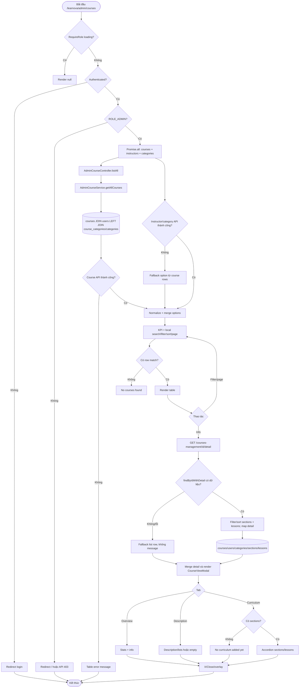

# Detailed Design As-Is — Course Management

> Phạm vi: màn hình **Khóa học** tại `/learnova/admin/courses`, gồm 5 KPI, tìm kiếm/bộ lọc/sắp xếp, bảng khóa học, phân trang và popup chi tiết 3 tab.  
> Quy ước: **Đã xác minh từ code** = có bằng chứng trực tiếp; **Suy luận từ ảnh và code** = đối chiếu ảnh với hành vi code; **Chưa xác minh** = thiếu dữ liệu runtime hoặc bằng chứng đầy đủ.

## 1. Thông tin màn hình

| Thuộc tính | Nội dung |
| --- | --- |
| Tên màn hình | Quản lý khóa học / Course Management |
| Mã màn hình | Không tìm thấy mã chính thức; tên component `Course` |
| Route/URL | FE `/learnova/admin/courses`; API chính `/api/learnova/admin/courses-management` |
| Actor | Quản trị viên có `ROLE_ADMIN` |
| Mục đích | Xem tổng quan trạng thái, lọc danh sách và xem chi tiết nội dung khóa học |
| Nguồn phân tích | Ảnh màn hình + FE + BE |
| Loại tài liệu | Reverse-engineered DD – As-Is |
| Mức độ xác minh | Đã xác minh route, API list/detail/thumbnail, filter, repository, entity và DDL; số liệu/runtime image chưa đối chiếu DB thực tế |
| File DD | `docs/DD_CourseManagement.md` |

## 2. Tổng quan chức năng

- Admin mở **Khóa học** từ sidebar hoặc URL `/learnova/admin/courses`; route nằm dưới `RequireRole role="ROLE_ADMIN"` (`AppRoutes.jsx:72-80`; `SidebarAdmin.jsx:44-49`).
- Khi mount, `Course` gọi song song API khóa học, giảng viên và danh mục. Chỉ lỗi API khóa học làm trang báo lỗi; lỗi giảng viên/danh mục bị chuyển thành mảng rỗng rồi FE bổ sung option từ dữ liệu khóa học (`Course.jsx:126-167`).
- Năm KPI được đếm hoàn toàn tại FE từ list: tổng số và số bản ghi có status `PUBLISHED`, `PENDING_REVIEW`, `ARCHIVED`, `DELETED` (`CourseStatistics.jsx:9-58`).
- Search, category, instructor, price và sort theo `publishedAt` đều thực hiện local; backend không nhận filter/page/sort (`Course.jsx:174-214`).
- Bảng hiển thị khóa học, giảng viên, primary category, level, price, status và một nút **Xem chi tiết**; pagination local 10 dòng/trang (`CourseTable.jsx:455-581`).
- Click nút thông tin gọi GET detail, merge response detail với row list, rồi mở popup 3 tab Overview/Description/Curriculum (`Course.jsx:96-102,169-172`; `CourseTable.jsx:484-499`).
- Thumbnail list/modal được resolve riêng qua GET `/thumbnail-url`; lỗi thumbnail bị nuốt và ảnh không render. Ảnh chụp cho thấy vùng ảnh hỏng, nhưng trạng thái runtime cụ thể chưa xác minh (`CourseTable.jsx:21-53,196-203,586-592`).
- Màn hình chính chỉ SELECT database. Không có Add/Edit/Delete/Approve/Reject/Export/Download trong component này. Các hàm approve/reject/hide tồn tại trong API/service khác nhưng không được gọi từ màn hình.
- Điểm bắt đầu: `AppRoutes.jsx:77`. Điểm kết thúc: bảng/KPI render; hoặc modal render rồi đóng bằng overlay/X/Close.

## 3. Đối chiếu ảnh với code

| STT | Thành phần trên ảnh | Loại control | File FE | Component/Method | Event/API | Nguồn dữ liệu | Xác minh |
| --: | --- | --- | --- | --- | --- | --- | --- |
| 1 | Tiêu đề “Khóa học” | Heading | `Header.jsx:55-87` | pathname title | route | i18n `admin.courses` | Đã xác minh từ code |
| 2 | Sidebar Khóa học active | Navigation | `SidebarAdmin.jsx:44-49,120-154` | `NavLink` | route | menu tĩnh | Đã xác minh từ code |
| 3 | Tổng số khóa học = 8 | KPI | `CourseStatistics.jsx:17-25` | `courses.length` | load list | course response | Code xác minh; số 8 chưa xác minh runtime |
| 4 | Đã xuất bản = 7 | KPI | `CourseStatistics.jsx:12,26-33` | status filter | none | `status=PUBLISHED` | Code xác minh; số ảnh chưa xác minh |
| 5 | Chờ duyệt = 1 | KPI | `CourseStatistics.jsx:13,34-41` | status filter | none | `PENDING_REVIEW` | Code xác minh; số ảnh chưa xác minh |
| 6 | Đã lưu trữ = 0 | KPI | `CourseStatistics.jsx:14,42-49` | status filter | none | `ARCHIVED` | Code xác minh; số ảnh chưa xác minh |
| 7 | Đã xóa = 0 | KPI | `CourseStatistics.jsx:15,50-57` | status filter | none | BE override `isDeleted`→`DELETED` | Code xác minh; số ảnh chưa xác minh |
| 8 | Tìm theo tên khóa học hoặc giảng viên | Text input | `CourseFilters.jsx:135-144`; `Course.jsx:174-192` | update `searchText` | local | title/slug/instructor/description | Đã xác minh từ code |
| 9 | Tất cả danh mục | Hover/click dropdown | `CourseFilters.jsx:95-100,147-156` | `FilterDropdown` | local | categories API + row fallback | Đã xác minh từ code |
| 10 | Giảng viên: Tất cả giảng viên | Dropdown | `CourseFilters.jsx:102-111,158-167` | `FilterDropdown` | local | instructors API + row fallback | Đã xác minh từ code |
| 11 | Đã xuất bản: Mới nhất | Sort dropdown | `CourseFilters.jsx:6-9,169-178`; `Course.jsx:207-213` | publishSort | local sort | `publishedAt` | Đã xác minh từ code |
| 12 | Giá: Tất cả loại | Dropdown | `CourseFilters.jsx:11-15,180-189`; `Course.jsx:201-206` | priceType | local filter | `basePrice` | Đã xác minh từ code |
| 13 | Cột Khóa học | Table | `CourseTable.jsx:504-528` | thumbnail/title/slug | thumbnail API | Course DTO | Đã xác minh từ code |
| 14 | Cột Giảng viên | Table | `CourseTable.jsx:507,529` | instructorName | none | `users` relation | Đã xác minh từ code |
| 15 | Cột Danh mục | Table | `CourseTable.jsx:507,529` | categoryName | none | primary `course_categories` | Đã xác minh từ code |
| 16 | Cột Cấp độ | Table | `CourseTable.jsx:507,529` | level | none | `courses.level` | Đã xác minh từ code |
| 17 | Cột Giá | Table | `CourseTable.jsx:507,530` | formatPrice | none | `courses.base_price` | Đã xác minh từ code |
| 18 | Cột Trạng thái | Badge | `CourseTable.jsx:531-535` | display status | none | status/isDeleted | Đã xác minh từ code |
| 19 | Icon thông tin | Button | `CourseTable.jsx:536-547` | `openCourseDetails` | GET detail | course id | Đã xác minh từ code |
| 20 | Pagination | Buttons | `CourseTable.jsx:557-574` | set current page | local | list length | Code xác minh; phần dưới ảnh bị cắt |
| 21 | Popup cover/thumbnail | Image area | `CourseTable.jsx:193-203` | useCourseThumbnail | GET thumbnail URL | thumbnailKey/S3 | Code xác minh; ảnh hiển thị hỏng là suy luận runtime |
| 22 | Active/PUBLISHED/level/language | Badges | `CourseTable.jsx:205-226` | status mapping | none | detail DTO | Đã xác minh từ code |
| 23 | Tên và category `--` | Text | `CourseTable.jsx:227-231` | fallback | none | title/categoryName | Đã xác minh từ code |
| 24 | Tabs Overview/Description/Curriculum | Tab buttons | `CourseTable.jsx:93-97,234-249` | setActiveTab | local | tabs tĩnh | Đã xác minh từ code |
| 25 | Students/Duration/Lessons/Rating/Price/Reviews | KPI modal | `CourseTable.jsx:251-277` | format values | none | detail object | Đã xác minh; Students/Rating/Reviews thiếu response nên `--` |
| 26 | Instructor/Level/Language/Category/Sections/Status/Created | Read-only rows | `CourseTable.jsx:279-294` | `timeAgo` | none | detail object | Đã xác minh; `Created` thực tế dùng `publishedAt` |
| 27 | Description | Read-only panel | `CourseTable.jsx:298-333` | activeTab | none | description/arrays | Đã xác minh từ code |
| 28 | “No curriculum added yet.” | Empty message | `CourseTable.jsx:336-430` | sections empty | none | detail sections | Đã xác minh từ code |
| 29 | Curriculum sections/lessons | Accordion | `CourseTable.jsx:366-427` | toggleSection | local | section/lesson DTO | Đã xác minh từ code |
| 30 | X/Close/overlay | Buttons/backdrop | `CourseTable.jsx:194-202,445-449` | onClose | none | selected state | Đã xác minh từ code |
| 31 | EN, chuông 34, settings, tài khoản | Admin shell | `Header.jsx:89-168`; `NotificationBell.jsx:13-62` | shell actions | notification/auth APIs | auth/runtime | Code xác minh; số 34 chưa xác minh |

Không tìm thấy trên màn hình: form editable, checkbox/radio, thêm/sửa/xóa, confirm, download/export. Từ khóa đã tìm: `create`, `edit`, `delete`, `approve`, `reject`, `save`, `export`, `download`, `checkbox`, `radio` trong `presentation/course`; chỉ có View.

## 4. Danh sách source liên quan

### Frontend — thứ tự chạy

| STT | Layer | Đường dẫn file | Class/Component | Method liên quan | Vai trò |
| --: | --- | --- | --- | --- | --- |
| 1 | Route | `front_end/src/app/routes/AppRoutes.jsx` | `App` | 72-80 | Admin guard/route |
| 2 | Guard | `front_end/src/app/routes/RequireRole.jsx` | `RequireRole` | 4-25 | Authentication/role |
| 3 | Layout | `front_end/src/app/layouts/admin/DashboardLayout.jsx` | `Dashboard` | 6-18 | Sidebar/header/outlet |
| 4-7 | Shell | Sidebar/Header/NotificationBell/useNotifications | components/hooks | relevant methods | Visible navigation/header |
| 8-11 | Auth/HTTP | AuthContext/AuthApi/useAxiosPrivate/AxiosClient | hooks/API | logout/interceptor/client | Session/request foundation |
| 12 | API | `.../admin/infrastructure/api/CourseApi.js` | course API functions | 3-29 | List/detail; unused mutation adapters |
| 13 | API | `.../admin/infrastructure/api/CategoryApi.js` | `getAdminCategoriesApi` | 3-6 | Filter options |
| 14 | API | `.../admin/infrastructure/api/InstructorApi.js` | `getAdminInstructorsApi` | 3-9 | Filter options |
| 15 | Media API | `front_end/src/shared/api/public/CoursesApi.js` | `getFileUrl` | 15-16 | Video preview branch |
| 16 | Page | `.../presentation/course/Course.jsx` | `Course` | 11-237 | State/load/filter/detail merge |
| 17 | KPI | `.../statistics/CourseStatistics.jsx` | component | 9-73 | Count statuses |
| 18-22 | KPI cards | 5 card JSX | card components | toàn file | Presentational values |
| 23 | Filter | `.../filters/CourseFilters.jsx` | `CourseFilters` | 6-196 | Search/dropdowns |
| 24 | Table/modal | `.../courses_table/CourseTable.jsx` | `CourseTable`, `CourseViewModal` | 9-595 | Table/page/detail tabs |
| 25 | Video | `.../courses_detail/components/tabs/video/VideoPlayer.jsx` | `CourseVideoPlayer` | component | Imported; preview disabled on this screen |
| 26-27 | i18n | `vi.json`, `en.json` | `courseAdmin` | line 22 | Main screen labels |
| 28-39 | CSS | admin shell + 9 course CSS files | CSS rules | toàn file | Layout/responsive/appearance |

### Backend/Database — thứ tự chạy

| STT | Layer | Đường dẫn file | Class/Component | Method liên quan | Vai trò |
| --: | --- | --- | --- | --- | --- |
| 1 | Security | `.../shared/config/SecurityConfig.java` | filter chain | 41-103 | Require ADMIN |
| 2 | Course Controller | `.../admin/adapter/in/web/AdminCourseController.java` | list/thumbnail/detail | 25-46 | HTTP endpoints |
| 3 | Course Service | `.../admin/application/AdminCourseService.java` | getAll/getThumbnail/getDetail/map | 56-74,164-265 | Query/mapping |
| 4-5 | DTO | `AdminCourseResponse`, `AdminCourseDetailResponse` | records | toàn file | Response contracts |
| 6 | DTO | `GetFileUrlResponse.java` | record | toàn file | Thumbnail URL body |
| 7 | Repository | `AdminCourseRepository.java` | findAllWithInstructor/findByIdWithDetail | 14-20,98-108 | Course list/detail ORM |
| 8 | Media | `S3Service.java` | sign/resolve | 124-166 | CloudFront URL |
| 9-12 | Category flow | controller/service/response/repository | getAllCategories | relevant ranges | Category options |
| 13-20 | Instructor option flow | controller/service/response + five repositories | getAllInstructors | relevant ranges | Instructor options; aggregates extra data |
| 21-31 | Entity | Course/User/Role/Category/CourseCategory/Section/Lesson/Enrollment/OrderItem/Order/Review | ORM mappings | relevant fields | Tables/relations |
| 32-35 | Enum | CourseStatus/CourseLevel/RoleName/OrderStatus | enums | toàn file | status/level/role/payment values |
| 36-37 | Exception | GlobalExceptionHandler/ErrorResponse | handlers/record | 32-117 | Error HTTP bodies |
| 38 | Database | `back_end/src/main/resources/db/migration/V1__initial_schema.sql` | DDL | 45-65,654-825,969-1001,1414-1435,1765-1862,2695-2712,2903-3016 | Tables/constraints/FK |

## 5. Thiết kế chi tiết UI

| STT | Label hiển thị | Tên trong code | Control | Kiểu dữ liệu | Bắt buộc | Mặc định | Nguồn dữ liệu | Điều kiện hiển thị | Event |
| --: | --- | --- | --- | --- | --- | --- | --- | --- | --- |
| 1 | 5 KPI | `courseStatsData` | read-only cards | integer | — | `...` loading, sau đó 0 | courses list | luôn hiện | load state |
| 2 | Search | `filters.searchText` | text input | string | Không | `""` | user | luôn enabled | updateFilter |
| 3 | Category | `filters.categoryId` | custom dropdown | id string | Không | `all` | categories + courses | hover/click | local filter |
| 4 | Instructor | `filters.instructorId` | custom dropdown | id string | Không | `all` | instructors + courses | hover/click | local filter |
| 5 | Published | `filters.publishSort` | custom dropdown | enum | Không | `newest` | static newest/oldest | hover/click | local sort |
| 6 | Price | `filters.priceType` | custom dropdown | enum | Không | `all` | static all/paid/free | hover/click | local filter |
| 7 | Course table | `currentPageItems` | table | array | — | [] | filteredCourses | load/error/empty/data branches | info/page |
| 8 | Thumbnail | `useCourseThumbnail` | image | URL | — | no element | thumbnailKey→API | URL resolved | API on mount |
| 9 | Title/slug | course fields | read-only | string | — | title N/A, slug empty | list DTO | row | none |
| 10 | Instructor/category/level | course fields | read-only | string | — | N/A | list DTO | row | none |
| 11 | Price | `basePrice` | read-only | decimal | — | $0/Free | list DTO | row | none |
| 12 | Status | `getCourseDisplayStatus` | badge | string | — | N/A | list DTO | row | none |
| 13 | View details | `openCourseDetails` | icon button | action | — | enabled | id | row | GET detail |
| 14 | Pagination | `currentPage` | buttons | integer | — | 1 | local list length | table footer | local slice |
| 15 | Modal | `selectedCourse` | dialog | object | — | null | detail/list fallback | selected != null | close/tab |
| 16 | Overview | `activeTab=overview` | tab panel | object | — | selected | detail | active tab | setActiveTab |
| 17 | Description | `activeTab=description` | tab panel | text/list | — | empty message | detail | active tab | setActiveTab |
| 18 | Curriculum | `activeTab=curriculum` | accordion | list | — | empty message | sections/lessons | active tab | toggle section |
| 19 | X/Close/overlay | `onClose` | buttons/backdrop | action | — | enabled | selected state | modal | selected null |

- Các control đều read-only, ngoại trừ search/dropdown/tab/accordion/page. Không có form validation, placeholder length hay max length.
- Search trim và lowercase, không debounce; tìm trong title, slug, instructorName, description (`Course.jsx:174-192`).
- Category/instructor so sánh `String(id)`; danh mục deleted bị loại khỏi dropdown (`CourseFilters.jsx:95-111`).
- Free là `basePrice <= 0`; Paid là `>0`. `null` được coi là 0 do `Number(course.basePrice || 0)` (`Course.jsx:201-205`).
- Sort dùng `publishedAt`; null/invalid quy về epoch 0. Newest đưa null xuống cuối, oldest đưa null lên đầu (`Course.jsx:112-115,207-213`).
- Dropdown mở bằng cả hover lẫn click, đóng khi mouseleave, chọn option hoặc click bên ngoài (`CourseFilters.jsx:46-80,113-125`).
- Modal mặc định Overview; section đầu tiên được expand nếu có. Video preview bị disable vì page không truyền `enableVideoPreview` (`CourseTable.jsx:99-160,576-580`).
- Currency hiển thị `$` và tối đa 2 số lẻ; 0 trong table/modal là `Free` (`CourseTable.jsx:12-19,60-65`).

## 6. Điểm bắt đầu và điểm kết thúc

| Luồng | File/Method bắt đầu | Điều kiện bắt đầu | Các layer đi qua | File/Method kết thúc | Kết quả |
| --- | --- | --- | --- | --- | --- |
| Mở màn hình | `AppRoutes.jsx:77` | URL match | RequireRole→Layout→Course | `Course.jsx:216-234` | Khung trang render |
| Load ban đầu | `Course.fetchCourses:128-163` | mount | 3 FE APIs→3 controllers/services/repos→DB | set courses/options/loading | KPI/filter/table |
| Search | `CourseFilters:137-143` | nhập text | state→useMemo | filteredCourses | bảng lọc |
| Category filter | `FilterDropdown:147-156` | chọn option | state→useMemo | filteredCourses | bảng lọc |
| Instructor filter | `FilterDropdown:158-167` | chọn option | state→useMemo | filteredCourses | bảng lọc |
| Sort published | `FilterDropdown:169-178` | newest/oldest | state→JS sort | filteredCourses | bảng sắp xếp |
| Price filter | `FilterDropdown:180-189` | all/paid/free | state→useMemo | filteredCourses | bảng lọc |
| Pagination | `CourseTable:557-574` | click | local state/slice | currentPageItems | page rows |
| View detail | `openCourseDetails:484-499` | info click | API→Controller→Service→Repository→DB→merge→modal | `CourseViewModal` | chi tiết 3 tab |
| Resolve thumbnail | `useCourseThumbnail:21-50` | key tồn tại | API→Service→S3 | signed URL/cache | image hoặc trống |
| Close detail | `CourseViewModal:194,200,446` | overlay/X/Close | onClose | selected=null | modal unmount |

Không có luồng thêm/sửa/xóa/lưu/xác nhận/export/download thực sự trong màn hình này.

## 7. Luồng khởi tạo màn hình

1. Browser truy cập `/learnova/admin/courses`; route `AppRoutes.jsx:77` nằm trong admin parent.
2. `RequireRole.jsx:4-25` chờ auth; chưa login redirect login, thiếu `ROLE_ADMIN` redirect `/`.
3. `DashboardLayout.jsx:6-18` mount SidebarAdmin/Header/Outlet; `Course` tạo state courses, instructors, categories, loading, error, filters (`Course.jsx:117-125`).
4. `useEffect` tạo cờ `isMounted` và chạy `fetchCourses` (`126-167`).
5. `Promise.all` gọi GET courses, instructors và categories. Hai API option tự catch thành `[]`; course API không catch nội bộ (`132-136`).
6. `SecurityConfig.java:79` yêu cầu role ADMIN cho cả ba `/api/learnova/admin/**`.
7. Course: `AdminCourseController.listAll()` gọi `AdminCourseService.getAllCourses()` (`AdminCourseController:30-33`).
8. `AdminCourseRepository.findAllWithInstructor()` SELECT DISTINCT Course, JOIN FETCH instructor, LEFT JOIN FETCH courseCategories/category; không WHERE/ORDER BY (`14-20`).
9. Service `toResponse` map `isDeleted=true` thành chuỗi `DELETED`, tìm primary category và tạo list DTO (`AdminCourseService:164-195`).
10. Instructor options: controller→`AdminInstructorService.getAllInstructors()`→user/course/enrollment/order/review/category repositories; đây là aggregate đầy đủ dù FE chỉ dùng id/name/email (`AdminInstructorService:47-168`).
11. Category options: controller→`AdminCategoryService.getAllCategories()`→`findAllForAdmin()` LEFT JOIN parent ORDER BY id (`AdminCategoryService:34-39`; `AdminCategoryRepository:17-18`).
12. Ba controller trả JSON. Course adapter trả body nguyên trạng; instructor adapter normalize array/null/scalar.
13. FE normalize course null fields, merge instructor/category options từ API và rows (`Course.jsx:11-102,137-154`).
14. `CourseStatistics` đếm status; `filteredCourses` chạy search/filter/sort; `CourseTable` slice 10 dòng (`Course.jsx:174-231`).
15. Nếu course API lỗi, FE dùng backend `message` hoặc “Could not load the course list.” và table hiển thị lỗi. Nếu component unmount, cờ `isMounted` ngăn setState (`155-166`).

## 8. Luồng từng thao tác

### 8.1 Tìm kiếm

| Bước | Layer | File | Method | Input | Xử lý | Output/Chuyển tiếp |
| --: | --- | --- | --- | --- | --- | --- |
| 1 | UI | `CourseFilters.jsx:137-143` | onChange | text | update searchText | parent filters |
| 2 | FE | `Course.jsx:174-192` | useMemo | trimmed lowercase | concatenate 4 fields/includes | filtered list |
| 3 | FE | `CourseTable.jsx:476-478` | effect | courses prop changed | page=1 | render rows/no results |

Điều kiện: page đã load hoặc đang có data. Không validation, debounce, API hay DB. Empty text trả toàn bộ. Failure branch không có.

### 8.2 Chọn danh mục

| Bước | Layer | File | Method | Input | Xử lý | Output/Chuyển tiếp |
| --: | --- | --- | --- | --- | --- | --- |
| 1 | UI | `CourseFilters.jsx:95-100` | build options | category list | loại `isDeleted` | menu |
| 2 | UI | `CourseFilters.jsx:72-75` | on option | id string | update categoryId/close | parent state |
| 3 | FE | `Course.jsx:193-196` | filter | categoryId | compare primary categoryId | table |

Category options khởi tạo từ GET categories; nếu API lỗi thì lấy primary category xuất hiện trong course rows. Không backend call khi chọn.

### 8.3 Chọn giảng viên

| Bước | Layer | File | Method | Input | Xử lý | Output/Chuyển tiếp |
| --: | --- | --- | --- | --- | --- | --- |
| 1 | FE load | `Course.jsx:11-41` | mergeInstructorOptions | API + rows | de-duplicate by id | options |
| 2 | UI | `CourseFilters.jsx:102-111,158-167` | choose | id | update filter | parent state |
| 3 | FE | `Course.jsx:197-200` | filter | id string | compare instructorId | table |

Không validation/API khi chọn. Nếu instructor API lỗi, row instructors vẫn được bổ sung.

### 8.4 Chọn loại giá

| Bước | Layer | File | Method | Input | Xử lý | Output/Chuyển tiếp |
| --: | --- | --- | --- | --- | --- | --- |
| 1 | UI | `CourseFilters.jsx:11-15,180-189` | choose | all/paid/free | update filter | parent state |
| 2 | FE | `Course.jsx:201-206` | filter | basePrice | `<=0`, `>0`, all | table |

Không API/DB. Null/undefined được coi là 0 và lọt vào Free.

### 8.5 Sắp xếp ngày xuất bản

| Bước | Layer | File | Method | Input | Xử lý | Output/Chuyển tiếp |
| --: | --- | --- | --- | --- | --- | --- |
| 1 | UI | `CourseFilters.jsx:169-178` | choose | newest/oldest | update publishSort | parent state |
| 2 | FE | `Course.jsx:112-115,207-213` | sort | publishedAt | epoch conversion, asc/desc | sorted table |

Không API/DB; không sort theo `createdAt` và response list không có `createdAt`.

### 8.6 Phân trang

| Bước | Layer | File | Method | Input | Xử lý | Output/Chuyển tiếp |
| --: | --- | --- | --- | --- | --- | --- |
| 1 | UI | `CourseTable.jsx:557-574` | page buttons | page | clamp prev/next/direct | currentPage |
| 2 | FE | `CourseTable.jsx:466-478` | memo/effects | courses length | slice size 10; clamp/reset | rows |

No backend pagination. `totalPages` tối thiểu 1 kể cả không có data.

### 8.7 Xem chi tiết

| Bước | Layer | File | Method | Input | Xử lý | Output/Chuyển tiếp |
| --: | --- | --- | --- | --- | --- | --- |
| 1 | UI | `CourseTable.jsx:538-547` | info click | course row | disable row while pending | openCourseDetails |
| 2 | FE | `CourseTable.jsx:484-499` | openCourseDetails | course | await onViewCourse | detail/list fallback |
| 3 | FE API | `CourseApi.js:9-11` | get detail | path id | GET | backend |
| 4 | Security | `SecurityConfig.java:79` | authorize | JWT/session | require ADMIN | controller/401/403 |
| 5 | Controller | `AdminCourseController.java:43-46` | getDetail | Long id | no DTO validation | service |
| 6 | Service | `AdminCourseService.java:70-74` | getCourseDetail | id | find or 404; map | detail DTO |
| 7 | Repository | `AdminCourseRepository.java:98-108` | findByIdWithDetail | id | fetch instructor/tags/sections/lessons/categories | entities |
| 8 | DB | courses/users/sections/lessons/categories | SELECT | id | joins plus potential collection loading | data/no row |
| 9 | Service | `AdminCourseService.java:197-265` | toDetailResponse | Course | filter deleted section/lesson; sort/order/sum | response |
| 10 | FE | `Course.jsx:96-102,169-172` | merge/normalize | row+detail | keep row slug/category precedence | normalized detail |
| 11 | Modal | `CourseTable.jsx:99-453` | render | selectedCourse | overview default | popup |

Failure: 404/403/500 bị `openCourseDetails` catch, popup vẫn mở bằng row list (`CourseTable.jsx:494-495`), không hiển thị message; detail-only fields thành fallback/empty.

### 8.8 Chuyển tab và mở section

| Bước | Layer | File | Method | Input | Xử lý | Output/Chuyển tiếp |
| --: | --- | --- | --- | --- | --- | --- |
| 1 | UI | `CourseTable.jsx:234-249` | setActiveTab | tab id | local state | panel |
| 2 | UI | `CourseTable.jsx:373-423` | toggleSection | section id/title | invert expanded flag | lessons show/hide |

Không API/DB. Lesson button disabled vì `enableVideoPreview=false` trên màn hình này; nhánh `openLessonPreview/getFileUrl` không chạy.

### 8.9 Resolve thumbnail

| Bước | Layer | File | Method | Input | Xử lý | Output/Chuyển tiếp |
| --: | --- | --- | --- | --- | --- | --- |
| 1 | FE hook | `CourseTable.jsx:21-50` | useCourseThumbnail | key.trim | check module cache | request/URL |
| 2 | API | same file 35-38 | axios GET | query thumbnailKey | `/thumbnail-url` | controller |
| 3 | Controller | `AdminCourseController:35-41` | getThumbnailUrl | String | call service | response `{url}` |
| 4 | Service | `AdminCourseService:62-68` | getThumbnailUrl | key | blank→400; trim/sign | CloudFront URL |
| 5 | FE | hook 38-45 | set URL | response/error | cache URL; errors→null | image/no image |

### 8.10 Đóng popup

Overlay, X hoặc Close gọi `closeCourseDetails`, đặt `selectedCourse=null`; modal unmount (`CourseTable.jsx:480-482,194,200,446`). Không API/message/DB.

## 9. API specification

| API | HTTP method | Nơi gọi | Controller | Request | Response | Mục đích |
| --- | --- | --- | --- | --- | --- | --- |
| `/api/learnova/admin/courses-management` | GET | `Course.jsx:133` | `AdminCourseController.listAll` | no param/body | `List<AdminCourseResponse>` | list/KPI/table |
| `/api/learnova/admin/instructors-management` | GET | `Course.jsx:134` | `AdminInstructorController.getAllInstructors` | none | `List<AdminInstructorResponse>` | instructor options |
| `/api/learnova/admin/categories-management` | GET | `Course.jsx:135` | `AdminCategoryController.getAllCategories` | none | `List<AdminCategoryResponse>` | category options |
| `/api/learnova/admin/courses-management/{id}/detail` | GET | `Course.jsx:170` | `AdminCourseController.getDetail` | path `Long id` | `AdminCourseDetailResponse` | modal detail |
| `/api/learnova/admin/courses-management/thumbnail-url` | GET | `CourseTable.jsx:35` | `AdminCourseController.getThumbnailUrl` | query `thumbnailKey` | `{url}` | signed thumbnail |

Chung cho các API:

- Base URL lấy từ `VITE_API_URL` hoặc `http://localhost:8080/api/learnova`; axios bật `withCredentials` và JSON (`AxiosClient.js:3-11`).
- `useAxiosPrivate` gắn interceptor refresh/retry cho 401; admin endpoints yêu cầu `ROLE_ADMIN` (`useAxiosPrivate.js:11-81`; `SecurityConfig.java:79`).
- Không request body/DTO/Bean Validation ở 5 GET. `id` được Spring parse Long; sai kiểu tạo lỗi framework. Thumbnail service validate nonblank bằng `BusinessException` 400.
- Thành công: 200. Course detail không tồn tại: 404 “Course not found id={id}”. Thiếu quyền: 401/403. Generic: 500 qua `GlobalExceptionHandler`.
- FE list course hiển thị error; option API errors bị nuốt; detail errors mở dữ liệu list; thumbnail errors ẩn ảnh.
- `AdminCourseDetailResponse` không chứa `slug`, `studentCount`, `rating`, `reviewCount`, `createdAt`. FE giữ slug từ list; ba KPI đầu/cuối liên quan hiện `--`; label Created dùng `publishedAt`.
- `CourseApi.js:15-29` còn khai báo PATCH approve/hide/reject nhưng `Course` không gọi. Controller có approve/reject nhưng không có `/hide`, dù service có `hideCourse`; đây là mismatch source ngoài luồng runtime của màn hình.

## 10. Backend processing

| Layer | File | Class | Method | Input | Xử lý | Gọi tiếp | Output |
| --- | --- | --- | --- | --- | --- | --- | --- |
| Security | `SecurityConfig.java` | config | chain | request | ADMIN only | controller | allow/401/403 |
| Controller | `AdminCourseController.java` | controller | listAll | none | delegate | service | 200 list |
| Service | `AdminCourseService.java` | service | getAllCourses | none | stream/map | repository | list DTO |
| Repository | `AdminCourseRepository.java` | JPA | findAllWithInstructor | none | fetch joins | DB | Course list |
| Mapper | `AdminCourseService.java` | service | toResponse | Course | deleted override/primary category | entity getters | DTO |
| Controller | same | controller | getDetail | id | delegate | service | 200 detail |
| Service | same | service | getCourseDetail | id | find or 404 | repository/map | DTO |
| Repository | same repo | JPA | findByIdWithDetail | id | fetch detail relations | DB | Optional Course |
| Mapper | service | service | toDetailResponse | Course | filter/sort/sum | S3/entity relations | detail DTO |
| Media | service/S3 | methods | getThumbnailUrl | key | validate/sign | CloudFront | URL |
| Category option | controller/service/repo | getAll | none | map all incl deleted | DB | option records |
| Instructor option | controller/service/6 repos | getAll | none | full aggregate | DB | instructor records |
| Exception | `GlobalExceptionHandler.java` | advice | handlers | exception | status/message mapping | HTTP | ErrorResponse |

- `AdminCourseService` đặt class-level `jakarta.transaction.Transactional` (`30-32`), nên cả GET và mapper chạy trong transaction mặc định read-write; không đánh dấu `readOnly`.
- List/detail không ghi DB. `approveCourse`, `rejectCourse`, `hideCourse` có mutation nhưng không được gọi bởi màn hình.
- Business logic chính của màn hình nằm ở `toResponse` và `toDetailResponse`; filter/sort/page/KPI nằm tại FE.
- Email/notification/index dependencies chỉ được dùng trong mutation methods, không đi qua list/detail.

## 11. Database và query

| Bảng | Cột sử dụng | Mục đích | Thao tác | File/Method truy cập |
| --- | --- | --- | --- | --- |
| `courses` | id,title,slug,description,language,requirements,what_you_learn,base_price,level,status,instructor_id,is_deleted,published_at,thumbnail_key | list/detail/filter/display | SELECT | AdminCourseRepository queries |
| `users` | user_id,full_name,email,avatar | instructor list/name | SELECT JOIN | course query/instructor flow |
| `course_categories` | course_id,category_id,is_primary | primary category | SELECT LEFT JOIN | course queries/service |
| `categories` | id,name,parent_id,is_deleted | category/display/options | SELECT LEFT JOIN | course/category repos |
| `sections` | id,course_id,title,section_order,is_deleted | curriculum | SELECT LEFT JOIN | detail query/service |
| `lessons` | id,section_id,title,lesson_order,duration_seconds,video_key,is_preview,is_deleted | curriculum/count/duration | SELECT LEFT JOIN | detail query/service |
| `roles`,`user_role` | roleName/user links | instructor options | SELECT JOIN | AdminUserRepository |
| `enrollments` | course_id,user_id | instructor aggregate option API | SELECT | EnrollmentRepository |
| `order_items`,`orders` | course_id,price,status | instructor revenue option API | SELECT JOIN | OrderItemRepository |
| `reviews` | course_id,rating | instructor rating option API | SELECT | ReviewRepository |

Query thực tế:

- List course: JPQL `SELECT DISTINCT c FROM Course c JOIN FETCH c.instructor LEFT JOIN FETCH c.courseCategories cc LEFT JOIN FETCH cc.category`; không `WHERE`, `ORDER BY`, pagination, status, deleted hoặc hidden filter (`AdminCourseRepository:14-20`).
- Detail: fetch instructor, tags, sections/lessons, courseCategories/category với `WHERE c.id=:id`; không filter deleted trong query (`98-108`). Service loại section/lesson deleted nhưng không loại course/category deleted.
- Category options: `SELECT c FROM Category c LEFT JOIN FETCH c.parent ORDER BY c.id ASC`; FE sau đó loại category deleted (`AdminCategoryRepository:17-18`; `CourseFilters:98`).
- Instructor options: role query không filter user deleted/active; sau đó nhiều bulk queries cho nondeleted courses và aggregate (`AdminUserRepository:23-24`; `AdminInstructorService:47-168`).
- Không SQL `INSERT/UPDATE/DELETE` trong luồng page/detail/thumbnail. Transaction kết thúc khi service trả response.
- Null: primary category thiếu→null→FE `N/A/--`; publishedAt null→sort epoch; requirements/whatYouLearn normalized []; duration null→0.
- Không data: course API trả `[]`; KPI 0, table no results, totalPages vẫn 1. Detail id thiếu trả 404.
- DDL: `courses.slug` UNIQUE; `base_price>=0`; published status yêu cầu `published_at` nonnull và status khác PUBLISHED yêu cầu null (`V1:817,1773-1782`).
- `course_categories` PK `(course_id,category_id)` và cascade FK; không có DB constraint chỉ một primary category (`V1:1765-1767,2695-2704`).
- `sections` unique `(course_id,section_order)`; `lessons` unique `(section_id,lesson_order)`; cascade on delete (`V1:1853-1862,2029-2038,2903-2904,3015-3016`).

## 12. Mapping dữ liệu FE–BE–DB

| Dữ liệu | UI field | FE variable | Request field | Backend DTO | Service/Repository | Table.Column | Response field | UI hiển thị |
| --- | --- | --- | --- | --- | --- | --- | --- | --- |
| Course id | action/detail | `course.id` | path id | id | findByIdWithDetail | courses.course_id | id | internal |
| Thumbnail | image | thumbnailKey/URL | query thumbnailKey | thumbnailKey/{url} | S3 signer | courses.thumbnail_key | thumbnailKey | image/trống |
| Title | Course/title | title | — | title | toResponse/detail | courses.title | title | text |
| Slug | Course subtext | slug | — | list only | toResponse | courses.slug | slug | text; preserved on merge |
| Description | search/tab | description | — | detail | toDetailResponse | courses.description | description | paragraph/empty |
| Language | badge/info | language | — | detail | mapper | courses.language | language | badge/text |
| Learn/requirements | Description tab | arrays | — | detail lists | mapper | courses arrays | whatYouLearn/requirements | lists |
| Price | filter/table/KPI | basePrice | — | decimal | mapper | courses.base_price | basePrice | Free/$value |
| Level | table/badge | level | — | string | enum.name | courses.level | level | text |
| Status | KPI/table/badge | status | — | string | isDeleted override | courses.status,is_deleted | status | badges/count |
| Instructor | table/filter/modal | instructorId/name | — | id/name | join User | courses.instructor_id→users | fields | name |
| Category | table/filter/modal | categoryId/name | — | id/name | primary relation | course_categories/categories | fields | name/N/A |
| Published date | sort/Created | publishedAt | — | OffsetDateTime | mapper | courses.published_at | publishedAt | time ago/order |
| Sections | curriculum | sections | — | SectionInfo[] | filter/sort | sections.* | sections | accordion |
| Lessons | lessons/duration | section.lessons | — | LessonInfo[] | filter/sort/sum | lessons.* | lessons/count/duration | list/KPI |
| Students | modal KPI | studentCount | — | **không có** | không map | enrollments | **không có** | `--` |
| Rating | modal KPI | rating | — | **không có** | không map | reviews.rating | **không có** | `--` |
| Reviews | modal KPI | reviewCount | — | **không có** | không map | reviews | **không có** | `--` |

## 13. Business rule rút ra từ code

| ID | Business rule hiện tại | Điều kiện | File/Method | Khi đúng | Khi sai | Mức xác minh |
| --- | --- | --- | --- | --- | --- | --- |
| BR-01 | Chỉ admin vào route/API | role ADMIN | RequireRole/SecurityConfig | render/allow | redirect/401/403 | Đã xác minh |
| BR-02 | Tổng KPI gồm mọi course query trả về | list row | CourseStatistics | +1 total | không có | Đã xác minh |
| BR-03 | Deleted override status | isDeleted true | `toResponse/toDetailResponse` | `DELETED` | enum status | Đã xác minh |
| BR-04 | Primary category duy nhất được hiển thị | `isPrimary=true` first | service mapper | id/name | null | Đã xác minh |
| BR-05 | Search gồm 4 field | includes normalized text | Course useMemo | giữ row | loại row | Đã xác minh |
| BR-06 | Free khi price <=0 | numeric price | Course filter | free | paid if >0 | Đã xác minh |
| BR-07 | Sort published null là epoch | null/invalid | getPublishedTime | time 0 | actual timestamp | Đã xác minh |
| BR-08 | Page size cố định 10 | any list | CourseTable | slice 10 | — | Đã xác minh |
| BR-09 | Detail section/lesson soft-delete không trả | isDeleted true | toDetailResponse | loại | map/sort | Đã xác minh |
| BR-10 | Section/lesson sort tăng theo order; null→0 | mapping | toDetailResponse | ordered | — | Đã xác minh |
| BR-11 | Duration là tổng duration lesson còn hiệu lực | detail | toDetailResponse | sum null=0 | 0 | Đã xác minh |
| BR-12 | Modal Active trừ khi status DELETED | status | CourseViewModal | Active | Inactive | Đã xác minh |
| BR-13 | Detail lỗi vẫn mở modal row | request throws | openCourseDetails | list fallback | full detail | Đã xác minh |
| BR-14 | Thumbnail blank bị từ chối | blank key | getThumbnailUrl | 400 | signed URL | Đã xác minh |
| BR-15 | Video preview không hoạt động ở màn hình | enableVideoPreview default false | modal invocation | lesson disabled | branch possible ở consumer khác | Đã xác minh |

## 14. Validation, permission và message

| Loại | Điều kiện | FE/BE | File/Method | Mã/Nội dung message | Hành vi |
| --- | --- | --- | --- | --- | --- |
| Permission | unauthenticated | FE | RequireRole | redirect login | không render page |
| Permission | role không ADMIN | FE | RequireRole | redirect `/` | không render page |
| Permission | admin API không ADMIN | BE | SecurityConfig | 401/403 JSON | request chặn |
| FE validation | search/dropdowns | FE | Course/CourseFilters | không có message | local normalize/filter |
| Path binding | id sai kiểu | BE | Spring controller | framework error | request fail |
| Business validation | thumbnail blank | BE | getThumbnailUrl | “Thumbnail key is required.” | 400 |
| Resource | id không tồn tại | BE | getCourseDetail | “Course not found id=…” | 404 |
| Init success | APIs ok | FE | fetchCourses | không toast | render page |
| Init error | course API fail | FE | catch 155-158 | BE message hoặc “Could not load the course list.” | table error |
| Option error | instructor/category fail | FE | Promise catches | không message | fallback options |
| Detail error | any detail error | FE | openCourseDetails catch | không message | modal sparse row |
| Thumbnail error | signing/request fail | FE | hook catch | không message | no image |
| Empty table | no match/data | FE | CourseTable | “Không tìm thấy khóa học.” | empty row |
| Empty description | no description | FE | modal | “No description added yet.” | empty panel |
| Empty curriculum | no sections | FE | modal | “No curriculum added yet.” | empty panel |
| DB constraint | price <0/slug duplicate/published date mismatch | DB | V1 constraints | integrity handler message | 409/generic depending exception |
| Generic exception | uncaught | BE | GlobalExceptionHandler | “An unexpected error occurred.” | 500 |

Không có popup xác nhận, message thành công/thất bại mutation vì màn hình không ghi dữ liệu.

## 15. Mermaid sequence toàn bộ màn hình

```mermaid
sequenceDiagram
    actor Admin
    participant Route as "AppRoutes/RequireRole"
    participant UI as "Course.jsx/CourseTable.jsx"
    participant API as "CourseApi/InstructorApi/CategoryApi"
    participant Sec as "SecurityConfig"
    participant CC as "AdminCourseController"
    participant CS as "AdminCourseService"
    participant CR as "AdminCourseRepository"
    participant Opt as "AdminInstructor/AdminCategory flows"
    participant DB as "courses/users/categories/sections/lessons"
    participant S3 as "S3Service"
    participant Modal as "CourseViewModal"

    Admin->>Route: GET /learnova/admin/courses
    Route->>Route: RequireRole(ROLE_ADMIN)
    Route->>UI: mount Course
    par Load courses
        UI->>API: getAdminCoursesApi()
        API->>Sec: GET /admin/courses-management
        Sec->>CC: ADMIN allowed
        CC->>CS: getAllCourses()
        CS->>CR: findAllWithInstructor()
        CR->>DB: SELECT Course JOIN instructor/categories
        DB-->>CR: Course[]
        CS-->>UI: AdminCourseResponse[] via controller/API
    and Load instructor options
        UI->>Opt: getAdminInstructorsApi()
        Opt->>DB: teacher + aggregate SELECTs
        DB-->>UI: AdminInstructorResponse[]
    and Load category options
        UI->>Opt: getAdminCategoriesApi()
        Opt->>DB: SELECT categories LEFT JOIN parent ORDER BY id
        DB-->>UI: AdminCategoryResponse[]
    end
    UI->>UI: normalize + merge options + KPI/filter/sort/page
    UI-->>Admin: cards + filters + table

    opt Thumbnail key exists
        UI->>CC: GET /thumbnail-url?thumbnailKey
        CC->>CS: getThumbnailUrl(key)
        CS->>S3: generateCloudFrontSignedUrl(key)
        S3-->>UI: URL via controller
    end

    opt Search/filter/sort/page
        Admin->>UI: update control
        UI->>UI: local useMemo/slice
        UI-->>Admin: updated rows
    end

    opt View details
        Admin->>UI: Info(course.id)
        UI->>API: getAdminCourseDetailApi(id)
        API->>CC: GET /{id}/detail
        CC->>CS: getCourseDetail(id)
        CS->>CR: findByIdWithDetail(id)
        CR->>DB: SELECT course/instructor/categories/sections/lessons
        DB-->>CR: Course or empty
        CR-->>CS: Optional Course
        CS->>CS: filter deleted + sort + count/duration
        CS-->>UI: AdminCourseDetailResponse
        UI->>UI: merge row + detail + normalize
        UI->>Modal: selectedCourse
        Modal-->>Admin: Overview/Description/Curriculum
        Admin->>Modal: tabs/section/X/Close/overlay
        Modal-->>UI: selectedCourse=null on close
    end
```

## 16. Mermaid flowchart



## 17. Phân tích từng source trong cùng file DD

Các mục dưới ghi vai trò, call chain, input/output, điều kiện, validation/exception, ảnh hưởng UI và vùng dòng quan trọng. File chỉ có presentation/CSS không có business validation hay exception riêng được ghi rõ.

### File: `front_end/src/app/routes/AppRoutes.jsx`
- Layer Route; `App` import `Course` line 12 và mount route `courses` line 77 dưới admin guard 73. Input URL; output component tree; redirect do guard.

### File: `front_end/src/app/routes/RequireRole.jsx`
- Layer Guard, component lines 4-25; gọi từ route, đọc auth/activeRole/roles, trả null/redirect/children. Không API; ảnh hưởng quyền mở màn hình.

### File: `front_end/src/app/layouts/admin/DashboardLayout.jsx`
- Layer Layout lines 6-18; gọi SidebarAdmin/Header/Outlet. Input route context; output shell; không validation/exception.

### File: `front_end/src/shared/components/sidebar/sidebar_admin/SidebarAdmin.jsx`
- Layer Navigation; course path lines 44-49, NavLink 120-154. Click chuyển route; không backend.

### File: `front_end/src/shared/components/header/admin_header/Header.jsx`
- Layer Shell; title course lines 55-87, language/settings/account/logout lines 89-168. Đọc pathname/auth; gọi navigation/logout.

### File: `front_end/src/shared/components/header/admin_header/NotificationBell.jsx`
- Layer Shell, component lines 13-62; đọc hook notification, mark-read/navigate. Badge trong ảnh là runtime; lỗi xử lý trong hook.

### File: `front_end/src/shared/hooks/useNotifications.js`
- Layer Hook lines 13-78; poll unread 45s, list page0/size20, mark read. Input axios/auth; output bell state/actions; lỗi bị catch.

### File: `front_end/src/app/providers/AuthContext.jsx`
- Layer Auth; logout lines 67-79 gọi API rồi clear local state trong finally. Ảnh hưởng menu account, không thuộc course data.

### File: `front_end/src/features/auth/infrastructure/api/AuthApi.js`
- Layer API; `logoutApi` lines 19-21 POST logout. Input client; output response/exception.

### File: `front_end/src/shared/hooks/useAxiosPrivate.js`
- Layer HTTP hook lines 11-81; gắn response interceptor, refresh/retry một 401, logout nếu refresh fail. Cung cấp client cho ba API init/detail.

### File: `front_end/src/shared/api-client/AxiosClient.js`
- Layer HTTP config lines 3-11; baseURL, credentials, JSON. Input config/request; output Axios promise.

### File: `front_end/src/features/admin/infrastructure/api/CourseApi.js`
- Layer API lines 3-29; màn hình gọi `getAdminCoursesApi` và `getAdminCourseDetailApi`. Input client/id; output response body; exception propagate. Approve/reject/hide adapters không được page gọi; hide không có controller mapping.

### File: `front_end/src/features/admin/infrastructure/api/CategoryApi.js`
- Layer API; `getAdminCategoriesApi` lines 3-6 GET categories. Được `Course.fetchCourses` gọi; output records; lỗi bị parent đổi `[]`.

### File: `front_end/src/features/admin/infrastructure/api/InstructorApi.js`
- Layer API lines 3-9; GET instructors và normalize response. Được init gọi; output options source; lỗi bị parent đổi `[]`.

### File: `front_end/src/shared/api/public/CoursesApi.js`
- Layer media API; `getFileUrl` lines 15-16. Chỉ nhánh video preview dùng, nhưng branch disabled ở màn hình Course.

### File: `front_end/src/features/admin/presentation/course/Course.jsx`
- Layer Page lines 11-237. `fetchCourses` gọi 3 APIs; helpers normalize/merge; useMemo search/filter/sort; `loadCourseDetail` gọi detail. Input API/user filters; output props cho KPI/filter/table. Error course hiển thị, option errors fallback; unmount guard.

### File: `front_end/src/features/admin/presentation/course/statistics/CourseStatistics.jsx`
- Layer KPI lines 9-73; nhận courses/loading, filter status và tạo 5 cards. Không API/exception; output giá trị/`...`.

### File: `front_end/src/features/admin/presentation/course/statistics/cards/total_courses/TotalCoursesCard.jsx`
- Presentational KPI; nhận label/value/trend, render total. Không gọi tiếp/validation/exception.

### File: `front_end/src/features/admin/presentation/course/statistics/cards/published_courses/PublishedCoursesCard.jsx`
- Presentational KPI PUBLISHED; input props từ CourseStatistics, output card; không logic backend.

### File: `front_end/src/features/admin/presentation/course/statistics/cards/pending_review/PendingReviewCard.jsx`
- Presentational KPI PENDING_REVIEW; không validation/exception.

### File: `front_end/src/features/admin/presentation/course/statistics/cards/suspended_courses/SuspendedCoursesCard.jsx`
- Presentational KPI ARCHIVED dù tên source “suspended”; output card “Đã lưu trữ”.

### File: `front_end/src/features/admin/presentation/course/statistics/cards/reported_courses/ReportedCoursesCard.jsx`
- Presentational KPI DELETED dù tên source “reported”; output card “Đã xóa”.

### File: `front_end/src/features/admin/presentation/course/filters/CourseFilters.jsx`
- Layer UI lines 6-196; `FilterDropdown` và `CourseFilters`. Nhận filter/options/callback; quản lý active dropdown; gọi parent updater. Không API/validation; document listener có cleanup.

### File: `front_end/src/features/admin/presentation/course/courses_table/CourseTable.jsx`
- Layer UI core lines 9-595. Hook thumbnail, formatters, `CourseViewModal`, local page, detail handler, table. Input courses/loading/error/callback; output rows/modal. Detail/thumbnail errors bị hạ cấp; no mutation.

### File: `front_end/src/features/course/presentation/user/courses_detail/components/tabs/video/VideoPlayer.jsx`
- Layer shared media component; được import bởi CourseTable nhưng không mount vì `enableVideoPreview=false`. Không ảnh hưởng runtime hiện tại; điểm cuối nhánh chưa chạy.

### File: `front_end/src/app/i18n/locales/vi.json`
- Layer i18n; namespace `courseAdmin` line 22 cho KPI/filter/table. Modal nhiều label vẫn hard-code English.

### File: `front_end/src/app/i18n/locales/en.json`
- Layer i18n; English `courseAdmin` line 22. Đổi ngôn ngữ tác động main screen, không tác động phần hard-code modal.

### File: `front_end/src/features/admin/presentation/course/Course.css`
- CSS page container/responsive. Không input/output business, validation hay exception.

### File: `front_end/src/features/admin/presentation/course/statistics/CourseStatistics.css`
- CSS grid 5 KPI và responsive; ảnh hưởng layout, không logic.

### File: `front_end/src/features/admin/presentation/course/statistics/cards/total_courses/TotalCoursesCard.css`
- CSS total card; không logic.

### File: `front_end/src/features/admin/presentation/course/statistics/cards/published_courses/PublishedCoursesCard.css`
- CSS published card; không logic.

### File: `front_end/src/features/admin/presentation/course/statistics/cards/pending_review/PendingReviewCard.css`
- CSS pending card; không logic.

### File: `front_end/src/features/admin/presentation/course/statistics/cards/suspended_courses/SuspendedCoursesCard.css`
- CSS archived card; không logic.

### File: `front_end/src/features/admin/presentation/course/statistics/cards/reported_courses/ReportedCoursesCard.css`
- CSS deleted card; không logic.

### File: `front_end/src/features/admin/presentation/course/filters/CourseFilters.css`
- CSS search/custom dropdown/hover/responsive; hỗ trợ trạng thái open/active; không validation.

### File: `front_end/src/features/admin/presentation/course/courses_table/CourseTable.css`
- CSS table, status badges, pagination, fixed modal, tabs, curriculum và responsive. Ảnh hưởng scroll/modal; không logic.

### File: `front_end/src/app/layouts/admin/DashboardLayout.css`
- CSS admin layout; giữ sidebar/header/content; không logic.

### File: `front_end/src/shared/components/sidebar/sidebar_admin/SidebarAdmin.css`
- CSS sidebar/active state; không logic.

### File: `front_end/src/shared/components/header/admin_header/Header.css`
- CSS header controls/badge/menu; không logic.

### File: `back_end/src/main/java/com/example/back_end/shared/config/SecurityConfig.java`
- Layer Security lines 41-103; admin matcher line 79 yêu cầu ADMIN trước controller. Input request/JWT; output allow/401/403; stateless.

### File: `back_end/src/main/java/com/example/back_end/admin/adapter/in/web/AdminCourseController.java`
- Layer Controller lines 25-59; page dùng list, thumbnail, detail lines 30-46. Input none/query/path; output ResponseEntity 200; validation thumbnail ở service, exception propagate. Approve/reject ngoài runtime screen.

### File: `back_end/src/main/java/com/example/back_end/admin/application/AdminCourseService.java`
- Layer Service class transaction lines 30-32. Page methods 56-74 và mappers 164-265; gọi repository/S3, map list/detail. Resource 404 và thumbnail business 400; mutation methods không được màn hình gọi.

### File: `back_end/src/main/java/com/example/back_end/admin/adapter/in/web/dto/AdminCourseResponse.java`
- Response DTO lines 6-19; list fields. Không request/validation; serialized về FE table/KPI/filter.

### File: `back_end/src/main/java/com/example/back_end/admin/adapter/in/web/dto/AdminCourseDetailResponse.java`
- Detail DTO lines 7-43 gồm course, arrays, count/duration, nested sections/lessons. Thiếu students/rating/reviews/createdAt/slug; tác động fallback UI.

### File: `back_end/src/main/java/com/example/back_end/media/adapter/in/web/dto/GetFileUrlResponse.java`
- Media response record `{url}`; controller tạo từ signed URL; FE đọc `response.data?.url`.

### File: `back_end/src/main/java/com/example/back_end/admin/infrastructure/persistence/AdminCourseRepository.java`
- Layer Repository lines 12-108; page dùng list query 14-20 và detail 98-108. Input none/id; output Course entities; queries không filter/order/page. Other dashboard queries không thuộc runtime screen.

### File: `back_end/src/main/java/com/example/back_end/media/infrastructure/storage/S3Service.java`
- Layer Storage; resolve/sign lines 124-166. Input key; output signed CloudFront URL; cấu hình/signing exception propagate.

### File: `back_end/src/main/java/com/example/back_end/admin/adapter/in/web/AdminCategoryController.java`
- Layer Controller lines 22-30; GET all gọi service, output category list. Mutation endpoints không được màn hình gọi.

### File: `back_end/src/main/java/com/example/back_end/admin/application/AdminCategoryService.java`
- Layer Service `getAllCategories` lines 34-39 readOnly; gọi repository/map response. Input none; output all including deleted; exceptions không dự kiến ở happy path.

### File: `back_end/src/main/java/com/example/back_end/admin/adapter/in/web/dto/AdminCategoryResponse.java`
- Response record lines 5-14; id/name/parent/deleted/timestamps. FE dùng id/name/isDeleted; field khác không dùng.

### File: `back_end/src/main/java/com/example/back_end/admin/infrastructure/persistence/AdminCategoryRepository.java`
- Repository lines 12-33; screen dùng `findAllForAdmin` 17-18, LEFT JOIN parent ORDER BY id. Output Category list.

### File: `back_end/src/main/java/com/example/back_end/admin/adapter/in/web/AdminInstructorController.java`
- Controller base/list lines 15-24; Course init gọi list để tạo filter. Input none; output instructor list.

### File: `back_end/src/main/java/com/example/back_end/admin/application/AdminInstructorService.java`
- Service list lines 47-168; gọi 6 repositories và aggregate nhiều dữ liệu, dù Course FE chỉ dùng id/name/email. ReadOnly; empty teacher/course branches; exception propagate.

### File: `back_end/src/main/java/com/example/back_end/admin/adapter/in/web/dto/AdminInstructorResponse.java`
- Response record lines 11-42; Course filter chỉ dùng instructorId/fullName/email, phần aggregate/courses không dùng.

### File: `back_end/src/main/java/com/example/back_end/admin/infrastructure/persistence/AdminUserRepository.java`
- Repository `findAllByRoleName` lines 23-24; SELECT user join roles, không filter active/deleted/order. Input ROLE_TEACHER; output users.

### File: `back_end/src/main/java/com/example/back_end/learning/infrastructure/persistence/EnrollmentRepository.java`
- Instructor option dependency; `findByCourseIdIn` lines 18-19. Input ids; output enrollments for unused aggregate fields on this page.

### File: `back_end/src/main/java/com/example/back_end/commerce/infrastructure/persistence/OrderItemRepository.java`
- Instructor option dependency; `findByCourseIdInWithOrder` lines 11-12. Output order items/orders for unused revenue.

### File: `back_end/src/main/java/com/example/back_end/assessment/infrastructure/persistence/ReviewRepository.java`
- Instructor option dependency; `findByCourseIdIn` lines 22-23. Output reviews for unused rating/course summary.

### File: `back_end/src/main/java/com/example/back_end/course/infrastructure/persistence/CourseCategoryRepository.java`
- Instructor option dependency; query lines 14-15 JOIN category. Không phải AdminCourseRepository; output category relations.

### File: `back_end/src/main/java/com/example/back_end/course/domain/Course.java`
- ORM entity table `courses` lines 33-150. Chứa mọi list/detail field và relations. Validation @NotNull/@Size; DB/JPA exceptions propagate.

### File: `back_end/src/main/java/com/example/back_end/auth/domain/User.java`
- ORM entity `users`; instructor relation/name/email/avatar và roles. Course query JOIN instructor; option query JOIN roles.

### File: `back_end/src/main/java/com/example/back_end/auth/domain/Role.java`
- ORM `roles`; roleName relation dùng để lấy filter instructor. Không trực tiếp render course.

### File: `back_end/src/main/java/com/example/back_end/course/domain/Category.java`
- ORM `categories` lines 28-67; id/name/parent/isDeleted. Dùng primary mapping và dropdown.

### File: `back_end/src/main/java/com/example/back_end/course/domain/CourseCategory.java`
- ORM join table lines 14-34; composite course/category và isPrimary. Service chọn first primary.

### File: `back_end/src/main/java/com/example/back_end/course/domain/Section.java`
- ORM `sections` lines 19-56; detail mapper filter isDeleted, sort sectionOrder, traverse lessons.

### File: `back_end/src/main/java/com/example/back_end/course/domain/Lesson.java`
- ORM `lessons` lines 21-97; detail dùng title/videoKey/order/duration/isPreview/isDeleted. Video branch disabled ở screen.

### File: `back_end/src/main/java/com/example/back_end/learning/domain/Enrollment.java`
- ORM enrollments; chỉ đi qua instructor option aggregate, không cung cấp `studentCount` cho course detail.

### File: `back_end/src/main/java/com/example/back_end/commerce/domain/OrderItem.java`
- ORM order_items; price/course/order dùng trong instructor option revenue, không dùng course screen display ngoài basePrice.

### File: `back_end/src/main/java/com/example/back_end/commerce/domain/Order.java`
- ORM orders; status PAID dùng trong instructor aggregate option API.

### File: `back_end/src/main/java/com/example/back_end/assessment/domain/Review.java`
- ORM reviews; rating dùng instructor option aggregate. Course detail service không truy vấn/map nên modal rating/reviews là `--`.

### File: `back_end/src/main/java/com/example/back_end/course/domain/enums/CourseStatus.java`
- Enum lines 3-5: DRAFT/PENDING_REVIEW/PUBLISHED/REJECTED/ARCHIVED/DELETED. KPI chỉ đếm 4 trạng thái cộng total.

### File: `back_end/src/main/java/com/example/back_end/course/domain/enums/CourseLevel.java`
- Enum lines 3-5: Beginner/Intermediate/Advanced; mapper dùng `.name()`, FE render trực tiếp.

### File: `back_end/src/main/java/com/example/back_end/auth/domain/enums/RoleName.java`
- Enum ROLE_ADMIN/ROLE_TEACHER/ROLE_USER; bảo vệ page và lấy instructor options.

### File: `back_end/src/main/java/com/example/back_end/commerce/domain/enums/OrderStatus.java`
- Enum chứa PAID; chỉ đi qua aggregate instructor option, không tác động course list/detail.

### File: `back_end/src/main/java/com/example/back_end/shared/exception/GlobalExceptionHandler.java`
- Exception advice lines 32-117; map 404,400,403,409,500 về `ErrorResponse`. FE xử lý khác nhau theo API như mục 14.

### File: `back_end/src/main/java/com/example/back_end/shared/adapter/in/web/dto/ErrorResponse.java`
- Error record `{message}` line 3; Course init đọc `response.data.message`, detail/option/thumbnail không hiển thị.

### File: `back_end/src/main/resources/db/migration/V1__initial_schema.sql`
- Database DDL: course enums 45-65; categories/course_categories/courses 654-825; lessons 969-1001; sections 1414-1435; PK/unique 1765-1862,2029-2038; FK 2695-2712,2903-3016. Quy định null/default/check/unique/cascade; runtime chỉ SELECT.

## 18. Rủi ro kỹ thuật

| Mức độ | File/Method | Vấn đề | Bằng chứng | Ảnh hưởng | Cách kiểm tra |
| --- | --- | --- | --- | --- | --- |
| Cao | `AdminCourseDetailResponse` vs `CourseViewModal:257-262` | FE cần studentCount/rating/reviewCount nhưng BE không trả | DTO lines 7-26 không có field | 3 KPI luôn `--` | gọi detail, inspect JSON/modal |
| Cao | `CourseTable.openCourseDetails:484-499` | Mọi lỗi detail bị nuốt và modal vẫn mở list row | catch setSelectedCourse(course) | Admin tưởng detail đầy đủ; không biết lỗi | force 403/404/500 |
| Trung bình | `AdminCourseRepository.findAllWithInstructor:14-20` | Không filter/order/page; lấy cả deleted/hidden/all status | query không WHERE/ORDER | tải lớn, thứ tự DB không ổn định | seed data/load profile |
| Trung bình | `AdminCourseService` class transaction | GET không readOnly | `@Transactional` line31 | persistence overhead/flush risk | enable transaction logs |
| Trung bình | `Course.jsx:132-136` + InstructorService | Filter instructor gọi API aggregate nặng, tải enrollments/orders/reviews/categories không dùng | full service lines47-168 | init chậm theo dữ liệu | trace SQL/timing |
| Trung bình | `CourseTable:287` | Label Created dùng publishedAt | response không có createdAt | Draft/null hiện `--`; sai ngữ nghĩa field code | compare DB timestamps |
| Trung bình | `CourseViewModal:168-210` | Active chỉ dựa `status !== DELETED` | ARCHIVED/REJECTED/DRAFT vẫn Active | badge dễ gây hiểu nhầm | open each status |
| Trung bình | `Course.jsx:207-213` | Sort published null về epoch | getPublishedTime | Oldest đưa chưa publish lên đầu | test PENDING/DRAFT |
| Trung bình | `CourseApi.js:21-23` vs controller | FE adapter `/hide` tồn tại nhưng controller không có `@PatchMapping /hide` | controller lines48-59 chỉ approve/reject | nếu consumer gọi sẽ 404/405 | integration test hide |
| Thấp | `CourseTable.jsx:35` | Thumbnail dùng raw `axiosClient`, không axiosPrivate | direct import | 401 không qua refresh interceptor | expire token/load images |
| Thấp | `useCourseThumbnail` | Lỗi thumbnail silent, no placeholder/alt visible if no URL | catch→null, render null | ảnh trống/hỏng không message | invalid key |
| Thấp | `CourseViewModal` | Modal labels hard-code English | detailTabs/labels/messages | EN/VI không đồng nhất | toggle language |
| Thấp | `CourseFilters` | Dropdown hover có thể khó dùng touch/keyboard; click chỉ mở, không toggle | lines46-80 | usability/accessibility | mobile/keyboard test |
| Thấp | `Course.jsx:96-102` | Merge luôn ưu tiên list slug/category | explicit overwrite | detail category mới hơn có thể bị che | mock differing responses |
| Thấp | Primary category | `.findFirst()` không deterministic nếu dữ liệu có nhiều primary | service 174-179/206-211; DB không unique primary | category không ổn định | seed two primary |
| Thấp | `CourseTable:168-169` | `is_hidden` không có DTO/mapping | entity có field, DTO không | hidden course không có badge riêng | seed hidden published |
| Thấp | Filter options | Lỗi instructor/category bị nuốt | `.catch(()=>[])` | thiếu option không cảnh báo | return 500 option APIs |

Không kết luận “sai yêu cầu”; đây là chênh lệch hoặc rủi ro xác minh được từ source/ảnh.

## 19. Test case rút ra từ code

| ID | Chức năng | Tiền điều kiện | Thao tác | Input | Kết quả mong đợi theo code | File/Method |
| --- | --- | --- | --- | --- | --- | --- |
| TC-01 | Mở page admin | ADMIN login | URL courses | — | route/page render | AppRoutes/RequireRole |
| TC-02 | Chưa login | no auth | URL | — | redirect login | RequireRole |
| TC-03 | Sai role | non-admin | URL/API | — | redirect `/`; API 403 | guard/security |
| TC-04 | Load success | APIs 200 | open | list | KPI/filter/table | fetchCourses |
| TC-05 | Course API empty | 200 [] | open | — | KPI 0/no results/page1 | stats/table |
| TC-06 | Course API error | 500 | open | — | table error | catch |
| TC-07 | Instructor API error | course API ok | open | — | no message; options from rows | Promise catch/merge |
| TC-08 | Category API error | course API ok | open | — | no message; options from rows | Promise catch/merge |
| TC-09 | KPI statuses | mixed rows | open | 4 statuses | exact FE counts | CourseStatistics |
| TC-10 | Deleted override | isDeleted=true, status PUBLISHED | open | — | DELETED KPI/badge | service mapper |
| TC-11 | Search title | list loaded | type | title fragment | matching rows | useMemo |
| TC-12 | Search instructor | list loaded | type | name | matching rows | useMemo |
| TC-13 | Search case/space | list loaded | type | padded uppercase | trim/case-insensitive | useMemo |
| TC-14 | Search no match | list loaded | type | random | no results | table |
| TC-15 | Category filter | categories loaded | choose | id | primary category matches | filter |
| TC-16 | Deleted category | API returns deleted | open menu | — | option omitted | CourseFilters |
| TC-17 | Instructor filter | options loaded | choose | id | instructor rows | filter |
| TC-18 | Price free | prices include 0 | choose Free | — | price<=0 | filter |
| TC-19 | Price paid | prices include >0 | choose Paid | — | price>0 | filter |
| TC-20 | Sort newest | timestamps/null | choose | newest | descending, null last | sort |
| TC-21 | Sort oldest | timestamps/null | choose | oldest | ascending, null first | sort |
| TC-22 | Pagination boundary | >10 rows | next/prev | — | 10/page, buttons clamp | CourseTable |
| TC-23 | Filters shrink pages | on later page | filter | — | reset/clamp page 1 | effects |
| TC-24 | Detail success | course exists | click Info | id | Overview popup | detail flow |
| TC-25 | Detail 404 | stale id | click Info | id | popup list fallback, no error | catch |
| TC-26 | Detail DB error | repository throws | click Info | id | same fallback | catch/handler |
| TC-27 | Missing student/rating/review | normal detail DTO | open | — | `--` | DTO/modal |
| TC-28 | Duration | lessons with seconds/null | open | — | sum and format | mapper/formatDuration |
| TC-29 | Deleted section | isDeleted true | open Curriculum | — | omitted | mapper |
| TC-30 | Deleted lesson | isDeleted true | open Curriculum | — | omitted | mapper |
| TC-31 | Empty curriculum | no sections | tab | — | exact empty message | modal |
| TC-32 | Description present | description | tab | — | paragraph | modal |
| TC-33 | Description absent | blank | tab | — | empty message | modal |
| TC-34 | Requirements/learn lists | arrays | tab | — | nonblank entries only | modal |
| TC-35 | Video lesson | videoKey exists | click lesson | — | button disabled on this screen | enableVideoPreview false |
| TC-36 | Thumbnail success | valid key/admin | load | key | signed image/cache | hook/API/service |
| TC-37 | Thumbnail blank | no key | load | blank | no API/image | hook |
| TC-38 | Thumbnail API error | invalid key | load | key | silent/no image | hook catch |
| TC-39 | Modal close | popup open | overlay/X/Close | — | unmount | close handler |
| TC-40 | Active badge statuses | archived/rejected/draft/deleted | open | — | first three Active, deleted Inactive | modal |
| TC-41 | Null category | no primary | open | — | N/A table/`--` modal | mapper/fallback |
| TC-42 | Null published | pending course | open/sort | — | Created `--`; epoch sort | modal/sort |
| TC-43 | Price format boundary | 0,0.08,29,invalid | render | — | Free,$0.08,$29,$0 | formatter |
| TC-44 | DB constraint | duplicate slug/negative price | external write then load | — | DB rejects write; screen no write | V1 DDL |
| TC-45 | Language | page open | toggle EN/VI | — | main labels translate; modal English remains | i18n/modal |
| TC-46 | Export/download | page open | inspect controls | — | không có action | course components |

## 20. Kết luận End-to-End

- Chức năng bắt đầu ở `AppRoutes.jsx:77`, qua `RequireRole.jsx:4-25`, `DashboardLayout.jsx:6-18` và `Course.jsx:117-237`.
- Khởi tạo gọi ba API: GET courses-management, instructors-management và categories-management. Course là dữ liệu chính; hai API còn lại chỉ tạo option và lỗi được fallback.
- Luồng course chính đi `CourseApi.getAdminCoursesApi` → `AdminCourseController.listAll` → `AdminCourseService.getAllCourses` → `AdminCourseRepository.findAllWithInstructor` → `courses/users/course_categories/categories` → `AdminCourseResponse[]` → FE normalize/KPI/filter/table.
- Detail đi `CourseTable.openCourseDetails` → `Course.loadCourseDetail` → GET `/{id}/detail` → controller/service/repository → `courses/users/categories/sections/lessons` → `AdminCourseDetailResponse` → merge/normalize → `CourseViewModal`.
- Business logic BE nằm ở `AdminCourseService.toResponse/toDetailResponse`; business presentation/filter/KPI/sort/page nằm tại `Course.jsx`, `CourseStatistics.jsx`, `CourseTable.jsx`.
- Database chỉ được SELECT trong runtime màn hình. Không có mutation, confirmation, success toast, export hoặc download.
- Response về FE hiển thị 5 KPI, rows và modal Overview/Description/Curriculum. Luồng kết thúc sau render hoặc khi `closeCourseDetails` đặt selected null.
- Đã xác minh: route/quyền, init APIs, failure fallback, filter/sort/page, list/detail/thumbnail, transaction, ORM/DDL, mapping/null/empty, modal tabs và admin shell.
- Chưa xác minh: số liệu cụ thể 8/7/1/0/0, nội dung row, badge notification 34, URL/ảnh S3 hỏng và số SQL thực tế do không có DB dump/network/runtime log. Không tìm thấy mã màn hình chính thức.
- Từ khóa đã tìm: `admin/courses`, `courses-management`, `courseAdmin`, `No curriculum added yet`, `Overview`, `Description`, `Curriculum`, `thumbnail-url`, `edit/delete/approve/reject/export/download`; thư mục kiểm tra: FE routes/layout/shared/admin course/API/i18n và BE admin/course/auth/learning/commerce/assessment/media/shared/migration. Điểm cuối truy vết: constraints/FK trong `V1__initial_schema.sql` và modal close trong `CourseTable.jsx`.
