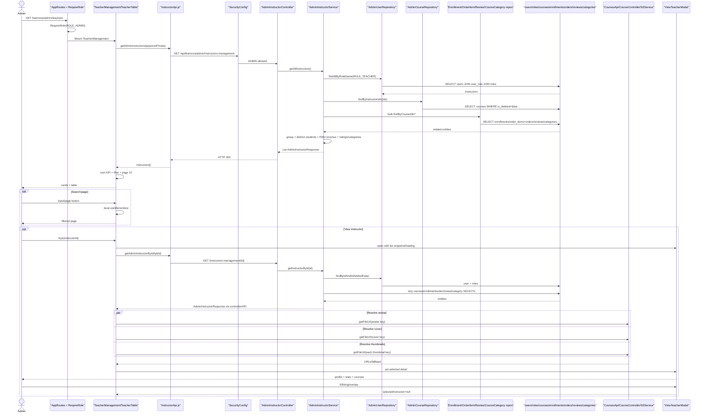
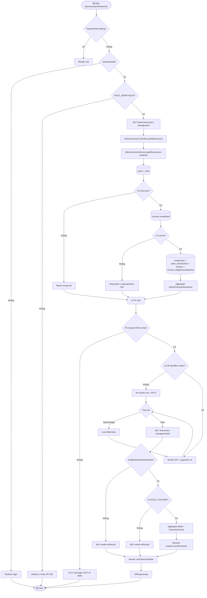

# Detailed Design As-Is — Instructor Management

> Phạm vi: màn hình **Giảng viên** tại `/learnova/admin/teachers`, gồm ba KPI, tìm kiếm, bảng giảng viên, phân trang và popup xem chi tiết/khóa học; đồng thời ghi nhận các control admin shell nhìn thấy trong ảnh.  
> Quy ước: **Đã xác minh từ code** = có bằng chứng trực tiếp; **Suy luận từ ảnh và code** = ghép UI ảnh với source; **Chưa xác minh** = không có dữ liệu runtime hoặc bằng chứng đầy đủ.

## 1. Thông tin màn hình

| Thuộc tính | Nội dung |
| --- | --- |
| Tên màn hình | Quản lý giảng viên / Instructor Management |
| Mã màn hình | Không tìm thấy mã chính thức; tên kỹ thuật `TeacherManagement` |
| Route/URL | FE `/learnova/admin/teachers`; API `/api/learnova/admin/instructors-management` |
| Actor | Quản trị viên có `ROLE_ADMIN` |
| Mục đích | Tổng hợp hoạt động giảng dạy và xem hồ sơ, thống kê, danh sách khóa học của từng giảng viên |
| Nguồn phân tích | Ảnh màn hình + FE + BE |
| Loại tài liệu | Reverse-engineered DD – As-Is |
| Mức độ xác minh | Đã xác minh end-to-end route, list/detail API, phép tính, repository/entity/DDL; số liệu runtime trong ảnh chưa có DB dump để đối chiếu |
| File DD | `docs/DD_InstructorManagement.md` |

## 2. Tổng quan chức năng

- Admin mở mục **Giảng viên** từ sidebar hoặc URL `/learnova/admin/teachers`; route dùng admin guard chung (`AppRoutes.jsx:72-76`; `SidebarAdmin.jsx:38-41`).
- Khi mount, `TeacherManagement` gọi `GET /admin/instructors-management`, lưu toàn bộ `AdminInstructorResponse[]` và truyền cùng dữ liệu cho KPI/bảng (`TeacherManagement.jsx:10-69`; `InstructorApi.js:3-9`).
- Ba KPI được FE cộng từ response: tổng `numberOfClasses`, tổng `totalStudents`, tổng `totalRevenue` (`TeacherStatistics.jsx:22-26`).
- Search chỉ chạy local theo `fullName`, `email`, `instructorCode`; pagination local 10 dòng/trang (`TeacherTable.jsx:53-84`).
- Bảng hiển thị mã `GV%03d`, tên/email/chuyên môn, số lớp, học viên và duy nhất một thao tác **Xem**. Không có thêm/sửa/xóa, sort, export/download hoặc bulk action.
- Click mắt gọi `GET /admin/instructors-management/{id}`, resolve avatar/cover/thumbnail và hiển thị popup hồ sơ, ba KPI cá nhân, bảng khóa học (`TeacherTable.jsx:86-118`; `ViewTeacherModal.jsx:99-287`).
- API chỉ đọc database. Admin shell vẫn có side effect notification read và logout; bản thân chức năng giảng viên không INSERT/UPDATE/DELETE.
- Lỗi load hiện cùng một chuỗi English ở vùng KPI và bảng. Lỗi detail giữ popup mở với dữ liệu list đã chọn và thêm message “Không tìm thấy giảng viên.”
- Điểm bắt đầu là `AppRoutes.jsx:76`; điểm kết thúc load là render KPI/table. Detail kết thúc khi popup render response hoặc khi người dùng đóng bằng X/Đóng/overlay.

## 3. Đối chiếu ảnh với code

| STT | Thành phần trên ảnh | Loại control | File FE | Component/Method | Event/API | Nguồn dữ liệu | Xác minh |
| --: | --- | --- | --- | --- | --- | --- | --- |
| 1 | Tiêu đề “Giảng viên” | Heading | `Header.jsx:55-87` | route title | pathname | i18n `admin.instructors` | Đã xác minh |
| 2 | Sidebar, Giảng viên active | Navigation | `SidebarAdmin.jsx:38-41,120-154` | NavLink | route | menu tĩnh | Đã xác minh |
| 3 | Khóa học đang quản lý = 8 | KPI | `TeacherStatistics.jsx:22-25,87-91`; `CourseLoadCard.jsx` | sum classes | load API | `numberOfClasses` | Code xác minh; số 8 chưa xác minh runtime |
| 4 | Lượt đăng ký học viên = 9 | KPI | `TeacherStatistics.jsx:22-25,94-98`; `StudentEnrollmentCard.jsx` | sum totalStudents | load API | unique students per instructor | Code xác minh; label và phép đếm khác ngữ nghĩa “lượt” |
| 5 | Doanh thu hệ thống = $1,037,301 | KPI | `TeacherStatistics.jsx:10-16,22-25,101-105`; `RevenueSummaryCard.jsx` | sum revenue | load API | paid order item price | Code xác minh; số ảnh chưa xác minh |
| 6 | Search theo tên/email/mã | Input | `TeacherFilters.jsx:5-24`; `TeacherTable.jsx:64-81` | setSearchTerm/useMemo | local only | list response | Đã xác minh |
| 7 | Header bảng Mã giảng viên | Table header | `TeacherTable.jsx:125-141` | translated th | none | i18n | Đã xác minh |
| 8 | Giảng viên/Chuyên môn | Table column | `TeacherTable.jsx:152-159` | displayName/email/specialization | none | DTO | Đã xác minh |
| 9 | Số lớp học | Table column | `TeacherTable.jsx:161` | displayClasses | none | DTO | Đã xác minh |
| 10 | Học viên | Table column | `TeacherTable.jsx:162` | displayStudents | none | DTO | Đã xác minh |
| 11 | Thao tác quản lý, icon mắt | Button | `TeacherTable.jsx:163-166` | `handleView` | GET detail | instructorId | Đã xác minh |
| 12 | GV002/GV005/... | Badge | `TeacherTable.jsx:32-39,151` | instructorCode | none | BE `formatInstructorCode` | Đã xác minh |
| 13 | N/A chuyên môn | Badge | `TeacherTable.jsx:34-38,157` | fallback | none | category aggregation | Đã xác minh |
| 14 | Pagination | Buttons | `TeacherTable.jsx:173-179` | currentPage | local slice | filtered length | Code xác minh; phần ảnh dưới bị cắt |
| 15 | Popup “Xem giảng viên” | Modal | `ViewTeacherModal.jsx:117-133` | selectedInstructor | GET detail | detail DTO | Đã xác minh |
| 16 | Cover/avatar/initials | Image/fallback | `ViewTeacherModal.jsx:104-115,135-155` | image error state | resolve media | avatar/cover + default asset | Đã xác minh |
| 17 | Tên/email/phone/chuyên môn | Text | `ViewTeacherModal.jsx:157-170` | valueOrDash | none | detail DTO | Đã xác minh |
| 18 | Mã giảng viên/ngày tạo | Info cards | `ViewTeacherModal.jsx:173-181` | formatDate | none | id/createdAt | Đã xác minh |
| 19 | Thông tin cơ bản | Read-only panel | `ViewTeacherModal.jsx:186-197` | InfoRow | none | detail DTO | Đã xác minh |
| 20 | Hiển thị | Text | `ViewTeacherModal.jsx:62,193` | isDeleted→Available/Hidden | none | users.is_deleted | Đã xác minh |
| 21 | Thống kê giảng dạy | KPI panel | `ViewTeacherModal.jsx:199-217` | formatNumber/currency | none | detail aggregate | Đã xác minh |
| 22 | Các khóa học của giảng viên (3) | Table | `ViewTeacherModal.jsx:220-279` | `courseItems` | none after detail | CourseSummary[] | Đã xác minh |
| 23 | Course/Category/Students/Rating/Price/Status/Published | Columns | `ViewTeacherModal.jsx:226-277` | format/status class | none | course summary | Đã xác minh |
| 24 | Thumbnail khóa học bị lỗi trong ảnh | Image | `ViewTeacherModal.jsx:241-247` | thumbnail URL | media GET | thumbnailKey | Suy luận từ ảnh và code; không có onError cho course image |
| 25 | X/Đóng/overlay | Buttons/backdrop | `ViewTeacherModal.jsx:118-130,281-283` | onClose | none | selected state | Đã xác minh |
| 26 | EN, chuông 34, settings, tài khoản | Shell buttons | `Header.jsx:89-168`; `NotificationBell.jsx:13-62` | language/bell/link/menu | notification/auth APIs | i18n/auth/notifications | Code xác minh; số 34 runtime chưa xác minh |

Không thấy input form chỉnh sửa, dropdown, checkbox/radio, create/update/delete, download/export. Từ khóa đã kiểm tra trong `teacher_management`: `edit`, `delete`, `save`, `export`, `download`, `checkbox`, `radio`; component runtime chỉ có View.

## 4. Danh sách source liên quan

### Frontend — thứ tự chạy

| STT | Layer | Đường dẫn file | Class/Component | Method liên quan | Vai trò |
| --: | --- | --- | --- | --- | --- |
| 1 | Route | `front_end/src/app/routes/AppRoutes.jsx` | `App` | lines 72-76 | Guard/layout/teachers route |
| 2 | Guard | `front_end/src/app/routes/RequireRole.jsx` | `RequireRole` | lines 4-25 | Auth/ROLE_ADMIN |
| 3 | Layout | `front_end/src/app/layouts/admin/DashboardLayout.jsx` | `Dashboard` | lines 6-18 | Shell + outlet |
| 4 | Sidebar | `front_end/src/shared/components/sidebar/sidebar_admin/SidebarAdmin.jsx` | `SidebarAdmin` | lines 38-41,120-154 | Navigation |
| 5 | Header | `front_end/src/shared/components/header/admin_header/Header.jsx` | `Header` | lines 17-168 | Title/control shell |
| 6 | Bell | `.../admin_header/NotificationBell.jsx` | `NotificationBell` | lines 13-62 | Header notification |
| 7 | Hook | `front_end/src/shared/hooks/useNotifications.js` | hook | lines 13-78 | Poll/list/read |
| 8 | Auth | `front_end/src/app/providers/AuthContext.jsx` | logout | lines 67-79 | Session clear |
| 9 | Auth API | `front_end/src/features/auth/infrastructure/api/AuthApi.js` | logoutApi | lines 19-21 | Logout HTTP |
| 10 | HTTP | `front_end/src/shared/hooks/useAxiosPrivate.js` | hook | lines 11-81 | 401 refresh/retry |
| 11 | HTTP | `front_end/src/shared/api-client/AxiosClient.js` | axiosClient | lines 3-11 | baseURL/cookies |
| 12 | API | `front_end/src/features/admin/infrastructure/api/InstructorApi.js` | get list/detail | lines 3-13 | Instructor HTTP |
| 13 | Media API | `front_end/src/shared/api/public/CoursesApi.js` | getFileUrl | lines 15-16 | Resolve file key |
| 14 | Page | `.../teacher_management/TeacherManagement.jsx` | `TeacherManagement` | lines 10-75 | State/load/composition |
| 15 | KPI | `.../statistics/TeacherStatistics.jsx` | `TeacherStatistics` | lines 10-112 | Aggregate/render KPI |
| 16-18 | KPI cards | `CourseLoadCard.jsx`, `StudentEnrollmentCard.jsx`, `RevenueSummaryCard.jsx` | card components | lines 4-22 | Display values |
| 19 | Filter | `.../filters/TeacherFilters.jsx` | `TeacherFilters` | lines 5-28 | Controlled search |
| 20 | Table | `.../table/TeacherTable.jsx` | `TeacherTable` | lines 10-192 | Map/filter/page/detail call |
| 21 | Modal | `.../modal/ViewTeacherModal.jsx` | `ViewTeacherModal` | lines 18-289 | Profile/stat/course display |
| 22-23 | i18n | `front_end/src/app/i18n/locales/vi.json`, `en.json` | `instructorAdmin` | line 21 | Labels |
| 24-34 | CSS | shell CSS + 8 teacher CSS | CSS classes | toàn file | Layout/table/modal/responsive |

### Backend/Database — thứ tự chạy

| STT | Layer | Đường dẫn file | Class/Component | Method liên quan | Vai trò |
| --: | --- | --- | --- | --- | --- |
| 1 | Security | `.../shared/config/SecurityConfig.java` | config | lines 41-103 | ADMIN only |
| 2 | Controller | `.../admin/adapter/in/web/AdminInstructorController.java` | controller | lines 15-29 | GET list/detail |
| 3 | Service | `.../admin/application/AdminInstructorService.java` | service | lines 47-320 | Aggregation/mapping |
| 4 | DTO | `.../admin/adapter/in/web/dto/AdminInstructorResponse.java` | records | lines 11-42 | Response contract |
| 5 | User repo | `.../admin/infrastructure/persistence/AdminUserRepository.java` | repo | lines 19,23-24 | Teachers/detail user |
| 6 | Course repo | `.../admin/infrastructure/persistence/AdminCourseRepository.java` | repo | lines 22-23 | Nondeleted courses |
| 7-10 | Aggregate repos | `EnrollmentRepository.java`, `OrderItemRepository.java`, `ReviewRepository.java`, `CourseCategoryRepository.java` | JPA repos | 18-19/11-12/22-23/14-15 | Bulk related data |
| 11-19 | Entities | `User`, `Role`, `Course`, `CourseCategory`, `Category`, `Enrollment`, `Order`, `OrderItem`, `Review` | ORM | relevant mappings | Tables/relations |
| 20-23 | Enums | `RoleName`, `GenderType`, `CourseStatus`, `OrderStatus` | enum | toàn file | Serialized/domain values |
| 24 | Media | `S3Service.java` | resolve/sign | lines 124-166 | Avatar/file URLs |
| 25-26 | Media API | `CourseController.java`, `CourseService.java` | video URL/HLS check | 29-38/381-387 | FE media resolution |
| 27-28 | Exception | `GlobalExceptionHandler.java`, `ErrorResponse.java` | handlers/record | 32-117/3 | Error status/body |
| 29-33 | Shell logout | auth controller/service/token service/repo/entity | logout | known ranges | Visible account action |
| 34-39 | Shell notification | notification controller/service/repo/entity/response + UserRepository | list/count/read | relevant methods | Visible bell |
| 40 | Database | `back_end/src/main/resources/db/migration/V1__initial_schema.sql` | DDL | relevant ranges | Schema/constraints/FK |

## 5. Thiết kế chi tiết UI

| STT | Label hiển thị | Tên trong code | Control | Kiểu dữ liệu | Bắt buộc | Mặc định | Nguồn dữ liệu | Điều kiện hiển thị | Event |
| --: | --- | --- | --- | --- | --- | --- | --- | --- | --- |
| 1 | 3 KPI | `stats` | read-only cards | number/currency | — | 0; `—` loading | instructors response | luôn hiện | load state |
| 2 | Tìm theo tên... | `searchTerm` | controlled text | string | Không | `""` | user input | luôn enabled | setSearchTerm |
| 3 | Instructor table | `currentItems` | table | array | — | [] | filtered instructors | loading/no result/data branches | View/page |
| 4 | Mã giảng viên | `displayId` | text badge | string | — | N/A | instructorCode | row exists | none |
| 5 | Tên/email/chuyên môn | display fields | read-only | strings | — | Unknown/N/A | DTO | row exists | none |
| 6 | Số lớp/học viên | display fields | read-only | long | — | 0 | DTO aggregates | row exists | none |
| 7 | View | `handleView` | icon button | action | — | enabled | instructorId | row exists | GET detail |
| 8 | Trước/page/Sau | `currentPage` | buttons | integer | — | 1 | local | always table footer | local pagination |
| 9 | Popup profile | `selectedInstructor` | modal | object | — | null | list then detail DTO | selected != null | close/detail load |
| 10 | Avatar | `avatar` | image/initials | URL | — | initials | detail + resolver | avatar valid/not failed | onError |
| 11 | Cover | `resolvedCover` | image | URL | — | bundled default cover | detail + resolver | modal | onError→default |
| 12 | Basic info | InfoRow[] | text | mixed | — | `--` | DTO | modal | none |
| 13 | Visibility | `getVisibility` | text | enum-like | — | Available | isDeleted | modal | none |
| 14 | Detail KPI | numberOfClasses/totalStudents/totalRevenue | cards | numeric | — | 0 | detail response | modal | none |
| 15 | Course table | `courseItems` | table | list | — | [] | detail courses | modal | none |
| 16 | Thumbnail | thumbnailUrl/key | image/fallback AI | URL | — | AI only if no key | resolver | key truthy→img | no image onError |
| 17 | Rating | course.rating | star + decimal | double | — | 0.0 | average review | course row | none |
| 18 | Price/revenue | price/totalRevenue | currency | decimal | — | $0 | base price/paid order items | panels/table | none |
| 19 | Status | prettifyStatus | badge | string | — | N/A | CourseStatus | course row | class by value |
| 20 | X/Đóng/overlay | onClose | buttons/backdrop | action | — | enabled | selected state | modal | set null |

- Main page has no editable form, dropdown, checkbox/radio, max length or validation input beyond string normalization.
- Search is case-insensitive, trimmed, no debounce; reset page 1 on every search change (`TeacherTable.jsx:60-81`).
- Currency is USD with zero fraction; count uses `vi-VN`; dates use `en-GB` (`TeacherStatistics.jsx:10-20`; `ViewTeacherModal.jsx:18-48`).
- Null detail values become `--`; list fallbacks are Unknown/N/A/0. Invalid dates return original string rather than `--` (`ViewTeacherModal.jsx:27-51`).
- Loading list row spans five columns; empty row appears after load. Popup has no global spinner overlay; `loadingDetails` only appears when `courseItems` is empty (`TeacherTable.jsx:145-149`; `ViewTeacherModal.jsx:269-273`).
- Popup max-height/scroll; course table horizontally scrolls; responsive breakpoints defined in CSS.

## 6. Điểm bắt đầu và điểm kết thúc

| Luồng | File/Method bắt đầu | Điều kiện bắt đầu | Các layer đi qua | File/Method kết thúc | Kết quả |
| --- | --- | --- | --- | --- | --- |
| Mở màn hình | `AppRoutes.jsx:76` | URL teachers | RequireRole→Layout→page | `TeacherManagement.jsx:49-72` | Page rendered |
| Load list/KPI | `loadInstructors:21-42` | mount | API→Controller→Service→6 repos→DB→DTO→FE | setInstructors/loading | KPI/table |
| Search | `TeacherFilters:15-20` | input | local state→useMemo | filteredInstructors | filtered table |
| Pagination | `TeacherTable:173-179` | click | local currentPage/slice | currentItems | page rows |
| View detail | `handleView:86-118` | eye click | detail API→controller→service→ORM/DB→media APIs→modal | setSelectedInstructor | profile/courses |
| Close modal | `ViewTeacherModal:118,128,282` | overlay/X/Đóng | onClose | selected=null | modal unmount |
| Shell actions | Header/sidebar/bell | click/hover | router/notification/auth | route/state | leave/update shell |

Không có Add/Edit/Delete/Save/Confirm/export/download trong chức năng giảng viên hiện tại.

## 7. Luồng khởi tạo màn hình

1. Route `/learnova/admin/teachers` match `AppRoutes.jsx:76` trong parent admin.
2. `RequireRole.jsx:4-25` chờ auth; unauthenticated→login, thiếu ROLE_ADMIN→`/`.
3. `DashboardLayout.jsx:6-18` mount sidebar/header/outlet; `TeacherManagement` khởi tạo `instructors=[]`, search empty, loading false, error empty (`10-16`).
4. `useEffect` chạy `loadInstructors`, bật loading/clear error (`18-24`).
5. FE gọi `getAdminInstructorsApi(axiosPrivate)` (`25-28`; `InstructorApi.js:3-8`).
6. Security yêu cầu ADMIN; `AdminInstructorController.getAllInstructors` nhận GET không request DTO/query (`20-24`).
7. `AdminInstructorService.getAllInstructors` bắt đầu `@Transactional(readOnly=true)` (`47-48`).
8. `AdminUserRepository.findAllByRoleName(ROLE_TEACHER)` lấy mọi user có teacher role, không filter deleted/active (`AdminUserRepository.java:23-24`).
9. Nếu không instructor, service trả list rỗng. Nếu có, lấy nondeleted courses theo instructor ids (`AdminInstructorService:49-68`; `AdminCourseRepository:22-23`).
10. Nếu có course, bulk-load enrollments, order items+orders, reviews, course categories+categories (`70-85`).
11. Service group theo course/instructor; tính số course, distinct student, paid revenue; tạo CourseSummary với per-course distinct student, average rating 1 decimal, paid revenue, primary/first category (`87-167`).
12. `createResponse` map user, code `GV%03d`, resolve avatar, specialization và aggregate (`288-320`).
13. Controller trả 200 list `AdminInstructorResponse`; FE normalize non-array→[]/single array ở API adapter.
14. Parent set instructors; TeacherStatistics cộng ba KPI; TeacherTable map fallback, filter và slice 10 (`TeacherManagement:26-38`; `TeacherStatistics:22-26`; `TeacherTable:32-84`).
15. Nếu lỗi, parent console.error và set literal `Could not load instructors.`; KPI và table cùng render lỗi, cuối cùng loading false (`TeacherManagement:30-38`; Stats 84; Table 123).

## 8. Luồng từng thao tác

### 8.1 Tìm kiếm

| Bước | Layer | File | Method | Input | Xử lý | Output/Chuyển tiếp |
| ---: | --- | --- | --- | --- | --- | --- |
| 1 | UI | `TeacherFilters.jsx:15-20` | onChange | string | controlled callback | searchTerm |
| 2 | FE | `TeacherTable.jsx:60-81` | effect/useMemo | trimmed lowercase | reset page 1; match name/email/code | filtered list |
| 3 | FE | `TeacherTable.jsx:83-84` | slice | pageSize10 | calculate pages/items | render/empty |

Không API, validation, debounce hoặc DB. Không tìm chuyên môn, phone, course title hay status dù các giá trị có trong response.

### 8.2 Phân trang

| Bước | Layer | File | Method | Input | Xử lý | Output/Chuyển tiếp |
| ---: | --- | --- | --- | --- | --- | --- |
| 1 | UI | `TeacherTable.jsx:173-179` | button handlers | page | clamp prev/next, direct page | setCurrentPage |
| 2 | FE | `TeacherTable.jsx:83-84` | slice | filtered list | 10 items | rows |

Không backend pagination/sort. totalPages tối thiểu 1; first/last navigation disabled.

### 8.3 Xem chi tiết giảng viên

| Bước | Layer | File | Method | Input | Xử lý | Output/Chuyển tiếp |
| ---: | --- | --- | --- | --- | --- | --- |
| 1 | UI | `TeacherTable.jsx:163-166` | click Eye | list instructor | `handleView` | popup opens with list data |
| 2 | FE | `TeacherTable.jsx:86-93` | handleView | instructorId | clear error, loading true, GET detail | API |
| 3 | API | `InstructorApi.js:11-13` | getById | path id | GET `/instructors-management/{id}` | controller |
| 4 | Security | `SecurityConfig:78-80` | matcher | principal | ADMIN only | controller/401/403 |
| 5 | Controller | `AdminInstructorController:27-29` | getInstructorById | Long id | pass service | response |
| 6 | Service validation | `AdminInstructorService:170-179` | getInstructorById | id | find nondeleted; verify teacher role | 404/400 or continue |
| 7 | ORM/service | same `181-249` | aggregate | user courses | filter course deleted, traverse enrollments/orders/reviews/categories | CourseSummary list |
| 8 | DB | entity relations | lazy SELECTs | instructor/course ids | read relevant tables | entities |
| 9 | Response | service `251-258,292-320` | createResponse | aggregates | code/media/DTO | 200 JSON |
| 10 | FE mapping | `TeacherTable:93-111` | map/Promise.all | detail/media keys | resolve avatar/cover/thumbnails | selected detail |
| 11 | Media | `CoursesApi:15-16`→CourseController/S3 | getFileUrl | fileKey | HLS-ready or signed URL; fallback origin | URLs |
| 12 | UI | `ViewTeacherModal:99-287` | render | detail | profile/KPI/course table | user sees popup |

Failure: 404 nếu deleted/missing; 400 nếu user không có teacher role; any detail/media mapping rejection chạy catch chung, set translated `noResults`, nhưng selected list object vẫn tồn tại nên modal vẫn hiện dữ liệu list cùng error (`TeacherTable.jsx:112-117`). Media resolver tự catch từng key và dùng backend-origin URL, nên thường không làm fail cả detail.

### 8.4 Đóng popup

| Bước | Layer | File | Method | Input | Xử lý | Output/Chuyển tiếp |
| ---: | --- | --- | --- | --- | --- | --- |
| 1 | UI | `ViewTeacherModal:118,128-130,281-283` | onClose | overlay/X/Đóng | parent setSelectedInstructor(null) | modal return null |

Không unsaved state/confirmation. Nếu detail request còn pending, không có abort/request-id guard; response sau close có thể set selected instructor lại.

### 8.5 Admin shell

| Bước | Layer | File | Method | Input | Xử lý | Output/Chuyển tiếp |
| ---: | --- | --- | --- | --- | --- | --- |
| 1 | Language | `Header.jsx:95-98` | click | vi/en | i18n + localStorage | rerender labels |
| 2 | Bell | NotificationBell/hook | hover/click/poll | id | list/count/read/navigate | badge/menu |
| 3 | Links | Header/Sidebar | click | route | React Router | target page |
| 4 | Logout | Header→AuthContext | click | cookie | logout API, clear state | login |

## 9. API specification

| API | HTTP method | Nơi gọi | Controller | Request | Response | Mục đích |
| --- | --- | --- | --- | --- | --- | --- |
| `/api/learnova/admin/instructors-management` | GET | `InstructorApi.js:3-8` | `getAllInstructors` | none | `List<AdminInstructorResponse>` | List + KPI source |
| `/api/learnova/admin/instructors-management/{id}` | GET | `InstructorApi.js:11-13` | `getInstructorById` | Long path id | `AdminInstructorResponse` | Popup detail |
| `/api/learnova/courses/video-url?fileKey={key}` | GET | `CoursesApi.js:15-16` | `CourseController.getVideoUrl` | required query | `{url}` | Resolve media |
| `/api/learnova/notifications/unread-count` | GET | header hook | NotificationController | auth | long | Badge |
| `/api/learnova/notifications?page=0&size=20` | GET | header hook | listMine | page/size | Page response | Bell list |
| `/api/learnova/notifications/{id}/read` | PATCH | header hook | markRead | path id | 204 | Mark read |
| `/api/learnova/auth/logout` | POST | AuthApi | AuthController | optional cookie | 204 | Logout |

- Base header: JSON, cookie credentials; interceptor refresh/retry một lần cho non-auth 401 (`AxiosClient.js:3-11`; `useAxiosPrivate.js:22-64`).
- Instructor APIs không query/body/request DTO; list không page/filter/sort. Detail chỉ path `Long id`; invalid nonnumeric path bị Spring binding trước service.
- Permission: `/admin/**` cần ADMIN. Success 200. 401 security JSON; 403 permission message; detail 404 “Instructor not found”; detail non-teacher 400 “User is not an instructor”; generic 500.
- Response fields: instructor identity/profile/flags/timestamps/specialization/classes/students/revenue và nested courses id/title/thumbnail/category/students/rating/price/revenue/status/publishedAt (`AdminInstructorResponse.java:11-42`).
- FE list success sets state. List failure uses fixed English error, không dùng response message. Detail failure dùng translated noResults, không phân biệt 400/403/404/500.

## 10. Backend processing

| Layer | File | Class | Method | Input | Xử lý | Gọi tiếp | Output |
| --- | --- | --- | --- | --- | --- | --- | --- |
| Security | `SecurityConfig.java` | config | filter chain | request/JWT | ADMIN matcher | controller | allow/deny |
| Controller | `AdminInstructorController.java` | controller | getAll/getById | none/id | pass-through | service | 200 DTO |
| Service | `AdminInstructorService.java` | service | getAll | none | bulk aggregation | 6 repos/S3 | list DTO |
| Service | same | service | getById | id | validate + entity traversal | repos/lazy ORM/S3 | DTO |
| User repo | `AdminUserRepository.java` | JPA | role query/find nondeleted id | role/id | JPQL/derived | users/roles | users |
| Course repo | `AdminCourseRepository.java` | JPA | findByInstructorIdIn | ids | `isDeleted=false` | courses | courses |
| Aggregate repos | four repos | JPA | findByCourseIdIn* | course ids | bulk SELECT/join-fetch | DB | related entities |
| Mapper | service | inline | createResponse/CourseSummary | entities | formats code/category/rating/revenue | S3 | response |
| Transaction | service | annotations | list/detail | whole method | `readOnly=true` | ORM | commit/rollback |
| Exception | Global handler | advice | handlers | exceptions | map status/body | FE | ErrorResponse |

Không có request DTO, mutation, explicit mapper class hoặc repository write trong screen flow.

## 11. Database và query

| Bảng | Cột sử dụng | Mục đích | Thao tác | File/Method truy cập |
| --- | --- | --- | --- | --- |
| `users` | id/name/email/avatar/cover/phone/DOB/gender/active/deleted/times | instructor profile | SELECT | AdminUserRepository |
| `roles` | role_id,role_name | select teacher/validate role | SELECT/JOIN | findAllByRoleName; eager roles |
| `user_role` | user_id,role_id | many-to-many | JOIN | User.roles |
| `courses` | id,title,price,status,instructor_id,is_deleted,published,thumbnail | counts/course list | SELECT WHERE instructor ids/deleted false | AdminCourseRepo/entity |
| `enrollments` | course_id,user_id | unique students | SELECT | EnrollmentRepo/entity |
| `order_items` | order_id,course_id,price | revenue | SELECT JOIN order | OrderItemRepo/entity |
| `orders` | order_id,status | only PAID revenue | JOIN/SELECT | OrderItemRepo/entity |
| `reviews` | course_id,rating | average course rating | SELECT | ReviewRepo/entity |
| `course_categories` | course_id,category_id,is_primary | category/specialization | SELECT JOIN | CourseCategoryRepo/entity |
| `categories` | category_id,name,is_deleted | displayed names | JOIN/SELECT | CourseCategory relation |
| `notifications` | user/read/time/... | shell bell | SELECT/COUNT/UPDATE | NotificationRepo |
| `verification_tokens` | token/user/type/expiry | shell logout | SELECT/DELETE | token repo |

Query As-Is:

- Instructor list JPQL: `SELECT DISTINCT u FROM User u JOIN u.roles r WHERE r.roleName=:ROLE_TEACHER`; **không** filter `u.isDeleted/u.isActive`, không ORDER BY (`AdminUserRepository.java:23-24`).
- Bulk course JPQL: instructor id IN list AND `c.isDeleted=false`; không filter status/isHidden, không ORDER BY (`AdminCourseRepository.java:22-23`).
- Enrollments/reviews filter course id IN; order items JOIN FETCH order; categories JOIN FETCH category (`EnrollmentRepository:18-19`; `OrderItemRepository:11-12`; `ReviewRepository:22-23`; `CourseCategoryRepository:14-15`).
- Total classes = số course nondeleted bất kể draft/pending/hidden/published.
- Total students per instructor = distinct `enrollment.user.id` trên tất cả course; per course cũng distinct. KPI ngoài cùng SUM các total instructor, không đếm row enrollment thuần.
- Revenue = SUM `order_items.price` chỉ khi associated `orders.status=PAID`; null price bỏ qua, empty→0. Không dùng `courses.base_price` hay `orders.total_amount`.
- Rating = AVG integer review rating per course, empty→0, rounded one decimal.
- Category course = primary đầu tiên, nếu không thì bất kỳ first, else N/A. Specialization = tất cả category names distinct nối ` / `, không chỉ primary.
- Detail find user WHERE id và isDeleted=false; verify role; lấy `user.courses` rồi filter course deleted. Các collection lazy có thể phát sinh nhiều SELECT trong read-only transaction.
- Không INSERT/UPDATE/DELETE trong instructor APIs. Empty instructor/course short-circuit. Null converted to N/A/0 as service/FE described.
- DDL confirms review rating 1..5; price nonnegative; course published date/status constraint; composite enrollment/course-category PK; unique order item per order/course and review per user/course (`V1:750-858,1071-1113,1762-2006`).

## 12. Mapping dữ liệu FE–BE–DB

| Dữ liệu | UI field | FE variable | Request field | Backend DTO | Service/Repository | Table.Column | Response field | UI hiển thị |
| --- | --- | --- | --- | --- | --- | --- | --- | --- |
| Instructor id | action/detail | instructorId | path id | Long | user repo | users.user_id | instructorId | request/key |
| Code | badge/card | instructorCode/displayId | — | String | `GV%03d` | derived from user_id | instructorCode | GV002 |
| Name/email/phone | table/profile | fields | — | strings | direct user map | users columns | same | text/-- |
| Avatar/cover | profile | URLs | fileKey query | strings | S3/media | users.avatar/cover_image | avatar/coverImage | image/fallback |
| Gender/DOB/times | basic info | fields | — | enum/date/time | direct | users columns | same | en-GB |
| Visibility | basic info | isDeleted | — | Boolean | direct | users.is_deleted | isDeleted | Available/Hidden |
| Specialization | tag/info | specialization | — | String | buildSpecialization | categories.name via course_categories | specialization | names joined slash |
| Class count | KPI/table/detail | numberOfClasses | — | Long | course list size | courses.instructor_id,is_deleted | numberOfClasses | integer |
| Students | KPI/table/detail/course | totalStudents/students | — | Long | distinct enrollment users | enrollments.user_id/course_id | fields | vi number |
| Revenue | KPI/detail | totalRevenue | — | BigDecimal | paid order items sum | order_items.price/orders.status | totalRevenue | USD 0 decimals |
| Course title/thumb | course row | course fields | fileKey | CourseSummary | direct/S3 | courses.title/thumbnail_key | title/thumbnailKey | image+title |
| Category | course row | category | — | String | primary/first selection | categories.name/is_primary | category | text |
| Rating | course row | rating | — | Double | average review | reviews.rating | rating | star x.x |
| Price | course row | price | — | BigDecimal | base price | courses.base_price | price | USD |
| Status/published | badges/date | status/publishedAt | — | String/OffsetDateTime | direct | courses.status/published_at | same | prettified/date |

## 13. Business rule rút ra từ code

| ID | Business rule hiện tại | Điều kiện | File/Method | Khi đúng | Khi sai | Mức xác minh |
| --- | --- | --- | --- | --- | --- | --- |
| BR-01 | Page/API chỉ admin | ROLE_ADMIN | guard/security | allow | redirect/401/403 | Đã xác minh |
| BR-02 | User có teacher role được đưa vào list | role association exists | user repo role query | include | exclude | Đã xác minh |
| BR-03 | List không loại deleted/inactive teacher | role match | same query | vẫn include | — | Đã xác minh |
| BR-04 | Detail chỉ user chưa deleted và có teacher role | id | service 172-179 | aggregate | 404/400 | Đã xác minh |
| BR-05 | Code = GV + id pad 3 | any id | service 288-290 | e.g. GV002 | — | Đã xác minh |
| BR-06 | Course count gồm mọi nondeleted status/visibility | course not deleted | course repo | count | exclude deleted | Đã xác minh |
| BR-07 | Instructor student count distinct across courses | enrollments | service 92-96 | one per user/instructor | zero | Đã xác minh |
| BR-08 | KPI student là sum distinct-per-instructor | list | Stats 22-25 | sum | 0 | Đã xác minh |
| BR-09 | Revenue chỉ PAID item price | order paid | service 97-107 | add | ignore | Đã xác minh |
| BR-10 | Rating average then round 1 decimal | reviews exist | service 116-121,149 | avg | 0 | Đã xác minh |
| BR-11 | Primary category preferred | category links | service 134-141 | primary/first | N/A | Đã xác minh |
| BR-12 | Specialization includes all distinct course categories | courses categories | 261-285 | slash join | N/A | Đã xác minh |
| BR-13 | Search matches name/email/code only | keyword | Table 64-81 | include | exclude | Đã xác minh |
| BR-14 | Detail is freshly fetched, not solely list snapshot | click view | Table 86-111 | replace selected | error retains list data | Đã xác minh |
| BR-15 | Screen is read-only | all runtime controls | source | SELECT only | — | Đã xác minh |

## 14. Validation, permission và message

| Loại | Điều kiện | FE/BE | File/Method | Mã/Nội dung message | Hành vi |
| --- | --- | --- | --- | --- | --- |
| Guard | auth loading | FE | RequireRole 7 | none | render null |
| Auth | unauthenticated | FE/BE | guard/security | 401 Unauthorized | redirect/JSON |
| Role | non-admin | FE/BE | guard/security | permission message | redirect/403 |
| Search | any string | FE | Table 64-81 | none | trim/lowercase local |
| Path binding | invalid id | BE | controller path Long | framework 400 behavior | handler/framework |
| Not found | id absent/deleted | BE | service 172-173 | Instructor not found | 404 |
| Business | user not teacher | BE | service 175-179 | User is not an instructor | 400 |
| Empty list | no teachers | FE | Table 147-149 | Không tìm thấy giảng viên. | table row |
| Loading list | request pending | FE | Table 145-146 | Đang tải giảng viên... | table row |
| List error | GET fails | FE | TeacherManagement 30-34 | Could not load instructors. | duplicated error blocks |
| Detail error | any failure | FE | Table 112-117 | instructorAdmin.noResults | modal error, list snapshot remains |
| Empty courses | no course | FE | Modal 269-273 | loadingDetails/noCourseData | table row |
| Null values | null/empty | FE | valueOrDash | `--` | detail fallback |
| Media error | avatar/cover | FE | modal error states | no message | initials/default cover |
| Course image error | invalid resolved URL | FE | Modal 243-247 | no message/onError | browser broken image |
| Generic BE | exception | BE | Global handler | unexpected error | 500 JSON |

Không request DTO/Bean Validation cho hai API. Không popup confirmation/success vì không mutation.

## 15. Mermaid sequence toàn bộ màn hình

## 16. Mermaid flowchart

## 17. Phân tích từng source trong cùng file DD

### File: `front_end/src/app/routes/AppRoutes.jsx`
- Route layer; import TeacherManagement line 11, mount `teachers` line 76 dưới RequireRole/admin layout. Input URL; output component tree.

### File: `front_end/src/app/routes/RequireRole.jsx`
- FE guard lines 4-25; kiểm auth/active role/roles, redirect hoặc render. Không API/message.

### File: `front_end/src/app/layouts/admin/DashboardLayout.jsx`
- Layout lines 6-18; SidebarAdmin + Header + Outlet. Không state/business logic.

### File: `front_end/src/shared/components/sidebar/sidebar_admin/SidebarAdmin.jsx`
- Shell navigation; teacher item lines 38-41, NavLink render/active 120-154. Không backend.

### File: `front_end/src/shared/components/header/admin_header/Header.jsx`
- Header title teachers lines 55-65; language/settings/profile/logout lines 89-168. Input route/auth; output visible shell.

### File: `front_end/src/shared/components/header/admin_header/NotificationBell.jsx`
- Bell lines 13-62; count/list/read/navigation. Error swallowed by hook; badge runtime.

### File: `front_end/src/shared/hooks/useNotifications.js`
- Poll unread 45s, list page 0 size20, mark read lines 13-78. Output bell state/actions.

### File: `front_end/src/app/providers/AuthContext.jsx`
- Logout lines 67-79; API then always clear auth in finally. Used by Header/interceptor.

### File: `front_end/src/features/auth/infrastructure/api/AuthApi.js`
- POST logout lines 19-21; no request body.

### File: `front_end/src/shared/hooks/useAxiosPrivate.js`
- Singleton response interceptor lines 11-81; refresh/retry one non-auth 401, logout on refresh error. Page passes returned client to APIs.

### File: `front_end/src/shared/api-client/AxiosClient.js`
- Axios baseURL/cookie/JSON config lines 3-11. Input request, output promise/error.

### File: `front_end/src/features/admin/infrastructure/api/InstructorApi.js`
- List/detail adapters lines 3-13. List normalizes null→[] and scalar→[scalar]; detail returns body. Exceptions propagate.

### File: `front_end/src/shared/api/public/CoursesApi.js`
- `getFileUrl` lines 15-16 calls public course video URL endpoint. TeacherTable uses for profile/course images.

### File: `front_end/src/features/admin/presentation/teacher_management/TeacherManagement.jsx`
- Page lines 10-75; state, mount fetch, fixed error, child composition. One list API call; no mutation/form.

### File: `front_end/src/features/admin/presentation/teacher_management/statistics/TeacherStatistics.jsx`
- Format/aggregate lines 10-26; controlled/fallback fetch branch 28-80; card render 82-108. On this page controlled props always supplied, nên internal fetch branch không chạy.

### File: `front_end/src/features/admin/presentation/teacher_management/statistics/cards/courses_load/CourseLoadCard.jsx`
- Presentational card lines 4-22; title/value/icon only.

### File: `front_end/src/features/admin/presentation/teacher_management/statistics/cards/user_enrollment/StudentEnrollmentCard.jsx`
- Presentational card lines 4-22; displays summed student value.

### File: `front_end/src/features/admin/presentation/teacher_management/statistics/cards/revenue_summary/RevenueSummaryCard.jsx`
- Presentational card lines 4-22; displays formatted revenue.

### File: `front_end/src/features/admin/presentation/teacher_management/filters/TeacherFilters.jsx`
- Controlled search component lines 5-28; placeholder i18n, onChange callback. No validation/API.

### File: `front_end/src/features/admin/presentation/teacher_management/table/TeacherTable.jsx`
- Core interaction lines 10-192: display mapping/media resolver, local filter/page, async detail call, table states/actions. No abort/stale-request guard; error reduces all causes to noResults.

### File: `front_end/src/features/admin/presentation/teacher_management/modal/ViewTeacherModal.jsx`
- Read-only modal lines 18-289; formatters/status/fallbacks, profile/basic info/KPI/course table/close. Uses bundled `TeacherCoverImage.png`; course image lacks onError.

### File: `front_end/src/app/i18n/locales/vi.json`
- `instructorAdmin` namespace line 21 contains all page/modal labels Vietnamese.

### File: `front_end/src/app/i18n/locales/en.json`
- Corresponding English namespace; language toggle rerenders components.

### File: `front_end/src/app/layouts/admin/DashboardLayout.css`
- Admin shell grid/background. Presentation only.

### File: `front_end/src/shared/components/sidebar/sidebar_admin/SidebarAdmin.css`
- Sidebar/active/responsive styles. No state/API.

### File: `front_end/src/shared/components/header/admin_header/Header.css`
- Topbar/bell/account/dropdown styles. No business logic.

### File: `front_end/src/features/admin/presentation/teacher_management/TeacherManagement.css`
- Page spacing/responsive lines 1-63, breakpoints 34-63. No data logic.

### File: `front_end/src/features/admin/presentation/teacher_management/statistics/TeacherStatistics.css`
- Three-card grid; 2/1 columns at 1200/768 lines 18-33.

### File: `front_end/src/features/admin/presentation/teacher_management/statistics/cards/courses_load/CourseLoadCard.css`
- Green KPI card/icon typography; no event.

### File: `front_end/src/features/admin/presentation/teacher_management/statistics/cards/user_enrollment/StudentEnrollmentCard.css`
- Enrollment KPI appearance; no logic.

### File: `front_end/src/features/admin/presentation/teacher_management/statistics/cards/revenue_summary/RevenueSummaryCard.css`
- Revenue KPI appearance; no logic.

### File: `front_end/src/features/admin/presentation/teacher_management/filters/TeacherFilter.css`
- Search container/input responsive lines 1-119. No validation.

### File: `front_end/src/features/admin/presentation/teacher_management/table/TeacherTable.css`
- Table columns/badges/actions/pagination/responsive lines 1-300; horizontal overflow below 960px.

### File: `front_end/src/features/admin/presentation/teacher_management/modal/ViewTeacherModal.css`
- Fixed scrollable modal/profile/two panels/course table/close/responsive lines 1-782. File còn chứa style form/delete không được ViewTeacherModal hiện tại gọi.

### File: `back_end/src/main/java/com/example/back_end/shared/config/SecurityConfig.java`
- Security lines 41-103; `/admin/**` hasRole ADMIN, 401 JSON, JWT stateless. Runs before controller.

### File: `back_end/src/main/java/com/example/back_end/admin/adapter/in/web/AdminInstructorController.java`
- REST base line 15; GET list 20-24, detail 27-29. No DTO/body/validation; 200 pass-through.

### File: `back_end/src/main/java/com/example/back_end/admin/application/AdminInstructorService.java`
- Read-only aggregation service: list 47-168, detail 170-259, specialization/code/response helpers 261-320. Calls six repos/S3; business/resource exceptions propagate.

### File: `back_end/src/main/java/com/example/back_end/admin/adapter/in/web/dto/AdminInstructorResponse.java`
- Response records lines 11-42; full instructor aggregate and nested CourseSummary. No request DTO.

### File: `back_end/src/main/java/com/example/back_end/admin/infrastructure/persistence/AdminUserRepository.java`
- User JPA repo; role query lines 23-24 and nondeleted id line 19. List role query lacks active/deleted filters/order.

### File: `back_end/src/main/java/com/example/back_end/admin/infrastructure/persistence/AdminCourseRepository.java`
- `findByInstructorIdIn` lines 22-23 selects nondeleted courses for bulk list. No status/hidden/order filter.

### File: `back_end/src/main/java/com/example/back_end/learning/infrastructure/persistence/EnrollmentRepository.java`
- `findByCourseIdIn` lines 18-19 bulk SELECT enrollment. Service groups and distincts user id.

### File: `back_end/src/main/java/com/example/back_end/commerce/infrastructure/persistence/OrderItemRepository.java`
- `findByCourseIdInWithOrder` lines 11-12 JOIN FETCH order for PAID test and price sum.

### File: `back_end/src/main/java/com/example/back_end/assessment/infrastructure/persistence/ReviewRepository.java`
- `findByCourseIdIn` lines 22-23 bulk review SELECT for averages. Other methods not used by screen.

### File: `back_end/src/main/java/com/example/back_end/course/infrastructure/persistence/CourseCategoryRepository.java`
- `findByCourseIdInWithCategory` lines 14-15 JOIN FETCH category for category/specialization.

### File: `back_end/src/main/java/com/example/back_end/auth/domain/User.java`
- ORM users and roles/courses mappings (`31-86,94-95,118-125`). Instructor identity and detail navigation source.

### File: `back_end/src/main/java/com/example/back_end/auth/domain/Role.java`
- ORM roles lines 12-28; teacher role relation used query/validation.

### File: `back_end/src/main/java/com/example/back_end/course/domain/Course.java`
- ORM courses fields `33-113`, instructor link 82-84, related collections 115-150. Detail traverses collections; list uses repo.

### File: `back_end/src/main/java/com/example/back_end/course/domain/CourseCategory.java`
- ORM join table lines 14-34; course/category/isPrimary for selection.

### File: `back_end/src/main/java/com/example/back_end/course/domain/Category.java`
- ORM categories lines 28-67; name displayed/specialization, deleted flag not filtered in service.

### File: `back_end/src/main/java/com/example/back_end/learning/domain/Enrollment.java`
- ORM enrollments lines 20-54; course/user/order and progress. Only user/course used for counts.

### File: `back_end/src/main/java/com/example/back_end/commerce/domain/Order.java`
- ORM orders lines 24-78; status used PAID predicate.

### File: `back_end/src/main/java/com/example/back_end/commerce/domain/OrderItem.java`
- ORM order_items lines 16-42; price summed, course/order relationships.

### File: `back_end/src/main/java/com/example/back_end/assessment/domain/Review.java`
- ORM reviews lines 19-61; rating average; DB check 1..5.

### File: `back_end/src/main/java/com/example/back_end/auth/domain/enums/RoleName.java`
- Enum ROLE_ADMIN/ROLE_TEACHER/ROLE_USER lines 3-4. Teacher selection/validation.

### File: `back_end/src/main/java/com/example/back_end/user/domain/enums/GenderType.java`
- Enum Male/Female/Other lines 3-4; serialized in profile.

### File: `back_end/src/main/java/com/example/back_end/course/domain/enums/CourseStatus.java`
- Course status enum serialized to CourseSummary; FE prettifies and assigns badge class.

### File: `back_end/src/main/java/com/example/back_end/commerce/domain/enums/OrderStatus.java`
- Order status enum; service compares name to `PAID` before revenue sum.

### File: `back_end/src/main/java/com/example/back_end/media/infrastructure/storage/S3Service.java`
- `resolveAvatarUrl` 124-132 and signed URL 134-166. Avatar response/key resolution support; config errors propagate/fallback FE.

### File: `back_end/src/main/java/com/example/back_end/course/adapter/in/web/CourseController.java`
- `getVideoUrl` 29-38 receives fileKey, HLS-ready else signer. Public route used for images despite video naming.

### File: `back_end/src/main/java/com/example/back_end/course/application/CourseService.java`
- HLS lookup 381-387. Non-lesson image key normally falls through to signer.

### File: `back_end/src/main/java/com/example/back_end/shared/exception/GlobalExceptionHandler.java`
- Maps resource 404, business 400, permission 403, generic 500 lines 32-117. FE detail discards specific message.

### File: `back_end/src/main/java/com/example/back_end/shared/adapter/in/web/dto/ErrorResponse.java`
- Error record line 3 `{message}`.

### File: `back_end/src/main/java/com/example/back_end/auth/adapter/in/web/AuthController.java`
- Visible shell logout endpoint lines 66-74; clear cookies, 204.

### File: `back_end/src/main/java/com/example/back_end/auth/application/AuthService.java`
- Logout lines 89-100; verify/delete token, catch exception.

### File: `back_end/src/main/java/com/example/back_end/auth/application/VerificationTokenService.java`
- Refresh token verify/delete lines 53-68; transaction.

### File: `back_end/src/main/java/com/example/back_end/auth/infrastructure/persistence/VerificationTokenRepository.java`
- Token find/delete derived methods lines 16-18.

### File: `back_end/src/main/java/com/example/back_end/auth/domain/VerificationToken.java`
- ORM verification_tokens lines 18-56; shell logout only.

### File: `back_end/src/main/java/com/example/back_end/notification/adapter/in/web/NotificationController.java`
- Header list/count/read endpoints lines 19-80; checks Authentication.

### File: `back_end/src/main/java/com/example/back_end/notification/application/NotificationService.java`
- Header list/count/read service lines 74-118; user ownership and transaction.

### File: `back_end/src/main/java/com/example/back_end/notification/infrastructure/persistence/NotificationRepository.java`
- Derived list/count queries lines 17-19; mark read uses inherited find/save.

### File: `back_end/src/main/java/com/example/back_end/notification/domain/Notification.java`
- ORM notifications lines 18-62; isRead updated by bell.

### File: `back_end/src/main/java/com/example/back_end/notification/adapter/in/web/dto/NotificationResponse.java`
- Header response record lines 5-13.

### File: `back_end/src/main/java/com/example/back_end/auth/infrastructure/persistence/UserRepository.java`
- `findByEmailAndIsDeletedFalse` line 13 resolves current admin for notification.

### File: `back_end/src/main/resources/db/migration/V1__initial_schema.sql`
- DDL categories/course_categories/reviews/courses/enrollments `654-858`; order_items/orders `1071-1113`; roles/user_role/users `1390-1558`; keys `1762-2142`; relevant FK `2692-3048`.

## 18. Rủi ro kỹ thuật

| Mức độ | File/Method | Vấn đề | Bằng chứng | Ảnh hưởng | Cách kiểm tra |
| --- | --- | --- | --- | --- | --- |
| Cao | `AdminUserRepository:23-24` vs detail 172 | List gồm deleted teacher nhưng detail chỉ nondeleted | list query no deleted filter | Row xem được nhưng click trả 404 | Seed teacher deleted |
| Cao | `TeacherTable.handleView:86-118` | Không abort/stale guard | async response luôn setSelectedInstructor | Đóng popup khi request pending có thể popup mở lại; click nhanh có race | Throttle network, close/click two rows |
| Cao | Service student calc + UI label | “Lượt đăng ký” thực tế SUM unique student per instructor | distinct lines 92-96; Stats sum | Không phải số enrollment, student học nhiều instructor bị đếm nhiều KPI | Seed cross-course/cross-instructor enrollments |
| Trung bình | list role query | Không filter isActive | only role condition | Inactive instructor vẫn hiện/được tổng hợp | Seed inactive teacher |
| Trung bình | course repo 22-23 | Chỉ filter deleted, không status/hidden | query evidence | Draft/pending/hidden course được tính “đang quản lý” và hiện popup | Seed status variants |
| Trung bình | Service list/detail specialization | Hai path lấy collection/bulk với order không xác định | no ORDER BY; distinct encounter order | Chuỗi category có thể đổi thứ tự; ảnh list/modal đã thể hiện thứ tự khác | Reload/compare list detail |
| Trung bình | detail entity traversal 181-249 | Lazy collections per course | getEnrollments/orderItems/reviews/categories loops | N+1 query, chậm với nhiều course | SQL log/count queries |
| Trung bình | main list APIs | Không backend pagination/order | full list + local page | Payload/memory/time lớn; row order không ổn định | Seed thousands teachers |
| Trung bình | `TeacherStatistics:28-80` | Component có nhánh tự fetch nhưng page luôn controlled | instructors prop always passed | Dead branch trong screen, tăng complexity | React profiler/network |
| Trung bình | `TeacherManagement:30-34` | List error hard-code English và lặp ở KPI/table | same error prop rendered twice | UI Việt xuất English hai lần | Force GET error |
| Trung bình | `TeacherTable:112-117` | Detail mọi lỗi thành noResults, giữ list snapshot | catch ignores status/body | User không biết permission/server/not-found; modal có data cũ + error | Simulate 400/403/500 |
| Thấp | `ViewTeacherModal:243-247` | Course thumbnail không onError fallback | only fallback when no key | Broken image như ảnh | Return invalid URL/key |
| Thấp | media endpoint | Images dùng `/courses/video-url` permitAll | CoursesApi + SecurityConfig | Coupling/public signing surface | Request arbitrary image key |
| Thấp | category filters | Category `isDeleted` không được lọc | service reads all links/names | Deleted category có thể hiện specialization | Seed deleted category linked |
| Thấp | revenue formatting | USD zero decimals | Intl maximumFractionDigits 0 | Fractional cents rounded on UI | Seed price 39.50 |

## 19. Test case rút ra từ code

| ID | Chức năng | Tiền điều kiện | Thao tác | Input | Kết quả mong đợi theo code | File/Method |
| --- | --- | --- | --- | --- | --- | --- |
| TC-01 | Auth loading | loading | open | — | null | RequireRole |
| TC-02 | Unauthenticated | none | open | — | login redirect/401 API | guard/security |
| TC-03 | Non-admin | other role | open/API | — | `/` redirect/403 | guard/security |
| TC-04 | Load success | teachers exist | open | — | GET, KPI/table | page/service |
| TC-05 | No teachers | no teacher role | open | — | KPI0/noResults/page1 disabled | service/table |
| TC-06 | Teachers no courses | teacher only | open | — | row class/student/revenue 0, specialization N/A | service 57-67 |
| TC-07 | Load 500 | backend error | open | — | English error in stats/table | page catch |
| TC-08 | Search name | list loaded | type | name part | matching rows/page reset | Table useMemo/effect |
| TC-09 | Search email/code | loaded | type | email/GV002 | match | Table |
| TC-10 | Search specialization | only category text | type | category | no match unless also in name/email/code | predicate |
| TC-11 | Search no result | loaded | random | xyz | noResults | table |
| TC-12 | Pagination | >10 | next/page/prev | page | slice10/boundary disabled | Table 83-84,173-179 |
| TC-13 | View success | active teacher | eye | id | detail GET, media resolve, popup | handleView |
| TC-14 | View missing | stale id | eye | id | noResults error in open popup | catch/service 404 |
| TC-15 | View nonteacher | direct API user id | GET | id | 400 User is not an instructor | service |
| TC-16 | Deleted teacher | deleted with teacher role | load then eye | id | list row exists, detail 404 | query mismatch |
| TC-17 | Inactive teacher | inactive role teacher | load | — | included | list query |
| TC-18 | Course deleted | deleted course | load/detail | — | excluded from all aggregates/list | filters |
| TC-19 | Draft/hidden course | nondeleted | load/detail | — | included | course query |
| TC-20 | Unique student | same student in 3 courses one teacher | load | — | instructor total 1; each course maybe 1 | distinct logic |
| TC-21 | Cross instructor student | one student two teachers | load | — | KPI student adds 2 | Stats sum |
| TC-22 | Revenue paid | PAID items | load | prices | sum item price | service |
| TC-23 | Revenue nonpaid/null | pending/null | load | — | ignored/zero | service filters |
| TC-24 | Rating boundary | reviews 4,5 | detail | — | 4.5; no review 0.0 | average |
| TC-25 | Category selection | primary + secondary | detail | — | course primary; specialization all distinct | service |
| TC-26 | Null profile | null phone/DOB | view | — | `--` | modal |
| TC-27 | Avatar failure | invalid URL | view | — | initials | modal onError |
| TC-28 | Cover failure | invalid URL | view | — | default cover | modal onError |
| TC-29 | Thumbnail missing | no key | view | — | AI fallback | modal |
| TC-30 | Thumbnail invalid | bad key/url | view | — | broken browser image, no fallback | modal |
| TC-31 | Empty course detail | 0 courses | view | — | noCourseData after loading | modal |
| TC-32 | Close popup | open | X/Đóng/overlay | — | selected null | modal/parent |
| TC-33 | Close during pending | slow detail | close | — | risk response reopens popup | handleView |
| TC-34 | Language | page/modal | toggle EN/VI | — | translated labels | i18n/Header |
| TC-35 | DB exception | query error | load/detail | — | 500; FE generic screen error/noResults | handler/catches |
| TC-36 | No mutation/export | page | inspect actions | — | only search/page/view | screen source |

## 20. Kết luận End-to-End

- Chức năng bắt đầu tại `AppRoutes.jsx:76`, qua `RequireRole.jsx:4-25`, `DashboardLayout.jsx:6-18`, rồi `TeacherManagement.jsx:10-75`.
- Load đi theo `getAdminInstructorsApi` → `AdminInstructorController.getAllInstructors` → `AdminInstructorService.getAllInstructors` → user/course/enrollment/order/review/category repositories → PostgreSQL → `AdminInstructorResponse[]` → FE KPI/table.
- Detail bắt đầu ở `TeacherTable.handleView`, gọi GET `/{id}` → service validate nondeleted/teacher role → aggregate ORM relations → resolve media → `ViewTeacherModal`.
- Business logic nằm chủ yếu tại `AdminInstructorService.java:47-320`; FE thực hiện KPI tổng, search, pagination và presentation formatting.
- Database chỉ được SELECT trong instructor APIs: `users,roles,user_role,courses,enrollments,order_items,orders,reviews,course_categories,categories`. Không mutation trong chức năng chính.
- Response quay lại FE được giữ nguyên phần lớn; table thêm display fallback, popup thêm resolved media URLs. UI kết thúc ở KPI/table hoặc profile/course popup; close làm modal unmount.
- Đã xác minh: route, permission, API list/detail, transaction, repositories, entities/DDL, aggregate rules, null/empty/error, media, table/modal và admin shell.
- Chưa xác minh: số liệu cụ thể `8/9/$1,037,301`, nội dung row/course và badge 34 do không có DB dump/network runtime. Không tìm thấy mã màn hình chính thức. Thứ tự chuyên môn/rows và số SQL detail cần runtime log để kết luận thực tế.
- Từ khóa đã tìm: `admin/teachers`, `instructors-management`, `Khóa học đang quản lý`, `Xem giảng viên`, `CÁC KHÓA HỌC`, `edit/delete/save/export/download`; thư mục kiểm tra: FE routes/admin shell/teacher_management/infrastructure/i18n và BE admin/auth/course/learning/commerce/assessment/media/shared/migration. Điểm cuối truy vết là tables/constraints ở mục 11 và render/close popup ở FE.
