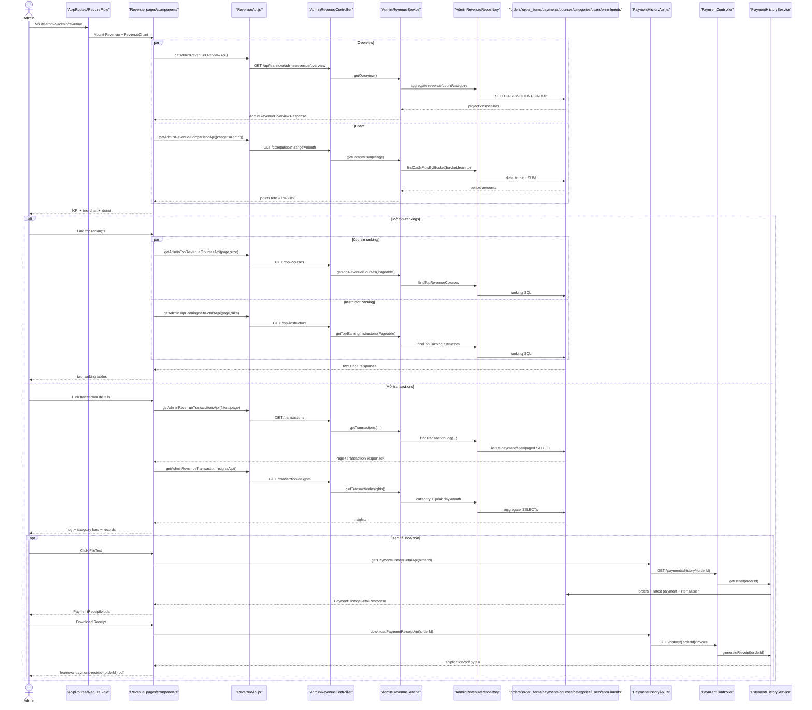

# Detailed Design As-Is — Revenue Management

> Phạm vi: chức năng admin **Doanh thu** được thể hiện trong 6 ảnh, gồm tổng quan `/learnova/admin/revenue`, bảng xếp hạng `/learnova/admin/revenue/top-rankings`, chi tiết giao dịch `/learnova/admin/revenue/transactions`, popup hóa đơn và tải PDF.  
> Quy ước: **Đã xác minh từ code** = có bằng chứng trực tiếp; **Suy luận từ ảnh và code** = ảnh khớp nhánh render nhưng chưa chạy lại runtime; **Chưa xác minh** = thiếu bằng chứng trong ảnh/source hiện tại. Theo yêu cầu chỉ tạo một DD, ba route cùng module được tài liệu hóa trong file này.

## 1. Thông tin màn hình

| Thuộc tính | Nội dung |
| --- | --- |
| Tên màn hình | Quản lý doanh thu / Revenue Management |
| Mã màn hình | Không tìm thấy mã chính thức; các component `Revenue`, `RevenueTopRankings`, `RevenueTransactions` |
| Route/URL | `/learnova/admin/revenue`; `/learnova/admin/revenue/top-rankings`; `/learnova/admin/revenue/transactions` |
| Actor | Quản trị viên có `ROLE_ADMIN` |
| Mục đích | Theo dõi KPI, biểu đồ, phân bổ doanh thu, xếp hạng khóa học/giảng viên, nhật ký giao dịch và hóa đơn |
| Nguồn phân tích | 6 ảnh màn hình + FE + BE |
| Loại tài liệu | Reverse-engineered DD – As-Is |
| Mức độ xác minh | Đã xác minh E2E 3 route, 9 API đọc dữ liệu/hóa đơn và DDL; số liệu cụ thể trên ảnh chưa đối chiếu DB runtime |
| File DD | `docs/DD_RevenueManagement.md` |

## 2. Tổng quan chức năng

- Ba route được khai báo dưới `RequireRole role="ROLE_ADMIN"` tại `front_end/src/app/routes/AppRoutes.jsx:73,81-83`. BE tiếp tục yêu cầu `ROLE_ADMIN` cho `/api/learnova/admin/**` (`back_end/src/main/java/com/example/back_end/shared/config/SecurityConfig.java:78-80`).
- Tổng quan `Revenue.jsx` gọi API overview để render 6 KPI và donut, trong khi `RevenueChart.jsx` gọi API comparison độc lập theo Day/Week/Month/Year (`Revenue.jsx:19-57`; `RevenueChart.jsx:54-90`).
- Hai link nhanh chuyển route tới bảng xếp hạng và chi tiết giao dịch; nút “Quay lại tổng quan” dùng `Link`, không reload chủ động (`Revenue.jsx:46-53`; `RevenueTopRankings.jsx:12-24`; `RevenueTransactions.jsx:44-65`).
- Xếp hạng gọi hai API phân trang độc lập: khóa học doanh thu cao nhất và giảng viên doanh thu cao nhất (`TopCourseRevenue.jsx:23-55`; `TopTeacherRevenue.jsx:23-55`).
- Chi tiết giao dịch đồng thời tải transaction insights, danh mục active và trang transaction. Search debounce 350 ms; category/gateway/status và paging gửi về BE (`RevenueTransactions.jsx:19-65`; `TransactionLog.jsx:78-171`).
- Nút chứng từ mở `PaymentReceiptModal` qua API lịch sử thanh toán theo `orderId`. Admin được service cho phép xem mọi order. PDF chỉ bật khi order `PAID` và payment `SUCCESS`, sau đó FE tạo object URL và tải file (`TransactionLog.jsx:178-228`; `PaymentReceiptModal.jsx:46-51,136-148`; `PaymentHistoryService.java:82-123`).
- Tất cả luồng màn hình là read-only đối với nghiệp vụ doanh thu: SELECT database và sinh PDF trong memory; không insert/update/delete database.
- Có loading/empty/error inline, tooltip Chart.js, popup hóa đơn, toast tải PDF thành công/thất bại và download. Không có form ghi dữ liệu, confirmation hay business mutation.
- Điểm bắt đầu là router; điểm kết thúc là KPI/chart/table render, chuyển route, modal đóng, hoặc browser nhận PDF.

## 3. Đối chiếu ảnh với code

### 3.1 Ảnh 1–2: Tổng quan doanh thu

| STT | Thành phần trên ảnh | Loại control | File FE | Component/Method | Event/API | Nguồn dữ liệu | Xác minh |
| --: | --- | --- | --- | --- | --- | --- | --- |
| 1 | URL `/learnova/admin/revenue` | Route | `AppRoutes.jsx:81` | `<Revenue/>` | navigate | Router | Đã xác minh |
| 2 | Tiêu đề “Doanh thu” | Header | `Header.jsx` + `vi.json:6` | pathname title | route | i18n | Đã xác minh |
| 3 | Sidebar Doanh thu active | Navigation | `SidebarAdmin.jsx` | NavLink | navigate | static/i18n | Đã xác minh |
| 4 | Tổng doanh thu `$1,037,301` | KPI | `RevenueCard.jsx:44-53` | `kpis.totalRevenue` | GET overview | sum paid item all-time | Code xác minh; số ảnh là runtime |
| 5 | `-100.0% Quý này` | KPI delta | `RevenueCard.jsx:23-29,49-51` | formatter | GET overview | current vs previous quarter | Đã xác minh |
| 6 | Doanh thu tháng `$0` | KPI | `RevenueCard.jsx:54-62` | monthlyRevenue | overview | current month | Đã xác minh |
| 7 | Tổng giao dịch `14` | KPI | `RevenueCard.jsx:63-71` | totalTransactions | overview | count SUCCESS payments | Đã xác minh |
| 8 | Khoản thanh toán chờ xử lý `$0` / `0 giảng viên` | KPI | `RevenueCard.jsx:72-79,112` | missing fields/default + hardcode | none usable | FE defaults, not overview DTO | Đã xác minh FE–BE không khớp |
| 9 | Yêu cầu hoàn tiền `0` | KPI | `RevenueCard.jsx:80-90` | refundCount/delta | overview | payments REFUNDED | Đã xác minh |
| 10 | Tỷ lệ tăng trưởng `-100%` | KPI | `RevenueCard.jsx:91-103` | growthRatePercent | overview | quarter delta | Đã xác minh |
| 11 | “Vượt mục tiêu 2,4%” | Static detail | `RevenueCard.jsx:112`; `vi.json:6` | `revenueAdmin.target` | none | hardcode i18n | Đã xác minh; không phụ thuộc KPI |
| 12 | Xem bảng doanh thu hàng đầu | Link button | `Revenue.jsx:46-49` | Link | `/top-rankings` | static/i18n | Đã xác minh |
| 13 | Xem chi tiết giao dịch | Link button | `Revenue.jsx:50-52` | Link | `/transactions` | static/i18n | Đã xác minh |
| 14 | So sánh chỉ số... | Chart section | `RevenueChart.jsx:256-315` | Chart.js line | GET comparison | points | Đã xác minh |
| 15 | Ngày/Tuần/Tháng/Năm | Button group | `RevenueChart.jsx:9-14,268-287` | `setRange` | refetch comparison | static values | Đã xác minh |
| 16 | Tooltip Jun 2026, 3 series | Interactive tooltip | `RevenueChart.jsx:176-208` | callbacks | hover | point fields | Đã xác minh; ảnh 2 khớp |
| 17 | Ba đường student/instructor/admin | Chart | `RevenueChart.jsx:97-155` | datasets | comparison API | 100%/80%/20% | Đã xác minh |
| 18 | Phân bổ nguồn doanh thu | Donut | `RevenueDonut.jsx:29-145` | Chart.js doughnut | overview | categoryBreakdown | Đã xác minh |
| 19 | `$1.0M`, 100% Revenue | Donut center | `RevenueDonut.jsx:17-25,115-124` | total/compact formatter | none | sum item.amount | Đã xác minh |
| 20 | Legend Lập trình/Kinh doanh | Legend | `RevenueDonut.jsx:127-142` | labels | none | categoryName | Đã xác minh |

### 3.2 Ảnh 3–4: Bảng xếp hạng doanh thu

| STT | Thành phần trên ảnh | Loại control | File FE | Component/Method | Event/API | Nguồn dữ liệu | Xác minh |
| --: | --- | --- | --- | --- | --- | --- | --- |
| 21 | URL `/revenue/top-rankings` | Route | `AppRoutes.jsx:82` | RevenueTopRankings | route | Router | Đã xác minh |
| 22 | Bảng xếp hạng doanh thu/description | Header card | `RevenueTopRankings.jsx:12-19` | i18n | none | vi.json | Đã xác minh |
| 23 | Quay lại tổng quan | Link | same | Link | `/revenue` | static | Đã xác minh |
| 24 | Khóa học doanh thu cao nhất | Section | `TopCourseRevenue.jsx:59-149` | component | GET top-courses | Page response | Đã xác minh |
| 25 | Badge Hàng tháng | Static badge | `TopCourseRevenue.jsx:68` | i18n | none | hardcoded semantic | Đã xác minh; query không có tháng |
| 26 | Cột Xếp hạng/Khóa học/Giảng viên/Danh mục/Học viên/Doanh thu/Tỷ lệ | Table | `TopCourseRevenue.jsx:73-128` | row mapping | GET | ranking DTO | Đã xác minh |
| 27 | Rank 1..5 | Derived text | `TopCourseRevenue.jsx:99-104` | page*5+index+1 | paging | FE | Đã xác minh |
| 28 | Course pagination | Buttons | `TopCourseRevenue.jsx:130-146` | setPage | GET page,size=5 | Page.totalPages | Đã xác minh; chỉ hiện >1 page |
| 29 | Giảng viên có thu nhập cao nhất | Section | `TopTeacherRevenue.jsx:59-154` | component | GET top-instructors | Page response | Đã xác minh |
| 30 | Cột rank/giảng viên/khóa học/tổng học viên/doanh thu/TB/tỷ lệ | Table | `TopTeacherRevenue.jsx:78-133` | mapping | GET | instructor ranking DTO | Đã xác minh |
| 31 | Instructor pagination `1` | Button | `TopTeacherRevenue.jsx:135-151` | setPage | GET | totalPages | Đã xác minh; hiện cả khi 1 page |

### 3.3 Ảnh 5–6: Chi tiết giao dịch

| STT | Thành phần trên ảnh | Loại control | File FE | Component/Method | Event/API | Nguồn dữ liệu | Xác minh |
| --: | --- | --- | --- | --- | --- | --- | --- |
| 32 | URL `/revenue/transactions` | Route | `AppRoutes.jsx:83` | RevenueTransactions | route | Router | Đã xác minh |
| 33 | Chi tiết giao dịch doanh thu | Header card | `RevenueTransactions.jsx:44-51` | i18n | Link back | static | Đã xác minh |
| 34 | Nhật ký giao dịch doanh thu | Section | `TransactionLog.jsx:230-242` | component | none | i18n | Đã xác minh |
| 35 | Search | Input | `TransactionLog.jsx:78-84,244-253` | searchInput → search | debounce 350 ms/API | user | Đã xác minh |
| 36 | All Categories | Custom dropdown | `TransactionLog.jsx:86-104,150-159,254-261` | category options | GET categories | active categories | Đã xác minh |
| 37 | All Payment Gateways | Dropdown | `TransactionLog.jsx:24-30,262-268` | selectedGateway | refetch | static enum | Đã xác minh |
| 38 | All Statuses | Dropdown | `TransactionLog.jsx:32-38,269-275` | selectedStatus | refetch | static enum | Đã xác minh |
| 39 | 7 cột transaction | Table | `TransactionLog.jsx:281-333` | row mapping | GET transactions | Page.content | Đã xác minh |
| 40 | PAY-57... / duplicate PAY-54 | ID text | same | transactionId | none | `PAY-{payment_id}` per order item | Đã xác minh; duplicate do nhiều item/order |
| 41 | Successful/Pending badges | Badge | `TransactionLog.jsx:17-22,310-315` | statusClasses | none | mapped BE status | Đã xác minh |
| 42 | Icon chứng từ | Button | `TransactionLog.jsx:317-327` | handleOpenDetail | GET history/{orderId} | order/payment/items | Đã xác minh |
| 43 | Previous, 1..10, Next | Pagination | `TransactionLog.jsx:335-366` | handlePageChange | refetch page | totalPages | Đã xác minh |
| 44 | Revenue Category Metrics | Bars | `RevenueCategory.jsx:17-58` | categoryMetrics | insights API | category sums/shares | Đã xác minh |
| 45 | System Revenue Records | Cards | `RevenueRecords.jsx:18-64` | peakDay/peakMonth | insights API | peak queries | Đã xác minh |
| 46 | Popup payment receipt | Dialog | `PaymentReceiptModal.jsx:31-153` | selectedPayment | GET detail | history DTO | Đã xác minh từ code; không có trong ảnh |
| 47 | Download Receipt | Button/download | `TransactionLog.jsx:197-228`; modal 136-148 | handleDownloadReceipt | GET invoice blob | generated PDF | Đã xác minh từ code |
| 48 | EN/chuông/settings/admin | Admin shell | `Header.jsx`, `NotificationBell.jsx` | shell | auth/notifications | runtime | Code xác minh; badge 34 chưa xác minh |

Không có add/edit/delete/refund approval/export CSV. Từ khóa đã tìm: `create`, `update`, `delete`, `approve refund`, `csv`, `xlsx`; không có mutation tương ứng trong module revenue.

## 4. Danh sách source liên quan

### Frontend — theo thứ tự chạy

| STT | Layer | Đường dẫn file | Class/Component | Method liên quan | Vai trò |
| --: | --- | --- | --- | --- | --- |
| 1 | Router | `front_end/src/app/routes/AppRoutes.jsx` | AppRoutes | 73,81-83 | 3 route/guard |
| 2 | Guard | `front_end/src/app/routes/RequireRole.jsx` | RequireRole | component | ROLE_ADMIN FE |
| 3 | Layout | `front_end/src/app/layouts/admin/DashboardLayout.jsx` | DashboardLayout | render | shell/outlet |
| 4 | Shell | `.../sidebar/sidebar_admin/SidebarAdmin.jsx` | SidebarAdmin | revenue link | navigation |
| 5 | Shell | `.../header/admin_header/Header.jsx` | Header | title/actions | header |
| 6 | HTTP | `front_end/src/shared/api-client/AxiosClient.js` | axiosClient | config | base client |
| 7 | HTTP auth | `front_end/src/shared/hooks/useAxiosPrivate.js` | hook | interceptors | authenticated calls |
| 8 | API | `front_end/src/features/admin/infrastructure/api/RevenueApi.js` | 6 functions | 3-67 | revenue endpoints |
| 9 | API | `front_end/src/features/admin/infrastructure/api/CategoryApi.js` | getAdminCategoriesApi | 3-6 | category filter |
| 10 | API | `front_end/src/features/profile/infrastructure/api/PaymentHistoryApi.js` | detail/download | 9-21 | invoice detail/PDF |
| 11 | Overview page | `.../revenue/Revenue.jsx` | Revenue | 13-63 | overview composition |
| 12 | KPI | `.../revenue/revenue_card/RevenueCard.jsx` | RevenueCard | 18-120 | map KPI |
| 13-18 | KPI children | six `revenue_card/*/*Card.jsx` | card components | render | six cards |
| 19 | Chart | `.../revenue/revenue_chart/RevenueChart.jsx` | RevenueChart | 54-318 | range API/Chart.js |
| 20 | Donut | `.../revenue/revenue_donut/RevenueDonut.jsx` | RevenueDonut | 29-149 | breakdown Chart.js |
| 21 | Ranking page | `.../revenue/top_ranking/RevenueTopRankings.jsx` | component | 7-30 | compose two tables |
| 22 | Course ranking | `.../revenue/top_course_revenue/TopCourseRevenue.jsx` | component | 15-152 | page/API/table |
| 23 | Instructor ranking | `.../revenue/top_teacher_revenue/TopTeacherRevenue.jsx` | component | 15-157 | page/API/table |
| 24 | Transaction page | `.../revenue/transactions/RevenueTransactions.jsx` | component | 13-72 | insights/layout |
| 25 | Transaction log | `.../revenue/transaction_log/TransactionLog.jsx` | component/handlers | 58-384 | filter/page/detail/download |
| 26 | Category metrics | `.../revenue/revenue_category/RevenueCategory.jsx` | component | 17-62 | bars |
| 27 | Records | `.../revenue/revenue_records/RevenueRecords.jsx` | component | 18-68 | peaks |
| 28 | Shared dropdown | `.../admin/presentation/shared/AdminHoverSelect.jsx` | component | 15-85 | three filters |
| 29 | Receipt modal | `.../profileView/sections/PaymentReceiptModal.jsx` | component | 31-155 | detail/download UI |
| 30-39 | Style/i18n | Revenue and child CSS; `vi.json`, `en.json` | rules/keys | relevant files | visual/text |

### Backend/Database — theo thứ tự chạy

| STT | Layer | Đường dẫn file | Class/Component | Method liên quan | Vai trò |
| --: | --- | --- | --- | --- | --- |
| 1 | Security | `back_end/src/main/java/com/example/back_end/shared/config/SecurityConfig.java` | config | 73-80 | admin/auth rules |
| 2 | Controller | `.../admin/adapter/in/web/AdminRevenueController.java` | controller | 28-83 | 6 revenue GET APIs |
| 3 | Service | `.../admin/application/AdminRevenueService.java` | service | 48-345 | formulas/filter/map/window |
| 4 | Calculator | `.../commerce/application/RevenueShareCalculator.java` | calculator | 10-23 | 20/80 split |
| 5 | Calculator | `.../shared/util/PercentDeltaCalculator.java` | utility | 12-20 | percent delta/null baseline |
| 6 | Repository | `.../admin/infrastructure/persistence/AdminRevenueRepository.java` | repository/projections | 1-490 | native SQL |
| 7-12 | Revenue DTO | six `AdminRevenue*Response.java` | records | toàn file | JSON contracts |
| 13 | Category controller/service/repo | Admin category flow | getAll | relevant | filter options |
| 14 | Payment controller | `.../commerce/adapter/in/web/PaymentController.java` | controller | 82-96 | detail/invoice |
| 15 | Payment service | `.../commerce/application/PaymentHistoryService.java` | service | 82-208,245-404 | auth/detail/PDF |
| 16-17 | Payment DTO | `PaymentHistoryDetailResponse`, `PaymentHistoryItemResponse` | records | toàn file | modal contract |
| 18-20 | Payment persistence | `OrderRepository`, `OrderItemRepository`, `PaymentRepository` | repositories | find id/items/latest | receipt data |
| 21-23 | Entities | `Order`, `OrderItem`, `Payment` | ORM | fields | main commerce tables |
| 24-27 | Related entities | Course, Category, CourseCategory, User/Enrollment | ORM | fields | joins/ranking/category/student |
| 28 | Exception | `GlobalExceptionHandler.java` | advice | relevant handlers | HTTP errors |
| 29 | Database | `V1__initial_schema.sql` | DDL | 654+,750+,797+,1071+,1100+,1134+,1543+ | tables/constraints/FKs |

## 5. Thiết kế chi tiết UI

| STT | Label hiển thị | Tên trong code | Control | Kiểu dữ liệu | Bắt buộc | Mặc định | Nguồn dữ liệu | Điều kiện hiển thị | Event |
| --: | --- | --- | --- | --- | --- | --- | --- | --- | --- |
| 1 | 6 KPI | `overview.kpis` | read-only cards | money/count/percent | N/A | 0/`—` | overview API | overview route | none |
| 2 | Top tables | Link | button-like link | route | N/A | enabled | static | overview | navigate |
| 3 | Transaction details | Link | link | route | N/A | enabled | static | overview | navigate |
| 4 | Day/Week/Month/Year | `range` | four buttons | enum string | Có | `month` | static | overview | refetch chart |
| 5 | Line chart | `points` | canvas | array | N/A | [] | comparison | overview | hover tooltip |
| 6 | Donut | `items` | canvas/legend | array | N/A | [] | overview.breakdown | overview | hover tooltip |
| 7 | Back | Link | button-like link | route | N/A | enabled | static | detail routes | navigate |
| 8 | Two ranking tables | courses/teachers | read-only table | Page.content | N/A | [] | ranking APIs | ranking route | paging |
| 9 | Search | `searchInput/search` | text input | string | Không | empty | user | transactions | debounce 350ms |
| 10 | Category | `selectedCategory` | custom select | `ALL`/id | Không | ALL | active category API | transactions | page=1/refetch |
| 11 | Gateway | `selectedGateway` | select | enum | Không | ALL | static | transactions | refetch |
| 12 | Status | `selectedStatus` | select | enum | Không | ALL | static | transactions | refetch |
| 13 | Transaction table | `transactions` | table | Page.content | N/A | [] | transactions API | transactions | receipt action |
| 14 | Pagination | `currentPage` | buttons | int | N/A | 1 | totalPages | >1 | refetch |
| 15 | Category bars | `categoryMetrics` | read-only bars | array | N/A | [] | insights | transactions | none |
| 16 | Peak records | `peakDay/peakMonth` | read-only cards | object/null | N/A | null | insights | transactions | none |
| 17 | Receipt close | `onClose` | button/backdrop | N/A | N/A | enabled after load | modal | detail loaded | close |
| 18 | Download receipt | `onDownload` | button | blob | N/A | disabled unless PAID+SUCCESS | detail status | modal | GET PDF/download |

UI rules:

- Không có editable field ngoài search/filter; không có required form hoặc maxLength. Search trim sau 350 ms.
- Tiền overview/cards dùng USD symbol, mostly zero decimals; chart dùng USD hai decimals; transaction dùng tối đa hai decimals; receipt modal hiển thị `amountVnd` với locale vi-VN và hậu tố VND (`RevenueCard.jsx:18-32`; `RevenueChart.jsx:16-22`; `TransactionLog.jsx:42-45`; `PaymentReceiptModal.jsx:14-17`).
- Chart range active bằng CSS class; canvas cũ bị destroy trước khi tạo mới và cleanup unmount (`RevenueChart.jsx:92-109,248-254`).
- Empty chart vẫn tạo canvas với points rỗng; donut empty dùng dataset `[1]`, màu xám, center “No data” (`RevenueDonut.jsx:49-57,121-130`).
- Transaction loading/empty/error có row/message riêng; category load lỗi bị nuốt và dropdown chỉ còn All (`TransactionLog.jsx:89-104,127-135,279-302`).
- Nút action bị disable cho toàn table khi một detail đang tải (`TransactionLog.jsx:323`). Modal loading đóng backdrop bị chặn; khi loaded click backdrop/X đóng (`PaymentReceiptModal.jsx:55-79`).
- Download disabled nếu order/payment không PAID/SUCCESS hoặc đang download.

## 6. Điểm bắt đầu và điểm kết thúc

| Luồng | File/Method bắt đầu | Điều kiện bắt đầu | Các layer đi qua | File/Method kết thúc | Kết quả |
| --- | --- | --- | --- | --- | --- |
| Mở overview | `AppRoutes.jsx:81` | admin route | Revenue → overview API/service/repo | RevenueCard/Donut | KPI/donut |
| Tải/chart filter | `RevenueChart.jsx:64-90` | mount/range change | comparison API → SQL buckets | Chart.js | chart/tooltip |
| Mở rankings | overview Link / route 82 | click/admin | TopRankings → 2 APIs | two tables | ranking rows |
| Paging rankings | child `setPage` | page click | API → native query Page | row render | new page |
| Mở transactions | overview Link / route 83 | click/admin | insights + category + transaction APIs | grid/table | transaction screen |
| Search/filter/page | TransactionLog state | user action/debounce | API → normalized filters → SQL | setTransactions | new rows |
| Xem hóa đơn | `handleOpenDetail` | row has orderId | Payment API → service/repositories | PaymentReceiptModal | dialog |
| Tải PDF | `handleDownloadReceipt` | PAID+SUCCESS | invoice API → PDF generator | browser anchor click | file `.pdf` |
| Quay lại | detail `Link` | click | router | Revenue mount | overview reload |

Không có luồng ghi database, thêm/sửa/xóa, approve/refund hay export bảng.

## 7. Luồng khởi tạo màn hình

### 7.1 Tổng quan

1. Router match route 81 dưới `RequireRole`.
2. `Revenue` tạo state `overview=null,error=""` (`Revenue.jsx:13-18`).
3. Effect gọi `getAdminRevenueOverviewApi`; song song child `RevenueChart` tạo range `month` và gọi comparison (`Revenue.jsx:19-39`; `RevenueChart.jsx:54-90`).
4. `AdminRevenueController.getOverview/getComparison` nhận GET; query params comparison default month (`AdminRevenueController.java:28-38`).
5. Security yêu cầu admin; không có request DTO/body.
6. Service tính mốc theo `Asia/Ho_Chi_Minh`, gọi nhiều aggregate SQL, tính delta và category breakdown (`AdminRevenueService.java:38-46,76-149,224-345`).
7. Repository đọc `order_items`, `orders`, `payments`, `courses`, và với category thêm `course_categories/categories`.
8. Backend tạo `AdminRevenueOverviewResponse`/`AdminRevenueComparisonResponse` và trả 200.
9. FE set overview; card default null fields thành zero/`—`; chart map points vào ba datasets.
10. Lỗi overview hiển thị “Unable to load revenue overview.” nhưng `RevenueChart` vẫn tải riêng. Lỗi chart chỉ hiển thị trong chart.

### 7.2 Rankings

1. Router match route 82, mount `RevenueTopRankings` rồi cả hai child.
2. Mỗi child tạo `page=0`, `size=5`, tự gọi API riêng.
3. Controller clamp page >=0, size 1..50 (`AdminRevenueController.java:79-83`).
4. Service map projection sang DTO; repository chạy native ranking query + count query.
5. FE nhận `content/totalPages`, render loading/error/empty/rows và page buttons.

### 7.3 Transactions

1. Router match route 83; `RevenueTransactions` tải insights. `TransactionLog` tải active categories và transaction page 0, size 7.
2. Search debounce; filter defaults ALL được API adapter bỏ khỏi query bằng `undefined` (`RevenueApi.js:38-60`).
3. Service chuẩn hóa search, whitelist payment method/status; invalid enum thành null (`AdminRevenueService.java:151-184,313-333`).
4. Native query chọn latest payment mỗi order, một row mỗi order item, category ưu tiên `is_primary`; ORDER BY paid/order time desc rồi item desc (`AdminRevenueRepository.java:347-441`).
5. Insights chạy category breakdown, peak day/month và previous month sum để tính growth (`AdminRevenueService.java:186-221`).
6. FE render table, paging, category bars, record cards. Lỗi insights không ngăn TransactionLog tải; lỗi categories không hiển thị.

## 8. Luồng từng thao tác

### 8.1 Chọn khoảng biểu đồ

| Bước | Layer | File | Method | Input | Xử lý | Output/Chuyển tiếp |
| ---: | --- | --- | --- | --- | --- | --- |
| 1 | UI | `RevenueChart.jsx:273-285` | setRange | day/week/month/year | update state | effect |
| 2 | FE API | `RevenueApi.js:28-36` | getComparison | range | GET query | controller |
| 3 | Controller | `AdminRevenueController.java:33-38` | getComparison | string | service | response |
| 4 | Service | `AdminRevenueService.java:126-149,247-310` | resolve window | range | invalid→month; periods/buckets | repo |
| 5 | DB | repository 323-345 | findCashFlowByBucket | bucket/from/to | paid+success/nondeleted aggregate | rows |
| 6 | Service | calculator | calculate | studentPaid | split 80/20 | points |
| 7 | FE | `RevenueChart.jsx:75,97-155` | setPoints/chart | DTO | three datasets | canvas/tooltip |

Thất bại: points `[]`, error inline, loading false; không retry ngoài chọn range lại.

### 8.2 Điều hướng tới/khỏi trang chi tiết

| Bước | Layer | File | Method | Input | Xử lý | Output/Chuyển tiếp |
| ---: | --- | --- | --- | --- | --- | --- |
| 1 | UI | `Revenue.jsx:46-53` | Link | target route | client navigation | detail mount |
| 2 | UI | detail pages | Back Link | `/revenue` | client navigation | overview remount/refetch |

Không validation/API trực tiếp ở link.

### 8.3 Phân trang xếp hạng

| Bước | Layer | File | Method | Input | Xử lý | Output/Chuyển tiếp |
| ---: | --- | --- | --- | --- | --- | --- |
| 1 | UI | TopCourse/Teacher | setPage | zero-based page | effect | API |
| 2 | API | `RevenueApi.js:3-21` | top functions | page,size=5 | GET params | controller |
| 3 | Controller | lines 40-54 | endpoints | page,size | clamp | service |
| 4 | Service | lines 48-74 | ranking methods | Pageable | map projections | repository |
| 5 | DB | repository 66-225 | native ranking | Pageable | group/order revenue desc | Page |
| 6 | FE | child | setters | Page JSON | rows/rank/page buttons | display |

### 8.4 Search/filter transaction

| Bước | Layer | File | Method | Input | Xử lý | Output/Chuyển tiếp |
| ---: | --- | --- | --- | --- | --- | --- |
| 1 | UI | `TransactionLog.jsx:78-84,244-275` | setters | query/filter | debounce/reset page | effect |
| 2 | API | `RevenueApi.js:38-60` | getTransactions | page,size,filters | omit ALL/empty | controller |
| 3 | Controller | lines 56-72 | getTransactions | query params | clamp Page | service |
| 4 | Service | lines151-184,313-333 | normalize | strings | trim/whitelist/map status | repo |
| 5 | DB | repository 347-441 | findTransactionLog | filters/Pageable | search joins/exists/order | Page projection |
| 6 | FE | lines123-135 | set list/page | JSON | loading/error/rows | display |

Không có validation message cho invalid enum từ client; BE biến giá trị ngoài whitelist thành null nên bỏ filter.

### 8.5 Mở chi tiết hóa đơn

| Bước | Layer | File | Method | Input | Xử lý | Output/Chuyển tiếp |
| ---: | --- | --- | --- | --- | --- | --- |
| 1 | UI | `TransactionLog.jsx:178-195` | handleOpenDetail | row.orderId | loading/code | detail API |
| 2 | API | `PaymentHistoryApi.js:9-14` | getDetail | orderId/token | GET | PaymentController |
| 3 | Controller | `PaymentController.java:82-87` | getPaymentHistoryDetail | path id | service | 200 DTO |
| 4 | Permission | `PaymentHistoryService.java:111-123` | resolveOrderAccess | auth/id | admin may any order | OrderRepository |
| 5 | Service/DB | lines148-194 | toDetail/getLatest/items | order | read user/items/latest payment | detail DTO |
| 6 | FE | modal | setSelectedPayment | DTO | render student/items/status/amount | dialog |

Thất bại: clear display code, toast detailError, modal không render. Order/payment missing → 404. Unauthenticated → 401.

### 8.6 Tải PDF hóa đơn

| Bước | Layer | File | Method | Input | Xử lý | Output/Chuyển tiếp |
| ---: | --- | --- | --- | --- | --- | --- |
| 1 | UI validate | `TransactionLog.jsx:197-204` | handleDownload | selectedPayment | chỉ PAID+SUCCESS | API hoặc return |
| 2 | API | `PaymentHistoryApi.js:16-21` | download | orderId | GET blob | controller |
| 3 | Controller | `PaymentController.java:89-96` | downloadReceipt | orderId | service; PDF headers | byte[] |
| 4 | Service validation | `PaymentHistoryService.java:87-109` | generateReceipt | order/payment | admin access, status check | 409 hoặc build |
| 5 | Service | lines245-404 | buildPdf | detail | OpenPDF in memory | PDF bytes |
| 6 | FE | `TransactionLog.jsx:212-220` | browser download | blob | object URL/anchor/revoke | file + success toast |

Không ghi DB. Lỗi generation → 500; status không hợp lệ → 409; FE toast error và reset downloading.

## 9. API specification

| API | HTTP method | Nơi gọi | Controller | Request | Response | Mục đích |
| --- | --- | --- | --- | --- | --- | --- |
| `/api/learnova/admin/revenue/overview` | GET | `Revenue.jsx` | `getOverview` | none | Overview DTO | KPI/donut |
| `/api/learnova/admin/revenue/comparison` | GET | `RevenueChart` | `getComparison` | `range` | Comparison DTO | chart |
| `/api/learnova/admin/revenue/top-courses` | GET | TopCourse | `getTopRevenueCourses` | page,size | Page<CourseRanking> | ranking |
| `/api/learnova/admin/revenue/top-instructors` | GET | TopTeacher | `getTopEarningInstructors` | page,size | Page<InstructorRanking> | ranking |
| `/api/learnova/admin/revenue/transactions` | GET | TransactionLog | `getTransactions` | page,size,search,categoryId,paymentMethod,status | Page<Transaction> | log |
| `/api/learnova/admin/revenue/transaction-insights` | GET | RevenueTransactions | `getTransactionInsights` | none | Insights DTO | categories/peaks |
| `/api/learnova/admin/categories-management` | GET | TransactionLog | AdminCategoryController | none | category list | category filter |
| `/api/learnova/payments/history/{orderId}` | GET | TransactionLog | PaymentController | path orderId | detail DTO | modal |
| `/api/learnova/payments/history/{orderId}/invoice` | GET | TransactionLog | PaymentController | path orderId | `application/pdf` bytes | download |

Chi tiết:

- Header: axios private/Bearer cho tất cả. Category/revenue bắt buộc ADMIN; payment history cần authenticated và service cho admin xem mọi order.
- Không API nào có request body. Controller revenue không dùng Bean Validation DTO.
- `range`: default month; valid day/week/month/year; invalid được service đổi thành month, không trả 400.
- `page`: default 0; `size`: rankings 5, transaction 7. Controller clamp page >=0 và size 1..50.
- Transaction search/category optional. Method whitelist MOMO/VNPAY/PAYPAL/PAYOS; status PENDING/SUCCESS/FAILED/REFUNDED. Invalid được bỏ filter.
- Success đều 200. Invoice có Content-Disposition attachment; FE vẫn tự đặt filename cùng pattern.
- Error: admin APIs 401/403/500; payment detail thêm 404; PDF thêm 409/500. FE chủ yếu dùng fixed fallback message; detail/download toast ưu tiên `response.data.message`.

## 10. Backend processing

| Layer | File | Class | Method | Input | Xử lý | Gọi tiếp | Output |
| --- | --- | --- | --- | --- | --- | --- | --- |
| Security | SecurityConfig | config | filterChain | JWT/path | ADMIN/auth | controllers | allow/401/403 |
| Controller | AdminRevenueController | controller | six GETs | query params | clamp page/size | service | ResponseEntity 200 |
| Service | AdminRevenueService | service | getOverview | none | time windows/deltas/breakdown | many repo queries | Overview DTO |
| Service | same | getComparison | range | normalize/window/zero fill/split | bucket query/calculator | Comparison DTO |
| Service | same | ranking methods | Pageable | projection mapping | ranking queries | Page DTO |
| Service | same | getTransactions | filters/page | normalize/map status | log query | Page DTO |
| Service | same | getTransactionInsights | none | breakdown/peaks/growth | aggregate queries | Insights DTO |
| Calculator | RevenueShareCalculator | calculate | paid >=0 | admin20%, instructor remainder80% | none | RevenueShare |
| Calculator | PercentDeltaCalculator | percentDelta | prev/current | null if prev zero; otherwise percentage | none | Double/null |
| Repository | AdminRevenueRepository | native queries | criteria | joins/aggregates/group/order/page | PostgreSQL | projections |
| Controller | PaymentController | detail/invoice | orderId | call service/headers | PaymentHistoryService | DTO/PDF |
| Service | PaymentHistoryService | resolve/detail/PDF | auth/orderId | access/status/read/build | 3 repositories | DTO/bytes |
| Exception | GlobalExceptionHandler/ResponseStatusException | handlers | exception | status/body | HTTP | error |

`AdminRevenueService` là `@Transactional(readOnly=true)` class-level (`33-36`). Detail/PDF cũng `@Transactional(readOnly=true)` (`PaymentHistoryService.java:82-89`). Không có transaction ghi dữ liệu.

## 11. Database và query

| Bảng | Cột sử dụng | Mục đích | Thao tác | File/Method truy cập |
| --- | --- | --- | --- | --- |
| `order_items` | id,order_id,course_id,price,original_price | đơn vị revenue/transaction | SELECT/SUM | AdminRevenueRepository; receipt repos |
| `orders` | id,user_id,status,amounts,created_at | paid/time/student/order detail | SELECT/JOIN | repository/services |
| `payments` | id,order_id,amount,currency,method,transaction_id,status,paid_at,updated_at | transaction/status/count | SELECT/JOIN | revenue/payment repositories |
| `courses` | id,title,instructor_id,is_deleted | ranking/log/filter | SELECT/JOIN | AdminRevenueRepository |
| `users` | id,full_name,email,phone | student/instructor/access | SELECT/JOIN | ranking/log/history |
| `user_role`,`roles` | user_id,role_name | teacher ranking | SELECT/JOIN | findTopEarningInstructors |
| `enrollments` | course_id,user_id | unique student counts | LEFT JOIN/COUNT DISTINCT | rankings |
| `course_categories`,`categories` | ids/name/is_primary/is_deleted | category display/filter/breakdown | SELECT/LATERAL/GROUP | revenue repository |
| `payout_requests` | không dùng | KPI pending kỳ vọng nhưng không truy vấn | Không thao tác | Chưa có trong AdminRevenueService |

Các query quan trọng:

- Revenue tổng/thời gian: SUM `oi.price`, yêu cầu `orders.status='PAID'`, course không deleted và `EXISTS` payment SUCCESS (`AdminRevenueRepository.java:227-262`).
- Transaction count là `COUNT(DISTINCT payment_id)` SUCCESS, không phải số order/item; thời gian dùng `COALESCE(paid_at,updated_at)` (`264-281`). Refund tương tự status REFUNDED (`283-300`).
- Category breakdown join mọi category active gắn course, GROUP BY category, ORDER amount desc (`302-321`). Không giới hạn primary.
- Chart group bằng `date_trunc(:bucket, o.created_at AT TIME ZONE 'Asia/Ho_Chi_Minh')`, điều kiện `[from,to)` (`323-345`). Dùng thời gian tạo order, không `paid_at`.
- Top course GROUP course, sum price, count distinct enrollment user, chọn một category qua lateral primary-first, ORDER revenue desc (`66-150`).
- Top instructor giới hạn `ROLE_TEACHER`, sum price, count distinct courses/students, avg revenue/course, ORDER revenue desc (`152-225`).
- Transaction log chọn latest payment theo max payment_id mỗi order; một row/order_item; search `PAY-id`, raw transaction_id, student, course, payment/order id; category filter dùng EXISTS; display category lateral primary; ORDER latest time/item (`347-441`).
- Peak day/month SUM paid item revenue, group date/month và lấy amount cao nhất (`443-489`).
- Receipt detail dùng OrderRepository.findById, `OrderItemRepository.findByOrderIdWithCourse ORDER BY item.id`, `PaymentRepository.findFirstByOrderIdOrderByIdDesc`.
- Không có INSERT/UPDATE/DELETE trong màn hình.
- Null/empty: SQL COALESCE về 0; service null-to-zero; peak projection có thể null; DTO peak null; FE hiển thị `—`. Page empty thành `content=[]`.
- DDL: amount/price không âm; order/payment statuses enum; order-item unique `(order_id,course_id)`; payment transaction_id unique nhưng order_id không unique, nên một order có thể có nhiều payment attempts (`V1__initial_schema.sql:1071-1150,1882-1918`).

## 12. Mapping dữ liệu FE–BE–DB

| Dữ liệu | UI field | FE variable | Request field | Backend DTO | Service/Repository | Table.Column | Response field | UI hiển thị |
| --- | --- | --- | --- | --- | --- | --- | --- | --- |
| Total revenue | KPI | kpis.totalRevenue | none | Kpis | sumPaidItemRevenueAllTime | order_items.price | totalRevenue | `$1,037,301` |
| Quarter delta | KPI | totalRevenueDeltaPercent | none | Kpis | percentDelta prev/current | orders.created_at + price | field | `-100.0%` |
| Monthly revenue | KPI | monthlyRevenue | none | Kpis | sum between month start/now | price/created_at | field | `$0` |
| Transactions | KPI | totalTransactions | none | Kpis | countSuccessfulPayments | payments.status/id | field | `14` |
| Pending payout | KPI | missing | none | Không có | Không query | payout_requests không đọc | Không có | default `$0`, hardcode count 0 |
| Refunds | KPI | refundCount | none | Kpis | count refunded | payments.status | field | count |
| Chart range | buttons | range | query range | ComparisonResponse.range | resolveChartWindow | order.created_at | range | active button |
| Student payments | line | point.totalCashFlow | range | point | bucket SUM | order_items.price | totalCashFlow | blue line |
| Instructor share | line | instructorPayouts | range | point | calculator 80% | derived | instructorPayouts | red line |
| Admin net | line | adminNet | range | point | calculator 20% | derived | adminNet | green line |
| Category revenue | donut/bars | items/categoryMetrics | none | breakdown/metric | group category | category + price | amount/share | label/bar/donut |
| Course ranking | row | course.* | page,size | CourseRanking DTO | ranking query | course/user/category/enrollment/item | fields | 7 columns |
| Teacher ranking | row | teacher.* | page,size | Instructor DTO | ranking query | users/role/course/enrollment/item | fields | 7 columns |
| Search | input | search | query search | String | SQL ILIKE | payment/user/course/order | N/A | filtered page |
| Transaction ID | table | transactionId | filters | Transaction DTO | CONCAT PAY-id | payments.payment_id | transactionId | PAY-57 |
| Status | badge | status | query raw enum | response String | mapPaymentStatus | payments.status | Successful/Pending... | badge |
| Row amount | table | amount | none | BigDecimal | oi.price | order_items.price | amount,currency USD | `$ 0.08` |
| Receipt | modal | selectedPayment | path orderId | PaymentHistoryDetail | detail mapping | orders/payments/items/users | fields | modal |
| PDF | download | blob | path orderId | byte[] | buildPdf | same read tables | binary | downloaded file |

## 13. Business rule rút ra từ code

| ID | Business rule hiện tại | Điều kiện | File/Method | Khi đúng | Khi sai | Mức xác minh |
| --- | --- | --- | --- | --- | --- | --- |
| BR-01 | Admin revenue APIs chỉ cho ROLE_ADMIN | path admin | SecurityConfig:79 | xử lý | 401/403 | Đã xác minh |
| BR-02 | Revenue chỉ tính paid order + successful payment + active course | aggregate | repository queries | cộng price | loại | Đã xác minh |
| BR-03 | Tổng revenue là all-time nhưng delta là quarter-over-quarter | overview | service:83-86 | render | N/A | Đã xác minh |
| BR-04 | Delta null khi kỳ trước bằng 0 | previous=0/null | PercentDeltaCalculator:12-20 | null/FE `—` | tính % | Đã xác minh |
| BR-05 | Chart chia payment 80% instructor, 20% admin | each bucket | RevenueShareCalculator:10-20 | split | negative throws | Đã xác minh |
| BR-06 | Window: day 7 ngày, week 8 tuần, month 12 tháng, year 5 năm | range | service:247-310 | periods zero-filled | invalid→month | Đã xác minh |
| BR-07 | Rank theo revenue giảm dần | ranking | repository SQL | rank/page | N/A | Đã xác minh |
| BR-08 | Teacher ranking chỉ ROLE_TEACHER có paid items | role/query | repo:174-220 | included | excluded | Đã xác minh |
| BR-09 | Page được clamp page>=0,size 1..50 | all paged API | controller:79-83 | PageRequest | clamp | Đã xác minh |
| BR-10 | Transaction dùng latest payment id cho mỗi order | log | repo:367-373 | selected | older ignored | Đã xác minh |
| BR-11 | Một transaction row tương ứng một order item | order has items | repo:363+ | repeated PAY id possible | N/A | Đã xác minh |
| BR-12 | Filter enum invalid bị bỏ thay vì lỗi | invalid value | service normalizeEnumFilter | null filter | valid applied | Đã xác minh |
| BR-13 | Category dropdown chỉ active | load | TransactionLog:91-97 | option | hidden excluded | Đã xác minh |
| BR-14 | Admin được xem receipt của mọi order | admin auth | PaymentHistoryService:111-123 | findById | user only own | Đã xác minh |
| BR-15 | PDF chỉ cho PAID+SUCCESS | download | service:92-97 | generate | 409 | Đã xác minh |

## 14. Validation, permission và message

| Loại | Điều kiện | FE/BE | File/Method | Mã/Nội dung message | Hành vi |
| --- | --- | --- | --- | --- | --- |
| Route role | không ROLE_ADMIN | FE | RequireRole | redirect | không mount |
| API role | không ADMIN | BE | SecurityConfig | 401/403 | chặn revenue |
| Range | invalid/null | BE | getComparison | invalid→month | không lỗi |
| Page/size | âm/0/>50 | BE | toPageable | clamp | query safe page |
| Gateway/status | invalid | BE | normalizeEnumFilter | none | bỏ filter |
| Search | blank | FE/BE | debounce/blankToNull | none | null filter |
| Overview fail | any API error | FE | Revenue effect | Unable to load revenue overview. | error paragraph |
| Chart fail | API error | FE | RevenueChart | Unable to load revenue comparison chart. | points empty/error |
| Ranking fail | API error | FE | ranking children | fixed English errors | error row |
| Transactions fail | API error | FE | TransactionLog | Unable to load transactions. | empty/error |
| Insights fail | API error | FE | RevenueTransactions | Unable to load transaction insights. | log may still render |
| Categories fail | API error | FE | TransactionLog | Không message | All only |
| Missing order/payment | invalid id | BE | PaymentHistoryService | Order/Payment not found | 404/toast |
| Receipt status | not PAID/SUCCESS | FE+BE | modal/service | receipt unavailable / conflict message | disabled/409 |
| Receipt generation | DocumentException | BE | generateReceipt | Could not generate payment receipt. | 500 |
| Download success | blob complete | FE | handleDownload | i18n downloadSuccess | toast/file |
| Download/detail fail | request fail | FE | handlers | API message/i18n fallback | toast |

Không có input business bắt buộc, Bean Validation DTO hoặc DB mutation constraint được kích hoạt bởi màn hình. Permission detail/invoice được kiểm tra trong service vì endpoint payment nằm dưới rule authenticated chung.

## 15. Mermaid sequence toàn bộ màn hình



## 16. Mermaid flowchart

```mermaid
flowchart TD
    A([Mở một route Revenue]) --> B{RequireRole ROLE_ADMIN?}
    B -- Không --> X[Redirect / 401-403] --> Z([Kết thúc thất bại])
    B -- Có --> C{Route}
    C -- overview --> D[GET overview + GET comparison range=month]
    D --> E[AdminRevenueService: time windows, delta, 80/20]
    E --> F[(Aggregate orders/order_items/payments/courses/categories)]
    F --> G{Có dữ liệu?}
    G -- Không --> H[KPI 0/—; chart/donut empty]
    G -- Có --> I[KPI + chart + donut]
    I --> J{Chọn range?}
    J -- Có --> K[GET /comparison?range=day|week|month|year] --> E
    J -- Không --> END([Kết thúc render])
    C -- top-rankings --> L[GET /top-courses + /top-instructors]
    L --> M[Clamp page,size; ranking SQL]
    M --> N[(Paid/success course/instructor joins)]
    N --> O{Page có content?}
    O -- Không --> P[Empty/error row]
    O -- Có --> Q[Hai bảng + paging]
    P --> END
    Q --> END
    C -- transactions --> R[GET transactions + insights + categories]
    R --> S[Normalize search/filter/page]
    S --> T[(Latest payment log + category/peak aggregates)]
    T --> U{Có rows?}
    U -- Không --> V[No transactions/error]
    U -- Có --> W[Table + bars + records]
    W --> Y{Click receipt?}
    Y -- Không --> END
    Y -- Có --> AA[GET /payments/history/{orderId}]
    AA --> AB{Authenticated admin + order/payment tồn tại?}
    AB -- Không --> AC[Toast error] --> Z
    AB -- Có --> AD[PaymentReceiptModal]
    AD --> AE{PAID và SUCCESS?}
    AE -- Không --> AF[Download disabled] --> END
    AE -- Có --> AG[GET invoice]
    AG --> AH[PaymentHistoryService.buildPdf]
    AH --> AI{Generate thành công?}
    AI -- Không --> AJ[409/500 + toast] --> Z
    AI -- Có --> AK[Blob/object URL/download + success toast] --> END
    V --> END
```

## 17. Phân tích từng source trong cùng file DD

### File: `front_end/src/app/routes/AppRoutes.jsx`

- Router khai báo ba route `revenue`, `revenue/top-rankings`, `revenue/transactions` dưới admin guard (`73,81-83`). Input URL; output component tương ứng.

### File: `front_end/src/app/routes/RequireRole.jsx`

- FE permission guard. Được AppRoutes gọi trước layout; quyết định render hoặc redirect dựa auth/role. Không thay thế security BE.

### File: `front_end/src/app/layouts/admin/DashboardLayout.jsx`

- Layout render Header, Sidebar và Outlet; tạo bố cục cố định trong cả 6 ảnh. Không gọi revenue API.

### File: `front_end/src/shared/components/sidebar/sidebar_admin/SidebarAdmin.jsx`

- Navigation tới `/learnova/admin/revenue`, active style theo pathname. Không có business logic.

### File: `front_end/src/shared/components/header/admin_header/Header.jsx`

- Header map các pathname revenue về tiêu đề “Doanh thu”; render locale, notification, setting và profile.

### File: `front_end/src/shared/api-client/AxiosClient.js`

- HTTP base client được RevenueApi dùng mặc định. Output `response`/error Promise.

### File: `front_end/src/shared/hooks/useAxiosPrivate.js`

- Cấp axios authenticated cho overview/chart/transactions/category/detail/invoice. Token/interceptor errors truyền về component.

### File: `front_end/src/features/admin/infrastructure/api/RevenueApi.js`

- Sáu adapter GET: top courses (3-11), top instructors (13-21), overview (23-26), comparison (28-36), transactions (38-60), insights (62-67). Transaction bỏ query falsy bằng `undefined`.

### File: `front_end/src/features/admin/infrastructure/api/CategoryApi.js`

- `getAdminCategoriesApi` cấp options category cho transaction filter. Trang lọc tiếp `!isDeleted`.

### File: `front_end/src/features/profile/infrastructure/api/PaymentHistoryApi.js`

- `getPaymentHistoryDetailApi` GET detail (9-14); `downloadPaymentReceiptApi` GET blob (16-21). Có thể gắn Authorization explicit ngoài interceptor.

### File: `front_end/src/features/admin/presentation/revenue/Revenue.jsx`

- Overview page. State/effect overview (`13-39`), compose KPI/link/chart/donut (`41-60`). Lỗi overview không chặn chart child tải.

### File: `front_end/src/features/admin/presentation/revenue/revenue_card/RevenueCard.jsx`

- Map response KPI thành six child card (`34-112`). `formatMoney/Delta/Count` default missing về 0 hoặc `—`. Pending fields được đọc nhưng DTO không có; count bị hardcode 0 tại line 112. Growth detail bị override bằng i18n target tĩnh.

### File: `front_end/src/features/admin/presentation/revenue/revenue_card/total_revenue_card/TotalRevenueCard.jsx`

- Presentation KPI tổng (`3-27`). Nhận title/value/delta/subtitle/icon; tự chọn tone theo dấu `-`. Được `RevenueCard` gọi, không gọi API.

### File: `front_end/src/features/admin/presentation/revenue/revenue_card/mothly_revenue_card/MonthlyRevenueCard.jsx`

- Presentation KPI tháng (`3-22`). Delta luôn mang class `positive`; input từ parent, output card read-only.

### File: `front_end/src/features/admin/presentation/revenue/revenue_card/transactions_card/TransactionsCard.jsx`

- Presentation KPI số giao dịch (`3-22`). Delta luôn class `positive`; không validation/API.

### File: `front_end/src/features/admin/presentation/revenue/revenue_card/pending_payment_card/PendingPaymentCard.jsx`

- Presentation KPI payout chờ (`3-19`). Render value/note do parent truyền; vì contract overview thiếu field, parent truyền các giá trị mặc định.

### File: `front_end/src/features/admin/presentation/revenue/revenue_card/refund_request_card/RefundRequestCard.jsx`

- Presentation KPI refund (`3-22`). Tone nhận từ `RevenueCard` dựa dấu refund delta; không xử lý refund.

### File: `front_end/src/features/admin/presentation/revenue/revenue_card/growth_rate_card/GrowthRateCard.jsx`

- Presentation KPI growth (`3-19`). Render detail do parent truyền; hiện tại detail bị parent override bằng text target i18n.

### File: `front_end/src/features/admin/presentation/revenue/revenue_chart/RevenueChart.jsx`

- State range/points/loading/error, effect gọi API (`54-90`); map 3 fields thành Chart.js datasets (`97-155`); tooltip/title/money (`176-208`); buttons (`268-287`). Destroy chart khi đổi/unmount.

### File: `front_end/src/features/admin/presentation/revenue/revenue_donut/RevenueDonut.jsx`

- Nhận categoryBreakdown từ parent, tự sum total, Chart.js doughnut và legend (`29-145`). Empty fallback dataset không đại diện dữ liệu thật.

### File: `front_end/src/features/admin/presentation/revenue/top_ranking/RevenueTopRankings.jsx`

- Trang composition chỉ render header/back link và cả `TopCourseRevenue`, `TopTeacherRevenue` (`7-30`). Hai child tải song song.

### File: `front_end/src/features/admin/presentation/revenue/top_course_revenue/TopCourseRevenue.jsx`

- State page 0,size5/list/total/error/loading (`15-21`), effect API (`23-55`), row rank toàn cục (`99-124`), pagination chỉ khi `totalPages>1` (`130-146`).

### File: `front_end/src/features/admin/presentation/revenue/top_teacher_revenue/TopTeacherRevenue.jsx`

- Tương tự course; table teacher (`76-133`). Pagination condition `totalPages>0`, nên một trang vẫn có button (`135-151`), đúng ảnh 4.

### File: `front_end/src/features/admin/presentation/revenue/transactions/RevenueTransactions.jsx`

- Effect insights (`13-39`); compose header/back, TransactionLog, RevenueCategory và RevenueRecords (`41-69`). Insight fail hiển thị page error nhưng log độc lập.

### File: `front_end/src/features/admin/presentation/revenue/transaction_log/TransactionLog.jsx`

- Thành phần phức tạp chính: constants/format (`17-56`), state (`58-76`), debounce/category/log effects (`78-148`), options/page/filter (`150-171`), detail/download handlers (`173-228`), controls/table/paging/modal (`230-379`). Không mutation DB.

### File: `front_end/src/features/admin/presentation/revenue/revenue_category/RevenueCategory.jsx`

- Render category metrics bars, clamp width 0..100 nhưng text percent không clamp (`17-58`). Money zero decimals. Empty message hardcode English.

### File: `front_end/src/features/admin/presentation/revenue/revenue_records/RevenueRecords.jsx`

- Render peak day/month; null thành `—`; null growth thành “No prior month baseline” (`4-64`). Nội dung English hardcode.

### File: `front_end/src/features/admin/presentation/shared/AdminHoverSelect.jsx`

- Shared controlled dropdown cho 3 filters; mở hover/click, click outside/mouseleave đóng, selection gọi onChange. Không API.

### File: `front_end/src/features/profile/presentation/profileView/sections/PaymentReceiptModal.jsx`

- Shared dialog detail. Loading branch, receipt eligibility PAID+SUCCESS, student/items, VND summary, close/download (`31-153`). Không tự gọi API.

### File: `front_end/src/app/i18n/locales/vi.json`

- Localization tiếng Việt; `revenueAdmin` và `revenueDetails` ở dòng 6-7. Cung cấp phần lớn label trong ảnh.

### File: `front_end/src/app/i18n/locales/en.json`

- Localization tiếng Anh ở dòng 6-7. Nhiều child text hardcode English nên không phải mọi text đều đi qua file này.

### File: `front_end/src/features/admin/presentation/revenue/Revenue.css`

- Style bố cục chung overview/detail, quick nav, detail grid/header. Không có state/API/business logic.

### File: `front_end/src/features/admin/presentation/revenue/revenue_card/RevenueCard.css`

- Grid sáu KPI và responsive styling; không ảnh hưởng giá trị KPI.

### File: `front_end/src/features/admin/presentation/revenue/revenue_card/total_revenue_card/TotalRevenueCard.css`

- Style card tổng đang selected, typography và delta tone.

### File: `front_end/src/features/admin/presentation/revenue/revenue_card/mothly_revenue_card/MonthlyRevenueCard.css`

- Style KPI tháng; tên thư mục/file giữ nguyên chính tả `mothly` từ source.

### File: `front_end/src/features/admin/presentation/revenue/revenue_card/transactions_card/TransactionsCard.css`

- Style KPI transaction.

### File: `front_end/src/features/admin/presentation/revenue/revenue_card/pending_payment_card/PendingPaymentCard.css`

- Style KPI pending payout.

### File: `front_end/src/features/admin/presentation/revenue/revenue_card/refund_request_card/RefundRequestCard.css`

- Style KPI refund.

### File: `front_end/src/features/admin/presentation/revenue/revenue_card/growth_rate_card/GrowthRateCard.css`

- Style KPI growth.

### File: `front_end/src/features/admin/presentation/revenue/revenue_chart/RevenueChart.css`

- Kích thước canvas, filter buttons, legend, loading/error; tạo bố cục chart trong ảnh.

### File: `front_end/src/features/admin/presentation/revenue/revenue_donut/RevenueDonut.css`

- Style donut, center label và two-column legend.

### File: `front_end/src/features/admin/presentation/revenue/top_course_revenue/TopCourseRevenue.css`

- Style dùng chung block/table/pagination ranking khóa học.

### File: `front_end/src/features/admin/presentation/revenue/top_teacher_revenue/TopTeacherRevenue.css`

- Style bổ sung cho bảng giảng viên và revenue cell.

### File: `front_end/src/features/admin/presentation/revenue/transaction_log/TransactionLog.css`

- Style controls/table/status badges/pagination/action button trên trang transaction.

### File: `front_end/src/features/admin/presentation/revenue/revenue_category/RevenueCategory.css`

- Style progress bars category metrics.

### File: `front_end/src/features/admin/presentation/revenue/revenue_records/RevenueRecords.css`

- Style hai record peak day/month.

### File: `front_end/src/features/admin/presentation/shared/AdminHoverSelect.css`

- Style custom dropdown dùng bởi ba filter.

### File: `front_end/src/features/profile/presentation/profileView/sections/PaymentHistorySection.css`

- Shared style cho `PaymentReceiptModal`, backdrop, loading, status và download button.

### File: `back_end/src/main/java/com/example/back_end/shared/config/SecurityConfig.java`

- Public exception chỉ webhook/exchange-rate; admin APIs require ADMIN; payment history rơi vào authenticated (`73-80`).

### File: `back_end/src/main/java/com/example/back_end/admin/adapter/in/web/AdminCategoryController.java`

- Category filter đi qua `getAllCategories` tại base `/api/learnova/admin/categories-management` (`22-30`). TransactionLog chỉ dùng GET list, không dùng mutation.

### File: `back_end/src/main/java/com/example/back_end/admin/application/AdminCategoryService.java`

- `getAllCategories` gọi `findAllForAdmin` và map response (`34-39,111-118`). FE tiếp tục loại hidden trước khi tạo options.

### File: `back_end/src/main/java/com/example/back_end/admin/infrastructure/persistence/AdminCategoryRepository.java`

- `findAllForAdmin` LEFT JOIN FETCH parent, ORDER id (`17-18`). Đây là query phục vụ dropdown category gián tiếp.

### File: `back_end/src/main/java/com/example/back_end/admin/adapter/in/web/dto/AdminCategoryResponse.java`

- Contract list category chứa id/name/isDeleted mà `TransactionLog` dùng để lọc option; các field khác không dùng trong màn hình revenue.

### File: `back_end/src/main/java/com/example/back_end/admin/adapter/in/web/AdminRevenueController.java`

- Base `/api/learnova/admin/revenue`, sáu GET mapping (`23-77`). `toPageable` clamp page/size (`79-83`). Không request body/Bean Validation.

### File: `back_end/src/main/java/com/example/back_end/admin/application/AdminRevenueService.java`

- Read-only service. Ranking map (48-74), overview/time/delta (76-124), comparison/window/split (126-149,247-310), transaction normalize/map (151-184,313-333), insights/category/peaks (186-245). Timezone cố định Asia/Ho_Chi_Minh.

### File: `back_end/src/main/java/com/example/back_end/admin/infrastructure/persistence/AdminRevenueRepository.java`

- JpaRepository<OrderItem,Long> với projections và native queries (`1-490`). Là nơi chứa toàn bộ JOIN/WHERE/GROUP/ORDER/paging thực tế.

### File: `back_end/src/main/java/com/example/back_end/commerce/application/RevenueShareCalculator.java`

- Constants admin 20/instructor 80; round paid 2 decimals, admin HALF_UP, instructor = paid-admin (`10-23`). Negative throws IllegalArgumentException.

### File: `back_end/src/main/java/com/example/back_end/shared/util/PercentDeltaCalculator.java`

- Trả null nếu previous null/zero, không trả infinite; còn lại `(current-previous)/previous*100` (`12-20`).

### File: `back_end/src/main/java/com/example/back_end/admin/adapter/in/web/dto/AdminRevenueOverviewResponse.java`

- Response overview gồm `kpis` và `categoryBreakdown` (`6-27`). `Kpis` có 9 fields, không có pending payout amount/count.

### File: `back_end/src/main/java/com/example/back_end/admin/adapter/in/web/dto/AdminRevenueComparisonResponse.java`

- Response chart gồm normalized `range` và points label/totalCashFlow/instructorPayouts/adminNet (`6-15`).

### File: `back_end/src/main/java/com/example/back_end/admin/adapter/in/web/dto/AdminRevenueCourseRankingResponse.java`

- Row contract course ranking: IDs, title, instructor, category, students, revenue, share (`5-15`).

### File: `back_end/src/main/java/com/example/back_end/admin/adapter/in/web/dto/AdminRevenueInstructorRankingResponse.java`

- Row contract instructor ranking: instructor, course/student counts, revenue, average, share (`5-13`).

### File: `back_end/src/main/java/com/example/back_end/admin/adapter/in/web/dto/AdminRevenueTransactionResponse.java`

- Row transaction contract gồm order/payment/item IDs, display fields, amount/currency/status/paidAt (`6-20`).

### File: `back_end/src/main/java/com/example/back_end/admin/adapter/in/web/dto/AdminRevenueTransactionInsightsResponse.java`

- Contract insights gồm category metrics, nullable peak day và nullable peak month/growth (`6-28`).

### File: `back_end/src/main/java/com/example/back_end/commerce/adapter/in/web/PaymentController.java`

- `/payments/history/{orderId}` trả detail và `/{orderId}/invoice` trả PDF attachment (`82-96`). Không có `@PreAuthorize`; security/service xử lý.

### File: `back_end/src/main/java/com/example/back_end/commerce/application/PaymentHistoryService.java`

- Detail/PDF read-only (`82-109`); `resolveOrderAccess` cho admin any order (`111-123`); map detail/latest payment/items (`148-194`); current user auth (`201-208`); build PDF in-memory (`245-404`).

### File: `back_end/src/main/java/com/example/back_end/commerce/adapter/in/web/dto/PaymentHistoryDetailResponse.java`

- Contract modal/PDF gồm order/payment/timestamps/student/items/amounts/method/status/transactionId (`8-27`).

### File: `back_end/src/main/java/com/example/back_end/commerce/adapter/in/web/dto/PaymentHistoryItemResponse.java`

- Contract từng course trong receipt: courseId/title/originalPrice/price (`5-10`).

### File: `back_end/src/main/java/com/example/back_end/commerce/infrastructure/persistence/OrderRepository.java`

- Receipt admin dùng inherited `findById`; user thường dùng `findByIdAndUserId` (`60`). Không ghi dữ liệu trong flow này.

### File: `back_end/src/main/java/com/example/back_end/commerce/infrastructure/persistence/OrderItemRepository.java`

- `findByOrderIdWithCourse` fetch course/instructor và ORDER BY item id (`14-15`) cho modal/PDF.

### File: `back_end/src/main/java/com/example/back_end/commerce/infrastructure/persistence/PaymentRepository.java`

- `findFirstByOrderIdOrderByIdDesc` chọn payment attempt mới nhất (`14`) cho detail/PDF.

### File: `back_end/src/main/java/com/example/back_end/commerce/domain/Order.java`

- ORM `orders`: user, totals, status, timestamps và relations items/payments (`24-78`).

### File: `back_end/src/main/java/com/example/back_end/commerce/domain/OrderItem.java`

- ORM `order_items`: unique order-course, original price/paid item price (`16-42`). Đây là đơn vị row transaction/revenue aggregate.

### File: `back_end/src/main/java/com/example/back_end/commerce/domain/Payment.java`

- ORM `payments`: many-to-one order, amount/currency/method/transaction/status/paid/updated (`22-65`).

### File: `back_end/src/main/java/com/example/back_end/course/domain/Course.java`

- ORM `courses`, cung cấp title/instructor/isDeleted và quan hệ được native SQL dùng. Màn hình không mutate course.

### File: `back_end/src/main/java/com/example/back_end/course/domain/Category.java`

- ORM `categories`, cung cấp name/isDeleted cho category breakdown/filter/display.

### File: `back_end/src/main/java/com/example/back_end/course/domain/CourseCategory.java`

- ORM `course_categories`, cung cấp association và `isPrimary` cho lateral category display.

### File: `back_end/src/main/java/com/example/back_end/auth/domain/User.java`

- ORM `users`, cung cấp student/instructor identity và current admin resolution trong receipt flow.

### File: `back_end/src/main/java/com/example/back_end/auth/infrastructure/persistence/UserRepository.java`

- `findByEmailAndIsDeletedFalse(authentication.getName())` được PaymentHistoryService gọi để resolve current admin (`PaymentHistoryService.java:201-207`).

### File: `back_end/src/main/java/com/example/back_end/learning/domain/Enrollment.java`

- ORM `enrollments`, nguồn `COUNT(DISTINCT user_id)` của ranking course/instructor.

### File: `back_end/src/main/java/com/example/back_end/shared/exception/GlobalExceptionHandler.java`

- Global advice map access/integrity/generic exceptions. `ResponseStatusException` từ payment history giữ status 401/404/409/500 qua Spring error handling.

### File: `back_end/src/main/resources/db/migration/V1__initial_schema.sql`

- DDL xác nhận tables/columns/checks/PK/FK/unique. Các vùng chính: categories 654+, course_categories 750+, courses 797+, enrollments 834+, order_items 1071+, orders 1100+, payments 1134+, users 1543+, constraints 1882+, FKs 2692+,2924+.

## 18. Rủi ro kỹ thuật

| Mức độ | File/Method | Vấn đề | Bằng chứng | Ảnh hưởng | Cách kiểm tra |
| --- | --- | --- | --- | --- | --- |
| Cao | RevenueCard vs Overview DTO | FE đọc `pendingPayoutAmount/count`, DTO không có; count còn hardcode `0` | FE:76-77,112; DTO:10-20 | KPI luôn `$0` và `0` bất kể payout_requests | Tạo pending payout, gọi overview |
| Cao | findRevenueByCategory | Course nhiều category bị cộng `oi.price` cho từng category | repo:307-318 | tổng donut/category có thể vượt tổng revenue; share phân bổ trên tổng bị nhân | gắn 2 category cho 1 paid course |
| Cao | ranking SQL | JOIN trực tiếp mọi payment SUCCESS thay vì EXISTS/latest | repo top queries: payment joins | nếu một order có >1 SUCCESS payment, revenue bị nhân | seed 2 success payments/order |
| Trung bình | TopCourse labels/query | UI badge “Hàng tháng” nhưng query không điều kiện thời gian | TopCourse:68 vs repo:66-150 | bảng thực tế all-time | so dữ liệu cũ hơn tháng |
| Trung bình | TopTeacher semantics | UI nói payout/thu nhập giảng viên nhưng query trả 100% `SUM(oi.price)`, không 80% | TopTeacher text; repo:168-173 | số “doanh thu kiếm được” cao hơn share giảng viên | đối chiếu calculator 80% |
| Trung bình | RevenueCard growth detail | “Vượt mục tiêu 2,4%” là i18n tĩnh dù growth âm/null | RevenueCard:95-101 bị override line112 | ảnh cho thấy -100% nhưng vẫn “vượt” | test quarter decline |
| Trung bình | time basis | Revenue aggregate/chart/peak dùng `orders.created_at`, transaction count dùng paid_at/updated_at | repo:250,325,449; 275 | cùng kỳ có thể lệch giữa KPI/chart/count | order tạo tháng A, paid tháng B |
| Trung bình | top student count | `COUNT(DISTINCT e.user_id)` trên mọi enrollment course, không ràng buộc paid items đang sum | ranking query | students có thể gồm enrollment từ order khác hoặc nguồn khác | seed enrollment độc lập |
| Trung bình | receipt currency | Transaction row hiển thị `oi.price` USD; modal/PDF hiển thị payment amount như VND | Transaction DTO forces USD; modal amountVnd | người dùng thấy hai giá trị/đơn vị khác cấp độ | mở receipt của row `$0.08` |
| Thấp | Monthly/Transactions cards | Delta CSS luôn `positive` kể cả chuỗi âm | child card line14 | màu sai khi delta âm | seed negative delta |
| Thấp | filter validation | Gateway/status invalid silently becomes null | service:313-326 | request sai trả unfiltered data | gọi API status=TYPO |
| Thấp | categories load | lỗi category API bị nuốt | TransactionLog:89-97 | filter biến mất không feedback | force GET categories fail |
| Thấp | transaction action | một detail load disable action toàn table | TransactionLog:323 | không mở row khác đến khi xong | throttle detail request |
| Thấp | pagination scalability | render button cho toàn bộ totalPages | TransactionLog:345-356 | hàng trăm nút nếu data lớn | seed >700 rows |
| Thấp | i18n | Nhiều empty/subtitle/records/filter options hardcode English | multiple JSX | giao diện Việt–Anh lẫn nhau | toggle vi |
| Thấp | top pagination inconsistency | course hiện only >1, teacher >0 | respective components | UX khác nhau cùng trang | totalPages=1 |
| Thấp | error detail | Overview catch bỏ error body | Revenue.jsx:28-32 | mất message BE cụ thể | trả error custom |

## 19. Test case rút ra từ code

| ID | Chức năng | Tiền điều kiện | Thao tác | Input | Kết quả mong đợi theo code | File/Method |
| --- | --- | --- | --- | --- | --- | --- |
| TC-01 | FE permission | không admin | mở route | URL | redirect/no mount | RequireRole/AppRoutes |
| TC-02 | BE permission | non-admin token | GET admin revenue | token | 403 | SecurityConfig |
| TC-03 | Overview happy | paid/success data | mở overview | none | KPI/donut 200 | getOverview |
| TC-04 | Overview empty | no paid data | mở | none | zero KPI, empty donut | service/FE defaults |
| TC-05 | Overview error | API 500 | mở | none | error paragraph; chart vẫn request | Revenue effect |
| TC-06 | Delta no baseline | prev=0 | overview | none | response null; FE `—` | PercentDeltaCalculator |
| TC-07 | Pending payout mismatch | pending payout exists | overview | none | UI vẫn 0 theo code | RevenueCard/DTO |
| TC-08 | Month chart | admin | default open | month | 12 points, zero-filled, 80/20 | comparison |
| TC-09 | Day/week/year | admin | click each | valid range | 7/8/5 points | resolveChartWindow |
| TC-10 | Invalid range | API direct | GET | range=foo | normalized month, 200 | service |
| TC-11 | Chart error | query fail | switch range | range | points empty/error | RevenueChart catch |
| TC-12 | Donut multi-category | paid course with 2 categories | overview | none | amount counted per category per SQL | category query |
| TC-13 | Navigate rankings | overview | click top tables | none | route 82, two APIs | Links/page |
| TC-14 | Course ranking happy | >=1 paid course | open | page0,size5 | revenue-desc rows/rank | top course flow |
| TC-15 | Course ranking empty | no paid data | open | none | “No paid revenue data yet.” | component |
| TC-16 | Ranking page clamp | direct API | page=-2,size=100 | query | page0,size50 | controller |
| TC-17 | Instructor ranking | teacher paid data | open | page0 | all-time 100% revenue values | query/component |
| TC-18 | Navigate transactions | overview | click detail | none | route 83, 3 initial APIs | RevenueTransactions |
| TC-19 | Transaction initial | data | open | page0,size7 | latest-payment rows | findTransactionLog |
| TC-20 | Search debounce | screen open | type | PAY-54/name/course | request after 350ms, page1 FE/page0 API | TransactionLog |
| TC-21 | Category filter | active category | select | id | EXISTS matching courses | query |
| TC-22 | Gateway filter | screen | select PayOS | PAYOS | matching latest payment | query |
| TC-23 | Status filter | screen | select Pending | PENDING | response label Pending | map/filter |
| TC-24 | Invalid filter direct | API | status typo | TYPO | filter ignored, 200 | normalizeEnumFilter |
| TC-25 | Pagination | >7 rows | next/page10 | page | corresponding Page request | handler/API |
| TC-26 | Empty transactions | no match | search | nonsense | empty row | TransactionLog |
| TC-27 | Transaction API error | DB/API fail | load | none | fixed error, zero pages | catch |
| TC-28 | Insights happy | paid data | open transactions | none | category bars + peaks | getInsights |
| TC-29 | Insights null | no paid data | open | none | empty categories, peak `—` | service/components |
| TC-30 | Category API fail | endpoint fail | open | none | dropdown All only, no message | category effect |
| TC-31 | Receipt detail admin | valid order | click icon | orderId | modal with any student's order | resolveOrderAccess |
| TC-32 | Receipt missing order | stale id | click/API | invalid | 404/toast | PaymentHistoryService |
| TC-33 | Receipt pending | order/payment pending | open | orderId | modal, download disabled | modal eligibility |
| TC-34 | Download success | PAID+SUCCESS | click download | orderId | PDF blob/file/success toast | generateReceipt/handler |
| TC-35 | Download conflict | bypass FE/pending | GET invoice | orderId | 409 | generateReceipt |
| TC-36 | PDF generation error | OpenPDF exception | download | valid | 500/toast | buildPdf catch |
| TC-37 | Duplicate PAY code | order has 2 items | load log | none | 2 rows same PAY id, different key/course | transaction SQL/row key |
| TC-38 | Multi-success payment | order has 2 SUCCESS attempts | ranking/overview | none | ranking may duplicate; overview EXISTS does not | SQL comparison |
| TC-39 | Locale | vi selected | view all routes | none | i18n labels Vietnamese, hardcoded strings remain English | locale/JSX |
| TC-40 | No mutation | any | inspect actions | none | không POST/PUT/PATCH/DELETE business DB | RevenueApi/source |

## 20. Kết luận End-to-End

- Chức năng bắt đầu ở `AppRoutes.jsx:73,81-83`, đi qua `RequireRole`, admin layout và một trong ba page `Revenue`, `RevenueTopRankings`, `RevenueTransactions`.
- Overview gọi `/overview` và `/comparison`; business logic ở `AdminRevenueService.getOverview/getComparison`; DB aggregate nằm trong `AdminRevenueRepository`; response quay lại `RevenueCard`, `RevenueChart`, `RevenueDonut`.
- Ranking gọi `/top-courses` và `/top-instructors`; controller clamp paging, service map projection, native SQL group/order trả Page, FE render hai bảng và paging.
- Transactions gọi `/transactions`, `/transaction-insights` và `/admin/categories-management`; search/filter/page đi từ `TransactionLog` tới native SQL rồi trở lại row/badge/paging; insights trở lại category bars và peak records.
- Receipt bắt đầu ở `TransactionLog.handleOpenDetail`, qua `PaymentHistoryApi` → `PaymentController` → `PaymentHistoryService` → Order/OrderItem/Payment repositories; modal hiển thị kết quả. Download đi tiếp `generateReceipt/buildPdf`, trả bytes, FE tải file và toast.
- Database chỉ được đọc: `orders`, `order_items`, `payments`, `courses`, `users`, `roles/user_role`, `enrollments`, `course_categories`, `categories`. Không transaction ghi hoặc side effect DB.
- Đã xác minh: route/permission, toàn bộ component/state/event, 9 API, DTO, formulas 80/20/delta, native SQL, paging/filter, receipt permission, PDF và DDL.
- Suy luận từ ảnh và code: các số liệu cụ thể `$1,037,301`, 14 transaction, các row/rank/peak và tooltip Jun 2026 là response runtime khớp nhánh render.
- Chưa xác minh: dữ liệu database runtime tại thời điểm chụp; badge notification 34; payload/modal receipt cụ thể vì 6 ảnh không mở dialog; browser tải PDF thành công thực tế. Không có runtime request log/file PDF trong hai nguồn.
- Từ khóa đã tìm: `revenue`, `top-courses`, `top-instructors`, `comparison`, `transactions`, `transaction-insights`, `PaymentReceipt`, `history/{orderId}`, `invoice`, `order_items`, `payments`, `course_categories`, `payout_requests`. Thư mục kiểm tra: `front_end/src`, `back_end/src/main/java`, `back_end/src/main/resources/db/migration`. Điểm cuối truy vết: render/tooltip/modal/toast/download ở FE và SELECT/PDF bytes ở BE.
