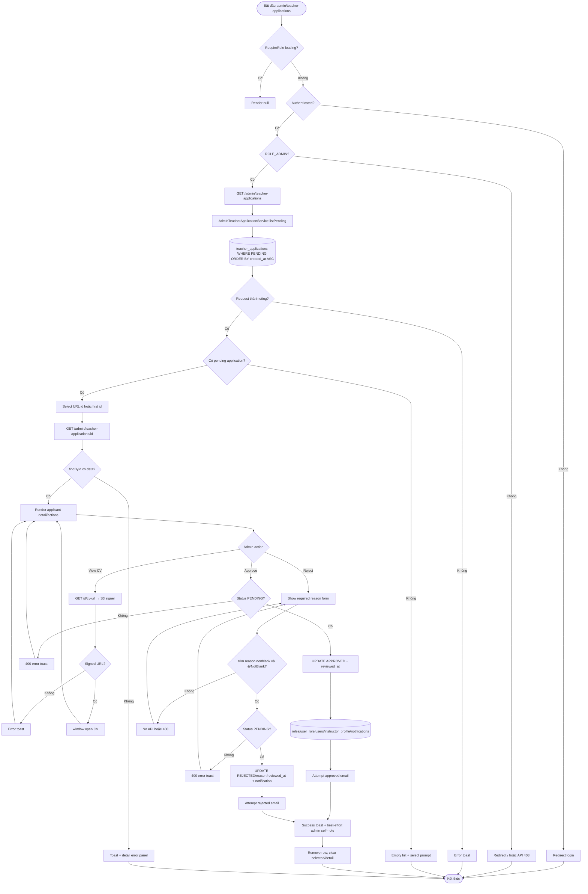

# Detailed Design As-Is — Teacher Application Management

> Phạm vi: màn hình admin **Đơn đăng ký giảng viên** tại `/learnova/admin/teacher-applications` và deep-link `/:applicationId`, bao gồm empty/loading/list/detail, xem CV, duyệt và từ chối.  
> Quy ước: **Đã xác minh từ code** = có bằng chứng trực tiếp; **Suy luận từ ảnh và code** = đối chiếu UI ảnh với nhánh code; **Chưa xác minh** = thiếu DB/runtime/network để kết luận.

## 1. Thông tin màn hình

| Thuộc tính | Nội dung |
| --- | --- |
| Tên màn hình | Duyệt đơn đăng ký giảng viên / Teacher Application Management |
| Mã màn hình | Không tìm thấy mã chính thức; component `TeacherApplicationPage` |
| Route/URL | `/learnova/admin/teacher-applications`; `/learnova/admin/teacher-applications/:applicationId` |
| Actor | Quản trị viên có `ROLE_ADMIN` |
| Mục đích | Xem danh sách đơn đang chờ, xem hồ sơ/CV và phê duyệt hoặc từ chối đơn |
| Nguồn phân tích | Ảnh màn hình + FE + BE |
| Loại tài liệu | Reverse-engineered DD – As-Is |
| Mức độ xác minh | Đã xác minh E2E list/detail/CV/approve/reject/notification/email/DB; ảnh chỉ thể hiện empty state nên UI có dữ liệu chưa đối chiếu runtime |
| File DD | `docs/DD_TeacherApplicationManagement.md` |

## 2. Tổng quan chức năng

- Admin mở mục **Đơn đăng ký giảng viên** từ sidebar hoặc URL. Hai route base/deep-link nằm dưới `RequireRole role="ROLE_ADMIN"` (`AppRoutes.jsx:73,90-91`; `SidebarAdmin.jsx:56-60`).
- Khi mount, FE gọi GET pending applications. Backend chỉ lấy status `PENDING`, sắp xếp `createdAt ASC`, nên đơn cũ nhất đứng trước (`TeacherApplicationPage.jsx:30-51`; `TeacherApplicationRepository.java:14`).
- Nếu URL không có id, FE tự chọn đơn đầu tiên khi list có dữ liệu; sau đó thay URL bằng deep-link. Nếu list rỗng, sidebar hiển thị “Không có đơn đăng ký đang chờ.” và main panel hiển thị prompt như ảnh (`TeacherApplicationPage.jsx:38-39,74-78,145-180`).
- Khi có selected id, FE gọi GET detail và hiển thị avatar, tên/email, specialization, experience, nút View CV, Approve/Reject (`TeacherApplicationPage.jsx:53-68,183-243`).
- View CV gọi API lấy signed CloudFront URL rồi `window.open` tab mới. Không download trực tiếp từ FE (`91-99`; `AdminTeacherApplicationService.java:62-68`).
- Approve cập nhật đơn thành APPROVED, thời điểm review, thêm ROLE_TEACHER nếu thiếu, đổi active role sang teacher nếu user không phải admin, seed instructor profile nếu chưa có, tạo notification cho ứng viên và thử gửi email (`AdminTeacherApplicationService.java:70-105,133-163`).
- Reject yêu cầu lý do, cập nhật REJECTED/rejectionReason/reviewedAt, tạo notification và thử gửi email (`108-130`).
- Sau mutation thành công, FE hiện success toast, cố tạo notification hoạt động cho chính admin, xóa row khỏi list và đưa detail về empty prompt (`TeacherApplicationPage.jsx:101-136`; `NotificationApi.js:25-36`).
- Chức năng đọc và thay đổi database. Không có search/filter/pagination/export. Có popup toast nhưng không có modal confirmation.
- Điểm bắt đầu là `AppRoutes.jsx:90-91`; điểm kết thúc là empty/list/detail render, tab CV mở, hoặc approve/reject hoàn tất và row bị loại.

## 3. Đối chiếu ảnh với code

| STT | Thành phần trên ảnh | Loại control | File FE | Component/Method | Event/API | Nguồn dữ liệu | Xác minh |
| --: | --- | --- | --- | --- | --- | --- | --- |
| 1 | Tiêu đề lớn “Đơn đăng ký giảng viên” | Header title | `Header.jsx:55-87` | pathname mapping | route | i18n admin | Đã xác minh từ code |
| 2 | Sidebar item active, text bị ellipsis | Navigation | `SidebarAdmin.jsx:56-60,120-154` | NavLink | route | menu/i18n | Đã xác minh từ code |
| 3 | Tiêu đề nội dung “Đơn đăng ký giảng viên” | h1 | `TeacherApplicationPage.jsx:140-143` | `t(title)` | none | vi.json | Đã xác minh từ code |
| 4 | Subtitle “Xem xét các đơn...” | paragraph | same 142 | `t(subtitle)` | none | vi.json | Đã xác minh từ code |
| 5 | “Không có đơn đăng ký đang chờ.” | Empty message | `TeacherApplicationPage.jsx:147-151` | list state branch | GET list | applications=[] | Đã xác minh; ảnh thể hiện branch này |
| 6 | Panel trái | Aside/list | `TeacherApplicationPage.jsx:145-170` | loading/empty/list | select | pending list | Đã xác minh từ code |
| 7 | Panel phải lớn | Main/detail | `TeacherApplicationPage.jsx:172-246` | selected/detail branches | GET detail | selected id/detail | Đã xác minh từ code |
| 8 | Icon graduation cap | Empty icon | `TeacherApplicationPage.jsx:173-176` | lucide icon | none | static | Đã xác minh từ code |
| 9 | “Chọn một đơn đăng ký...” | Empty message | same 176 | `t(select)` | none | selectedId=null | Đã xác minh; ảnh thể hiện branch này |
| 10 | EN, chuông 34, settings, admin | Admin shell | `Header.jsx:89-168`; `NotificationBell.jsx:13-62` | shell controls | notification/auth | runtime/auth | Code xác minh; số 34 chưa xác minh |
| 11 | Application list item | Button | `TeacherApplicationPage.jsx:152-168` | `selectApplication` | local + GET detail | pending response | Đã xác minh từ code; không có trên ảnh empty |
| 12 | Avatar/tên/email | Image/text | `TeacherApplicationPage.jsx:160-164,184-190` | response binding | none | users fields | Đã xác minh từ code |
| 13 | Specialization | Read-only | `TeacherApplicationPage.jsx:192-195` | binding | none | teacher_applications | Đã xác minh từ code |
| 14 | Experience | Read-only multiline | `TeacherApplicationPage.jsx:197-200` | binding | none | teacher_applications | Đã xác minh từ code |
| 15 | View CV (PDF) | Button/link action | `TeacherApplicationPage.jsx:202-206` | `handleViewCv` | GET cv-url/window.open | cv_key/S3 | Đã xác minh từ code |
| 16 | Approve | Button | `TeacherApplicationPage.jsx:209-213` | `handleApprove` | PATCH approve | selected id | Đã xác minh từ code |
| 17 | Reject | Button | `TeacherApplicationPage.jsx:214-221` | showRejectForm | local | state | Đã xác minh từ code |
| 18 | Rejection reason | Required textarea | `TeacherApplicationPage.jsx:224-233` | rejectReason | input | user | Đã xác minh từ code |
| 19 | Confirm Reject | Submit button | `TeacherApplicationPage.jsx:234-237` | `handleReject` | PATCH reject | id/reason | Đã xác minh từ code |
| 20 | Cancel | Button | `TeacherApplicationPage.jsx:238-240` | hide form | local | state | Đã xác minh từ code |
| 21 | Toast success/error | Message | handlers lines 40-41,62-64,96-97,106-112,124-132 | toast/adminNotifySuccess | API results | response/message | Đã xác minh từ code |

Không có table, search, dropdown, checkbox/radio, pagination, export hoặc direct-download control. Từ khóa đã tìm trong `teacher_application`: `search`, `filter`, `table`, `pagination`, `export`, `download`, `checkbox`, `radio`; không có runtime control tương ứng.

## 4. Danh sách source liên quan

### Frontend — theo thứ tự chạy

| STT | Layer | Đường dẫn file | Class/Component | Method liên quan | Vai trò |
| --: | --- | --- | --- | --- | --- |
| 1 | Route | `front_end/src/app/routes/AppRoutes.jsx` | App | 73,90-91 | Base/deep-link route |
| 2 | Guard | `front_end/src/app/routes/RequireRole.jsx` | RequireRole | 4-25 | Auth/ROLE_ADMIN |
| 3 | Layout | `front_end/src/app/layouts/admin/DashboardLayout.jsx` | Dashboard | 6-18 | Admin shell/outlet |
| 4 | Sidebar | `.../sidebar_admin/SidebarAdmin.jsx` | SidebarAdmin | 56-60,120-154 | Navigation/active |
| 5 | Header | `.../admin_header/Header.jsx` | Header | 55-168 | Title/shell actions |
| 6-7 | Notification shell | NotificationBell/useNotifications | component/hook | relevant ranges | Badge/list/read |
| 8-9 | Auth shell | AuthContext/AuthApi | context/API | logout | Account action |
| 10 | HTTP | `shared/api-client/AxiosClient.js` | axiosClient | 3-11 | All page requests |
| 11 | API | `admin/infrastructure/api/TeacherApplicationApi.js` | 5 adapters | 3-25 | list/detail/CV/approve/reject |
| 12 | Notification API | `notification/infrastructure/api/NotificationApi.js` | adminNotifySuccess | 20-36 | toast/admin self-note |
| 13 | Page | `admin/presentation/teacher_application/TeacherApplicationPage.jsx` | component/handlers | 16-252 | State/render/actions |
| 14 | CSS | `TeacherApplicationPage.css` | rules | toàn file | Two-column/detail/form responsive |
| 15-16 | i18n | `vi.json`, `en.json` | teacherApplication | lines 3 | Empty/loading headings |
| 17-19 | Shell CSS | DashboardLayout/SidebarAdmin/Header CSS | rules | toàn file | Screenshot layout |

### Backend/Database — theo thứ tự chạy

| STT | Layer | Đường dẫn file | Class/Component | Method liên quan | Vai trò |
| --: | --- | --- | --- | --- | --- |
| 1 | Security | `shared/config/SecurityConfig.java` | filter chain | 41-103 | Admin API requires ADMIN |
| 2 | Controller | `admin/adapter/in/web/AdminTeacherApplicationController.java` | five endpoints | 23-54 | HTTP entry |
| 3 | Service | `admin/application/AdminTeacherApplicationService.java` | list/get/CV/approve/reject | 48-181 | Business transaction |
| 4 | Request DTO | `RejectTeacherApplicationRequest.java` | record | 5-7 | @NotBlank reason |
| 5 | Response DTO | `TeacherApplicationResponse.java` | record | 5-18 | Application JSON |
| 6 | Response DTO | `CvUrlResponse.java` | record | 3 | Signed URL JSON |
| 7 | Repository | `TeacherApplicationRepository.java` | derived methods | 10-16 | Pending/list/id/save |
| 8 | Entity | `TeacherApplication.java` | entity | 16-55 | Main table mapping |
| 9 | Enum | `TeacherApplicationStatus.java` | enum | 3-5 | PENDING/APPROVED/REJECTED |
| 10-12 | User/role | User/Role/RoleName | entities/enum | relevant fields | Add teacher role/active role |
| 13 | Entity | `InstructorProfile.java` | entity | 16-44 | Seed approved profile |
| 14-16 | Repositories | UserRepository/RoleRepository/InstructorProfileRepository | JPA | save/find/exists | Approval persistence |
| 17 | Notification service | `NotificationService.java` | create/createForEmail | 30-58 | Applicant/admin notifications |
| 18-20 | Notification persistence | NotificationRepository/Notification/NotificationType | repository/entity/enum | save | notifications table |
| 21 | Self-note Controller | `NotificationController.java` | createSelf | 45-63 | FE admin activity note |
| 22-23 | Self-note DTO | SelfNotificationRequest/NotificationResponse | records | toàn file | validate/return self-note |
| 24 | Email | `EmailService.java` | teacher application emails | 292+,500+ | Best-effort email |
| 25 | Storage | `S3Service.java` | generate signed URL | relevant method | CV URL |
| 26-27 | Exception | GlobalExceptionHandler/ErrorResponse | handlers/record | 32-117 | 400/403/404/409/500 |
| 28 | Database | `V1__initial_schema.sql` | DDL | relevant ranges | Tables, keys, indexes, FK |

## 5. Thiết kế chi tiết UI

| STT | Label hiển thị | Tên trong code | Control | Kiểu dữ liệu | Bắt buộc | Mặc định | Nguồn dữ liệu | Điều kiện hiển thị | Event |
| --: | --- | --- | --- | --- | --- | --- | --- | --- | --- |
| 1 | Title/subtitle | i18n keys | read-only | string | — | translated | vi/en JSON | always | language |
| 2 | Loading | loadingList | message | boolean | — | true | state | list loading | none |
| 3 | Không có đơn... | applications | message | array | — | [] | GET pending | !loading && empty | none |
| 4 | Application item | app | button/list | object | — | first auto-selected | list response | list nonempty | selectApplication |
| 5 | Avatar | userAvatar | image | URL/key | — | none | users.avatar | list/detail | browser load |
| 6 | Name/email | userFullName/userEmail | text | string | — | email fallback for name | users | row/detail | none |
| 7 | Specialization | specialization | read-only | string | — | no FE fallback | application | selected detail | none |
| 8 | Experience | experience | read-only multiline | string | — | no FE fallback | application | selected detail | none |
| 9 | View CV | handleViewCv | button | action | — | enabled | selected id | detail | GET URL/open tab |
| 10 | Approve | handleApprove | button | action | — | enabled | selected id | detail & !reject form | PATCH |
| 11 | Reject | showRejectForm | button | action | — | enabled | local | detail & !reject form | show form |
| 12 | Rejection reason | rejectReason | textarea rows=3 | string | Có | empty | admin input | reject form | onChange |
| 13 | Confirm Reject | handleReject | submit | action | — | enabled | id/reason | reject form | PATCH |
| 14 | Cancel | setShowRejectForm | button | action | — | enabled | local | reject form | hide form |
| 15 | Main prompt | selectedId | icon/message | nullable id | — | null if empty | URL/list/action | no selected id | none |
| 16 | Detail loading/error | loadingDetail/detail | message | state | — | false/null | detail API | selected | none |

- Read-only: applicant identity, specialization, experience. Editable duy nhất là rejection reason.
- Textarea có HTML `required`, handler kiểm `trim()`, backend `@NotBlank`; không có `maxLength` (`TeacherApplicationPage.jsx:118-123,224-232`; `RejectTeacherApplicationRequest.java:3-7`).
- Approve/Reject/Confirm/Cancel disabled khi `isSubmitting`; View CV và list item không disabled (`TeacherApplicationPage.jsx:202-240`).
- Cancel chỉ ẩn form, không reset `rejectReason`; mở lại form giữ nội dung cũ. Chọn application khác mới reset (`80-84,238`).
- Không có placeholder cho textarea. Không hiển thị status/createdAt/reviewedAt dù response có.
- Avatar không có fallback/onError và backend trả raw `user.avatar`, không resolve S3 trong mapper (`AdminTeacherApplicationService:165-180`).
- Layout 300px + 1fr; CSS định nghĩa sidebar/detail/form và responsive. Ảnh đang ở empty state.

## 6. Điểm bắt đầu và điểm kết thúc

| Luồng | File/Method bắt đầu | Điều kiện bắt đầu | Các layer đi qua | File/Method kết thúc | Kết quả |
| --- | --- | --- | --- | --- | --- |
| Mở base route | `AppRoutes.jsx:90` | admin navigates | guard→layout→page | initial render | load list |
| Mở deep-link | `AppRoutes.jsx:91` | id in URL | params→detail API | detail/empty/error | selected review |
| Load pending | `loadApplications:33-47` | mount | API→controller→service→repo→DB | setApplications/selected | empty/list |
| Load detail | `loadDetail:53-68` | selectedId truthy | API→controller→service→repo→DB | setDetail | detail panel |
| Select item | `selectApplication:80-84` | row click | local state→URL→detail | detail render | selected row |
| View CV | `handleViewCv:91-99` | detail/id | API→service→S3 | window.open | new tab/error toast |
| Approve | `handleApprove:101-116` | selected | PATCH→transaction→notifications/email→self-note | remove row | prompt/success |
| Show reject | Reject onClick 218 | detail | local state | reject form | wait input |
| Reject | `handleReject:118-136` | id + nonblank | PATCH→transaction→notification/email→self-note | remove row | prompt/success |
| Cancel reject | line238 | form shown | local state | hide form | action buttons |
| Shell actions | sidebar/header/bell | click | router/auth/notifications | route/state | leave/update shell |

Không có search, filter, pagination, add/edit/delete generic, export hoặc download. Approve/reject là mutation chính.

## 7. Luồng khởi tạo màn hình

1. Route base hoặc `/:applicationId` match `AppRoutes.jsx:90-91` dưới admin parent.
2. `RequireRole.jsx:4-25` chờ auth; unauthenticated redirect login, sai role redirect `/`.
3. `DashboardLayout.jsx:6-18` mount shell; `TeacherApplicationPage` đọc param, tạo `selectedId=Number(applicationId)` hoặc null và các state lines 16-28.
4. Mount effect `loadApplications` bật loading và gọi `getAdminTeacherApplicationsApi()` (`30-47`).
5. FE dùng default `axiosClient`, GET `/admin/teacher-applications` (`TeacherApplicationApi.js:3-6`).
6. `SecurityConfig.java:79` yêu cầu ADMIN; `AdminTeacherApplicationController.listPending()` nhận request không param/body (`28-31`).
7. `AdminTeacherApplicationService.listPending()` chạy read-only transaction (`48-53`).
8. Repository derived query tương đương `WHERE status=PENDING ORDER BY created_at ASC` (`TeacherApplicationRepository.java:14`).
9. ORM đọc `teacher_applications` và lazy `users` khi mapper truy cập user; mapper tạo `TeacherApplicationResponse` (`AdminTeacherApplicationService:165-180`).
10. Controller trả 200 list; FE chỉ nhận array, non-array thành `[]`.
11. Nếu chưa selected, FE chọn `data[0].id`; nếu list empty giữ null (`TeacherApplicationPage:38-39`).
12. Nếu selected truthy, navigation effect replace URL bằng deep-link (`74-78`).
13. Detail effect gọi GET `/{id}`. Service `findById` không bắt buộc status PENDING, map cùng response (`53-72`; BE `55-60`).
14. UI render loading/empty/list và prompt/loading detail/error/detail theo conditions lines 145-246.
15. Lỗi list hiện toast và kết thúc loading; lỗi detail clear detail, toast và panel hard-code “Application detail could not be loaded.” (`40-43,62-66,180-181`).

## 8. Luồng từng thao tác

### 8.1 Chọn đơn đăng ký

| Bước | Layer | File | Method | Input | Xử lý | Output/Chuyển tiếp |
| --: | --- | --- | --- | --- | --- | --- |
| 1 | UI | `TeacherApplicationPage.jsx:152-168` | list onClick | app.id | call selectApplication | state |
| 2 | FE | same 80-84 | selectApplication | id | set id; hide/reset reject | effects |
| 3 | Router | same 74-78 | navigate replace | id | deep-link URL | route history |
| 4 | FE API | same 53-68 | loadDetail | selectedId | GET detail | response/error |
| 5 | BE | controller/service/repo | getDetail/getById/findById | id | SELECT/map | DTO |
| 6 | FE | lines61/183-243 | setDetail/render | DTO | bind fields/actions | review panel |

Không FE validation ngoài truthy id. Failure: toast, detail null, error panel. Không abort/request-id; rapid selection có thể race.

### 8.2 Xem CV

| Bước | Layer | File | Method | Input | Xử lý | Output/Chuyển tiếp |
| --: | --- | --- | --- | --- | --- | --- |
| 1 | UI | `TeacherApplicationPage:202-206` | click | selectedId | handleViewCv | API |
| 2 | API | `TeacherApplicationApi:13-15` | getCvUrlApi | id | GET `/{id}/cv-url` | BE |
| 3 | Security | `SecurityConfig:79` | authorize | admin auth | allow/deny | controller |
| 4 | Controller | `AdminTeacherApplicationController:38-41` | getCvUrl | Long id | delegate | service |
| 5 | Service | `AdminTeacherApplicationService:62-68` | getCvUrl | id | find or 404; sign cvKey | `{url}` |
| 6 | Storage | `S3Service` | signer | cvKey | CloudFront signed URL | URL/error |
| 7 | Browser | FE lines94-97 | window.open | URL | new tab noopener/noreferrer | CV/error toast |

Không kiểm status hoặc ownership ngoài quyền ADMIN. Không gọi DB update. Popup blocker có thể chặn do `window.open` chạy sau await.

### 8.3 Phê duyệt

| Bước | Layer | File | Method | Input | Xử lý | Output/Chuyển tiếp |
| --: | --- | --- | --- | --- | --- | --- |
| 1 | UI | `TeacherApplicationPage:209-213` | Approve | selectedId | isSubmitting=true | PATCH |
| 2 | API | `TeacherApplicationApi:18-20` | approve API | path id | no body | controller |
| 3 | Controller | `AdminTeacherApplicationController:43-46` | approve | Long id | delegate | service |
| 4 | Service | `AdminTeacherApplicationService:70-80` | approve | id | find; require PENDING; set status/reviewedAt/save | application |
| 5 | Repository/DB | TeacherApplicationRepository | find/save | id/entity | SELECT + UPDATE | teacher_applications |
| 6 | Service | lines82-93 | role logic | applicant user | find ROLE_TEACHER; add if missing; set active role unless admin | save user/user_role |
| 7 | Service | lines95,133-146 | seedInstructorProfile | user/application | skip existing; else INSERT profile | instructor_profile |
| 8 | Service | lines97-103,148-163 | notifyApplicant | applicant | INSERT notification; attempt email | side effects |
| 9 | BE | toResponse/controller | map | application | commit transaction | 200 DTO |
| 10 | FE | `NotificationApi:25-36` | adminNotifySuccess | fixed message/title | immediate toast; POST self-note best effort | admin notification |
| 11 | FE | `TeacherApplicationPage:109-115` | remove/clear | selectedId | remove row, selected/detail null | prompt |

Validation/permission: selected truthy FE; ADMIN BE; record must exist and PENDING; ROLE_TEACHER row must exist. Failure before commit rolls back transaction, except email is external. FE shows backend message or generic.

### 8.4 Mở form từ chối

Reject button chỉ đặt `showRejectForm=true`; thay action buttons bằng textarea/Confirm/Cancel. Không API/DB/message (`TeacherApplicationPage:209-243`).

### 8.5 Xác nhận từ chối

| Bước | Layer | File | Method | Input | Xử lý | Output/Chuyển tiếp |
| --: | --- | --- | --- | --- | --- | --- |
| 1 | Form | `TeacherApplicationPage:224-237` | submit | reason | HTML required | handler |
| 2 | FE | lines118-123 | handleReject | id, reason | preventDefault; trim; blank→return | PATCH |
| 3 | API | `TeacherApplicationApi:23-25` | reject API | `{reason}` | PATCH | controller |
| 4 | Controller | `AdminTeacherApplicationController:48-54` | reject | @Valid DTO | validate NotBlank | service/400 |
| 5 | Service | `AdminTeacherApplicationService:108-119` | reject | id/reason | find; require PENDING; status/reason/reviewedAt | save |
| 6 | DB | repository | save | entity | UPDATE teacher_applications | persisted |
| 7 | Service | lines121-128,148-163 | notifyApplicant | application/reason | INSERT notification; attempt rejected email | side effects |
| 8 | BE | mapper/controller | response | entity | commit | 200 DTO |
| 9 | FE | adminNotifySuccess | message | fixed content | toast + self-note best effort | UI |
| 10 | FE | lines127-135 | cleanup | id | remove, clear detail/form/reason | prompt |

Failure: 404, 400 nonpending, validation 400, DB/notification 500; FE keeps row/form and shows toast. Email exception bị backend catch, không làm API fail.

### 8.6 Hủy từ chối

Cancel đặt `showRejectForm=false`; không clear `rejectReason`, không API/DB. Button disabled trong khi submitting (`TeacherApplicationPage:238-240`).

### 8.7 Success self-notification cho admin

Sau approve/reject API 200, `adminNotifySuccess` gọi `toast.success` trước, rồi POST `/notifications/self` với title/content/current pathname. Controller yêu cầu ADMIN, service tìm current admin email và INSERT `notifications`; lỗi bị FE nuốt, toast vẫn tồn tại (`NotificationApi.js:25-36`; `NotificationController.java:45-63`; `NotificationService.java:43-58`).

## 9. API specification

| API | HTTP method | Nơi gọi | Controller | Request | Response | Mục đích |
| --- | --- | --- | --- | --- | --- | --- |
| `/api/learnova/admin/teacher-applications` | GET | page mount | `listPending` | none | `List<TeacherApplicationResponse>` | pending list |
| `/api/learnova/admin/teacher-applications/{id}` | GET | selected effect | `getDetail` | path Long id | `TeacherApplicationResponse` | detail |
| `/api/learnova/admin/teacher-applications/{id}/cv-url` | GET | View CV | `getCvUrl` | path Long id | `CvUrlResponse` | signed CV URL |
| `/api/learnova/admin/teacher-applications/{id}/approve` | PATCH | Approve | `approve` | path id, no body | `TeacherApplicationResponse` | approve/promote |
| `/api/learnova/admin/teacher-applications/{id}/reject` | PATCH | Confirm Reject | `reject` | path id + `{reason}` | `TeacherApplicationResponse` | reject |
| `/api/learnova/notifications/self` | POST | success helper | `NotificationController.createSelf` | title/content/link | `NotificationResponse` | admin activity note |

Chi tiết hợp đồng:

- Axios base URL/credentials/JSON tại `AxiosClient.js:3-11`. Page APIs dùng raw `axiosClient`, không dùng `useAxiosPrivate`; không có response refresh/retry interceptor của hook.
- Admin application endpoints match `SecurityConfig.java:79` và yêu cầu `ROLE_ADMIN`. Self-note còn có `@PreAuthorize("hasRole('ADMIN')")` (`NotificationController:46-50`).
- List không query/page/body; chỉ status PENDING và order ASC tại repository.
- Detail/CV/approve/reject dùng path `Long id`; không request DTO trừ reject.
- Reject body DTO `@NotBlank(message="Reason is required")`; không max size (`RejectTeacherApplicationRequest:3-7`).
- Thành công 200. Not found 404. Nonpending approve/reject và blank business input 400. Auth/role 401/403. DB/generic 500.
- FE list/detail/CV/mutation hiển thị toast error. Success mutation bỏ qua response body và tự remove row. Self-note error bị nuốt.
- Response chứa cả `cvKey`, status, rejectionReason, timestamps nhưng admin UI chỉ dùng identity/avatar/specialization/experience.

## 10. Backend processing

| Layer | File | Class | Method | Input | Xử lý | Gọi tiếp | Output |
| --- | --- | --- | --- | --- | --- | --- | --- |
| Security | SecurityConfig | config | filter chain | HTTP | require ADMIN | controller | allow/deny |
| Controller | AdminTeacherApplicationController | class | listPending | none | delegate | service | 200 list |
| Service | AdminTeacherApplicationService | class | listPending | status constant | readOnly/map | repo | DTO list |
| Repository | TeacherApplicationRepository | interface | findAllByStatusOrderByCreatedAtAsc | PENDING | derived SELECT/order | DB | entities |
| Controller | same | class | getDetail/getCvUrl | id | delegate | service | DTO/URL |
| Service | same | class | getById/getCvUrl | id | find/map/sign | repo/S3 | response |
| Controller | same | class | approve | id | delegate | service | approved DTO |
| Service | same | class | approve | id | validate/update role/profile/notify/email | 4 repos/services | response |
| Controller | same | class | reject | id/valid DTO | validate/delegate | service | rejected DTO |
| Service | same | class | reject | id/reason | validate/update/notify/email | repo/services | response |
| Mapper | same | class | toResponse | entity | map user/application | lazy relation | record |
| Notification | NotificationController/Service | classes | createSelf/createForEmail | admin payload | validate/find/save | repos | note DTO |
| Exception | GlobalExceptionHandler | advice | handlers | exceptions | status/message | HTTP | ErrorResponse |

- `AdminTeacherApplicationService` class-level `@Transactional`; list/get/CV override readOnly. Approve/reject, role/profile và applicant notification cùng transaction (`lines33-36,48-68,70-163`).
- `teacherApplicationRepository.save` có thể flush muộn; nếu role/profile/notification fail, transaction rollback DB changes.
- Email gọi trong transaction nhưng exception bị catch. Email success xảy ra trước DB commit; commit failure sau email là một rủi ro side effect không transactional.
- Applicant notification là bắt buộc trong transaction: `NotificationService.create` exception làm rollback. Admin self-note là transaction/request riêng sau approval và best-effort.
- Không có audit log explicit trong approve/reject flow.

## 11. Database và query

| Bảng | Cột sử dụng | Mục đích | Thao tác | File/Method truy cập |
| --- | --- | --- | --- | --- |
| `teacher_applications` | id,user_id,specialization,experience,cv_key,status,rejection_reason,created_at,reviewed_at | list/detail/review | SELECT, UPDATE | TeacherApplicationRepository/Admin service |
| `users` | user_id,full_name,email,avatar,active_role | applicant display/promotion | SELECT, UPDATE | User relation/UserRepository |
| `roles` | role_id,role_name | find teacher role | SELECT | RoleRepository.findByRoleName |
| `user_role` | user_id,role_id | grant teacher role | INSERT if missing | User.roles save |
| `instructor_profile` | instructor_id,description,expertise,created_at,updated_at | seed public profile | SELECT exists, INSERT if absent | InstructorProfileRepository |
| `notifications` | user_id,title,content,type,link,metadata,is_read,created_at | applicant/admin notes | INSERT | NotificationService |

Query/transaction chi tiết:

- Pending list derived query: `WHERE status='PENDING' ORDER BY created_at ASC`; không pagination, join fetch hoặc explicit user filter (`TeacherApplicationRepository.java:14`).
- `findById` dùng PK cho detail/CV/mutation; detail/CV không kiểm status PENDING.
- `toResponse` truy cập lazy `application.user`; list query không JOIN FETCH, có nguy cơ thêm SELECT user theo application/N+1.
- Approve UPDATE `status=APPROVED`, `reviewed_at=now`; INSERT `user_role` nếu thiếu; UPDATE `users.active_role=ROLE_TEACHER` nếu applicant không có admin role; INSERT profile nếu PK chưa tồn tại; INSERT applicant notification.
- Reject UPDATE `status=REJECTED`, `rejection_reason`, `reviewed_at`; INSERT applicant notification.
- FE success self-note INSERT thêm một row notifications cho current admin qua request riêng.
- Không DELETE. Không GROUP BY. Không điều kiện ngày ngoài ORDER BY createdAt.
- Empty: repository trả `[]`; UI empty state. Missing id: 404. Null fullName fallback email; null avatar không có visual fallback. specialization/experience/cvKey/entity createdAt nonnull theo JPA/DDL.
- DDL `teacher_applications` có PK và FK user nhưng không có CHECK status hoặc unique “một PENDING/user” (`V1:1470-1482,2066-2070,3020-3024`). Quy tắc duplicate pending nằm ở applicant service, có thể race nếu concurrent submit.
- `user_role` PK `(user_id,role_id)` chống duplicate role (`V1:2130-2134`); `roles.role_name` UNIQUE (`2018-2022`).
- `instructor_profile.instructor_id` vừa PK vừa FK cascade tới users (`1810-1814,2756-2760`).
- Notifications có indexes user/created/unread và FK cascade (`V1:2372-2393,2916-2920`).

## 12. Mapping dữ liệu FE–BE–DB

| Dữ liệu | UI field | FE variable | Request field | Backend DTO | Service/Repository | Table.Column | Response field | UI hiển thị |
| --- | --- | --- | --- | --- | --- | --- | --- | --- |
| Application id | selection/actions | selectedId/app.id | path id | id | findById | teacher_applications.id | id | internal/URL |
| Applicant id | not displayed | userId | — | userId | mapper User | users.user_id | userId | unused |
| Name | list/detail | userFullName | — | userFullName | application.user | users.full_name | userFullName | name/email fallback |
| Email | list/detail | userEmail | — | userEmail | application.user | users.email | userEmail | text |
| Avatar | list/detail image | userAvatar | — | userAvatar | mapper raw avatar | users.avatar | userAvatar | img |
| Specialization | list/detail | specialization | — | specialization | entity | teacher_applications.specialization | specialization | text |
| Experience | detail | experience | — | experience | entity | teacher_applications.experience | experience | multiline |
| CV key | View CV | not directly used | path id | cvKey/CvUrlResponse | signer | teacher_applications.cv_key | url | new tab |
| Status | list inclusion/action validation | status | — | status | repository/service | teacher_applications.status | status | not shown |
| Reject reason | textarea | rejectReason | body.reason | Reject DTO | reject service | rejection_reason | rejectionReason | not shown after success |
| Created | ordering | createdAt | — | createdAt | derived order | created_at | createdAt | not shown |
| Reviewed | mutation | — | — | reviewedAt | Instant.now | reviewed_at | reviewedAt | not shown |
| Teacher role | side effect | auth later | — | — | role/user repos | roles/user_role | not returned separately | user becomes teacher |
| Active role | side effect | auth later | — | — | user save | users.active_role | — | changed for non-admin |
| Profile expertise | side effect | — | — | — | seed profile | instructor_profile.expertise | — | later instructor profile |
| Profile description | side effect | — | — | — | seed profile | instructor_profile.description | — | later instructor profile |
| Applicant notification | external UI later | — | — | — | NotificationService.create | notifications.* | — | bell/profile later |
| Admin success note | bell | fixed payload | title/content/link | SelfNotificationRequest | createForEmail | notifications.* | NotificationResponse | bell count/event |

## 13. Business rule rút ra từ code

| ID | Business rule hiện tại | Điều kiện | File/Method | Khi đúng | Khi sai | Mức xác minh |
| --- | --- | --- | --- | --- | --- | --- |
| BR-01 | Chỉ admin dùng page/API | ROLE_ADMIN | RequireRole/SecurityConfig | allow | redirect/401/403 | Đã xác minh |
| BR-02 | List chỉ PENDING, cũ trước | status/order | listPending/repository | included ASC | excluded | Đã xác minh |
| BR-03 | Base route tự chọn đơn đầu | no selected + list | loadApplications | selected first | null | Đã xác minh |
| BR-04 | Deep-link detail không giới hạn PENDING | id exists | getById | any status DTO | 404 | Đã xác minh |
| BR-05 | CV admin không kiểm status/ownership | valid id/admin | getCvUrl | signed URL | 404/sign error | Đã xác minh |
| BR-06 | Chỉ PENDING được approve | status PENDING | approve | continue | BusinessException 400 | Đã xác minh |
| BR-07 | Approve gắn teacher role idempotent ở logic | role missing | approve lines85-87 | add | keep existing | Đã xác minh |
| BR-08 | Admin applicant giữ active role | user has ADMIN | lines88-92 | no change | set teacher | Đã xác minh |
| BR-09 | Profile chỉ seed nếu chưa có | existsById | seedInstructorProfile | skip | insert | Đã xác minh |
| BR-10 | Profile lấy specialization/experience | approve new profile | seed | expertise/description | — | Đã xác minh |
| BR-11 | Chỉ PENDING được reject | status PENDING | reject | continue | 400 | Đã xác minh |
| BR-12 | Reject reason bắt buộc | trimmed/NotBlank | FE/DTO | request | no call/400 | Đã xác minh |
| BR-13 | Email failure không fail action | email throws | notifyApplicant | log, commit possible | email sent | Đã xác minh |
| BR-14 | Applicant notification là phần transaction | notification save | service | commit with action | exception rollback | Đã xác minh |
| BR-15 | Admin self-note best-effort | POST fail | adminNotifySuccess | bell sync | toast still success | Đã xác minh |
| BR-16 | Success xóa row local, không reload list | API 200 | removeFromList | row removed | remains on failure | Đã xác minh |

## 14. Validation, permission và message

| Loại | Điều kiện | FE/BE | File/Method | Mã/Nội dung message | Hành vi |
| --- | --- | --- | --- | --- | --- |
| Permission | unauthenticated | FE | RequireRole | redirect login | page not rendered |
| Permission | non-admin | FE | RequireRole | redirect `/` | page not rendered |
| Permission | non-admin API | BE | SecurityConfig | 401/403 | controller blocked |
| List error | GET fail | FE | loadApplications | BE message/“Failed to load applications.” | toast |
| Detail error | GET fail | FE | loadDetail | BE message/“Failed to load application detail.” | toast + error panel |
| CV error | URL/sign/open request fail | FE | handleViewCv | BE message/“Failed to open CV.” | toast |
| FE validation | no selected id | FE | approve/CV/reject | none | return |
| FE validation | reject trim blank | FE | handleReject | native required/no custom toast | no API |
| Bean validation | blank reason | BE | Reject DTO | “Reason is required” | 400 validation response |
| Resource | id missing | BE | service | “Application not found id=…” | 404 |
| Business | approve nonpending | BE | approve | Vietnamese PENDING message | 400 |
| Business | reject nonpending | BE | reject | Vietnamese PENDING message | 400 |
| Resource | teacher role missing | BE | approve | “Role ROLE_TEACHER not found” | 404/rollback |
| Success approve | API 200 | FE | adminNotifySuccess | “Application approved. The user is now an instructor.” | success toast+self-note |
| Success reject | API 200 | FE | adminNotifySuccess | “Application rejected. The user has been notified.” | success toast+self-note |
| Email exception | send fails | BE | notifyApplicant | server log only | action continues |
| Self-note exception | POST fails | FE | adminNotifySuccess | none | swallowed |
| DB constraint | duplicate user_role/invalid FK/null | DB | transaction | integrity/generic handler | rollback 409/500 |
| Generic | uncaught | BE | GlobalExceptionHandler | “An unexpected error occurred.” | 500 |

Không có confirmation modal. Error/success dùng toast; empty/loading dùng inline message.

## 15. Mermaid sequence toàn bộ màn hình

```mermaid
sequenceDiagram
    actor Admin
    participant Route as "AppRoutes/RequireRole"
    participant UI as "TeacherApplicationPage.jsx"
    participant API as "TeacherApplicationApi.js"
    participant Sec as "SecurityConfig"
    participant Ctrl as "AdminTeacherApplicationController"
    participant Svc as "AdminTeacherApplicationService"
    participant Repo as "TeacherApplicationRepository"
    participant DB as "teacher_applications/users/roles/user_role/instructor_profile/notifications"
    participant S3 as "S3Service"
    participant Mail as "EmailService"
    participant NoteAPI as "NotificationApi/NotificationController"

    Admin->>Route: GET /learnova/admin/teacher-applications
    Route->>Route: RequireRole(ROLE_ADMIN)
    Route->>UI: mount TeacherApplicationPage
    UI->>API: getAdminTeacherApplicationsApi()
    API->>Sec: GET /api/learnova/admin/teacher-applications
    Sec->>Ctrl: ADMIN allowed
    Ctrl->>Svc: listPending()
    Svc->>Repo: findAllByStatusOrderByCreatedAtAsc(PENDING)
    Repo->>DB: SELECT teacher_applications + users
    DB-->>Svc: pending applications
    Svc-->>UI: TeacherApplicationResponse[] via controller/API
    alt Empty list
        UI-->>Admin: empty list + select prompt
    else Has applications
        UI->>UI: select URL id or first id; replace deep-link
        UI->>API: getAdminTeacherApplicationDetailApi(id)
        API->>Ctrl: GET /{id}
        Ctrl->>Svc: getById(id)
        Svc->>Repo: findById(id)
        Repo->>DB: SELECT application/user
        Svc-->>UI: detail response
        UI-->>Admin: identity/specialization/experience/actions
    end

    opt View CV
        Admin->>UI: View CV
        UI->>API: getCvUrlApi(id)
        API->>Ctrl: GET /{id}/cv-url
        Ctrl->>Svc: getCvUrl(id)
        Svc->>S3: generateCloudFrontSignedUrl(cvKey)
        S3-->>UI: CvUrlResponse via controller/API
        UI-->>Admin: window.open(url)
    end

    alt Approve
        Admin->>UI: Approve
        UI->>API: PATCH /{id}/approve
        API->>Ctrl: approve(id)
        Ctrl->>Svc: approve(id)
        Svc->>Repo: findById + save APPROVED
        Svc->>DB: UPDATE application; INSERT role; UPDATE active_role; INSERT profile/notification
        Svc->>Mail: sendTeacherApplicationApprovedEmail()
        Mail-->>Svc: success or caught exception
        Svc-->>UI: approved response
    else Reject
        Admin->>UI: Reject → reason → Confirm Reject
        UI->>API: PATCH /{id}/reject {reason}
        API->>Ctrl: reject(id, @Valid request)
        Ctrl->>Svc: reject(id, reason)
        Svc->>Repo: findById + save REJECTED
        Svc->>DB: UPDATE application; INSERT applicant notification
        Svc->>Mail: sendTeacherApplicationRejectedEmail()
        Mail-->>Svc: success or caught exception
        Svc-->>UI: rejected response
    end
    UI->>NoteAPI: adminNotifySuccess → POST /notifications/self
    NoteAPI->>DB: INSERT admin notification, best effort
    UI->>UI: remove row; clear selection/detail
    UI-->>Admin: success toast + select prompt
```

## 16. Mermaid flowchart



## 17. Phân tích từng source trong cùng file DD

Mỗi mục ghi layer, class/method, call chain, input/output, điều kiện, validation/exception, ảnh hưởng UI và vùng dòng trọng yếu.

### File: `front_end/src/app/routes/AppRoutes.jsx`
- Route layer; import TeacherApplicationPage line47, base/deep-link lines90-91 dưới admin guard line73. Input URL; output page tree; permission do RequireRole.

### File: `front_end/src/app/routes/RequireRole.jsx`
- Guard component lines4-25; đọc auth/roles, trả null/redirect/children. Được AppRoutes gọi; không gọi backend trực tiếp.

### File: `front_end/src/app/layouts/admin/DashboardLayout.jsx`
- Layout lines6-18; SidebarAdmin/Header/Outlet. Input nested route; output shell; không validation/exception.

### File: `front_end/src/shared/components/sidebar/sidebar_admin/SidebarAdmin.jsx`
- Navigation; teacher application item lines56-60, render active NavLink 120-154. Click đổi route; text ellipsis do CSS.

### File: `front_end/src/shared/components/header/admin_header/Header.jsx`
- Shell; route title startsWith lines73+, language/settings/profile/logout lines89-168. Input pathname/auth; output header.

### File: `front_end/src/shared/components/header/admin_header/NotificationBell.jsx`
- Shell notification component lines13-62; hiển thị unread count/list và mark read. Badge 34 là runtime chưa xác minh.

### File: `front_end/src/shared/hooks/useNotifications.js`
- Hook lines13-78; poll unread, list/read. Nhận axios/auth; output bell state; lỗi được xử lý nội bộ.

### File: `front_end/src/app/providers/AuthContext.jsx`
- Auth context; logout lines67-79 API + clear state finally. Chỉ shell, không application review business.

### File: `front_end/src/features/auth/infrastructure/api/AuthApi.js`
- API logout lines19-21; output promise. Không tác động DB review.

### File: `front_end/src/shared/api-client/AxiosClient.js`
- HTTP client lines3-11; baseURL/credentials/JSON. Page API sử dụng trực tiếp; exception propagate.

### File: `front_end/src/features/admin/infrastructure/api/TeacherApplicationApi.js`
- API layer lines3-25; list/detail/CV/approve/reject. Nhận id/reason/client optional, trả response.data; không normalize/error handling.

### File: `front_end/src/features/notification/infrastructure/api/NotificationApi.js`
- API/UI side effect lines20-36; `adminNotifySuccess` toast ngay, POST self-note, dispatch event; catch nuốt lỗi bell sync.

### File: `front_end/src/features/admin/presentation/teacher_application/TeacherApplicationPage.jsx`
- Page lines16-252; states/effects/handlers/render. Gọi API adapter, router, toast, success helper. Input route/user actions; output empty/list/detail/form/messages. Có unmount guard list nhưng không detail race guard.

### File: `front_end/src/features/admin/presentation/teacher_application/TeacherApplicationPage.css`
- CSS two-column layout/sidebar/list/detail/buttons/reject textarea và responsive; ảnh hưởng panel/ellipsis/disabled appearance. Không business validation/exception.

### File: `front_end/src/app/i18n/locales/vi.json`
- i18n `teacherApplication` line3 và admin teacherApplications line23. Chỉ headings/loading/empty/select được dịch; detail/action labels hard-code English.

### File: `front_end/src/app/i18n/locales/en.json`
- English namespace tương ứng lines3/23. Language toggle không dịch Specialization/Experience/CV/Approve/Reject/form labels.

### File: `front_end/src/app/layouts/admin/DashboardLayout.css`
- CSS layout admin; không logic/validation.

### File: `front_end/src/shared/components/sidebar/sidebar_admin/SidebarAdmin.css`
- CSS sidebar active/ellipsis; không backend.

### File: `front_end/src/shared/components/header/admin_header/Header.css`
- CSS header/badge/account; không business logic.

### File: `back_end/src/main/java/com/example/back_end/shared/config/SecurityConfig.java`
- Security filter chain lines41-103; admin matcher line79 requires ADMIN. Input HTTP/JWT; output allow/401/403 trước controller.

### File: `back_end/src/main/java/com/example/back_end/admin/adapter/in/web/AdminTeacherApplicationController.java`
- Controller lines23-54; five endpoints. Input none/path/@Valid reason; delegate service; output ResponseEntity 200; exceptions propagate.

### File: `back_end/src/main/java/com/example/back_end/admin/application/AdminTeacherApplicationService.java`
- Business service lines33-181. Read-only list/detail/CV; transactional approve/reject; role/profile/notifications/email; mapper. Validation PENDING/resource, email catch; output DTO.

### File: `back_end/src/main/java/com/example/back_end/admin/adapter/in/web/dto/RejectTeacherApplicationRequest.java`
- Request record lines5-7; input JSON reason, @NotBlank message. Không max length; validation error handled globally.

### File: `back_end/src/main/java/com/example/back_end/instructor/adapter/in/web/dto/TeacherApplicationResponse.java`
- Response record lines5-18; application/user/status/timestamps. FE chỉ sử dụng subset, cvKey/status/timestamps dư trên admin page.

### File: `back_end/src/main/java/com/example/back_end/media/adapter/in/web/dto/CvUrlResponse.java`
- Response record line3 `{url}`. Service/controller trả, FE destructures URL.

### File: `back_end/src/main/java/com/example/back_end/instructor/infrastructure/persistence/TeacherApplicationRepository.java`
- JPA lines10-16; admin uses pending ordered query and inherited findById/save. Input status/id/entity; output list/optional/persisted entity.

### File: `back_end/src/main/java/com/example/back_end/instructor/domain/TeacherApplication.java`
- Entity table mapping lines16-55. Nonnull user/specialization/experience/cv/status/created; optional reason/reviewed. Drives SELECT/UPDATE.

### File: `back_end/src/main/java/com/example/back_end/instructor/domain/enums/TeacherApplicationStatus.java`
- Enum lines3-5 PENDING/APPROVED/REJECTED. List/action validation and serialization.

### File: `back_end/src/main/java/com/example/back_end/auth/domain/User.java`
- Entity users lines34-125 relevant identity/avatar/roles/activeRole. Approval updates roles and activeRole; mapper reads identity.

### File: `back_end/src/main/java/com/example/back_end/auth/domain/Role.java`
- Entity roles lines15-28; ROLE_TEACHER fetched and added. Many-to-many writes user_role.

### File: `back_end/src/main/java/com/example/back_end/auth/domain/enums/RoleName.java`
- Enum ROLE_ADMIN/ROLE_TEACHER/ROLE_USER; permission and active-role branching.

### File: `back_end/src/main/java/com/example/back_end/instructor/domain/InstructorProfile.java`
- Entity instructor_profile lines16-44; shared PK/FK user. Approval seeds expertise/description/timestamps only when absent.

### File: `back_end/src/main/java/com/example/back_end/auth/infrastructure/persistence/UserRepository.java`
- JPA repo lines10-30; approval calls inherited save; notification self lookup uses findByEmailAndIsDeletedFalse. Applicant submit upstream uses findAllAdmins.

### File: `back_end/src/main/java/com/example/back_end/auth/infrastructure/persistence/RoleRepository.java`
- JPA repo lines9-12; `findByRoleName(ROLE_TEACHER)` in approve. Missing role throws 404/rollback.

### File: `back_end/src/main/java/com/example/back_end/instructor/infrastructure/persistence/InstructorProfileRepository.java`
- JPA repo lines9-12; approve uses inherited existsById/save. Output boolean/profile; DB exception rolls transaction back.

### File: `back_end/src/main/java/com/example/back_end/notification/application/NotificationService.java`
- Service lines22-58 relevant: `create` applicant notification in approval transaction; `createForEmail` admin self-note in later transaction/request. Input user/payload; INSERT notification; exceptions propagate to respective caller.

### File: `back_end/src/main/java/com/example/back_end/notification/infrastructure/persistence/NotificationRepository.java`
- JPA lines15-25; review uses inherited save/saveAndFlush. Header uses list/count. Output persisted notification.

### File: `back_end/src/main/java/com/example/back_end/notification/domain/Notification.java`
- Entity table mapping lines21-62; user/title/content/type/link/metadata/isRead/createdAt. Applicant and admin notes create rows.

### File: `back_end/src/main/java/com/example/back_end/notification/domain/enums/NotificationType.java`
- Enum contains TEACHER_APPLICATION_SUBMITTED/APPROVED/REJECTED và GENERIC; review uses approved/rejected and self-note GENERIC.

### File: `back_end/src/main/java/com/example/back_end/notification/adapter/in/web/NotificationController.java`
- Controller lines45-63 `createSelf`; @PreAuthorize ADMIN, auth null check, delegate createForEmail. Output 200 note.

### File: `back_end/src/main/java/com/example/back_end/notification/adapter/in/web/dto/SelfNotificationRequest.java`
- DTO lines6-10; title/content NotBlank with max200/2000, link max500. FE fixed messages satisfy constraints.

### File: `back_end/src/main/java/com/example/back_end/notification/adapter/in/web/dto/NotificationResponse.java`
- Response record lines5-13; self-note output ignored by FE except request completion.

### File: `back_end/src/main/java/com/example/back_end/auth/infrastructure/EmailService.java`
- External side-effect methods `sendTeacherApplicationApprovedEmail` around line292 and rejected around500. Called from notifyApplicant; exception caught/logged.

### File: `back_end/src/main/java/com/example/back_end/media/infrastructure/storage/S3Service.java`
- Storage service signed URL methods; getCvUrl passes persisted cvKey. Blank/config/signing errors propagate to GET and toast.

### File: `back_end/src/main/java/com/example/back_end/shared/exception/GlobalExceptionHandler.java`
- Advice lines32-117 maps not-found 404, business/validation 400, access 403, integrity 409, generic 500. Response message consumed by FE toast.

### File: `back_end/src/main/java/com/example/back_end/shared/adapter/in/web/dto/ErrorResponse.java`
- Error record line3 `{message}`. Page reads `error.response.data.message`.

### File: `back_end/src/main/resources/db/migration/V1__initial_schema.sql`
- DDL teacher_applications 1470-1482; instructor_profile 876-886; notifications1040-1051; roles/user_role/users1390-1558; keys1810-2142; notification indexes2372-2393; FK2756-2760,2916-2920,3020-3048. Runtime SELECT/UPDATE/INSERT as mục11.

## 18. Rủi ro kỹ thuật

| Mức độ | File/Method | Vấn đề | Bằng chứng | Ảnh hưởng | Cách kiểm tra |
| --- | --- | --- | --- | --- | --- |
| Cao | `TeacherApplicationPage:22,74-78,86-89` | Sau approve/reject URL deep-link cũ không trở về base | navigate chỉ khi selectedId truthy; remove sets null | refresh mở lại đơn nonpending và hiện actions | approve rồi refresh |
| Cao | FE deep-link + `getById:55-60` | Detail cho phép APPROVED/REJECTED dù list chỉ PENDING | getById không status check | stale URL hiển thị action, PATCH sau đó 400 | open nonpending id |
| Cao | `notifyApplicant:148-162` trong transaction | Email có thể gửi trước DB commit; commit sau đó có thể fail | email external trước method/transaction return | applicant nhận email nhưng DB rollback | induce commit failure after email |
| Trung bình | Page APIs raw axiosClient | Không dùng useAxiosPrivate refresh interceptor | API file defaults axiosClient; page không inject private client | expired access token có thể làm toàn page fail | expire access token |
| Trung bình | `loadDetail:53-68` | Không abort/stale request guard | response luôn setDetail | click nhanh có thể hiển thị detail sai selected row | throttle/click multiple |
| Trung bình | Pending query | Không JOIN FETCH user | derived query + mapper accesses lazy user | N+1 SELECT list | enable SQL logs |
| Trung bình | DDL/application submit | Không unique pending per user | DDL chỉ PK/FK; service check-then-save | concurrent submit có thể tạo duplicate pending | parallel submits |
| Trung bình | `handleViewCv:94-95` | window.open sau await có thể bị popup blocker | async request trước open | CV không mở dù URL lấy thành công | browser popup policy test |
| Trung bình | `toResponse:172` | Avatar trả raw key/URL, không S3 resolve/fallback | mapper user.getAvatar; img no onError | broken avatar | seed object key |
| Trung bình | `adminNotifySuccess` | Toast hiển thị trước khi self-note hoàn tất; handler awaits helper | lines25-36 | UI row removal chậm nếu self-note slow, dù toast đã success | throttle self endpoint |
| Thấp | Cancel reject | Không clear rejectReason | line238 only hide | lý do cũ còn khi reopen | type/cancel/reopen |
| Thấp | Response DTO | cvKey/status/reason/timestamps trả nhưng page không dùng | DTO vs JSX | dư dữ liệu, storage key exposed | inspect network |
| Thấp | List no pagination | toàn bộ PENDING loaded | repository returns List | performance khi backlog lớn | seed large backlog |
| Thấp | UI i18n | Detail/action labels hard-code English | JSX 192-240 | giao diện trộn Việt/Anh | toggle language |
| Thấp | Service flow | Không explicit audit log | approve/reject only app/role/profile/notification | thiếu audit record nội bộ | inspect auditlog after action |
| Thấp | Profile existing | Approval không cập nhật profile đã có | exists→return | specialization mới không đồng bộ profile cũ | precreate profile/approve |
| Thấp | removeFromList | Nếu còn applications, không auto-select next | selected current→null | admin phải chọn lại thủ công | approve first of two |

Đây là rủi ro/chênh lệch As-Is xác minh từ code, không phải kết luận sai yêu cầu.

## 19. Test case rút ra từ code

| ID | Chức năng | Tiền điều kiện | Thao tác | Input | Kết quả mong đợi theo code | File/Method |
| --- | --- | --- | --- | --- | --- | --- |
| TC-01 | Mở base route | ADMIN | navigate | — | list loads | AppRoutes/page |
| TC-02 | Chưa login | no auth | open | — | redirect login | RequireRole |
| TC-03 | Sai role | non-admin | open/API | — | redirect/403 | guard/security |
| TC-04 | Empty pending | DB none | open | — | exact two empty prompts | page branches |
| TC-05 | Pending list | 2 pending | open | — | ASC created; first auto-selected | repo/page |
| TC-06 | List error | API500 | open | — | error toast; sidebar leaves [] | loadApplications |
| TC-07 | Deep-link valid pending | record exists | open /id | id | detail loads | params/loadDetail |
| TC-08 | Deep-link nonpending | approved/rejected | open /id | id | detail shows, actions visible | getById/page |
| TC-09 | Deep-link invalid | no id | open /id | id | toast + detail error | service/page |
| TC-10 | Invalid param | `/abc` | open | NaN | selected treated falsy; no detail | state guards |
| TC-11 | Select row | list loaded | click | id | URL replace/detail | select/effects |
| TC-12 | Rapid selection | slow API | click A then B | ids | possible stale detail race | loadDetail |
| TC-13 | View CV success | valid key | click | id | new tab signed URL | CV flow |
| TC-14 | CV missing id | stale id | click | id | 404 toast | getCvUrl |
| TC-15 | CV signer error | invalid config/key | click | id | error toast | S3/service |
| TC-16 | Approve happy path | PENDING, teacher role exists | Approve | id | APPROVED, role/profile/notification, toast, row removed | approve |
| TC-17 | Approve already teacher role | PENDING user has role | Approve | id | no duplicate role | approve lines85-87 |
| TC-18 | Approve admin applicant | PENDING user has ADMIN | Approve | id | activeRole unchanged | lines88-92 |
| TC-19 | Approve non-admin | PENDING student | Approve | id | activeRole teacher | lines90-93 |
| TC-20 | Approve profile absent | no profile | Approve | id | profile inserted | seed |
| TC-21 | Approve profile exists | profile exists | Approve | id | profile unchanged | seed |
| TC-22 | Approve nonpending | approved/rejected | Approve | id | 400 toast/no mutation | approve validation |
| TC-23 | Approve missing role | roles lacks teacher | Approve | id | 404/rollback | RoleRepository |
| TC-24 | Approve DB failure | repo fails | Approve | id | 500 toast; transaction rollback | transaction/handler |
| TC-25 | Approve email failure | SMTP fail | Approve | id | server log; API still succeeds | notifyApplicant |
| TC-26 | Open reject form | detail | Reject | — | textarea/actions switch | local state |
| TC-27 | Reject blank | form open | submit | spaces | no API/native validation | handler/HTML |
| TC-28 | Reject happy path | PENDING | submit | reason | REJECTED/reason/reviewed/notification; row removed | reject |
| TC-29 | Reject nonpending | stale detail | submit | reason | 400 toast/form remains | reject validation |
| TC-30 | Reject missing id | no selected | submit | reason | no API | handler |
| TC-31 | Reject email failure | SMTP fail | submit | reason | action succeeds/log error | notifyApplicant |
| TC-32 | Cancel reject | typed reason | Cancel/reopen | text | old reason remains | line238 |
| TC-33 | Buttons while submit | slow mutation | click | — | approve/reject/confirm/cancel disabled | isSubmitting |
| TC-34 | Applicant notification fail | DB notification error | approve/reject | — | transaction fails/rolls back | NotificationService |
| TC-35 | Admin self-note fail | mutation success | wait | — | success toast; row still eventually removed | adminNotifySuccess |
| TC-36 | Two pending rows | list two | approve selected | — | selected null; other row remains unselected | removeFromList |
| TC-37 | Refresh after mutation | stale deep-link | approve/reject then refresh | — | nonpending detail reloads, list excludes it | route/getById |
| TC-38 | Null full name | applicant name null | open | — | email used as display name | JSX/mapper |
| TC-39 | Null/bad avatar | missing/bad avatar | open | — | browser broken/empty image, no fallback | JSX |
| TC-40 | Very long reason | PENDING | reject | long text | no FE/BE max; DB text accepts | DTO/DDL |
| TC-41 | Duplicate pending | concurrent upstream submits | load | — | both may appear if persisted | DDL/repo |
| TC-42 | Language | page | toggle EN/VI | — | heading/empty translate, actions remain English | i18n/JSX |
| TC-43 | No export/search/page | page | inspect | — | controls absent | component |

## 20. Kết luận End-to-End

- Chức năng bắt đầu tại `AppRoutes.jsx:90-91`, qua `RequireRole.jsx:4-25`, `DashboardLayout.jsx:6-18`, rồi `TeacherApplicationPage.jsx:16-252`.
- Initial flow: `getAdminTeacherApplicationsApi` → `AdminTeacherApplicationController.listPending` → `AdminTeacherApplicationService.listPending` → `TeacherApplicationRepository.findAllByStatusOrderByCreatedAtAsc(PENDING)` → `teacher_applications/users` → DTO → FE list/empty state.
- Detail flow: selected id/deep-link → GET `/{id}` → `getById/findById` → DTO → profile review panel. Backend detail không giới hạn status.
- CV flow: GET `/{id}/cv-url` → S3 signer → URL → `window.open`.
- Approve business logic nằm tại `AdminTeacherApplicationService.approve/seedInstructorProfile/notifyApplicant`: UPDATE application/user, INSERT user_role/profile/notification, email best-effort; toàn bộ DB logic chính trong transaction.
- Reject business logic nằm tại `reject/notifyApplicant`: validate PENDING/NotBlank, UPDATE application và INSERT notification, email best-effort.
- Sau API success, FE `adminNotifySuccess` hiển thị toast và best-effort INSERT notification cho admin; sau đó row được remove và detail clear.
- Database đọc/ghi: `teacher_applications`, `users`, `roles`, `user_role`, `instructor_profile`, `notifications`. Không DELETE.
- UI kết thúc ở empty/list/detail/error, tab CV mới, hoặc success prompt sau mutation. Không search/filter/page/export/download.
- Đã xác minh: route/permission, empty state trong ảnh, list order/filter, deep-link, detail/CV, validation, approve/reject transaction, role/profile, notification/email, DTO/entity/DDL, messages và error handling.
- Chưa xác minh: dữ liệu pending thực tế, avatar/CV URL runtime, email delivery, notification badge 34, số SQL/N+1 thực tế và browser popup behavior do không có DB dump/network/runtime log. Không tìm thấy mã màn hình chính thức.
- Từ khóa đã tìm: `teacher-applications`, `TeacherApplication`, `PENDING`, `Approve`, `Reject`, `CV`, `Không có đơn đăng ký đang chờ`, `Chọn một đơn`; thư mục kiểm tra: FE routes/layout/shared/admin teacher_application/API/notification/i18n và BE admin/instructor/auth/notification/media/shared/migration. Điểm cuối truy vết: DDL/FK/index của application/role/profile/notification và FE cleanup sau mutation.
