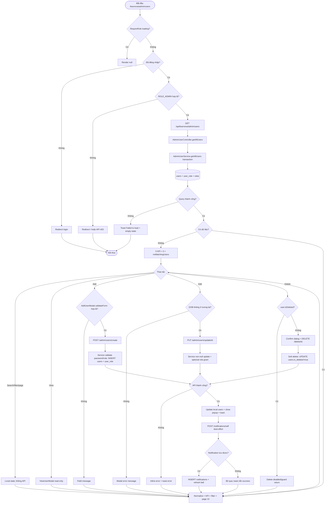

# Detailed Design As-Is — User Management

> Phạm vi: màn hình quản lý người dùng tại `/learnova/admin/users`, gồm danh sách, KPI, tìm kiếm/lọc/phân trang, popup thêm/xem/sửa/xóa và các control admin shell xuất hiện trong ảnh.  
> Quy ước: **Đã xác minh từ code** = có bằng chứng trực tiếp; **Suy luận từ ảnh và code** = đối chiếu UI ảnh với source; **Chưa xác minh** = thiếu dữ liệu runtime hoặc source tương ứng.

## 1. Thông tin màn hình

| Thuộc tính | Nội dung |
| --- | --- |
| Tên màn hình | Quản lý người dùng / User Management |
| Mã màn hình | Không tìm thấy mã chính thức trong ảnh hoặc source; tên kỹ thuật `UserManagement` |
| Route/URL | FE `/learnova/admin/users`; API gốc `/api/learnova/admin/users` |
| Actor | Quản trị viên có `ROLE_ADMIN` |
| Mục đích | Xem và quản trị tài khoản: thống kê, tìm/lọc, xem chi tiết, tạo, cập nhật, ẩn/xóa mềm |
| Nguồn phân tích | Ảnh màn hình + FE + BE |
| Loại tài liệu | Reverse-engineered DD – As-Is |
| Mức độ xác minh | Đã xác minh end-to-end route, CRUD, notification side effect và database; số liệu cụ thể trong ảnh chưa có runtime dump để xác nhận |
| File DD | `docs/DD_UserManagement.md` |

## 2. Tổng quan chức năng

- Admin mở mục **Người dùng** từ sidebar hoặc truy cập trực tiếp `/learnova/admin/users`; route được bọc `RequireRole role="ROLE_ADMIN"` (`AppRoutes.jsx:72-76`; `SidebarAdmin.jsx:32-35`).
- Màn hình tải toàn bộ tài khoản bằng `GET /admin/users`; không truyền filter/page/sort. FE tự normalize media, role, status, visibility, sau đó tự tính 5 KPI (`UserManagement.jsx:101-149,168-222`; `UserManagementStats.jsx:11-63`).
- Bảng hiển thị tối đa 10 dòng/trang với tên/email, vai trò, điện thoại, hiển thị, ngày tham gia và ba thao tác xem/sửa/xóa (`UsersList.jsx:16-18,61-67,84-264`).
- Tìm kiếm, lọc vai trò và phân trang chỉ thay state FE; không gọi backend (`UserManagement.jsx:154-157,206-222`; `UsersList.jsx:57-82`).
- Thêm gọi `POST /admin/users/create`; sửa gọi `PUT /admin/users/update/{id}`; xóa gọi `DELETE /admin/users/delete/{id}`. Xóa là soft delete: `users.is_deleted=true`, không DELETE row (`AdminUserApi.js:10-22`; `AdminUserService.java:224-230`).
- Xem chi tiết không gọi API riêng; popup nhận object đang có trong state (`UsersList.jsx:235-237`; `ViewUserModal.jsx:67-126`).
- Thành công hiển thị toast rồi cố ghi một notification cho chính admin qua `POST /notifications/self`; lỗi ghi notification bị bỏ qua (`UserManagement.jsx:160-166`; `NotificationApi.js:25-36`). Lỗi CRUD hiển thị toast và error text trong popup.
- Không có download/export, checkbox/radio hoặc bulk action. Không có popup thành công riêng. Redirect chỉ thuộc guard/login và các link admin shell.
- Điểm bắt đầu là route `AppRoutes.jsx:75`; điểm kết thúc của load là `setUsers` rồi render KPI/table. Điểm kết thúc CRUD là cập nhật mảng FE, đóng popup và toast/notification; database có INSERT/UPDATE và insert notification phụ.

## 3. Đối chiếu ảnh với code

| STT | Thành phần trên ảnh | Loại control | File FE | Component/Method | Event/API | Nguồn dữ liệu | Xác minh |
| --: | --- | --- | --- | --- | --- | --- | --- |
| 1 | Tiêu đề “Người dùng” | Heading shell | `Header.jsx:55-87` | pathname title | route change | i18n `admin.users` | Đã xác minh từ code |
| 2 | Sidebar và mục Người dùng active | Navigation | `SidebarAdmin.jsx:20-154` | `NavLink` | `/learnova/admin/users` | menu tĩnh + i18n | Đã xác minh |
| 3 | Tổng số người dùng 20 | KPI card | `UserManagementStats.jsx:11-30`; `TotalUsersCard.jsx:4-24` | `activeUsers.length` | load/create/edit/delete | `users` response trừ `isDeleted` | Code xác minh; số 20 suy luận runtime |
| 4 | Học viên 12 | KPI | `UserManagementStats.jsx:12-38`; `StudentsCard.jsx:4-24` | filter `roleFilter=student` | state change | normalized users chưa deleted | Code xác minh; số ảnh chưa xác minh |
| 5 | Giảng viên 7 | KPI | `UserManagementStats.jsx:12-46`; `TeachersCard.jsx:4-24` | filter teacher | state change | normalized users | Code xác minh |
| 6 | Quản trị viên 1 | KPI | `UserManagementStats.jsx:12-54`; `AdminsCard.jsx:4-24` | filter admin | state change | normalized users | Code xác minh |
| 7 | Đã khóa 6 | KPI | `UserManagementStats.jsx:17-61`; `LockedAccountsCard.jsx:4-24` | statusFilter locked | state change | deleted hoặc status inactive/locked | Code xác minh; số ảnh chưa xác minh |
| 8 | “Dữ liệu trực tiếp” | Text | `UserManagementStats.jsx:28-60,68-72` | translation | none | chuỗi tĩnh | Đã xác minh |
| 9 | Ô “Tìm kiếm...” | Search input | `UserManagementFilters.jsx:37-45` | `onSearchChange` | local filter | name/email/phone/role/status | Đã xác minh |
| 10 | Dropdown “Tất cả” | Custom select | `UserManagementFilters.jsx:10-15,46-52`; `AdminHoverSelect.jsx:15-83` | `onRoleChange` | local filter | all/student/teacher/admin tĩnh | Đã xác minh |
| 11 | “+ Thêm người dùng” | Button | `UserManagementFilters.jsx:54-60` | `onAddUser` | mở AddUserModal | none | Đã xác minh |
| 12 | Header bảng Người dùng/Vai trò/Số điện thoại/Hiển thị/Ngày tham gia/Thao tác | Table-like header | `UsersList.jsx:16,87-96` | `tableColumns.map` | none | i18n | Đã xác minh; code dùng `column.id` dù phần tử là string |
| 13 | Avatar trống, tên, email | Row fields | `UsersList.jsx:25-48,103-116` | `UserAvatar` | image onError | response + resolved media | Đã xác minh |
| 14 | Vai trò Học viên/Giảng viên/Admin | Badge | `UsersList.jsx:118-124` | roleFilter/tone | none | BE role normalized | Đã xác minh |
| 15 | Điện thoại | Text | `UsersList.jsx:126-130` | `user.phone` | none | `users.phone` | Đã xác minh |
| 16 | Đang hoạt động/Đã ẩn | Badge | `UsersList.jsx:20-23,132-138` | `getUserVisibility` | none | chỉ `isDeleted` | Đã xác minh |
| 17 | Ngày tham gia | Date | `UserManagement.jsx:13-24,130-131`; `UsersList.jsx:140-143` | `formatDate` | none | `users.created_at` | Đã xác minh |
| 18 | Icon mắt | Button | `UsersList.jsx:147-154` | `openActionPopup("View")` | không API | selected user state | Đã xác minh |
| 19 | Icon bút | Button | `UsersList.jsx:156-163` | `openActionPopup("Edit")` | PUT khi save | selected user | Đã xác minh |
| 20 | Icon thùng rác | Button | `UsersList.jsx:165-173` | `openActionPopup("Delete")` | DELETE khi confirm | selected user; disabled nếu deleted | Đã xác minh |
| 21 | Footer phân trang | Buttons/text | `UsersList.jsx:188-232` | `goToPage` | local slice | `users.length`, pageSize 10 | Đã xác minh; không thấy trong phần ảnh bị cắt |
| 22 | Popup Add User/Create New Account | Modal/form | `AddUserModal.jsx:154-307` | `handleSubmit` | POST create | local form | Đã xác minh |
| 23 | Full Name, Email, Password, Phone, DOB, Gender, Role | Inputs/selects | `AddUserModal.jsx:178-282` | `handleChange/handlePhoneChange` | validate trước POST | formData | Đã xác minh |
| 24 | Note ID tự sinh | Information | `AddUserModal.jsx:284-287` | none | none | DB identity | Đã xác minh |
| 25 | Cancel/Create User/X | Buttons | `AddUserModal.jsx:164-171,292-303` | close/submit | close hoặc POST | modal state | Đã xác minh |
| 26 | Popup hồ sơ xem user | Read-only modal | `ViewUserModal.jsx:67-199` | rows mapping | không API | selected user state | Đã xác minh |
| 27 | Email, ID, Role, Full Name, Phone, Avatar, Cover, Created/Updated, Visibility, Gender, Birthday | Detail fields | `ViewUserModal.jsx:79-126` | formatting/link | external link optional | response normalized | Đã xác minh |
| 28 | Close/X/overlay | Buttons | `ViewUserModal.jsx:128-143,193-197` | `onClose` | none | selectedAction state | Đã xác minh |
| 29 | Popup Edit User | Editable form | `EditUserModal.jsx:113-424` | `handleSubmit` | PUT update | selected user + local form | Đã xác minh |
| 30 | Email/ID/Created/Updated read-only | Inputs | `EditUserModal.jsx:149-174,238-247,281-290` | readOnly | none | selected user | Đã xác minh |
| 31 | Role/name/phone/media/visibility/gender/birthday editable | Inputs/selects | `EditUserModal.jsx:175-237,249-280,292-304` | `updateForm` | PUT on save | form state | Đã xác minh |
| 32 | Cancel/Save Changes/X | Buttons | `EditUserModal.jsx:346-363,416-422` | close/submit | PUT | form state | Đã xác minh |
| 33 | Popup Confirm deletion | Confirmation dialog | `DeleteUserModal.jsx:43-104` | `handleDelete` | DELETE | selected user | Đã xác minh |
| 34 | Delete User/Cancel/X | Buttons | `DeleteUserModal.jsx:52-58,85-102` | close/delete | DELETE | selected user | Đã xác minh |
| 35 | EN, chuông 34, settings, avatar/menu | Admin shell controls | `Header.jsx:89-168`; `NotificationBell.jsx:13-62` | language/list/settings/profile/logout | notification/auth APIs | auth/i18n/notifications | Code xác minh; badge 34 chỉ runtime ảnh |

Không có checkbox, radio, export/download hoặc bulk action trong ảnh/source màn hình. Từ khóa đã kiểm tra: `export`, `download`, `checkbox`, `bulk` trong thư mục `user_management`; không thấy luồng tương ứng.

## 4. Danh sách source liên quan

### Frontend — thứ tự chạy

| STT | Layer | Đường dẫn file | Class/Component | Method liên quan | Vai trò |
| --: | --- | --- | --- | --- | --- |
| 1 | Route | `front_end/src/app/routes/AppRoutes.jsx` | `App` | lines 72-76 | Guard/layout/route users |
| 2 | Guard | `front_end/src/app/routes/RequireRole.jsx` | `RequireRole` | lines 4-25 | Kiểm tra login và ROLE_ADMIN |
| 3 | Layout | `front_end/src/app/layouts/admin/DashboardLayout.jsx` | `Dashboard` | lines 6-18 | Sidebar + header + outlet |
| 4 | Shell | `front_end/src/shared/components/sidebar/sidebar_admin/SidebarAdmin.jsx` | `SidebarAdmin` | lines 20-154 | Menu và active route |
| 5 | Shell | `front_end/src/shared/components/header/admin_header/Header.jsx` | `Header` | lines 17-168 | Title/language/settings/account |
| 6 | Shell | `front_end/src/shared/components/header/admin_header/NotificationBell.jsx` | `NotificationBell` | lines 13-62 | Badge/list/read notification |
| 7 | Hook | `front_end/src/shared/hooks/useNotifications.js` | `useNotifications` | lines 13-78 | Poll/list/mark read |
| 8 | Auth | `front_end/src/app/providers/AuthContext.jsx` | `logout` | lines 67-79 | Logout/clear session |
| 9 | Auth API | `front_end/src/features/auth/infrastructure/api/AuthApi.js` | `logoutApi` | lines 19-21 | POST logout |
| 10 | HTTP | `front_end/src/shared/hooks/useAxiosPrivate.js` | `useAxiosPrivate` | lines 11-81 | 401 refresh/retry |
| 11 | HTTP | `front_end/src/shared/api-client/AxiosClient.js` | `axiosClient` | lines 3-11 | baseURL/cookies/JSON |
| 12 | API | `front_end/src/features/admin/infrastructure/api/AdminUserApi.js` | CRUD functions | lines 3-22 | GET/POST/PUT/DELETE user |
| 13 | API/side effect | `front_end/src/features/notification/infrastructure/api/NotificationApi.js` | `adminNotifySuccess` | lines 20-36 | Toast + self notification |
| 14 | Media API | `front_end/src/shared/api/public/CoursesApi.js` | `getFileUrl` | lines 15-16 | Resolve media key |
| 15 | Page | `front_end/src/features/admin/presentation/user_management/UserManagement.jsx` | `UserManagement` | lines 13-272 | Load/state/map/filter/CRUD state |
| 16 | KPI | `.../user_management/statistics/UserManagementStats.jsx` | `UserManagementStats` | lines 9-88 | Tính và render 5 KPI |
| 17-21 | KPI cards | `TotalUsersCard.jsx`, `StudentsCard.jsx`, `TeachersCard.jsx`, `AdminsCard.jsx`, `LockedAccountsCard.jsx` | card components | lines 4-24 mỗi file | Icon/value/trend |
| 22 | Filter | `.../user_management/filters/UserManagementFilters.jsx` | `UserManagementFilters` | lines 5-67 | Search/role/add |
| 23 | Shared UI | `.../admin/presentation/shared/AdminHoverSelect.jsx` | `AdminHoverSelect` | lines 15-88 | Custom select |
| 24 | List | `.../user_management/user_list/UsersList.jsx` | `UsersList`, `UserAvatar` | lines 16-268 | Rows, actions, pagination, popup routing |
| 25 | Modal | `.../filters/modal/AddUserModal.jsx` | `AddUserModal` | lines 15-310 | Create form/validation |
| 26 | Modal | `.../user_list/modal/ViewUserModal.jsx` | `ViewUserModal` | lines 19-203 | Read-only detail |
| 27 | Modal | `.../user_list/modal/EditUserModal.jsx` | `EditUserModal` | lines 19-429 | Edit form/update |
| 28 | Modal | `.../user_list/modal/DeleteUserModal.jsx` | `DeleteUserModal` | lines 6-109 | Confirm soft delete |
| 29-30 | i18n | `front_end/src/app/i18n/locales/vi.json`, `en.json` | `admin` namespace | line 23 | Main page labels |
| 31-40 | CSS | `DashboardLayout.css`, `SidebarAdmin.css`, `Header.css`, `UserManagement.css`, `UserManagementStats.css`, `UserManagementFilters.css`, `AdminHoverSelect.css`, `UsersList.css`, `AddUserModal.css`, `ViewUserModal.css` | CSS classes | toàn file | Layout, modal, disabled, responsive |

### Backend/Database — thứ tự chạy

| STT | Layer | Đường dẫn file | Class/Component | Method liên quan | Vai trò |
| --: | --- | --- | --- | --- | --- |
| 1 | Security | `back_end/src/main/java/com/example/back_end/shared/config/SecurityConfig.java` | `SecurityConfig` | lines 41-103 | `/admin/**` yêu cầu ADMIN |
| 2 | Controller | `.../admin/adapter/in/web/AdminUserController.java` | `AdminUserController` | lines 24-49 | Bốn endpoint CRUD |
| 3 | DTO | `.../admin/adapter/in/web/dto/AdminUserRequest.java` | record | lines 6-18 | Create/update body |
| 4 | Service | `.../admin/application/AdminUserService.java` | `AdminUserService` | lines 25-231 | Mapping và business logic |
| 5 | Repository | `.../admin/infrastructure/persistence/AdminUserRepository.java` | `AdminUserRepository` | lines 15-26 | findAll/findById/save |
| 6 | Repository | `.../auth/infrastructure/persistence/RoleRepository.java` | `RoleRepository` | lines 9-11 | Lookup role |
| 7 | Entity | `.../auth/domain/User.java` | `User` | lines 31-125 | `users`, `user_role` mapping |
| 8 | Entity | `.../auth/domain/Role.java` | `Role` | lines 12-28 | `roles` mapping |
| 9-10 | Enum | `RoleName.java`, `GenderType.java` | enums | toàn file | Giá trị role/gender |
| 11 | DTO | `.../admin/adapter/in/web/dto/AdminUserResponse.java` | record | lines 8-22 | CRUD response |
| 12 | Media | `.../media/infrastructure/storage/S3Service.java` | `S3Service` | `resolveAvatarUrl` lines 124-132 | Map avatar key sang URL |
| 13-14 | Media fallback | `CourseController.java`, `CourseService.java` | `getVideoUrl`, HLS lookup | controller 29-38; service 381-387 | Endpoint FE resolve key |
| 15 | Notification controller | `NotificationController.java` | `createSelf` | lines 19,45-62 | Nhận success note |
| 16 | Notification service | `NotificationService.java` | `createForEmail` | lines 43-59 | INSERT notification |
| 17 | Notification repo | `NotificationRepository.java` | JPA | lines 15-25 | save/list/count |
| 18 | Notification entity | `Notification.java` | entity | lines 18-62 | Map `notifications` |
| 19-20 | Notification DTO | `SelfNotificationRequest.java`, `NotificationResponse.java` | records | lines 6-10 / 5-13 | Validate/request/response |
| 21 | User lookup | `auth/infrastructure/persistence/UserRepository.java` | repository | line 13 | Resolve current admin |
| 22 | Exceptions | `GlobalExceptionHandler.java` | advice | lines 32-117 | 400/403/404/409/500 |
| 23 | Error DTO | `shared/adapter/in/web/dto/ErrorResponse.java` | record | line 3 | `{message}` |
| 24-28 | Shell logout | `AuthController.java`, `AuthService.java`, `VerificationTokenService.java`, `VerificationTokenRepository.java`, `VerificationToken.java` | logout chain | controller 66-74; service 89-100; token 53-68 | Clear cookie/token |
| 29 | Database | `back_end/src/main/resources/db/migration/V1__initial_schema.sql` | PostgreSQL DDL | users 1543-1558; constraints 2018-2142; FK 2916-3048 | Bảng/cột/constraint |

## 5. Thiết kế chi tiết UI

| STT | Label hiển thị | Tên trong code | Control | Kiểu dữ liệu | Bắt buộc | Mặc định | Nguồn dữ liệu | Điều kiện hiển thị | Event |
| --: | --- | --- | --- | --- | --- | --- | --- | --- | --- |
| 1 | 5 KPI | `statisticsCards` | Read-only cards | integer/string | — | `...` khi loading, `0` khi rỗng | toàn bộ `users` state | luôn hiện | state update |
| 2 | Tìm kiếm... | `searchTerm` | search input | string | Không | `""` | user nhập | luôn enabled | `setSearchTerm` |
| 3 | Tất cả/Học viên/Giảng viên/Quản trị viên | `roleFilter` | custom select | enum string | Không | `all` | options tĩnh | luôn enabled | `setRoleFilter` |
| 4 | + Thêm người dùng | `showAddUserModal` | button | boolean | — | false | local state | luôn enabled | mở modal |
| 5 | User table | `visibleUsers` | list/table-like | array | — | [] | filtered users | loading vẫn header/footer; empty message khi !loading và 0 | action buttons |
| 6 | Previous/page/Next | `currentPage` | buttons | integer | — | 1 | local pageSize 10 | footer luôn hiện | `goToPage` |
| 7 | View | `selectedAction="View"` | icon button | action | — | none | row | enabled cả deleted | mở view modal |
| 8 | Edit | `selectedAction="Edit"` | icon button | action | — | none | row | enabled cả deleted | mở edit modal |
| 9 | Delete | `selectedAction="Delete"` | icon button | action | — | none | row | disabled khi `user.isDeleted` | mở delete modal |
| 10 | Full Name * | `formData.fullName` | text | string | FE có | empty | user nhập | add modal | change/validate |
| 11 | Email * | `formData.email` | email | string | FE có | empty | user nhập | add modal | Gmail regex |
| 12 | Password * | `formData.password` | password | string | FE+BE | empty | user nhập | add modal | min 6 FE |
| 13 | Phone * | `formData.phone` | text | 10 digit string | FE có | empty | user nhập | add modal | bỏ non-digit, max 10 |
| 14 | Date of Birth * | `formData.dateOfBirth` | date | `YYYY-MM-DD` | FE có | empty | user nhập | add modal | max hôm nay |
| 15 | Gender * | `formData.gender` | select | Male/Female/Other | FE có | empty | options tĩnh | add modal | change |
| 16 | Role * | `formData.role` | select | ROLE_* | FE có | `ROLE_USER` | options tĩnh | add modal | change |
| 17 | ID auto note | — | info | text | — | tĩnh | DB identity | add modal | none |
| 18 | Create User | `isSubmitting` | submit | action | — | enabled | form | add modal | validate + POST; disabled during submit |
| 19 | View detail fields | `rows` | read-only values/links | mixed | — | N/A | selected user | view modal | link opens new tab |
| 20 | Edit Email/ID/Created/Updated | `form.email`, `user.id`, timestamps | readonly inputs | mixed | — | selected values | selected user | edit modal | none |
| 21 | Edit Role/Name/Phone/Avatar/Cover/Visibility/Gender/Birthday | `form.*` | input/select | mixed | Không | selected values | selected user | edit modal | `updateForm` |
| 22 | Save Changes | `isSaving` | submit | action | — | enabled | edit form | edit modal | DOB validate + PUT |
| 23 | Confirm deletion | `isDeleting` | confirm | action | — | enabled | selected user | delete modal | DELETE; disabled while request |
| 24 | Cancel/X/overlay | close handlers | buttons/backdrop | action | — | enabled | local state | từng modal | reset/close tùy modal |

Chi tiết trạng thái và format:

- Trang chính read-only ngoài search/filter. Không có sort column. Danh sách không có loading skeleton/text riêng; KPI dùng `...` (`UserManagementStats.jsx:20`; `UsersList.jsx:179-183`).
- Date table là `dd/mm/yyyy`; detail timestamps là `dd/mm/yyyy, hh:mm` theo `en-GB` (`UserManagement.jsx:13-24`; `ViewUserModal.jsx:19-40`). Invalid/null thành `N/A`.
- Add form không đặt `maxLength` cho name/email/password; phone bị cắt 10 ký tự trong handler. Entity giới hạn name 100, phone 20 (`AddUserModal.jsx:32-35,57-59`; `User.java:41-50`).
- Add modal click overlay/X/Cancel đều reset toàn bộ form/errors; Cancel bị disabled khi submit nhưng X và overlay không bị disabled (`AddUserModal.jsx:144-161,164-171,292-303`).
- Edit chỉ khóa email, ID và timestamps. Không có validation name/phone/media URL/role/gender ngoài option; chỉ chặn DOB tương lai (`EditUserModal.jsx:149-304,309-328`).
- View/edit cover/avatar lỗi thì ẩn hoặc dùng initials/empty; URL raw được phép mở tab mới trong view (`ViewUserModal.jsx:43-60,68-78,146-169`; `EditUserModal.jsx:130-143,365-390`).
- Main UI đã i18n; nội dung các modal chủ yếu hard-code tiếng Anh, khớp ảnh dù header đang tiếng Việt.

## 6. Điểm bắt đầu và điểm kết thúc

| Luồng | File/Method bắt đầu | Điều kiện bắt đầu | Các layer đi qua | File/Method kết thúc | Kết quả |
| --- | --- | --- | --- | --- | --- |
| Mở màn hình | `AppRoutes.jsx:75` | URL users | RequireRole → Layout → UserManagement | `UserManagement.jsx:243-269` | Render shell/page |
| Tải ban đầu | `UserManagement.fetchUsers:171-199` | mount | API → Controller → Service → Repo → DB → FE map | `setUsers/setIsLoading` | KPI + rows |
| Tìm kiếm | `UserManagementFilters:42-44` | nhập text | local state/useMemo | `filteredUsers` | Bảng lọc |
| Lọc vai trò | `AdminHoverSelect.handleSelect:47-50` | chọn option | local state/useMemo | `filteredUsers` | Bảng lọc |
| Phân trang | `UsersList.goToPage:79-82` | click page/nav | local slice | `visibleUsers` | Trang 10 dòng |
| Thêm | `AddUserModal.handleSubmit:105` | form hợp lệ | FE API → Controller → Service → repos → DB → FE | `handleCreateUser:236-240` | Insert user/role, append row, toast/notification |
| Xem | `UsersList:147-152` | click mắt | selected state → View modal | `ViewUserModal` | Detail read-only; close kết thúc |
| Sửa | `EditUserModal.handleSubmit:309` | DOB không tương lai | PUT → Controller → Service → repos → DB → FE | `onSaved/handleUserUpdated` | Update/role grant, local row, toast |
| Xóa | `DeleteUserModal.handleDelete:12` | user chưa deleted | DELETE → Controller → Service → repo → DB → FE | `onDeleted/handleUserUpdated` | `is_deleted=true`, row Hidden, toast |
| Thành công CRUD | `showNotification:160-166` | CRUD success | toast → POST self notification → notification DB | `adminNotifySuccess:25-36` | Toast ngay, bell sync best-effort |
| Điều hướng shell | Sidebar/Header links | click | React Router | route đích | Kết thúc users page |
| Logout | `Header.handleLogout:49-53` | click Logout | AuthContext → API → Auth service/token DB | login route | Clear auth/cookies |

Không tồn tại luồng export/download, bulk select, sort hoặc API detail riêng.

## 7. Luồng khởi tạo màn hình

1. Browser truy cập `/learnova/admin/users`; `AppRoutes.jsx:72-76` match route con `users`.
2. `RequireRole.jsx:4-25` đợi auth loading, redirect login nếu chưa đăng nhập, redirect `/` nếu không có `ROLE_ADMIN` hợp lệ.
3. `DashboardLayout.jsx:6-18` render sidebar, header và outlet `UserManagement`.
4. `UserManagement` tạo state: `users=[]`, `searchTerm=""`, `roleFilter="all"`, `isLoading=true`, `showAddUserModal=false` (`152-158`). Không có form/store global.
5. `useEffect` gọi `fetchUsers`, set loading rồi `getAdminUsersApi()` (`168-200`).
6. `AdminUserApi.js:5-8` gửi `GET /api/learnova/admin/users` qua Axios có cookie.
7. `SecurityConfig.java:78-80` chỉ cho `ROLE_ADMIN`; controller không có request/validation cho GET (`AdminUserController.java:29-31`).
8. `AdminUserService.getAllUsers` chạy trong transaction class-level, gọi `adminUserRepository.findAll()` (`25,33-61`).
9. JPA SELECT tất cả `users`; eager roles đọc join `user_role → roles` (`User.java:118-125`). Không WHERE, ORDER BY hoặc pagination.
10. Service chọn role ưu tiên ADMIN > TEACHER > USER, derive status từ `isActive`, resolve avatar URL, tạo `AdminUserResponse` (`AdminUserService.java:37-59,64-72`).
11. Controller trả HTTP 200 list JSON.
12. FE kiểm response là array, `Promise.all` normalize từng user/media (`UserManagement.jsx:175-179`). Media đã là URL thì giữ; key thì gọi `/courses/video-url`; lỗi dùng URL backend ghép (`60-99,138-149`).
13. FE map role, status, visibility, date và fallback name/email/phone (`101-135`).
14. `setUsers`; KPI tính trên toàn bộ users, search/role useMemo tạo `filteredUsers`, UsersList slice page 10 (`181-183,206-222`; `UserManagementStats.jsx:11-63`; `UsersList.jsx:61-67`).
15. Nếu GET lỗi, FE giữ mảng hiện tại (ban đầu rỗng), toast `response.data.message` hoặc `Failed to load users from server.`, rồi dừng loading (`184-195`). Empty message hiện sau đó.

## 8. Luồng từng thao tác

### 8.1 Tìm kiếm

| Bước | Layer | File | Method | Input | Xử lý | Output/Chuyển tiếp |
| ---: | --- | --- | --- | --- | --- | --- |
| 1 | UI | `UserManagementFilters.jsx:37-45` | input onChange | string | gọi callback mỗi ký tự | `setSearchTerm` |
| 2 | FE | `UserManagement.jsx:206-222` | `filteredUsers` useMemo | trimmed lowercase | ghép name/email/phone/role/status và `includes` | filtered array |
| 3 | UI | `UsersList.jsx:61-67` | pagination slice | filtered array | slice 10 | render/empty |

Không validation, debounce, API hoặc database. Không tìm theo ID, ngày, gender, visibility label riêng. Nếu filter làm giảm số trang, `visiblePage=Math.min(currentPage,totalPages)` nhưng `currentPage` không reset (`UsersList.jsx:57-67`).

### 8.2 Lọc vai trò

| Bước | Layer | File | Method | Input | Xử lý | Output/Chuyển tiếp |
| ---: | --- | --- | --- | --- | --- | --- |
| 1 | UI | `AdminHoverSelect.jsx:47-50` | `handleSelect` | all/student/teacher/admin | lưu value, đóng menu | callback |
| 2 | FE | `UserManagement.jsx:217-220` | role predicate | roleFilter | all hoặc equality roleFilter | filtered rows |

Không API/validation. Dropdown mở bằng hover/click, đóng mouseleave/click ngoài; không thấy Arrow/Escape handling (`AdminHoverSelect.jsx:36-45,53-83`).

### 8.3 Phân trang

| Bước | Layer | File | Method | Input | Xử lý | Output/Chuyển tiếp |
| ---: | --- | --- | --- | --- | --- | --- |
| 1 | UI | `UsersList.jsx:199-230` | nav/page click | page integer | disable first/last boundary | `goToPage` |
| 2 | FE | `UsersList.jsx:61-82` | slice | pageSize=10 | close popup và slice | visible rows/footer |

Không backend paging/sort. `totalPages` tối thiểu 1 kể cả 0 user.

### 8.4 Thêm người dùng

| Bước | Layer | File | Method | Input | Xử lý | Output/Chuyển tiếp |
| ---: | --- | --- | --- | --- | --- | --- |
| 1 | UI | `UserManagementFilters.jsx:54-60` | onAddUser | — | set modal true | AddUserModal |
| 2 | FE form | `AddUserModal.jsx:47-103` | change/validate | 7 fields | required, Gmail, password≥6, phone regex, DOB≤today | errors hoặc submit |
| 3 | FE | `AddUserModal.jsx:105-125` | `handleSubmit` | normalized payload | thêm active=true, deleted=false, media null | parent onSubmit |
| 4 | API | `AdminUserApi.js:10-13` | `createAdminUserApi` | JSON body | POST `/admin/users/create` | controller |
| 5 | Security | `SecurityConfig.java:78-80` | matcher | auth | require ADMIN | allow/401/403 |
| 6 | Controller | `AdminUserController.java:34-36` | `createUser` | `AdminUserRequest` | không `@Valid` | service |
| 7 | Service | `AdminUserService.java:74-107` | `createUser` | request | password required; role normalize/default; encode; defaults/time | repositories |
| 8 | Repository | `RoleRepository.java:11`; `AdminUserRepository` | find role/save | role/user | SELECT role; INSERT user + user_role | saved entity |
| 9 | Response | `AdminUserService.java:108-132` | map response | saved user | role/status/avatar URL | HTTP 200 DTO |
| 10 | FE | `UserManagement.jsx:236-240` | `handleCreateUser` | response | normalize, append, close | KPI/table update |
| 11 | Side effect | `AddUserModal.jsx:127-140`; `NotificationApi.js:25-36` | notify | success/error | toast; success POST self note | bell best-effort |

Thất bại: field error chặn trước API; BE password blank trả 400; duplicate email/constraint trả 409; role missing/generic lỗi 500. Popup giữ mở, hiện `submitError`; toast error dùng generic “Failed to create user”.

### 8.5 Xem chi tiết

| Bước | Layer | File | Method | Input | Xử lý | Output/Chuyển tiếp |
| ---: | --- | --- | --- | --- | --- | --- |
| 1 | UI | `UsersList.jsx:147-154` | open View | row user | set selected state | ViewUserModal |
| 2 | Modal | `ViewUserModal.jsx:67-126` | build rows | selected user | format dates/status/media links | read-only detail |
| 3 | UI | `ViewUserModal.jsx:128-143,193-197` | close | X/Close/overlay | clear selectedAction/user | table |

Không frontend validation, backend API hoặc DB access mới; dữ liệu là snapshot từ GET/list/local update.

### 8.6 Sửa người dùng

| Bước | Layer | File | Method | Input | Xử lý | Output/Chuyển tiếp |
| ---: | --- | --- | --- | --- | --- | --- |
| 1 | UI | `UsersList.jsx:156-163,239-250` | open Edit | row user | init form | EditUserModal |
| 2 | FE | `EditUserModal.jsx:113-147` | init/updateForm | selected user | map role/date/string flags | form state |
| 3 | Validation | `EditUserModal.jsx:309-314` | submit guard | DOB | chỉ chặn tương lai | error hoặc payload |
| 4 | FE/API | `EditUserModal.jsx:319-331`; `AdminUserApi.js:15-18` | `handleSubmit/updateAdminUserApi` | partial JSON | PUT `/update/{id}` | controller |
| 5 | Controller | `AdminUserController.java:39-43` | `updateUser` | id + request | không `@Valid` | service |
| 6 | Service | `AdminUserService.java:135-197` | `updateUser` | id/request | find any id; update non-null; encode optional password; grant role; timestamp | save user/user_role |
| 7 | DB | JPA | find/save | id/entity | SELECT, UPDATE users, optional INSERT user_role | saved entity |
| 8 | Response | `AdminUserService.java:199-221` | map | updated entity | first role/status/avatar | HTTP 200 DTO |
| 9 | FE | `EditUserModal.jsx:330-343` | onSaved | response bị bỏ qua | build local object, parent replace row, close | KPI/table update + toast |
| 10 | Notification | `NotificationApi.js:25-36` | adminNotifySuccess | message | INSERT self note best-effort | bell event |

Permission như create. 404 nếu id không tồn tại. FE không gửi email/password/isActive trong popup. Empty nullable edit field được gửi null; BE hiểu null là “không đổi”, trong khi `buildSavedUser` có thể hiển thị N/A/null cục bộ cho phone/media/DOB/gender đến lần reload.

### 8.7 Xóa người dùng

| Bước | Layer | File | Method | Input | Xử lý | Output/Chuyển tiếp |
| ---: | --- | --- | --- | --- | --- | --- |
| 1 | UI | `UsersList.jsx:165-173` | open Delete | user | disabled nếu deleted | confirm modal |
| 2 | UI | `DeleteUserModal.jsx:12-18,65-101` | confirm | id | guard deleted, disable during call | API |
| 3 | API | `AdminUserApi.js:20-22` | delete | path id | DELETE `/delete/{id}` | controller |
| 4 | Controller | `AdminUserController.java:46-49` | `deleteUser` | Long id | service, response string | service |
| 5 | Service | `AdminUserService.java:224-230` | `deleteUser` | id | find nondeleted; set deleted true + timestamp | repository save |
| 6 | DB | JPA | SELECT/UPDATE | id | `UPDATE users` | no row deletion |
| 7 | FE | `DeleteUserModal.jsx:18-40` | onDeleted | ignores response string | synthesize Hidden/Locked, replace row, close | KPI/table update + toast/note |

404 nếu id không tồn tại hoặc đã deleted. Không có check tự xóa, admin cuối cùng, ownership hoặc dependency trong method. DB child rows không cascade vì user row không bị DELETE.

### 8.8 Đóng popup

| Bước | Layer | File | Method | Input | Xử lý | Output/Chuyển tiếp |
| ---: | --- | --- | --- | --- | --- | --- |
| 1 | Add | `AddUserModal.jsx:144-149` | handleClose | overlay/X/Cancel | reset form/errors | modal closed |
| 2 | View/Edit/Delete | respective modal + `UsersList:74-77` | onClose | overlay/X/button | clear selected state | table |

Edit/Delete không reset vì component unmount. Không có unsaved-change warning. Overlay click đóng modal.

### 8.9 Admin shell

| Bước | Layer | File | Method | Input | Xử lý | Output/Chuyển tiếp |
| ---: | --- | --- | --- | --- | --- | --- |
| 1 | Language | `Header.jsx:95-98` | click | vi/en | i18n + localStorage | labels rerender |
| 2 | Bell | `NotificationBell.jsx:17-25`; `useNotifications.js:23-69` | hover/click/poll | notification id | list/count/read/navigate | badge/dropdown |
| 3 | Links | `Header.jsx:100-151`; `SidebarAdmin.jsx:141-149` | click | route | client navigation | page đích |
| 4 | Logout | `Header.jsx:49-53`; `AuthContext.jsx:67-79` | click | cookies | API then clear state | login route |

## 9. API specification

| API | HTTP method | Nơi gọi | Controller | Request | Response | Mục đích |
| --- | --- | --- | --- | --- | --- | --- |
| `/api/learnova/admin/users` | GET | `AdminUserApi.js:5-8` | `getAllUsers` | none | `List<AdminUserResponse>` | Load all users |
| `/api/learnova/admin/users/create` | POST | `AdminUserApi.js:10-13` | `createUser` | `AdminUserRequest` | `AdminUserResponse`, 200 | Create |
| `/api/learnova/admin/users/update/{id}` | PUT | `AdminUserApi.js:15-18` | `updateUser` | path id + request | `AdminUserResponse`, 200 | Partial-like update |
| `/api/learnova/admin/users/delete/{id}` | DELETE | `AdminUserApi.js:20-22` | `deleteUser` | path id | string, 200 | Soft delete |
| `/api/learnova/courses/video-url?fileKey={key}` | GET | `CoursesApi.js:15-16` | `CourseController.getVideoUrl` | query string | `{url}` | Resolve unresolved media key |
| `/api/learnova/notifications/self` | POST | `NotificationApi.js:20-32` | `NotificationController.createSelf` | title/content/link | `NotificationResponse`, 200 | Persist success note |
| `/api/learnova/notifications/unread-count` | GET | notification hook | `unreadCount` | authenticated principal | long | Header badge |
| `/api/learnova/notifications?page=0&size=20` | GET | notification hook | `listMine` | page/size | Page | Header list |
| `/api/learnova/notifications/{id}/read` | PATCH | notification hook | `markRead` | path id | 204 | Read state |
| `/api/learnova/auth/logout` | POST | `AuthApi.js:19-21` | `AuthController.logout` | optional refresh cookie | 204 | Shell logout |

API user dùng baseURL `VITE_API_URL`, `Content-Type: application/json`, `withCredentials=true`; response interceptor thử refresh/retry một lần khi 401 non-auth (`AxiosClient.js:3-11`; `useAxiosPrivate.js:22-64`).

`AdminUserRequest` fields: `fullName,email,phone,avatar,coverImage,dateOfBirth,gender,password,role,isActive,isDeleted` (`AdminUserRequest.java:6-18`). Không có annotation Bean Validation và controller không dùng `@Valid`.

- GET: không header riêng ngoài auth/cookie; không path/query/body; trả cả deleted/inactive, không page/sort.
- POST: FE gửi đủ create payload. BE chỉ business-check password nonblank, role lạ default USER. Success 200, không phải 201.
- PUT: path `Long id`; FE không gửi email/password/isActive. BE cập nhật field chỉ khi non-null; role được **thêm**, không thay thế set role.
- DELETE: path `Long id`; no body/DTO. Success body plain string; FE bỏ response và tự dựng state.
- Permission: tất cả `/admin/**` cần ADMIN (`SecurityConfig.java:78-80`). Unauthenticated trả 401 `{"error":"Unauthorized"}`; denied qua handler 403 message.
- Failure: password required 400; user missing 404; duplicate/constraint 409; unexpected/role missing 500 (`GlobalExceptionHandler.java:32-117`).
- Success CRUD: FE update local state rồi toast; self-notification thất bại không làm CRUD bị coi là lỗi.

## 10. Backend processing

| Layer | File | Class | Method | Input | Xử lý | Gọi tiếp | Output |
| --- | --- | --- | --- | --- | --- | --- | --- |
| Security | `SecurityConfig.java` | config | filter chain | request/JWT | stateless + ADMIN matcher | controller | allow/401/403 |
| Controller | `AdminUserController.java` | controller | get/create/update/delete | body/id | pass-through | service | 200 response |
| DTO | `AdminUserRequest.java` | record | deserialize | JSON | no annotations | service | typed fields |
| Service | `AdminUserService.java` | service | `getAllUsers` | none | role priority/status/media/map | AdminUserRepo | list DTO |
| Service | same | service | `createUser` | request | password/role/defaults/hash/time | RoleRepo/AdminUserRepo | DTO |
| Service | same | service | `updateUser` | id/request | non-null field update + role grant | repos | DTO |
| Service | same | service | `deleteUser` | id | soft delete/time | AdminUserRepo | void |
| Repository | `AdminUserRepository.java` | JPA | findAll/findById/findByIdAndIsDeletedFalse/save | entity/id | ORM | PostgreSQL | entity/list |
| Repository | `RoleRepository.java` | JPA | findByRoleName | enum | ORM SELECT | PostgreSQL | Role |
| Mapper | `AdminUserService.java` | inline | response constructors | User | resolve fields | S3Service | AdminUserResponse |
| Transaction | `AdminUserService.java:25` | class-level | `@Transactional` | every public method | read/write transaction | repos | commit/rollback |
| Notification | `NotificationController/Service` | createSelf/createForEmail | principal + DTO | validate DTO, current admin lookup, saveAndFlush | UserRepo/NotificationRepo | response |
| Exception | `GlobalExceptionHandler.java` | advice | handlers | exception | status + ErrorResponse | FE | JSON error |

Không có mapper class riêng. `getAllUsers` không đánh dấu read-only dù chỉ SELECT. `existsUsersByEmail` tồn tại ở repository (`AdminUserRepository.java:21`) nhưng không được createUser gọi.

## 11. Database và query

| Bảng | Cột sử dụng | Mục đích | Thao tác | File/Method truy cập |
| --- | --- | --- | --- | --- |
| `users` | `user_id,full_name,email,phone,avatar,cover_image,date_of_birth,gender,password_hash,is_active,is_deleted,created_at,updated_at,active_role` | list/create/update/delete | SELECT/INSERT/UPDATE | `AdminUserRepository`; `AdminUserService` |
| `roles` | `role_id,role_name` | lookup/display/assign | SELECT | `RoleRepository.findByRoleName`; eager roles |
| `user_role` | `user_id,role_id` | many-to-many assignment | SELECT/INSERT | `User.roles` owning mapping |
| `notifications` | `notification_id,user_id,title,content,type,link,metadata,is_read,created_at` | success side effect | INSERT; header SELECT/UPDATE | `NotificationRepository` |
| `verification_tokens` | token/user/type/expiry | shell logout | SELECT/DELETE | verification token repository |

Query/ORM As-Is:

- Load: `JpaRepository.findAll()` trên `users`; eager `roles` qua join table. Không `WHERE`, `ORDER BY`, `GROUP BY`, paging hoặc duplicate elimination do code application (`AdminUserService.java:33-61`; `User.java:118-125`). Thứ tự bảng chưa được bảo đảm.
- Create: lookup `roles.role_name`; `save(user)` INSERT `users`, sau đó association INSERT `user_role`. `user_id` là identity. Password được encode. `created_at=updated_at=Instant.now` (`AdminUserService.java:74-108`).
- Update: `findById`; non-null fields UPDATE `users`; chọn role mới chỉ thêm association nếu chưa có. Không DELETE role cũ. `active_role` chỉ set khi thêm role mới và user trước đó chưa là admin (`135-197`).
- Delete: `findByIdAndIsDeletedFalse`; UPDATE `is_deleted=true,updated_at=now`; không DELETE và không thay `is_active` (`224-230`).
- Notification success: lookup current admin `users.email AND is_deleted=false`; INSERT `notifications` với type GENERIC, metadata source admin-ui, unread false (`NotificationService.java:43-59`).
- Null: create truyền thẳng hầu hết null; DB chỉ bắt email/is_deleted/created. Update null có nghĩa không thay đổi. FE N/A chỉ là presentation.
- Duplicate: `users.email` unique; `user_role(user_id,role_id)` composite PK; `roles.role_name` unique (`V1:2018-2142`). Duplicate email rơi vào 409 generic.
- FK: user_role FK tới users/roles ON DELETE CASCADE; notifications FK user ON DELETE CASCADE (`V1:2916-3048`). Soft delete không kích hoạt cascade.
- Transaction: tất cả AdminUserService method trong transaction class-level; lỗi save/constraint rollback. Self notification là request/transaction riêng sau CRUD nên không atomic với CRUD.

DDL: `users` lines 1543-1558; identity ngay sau; `user_role` 1533-1536; `roles` 1390-1393; notifications 1040-1050; PK/unique 2018-2142; FK 2916-3048.

## 12. Mapping dữ liệu FE–BE–DB

| Dữ liệu | UI field | FE variable | Request field | Backend DTO | Service/Repository | Table.Column | Response field | UI hiển thị |
| --- | --- | --- | --- | --- | --- | --- | --- | --- |
| ID | detail | `user.id` | path id | Long/id | identity/findById | `users.user_id` | id | detail/action key |
| Tên | row/form | fullName/name | fullName | String | direct set/map | `users.full_name` | fullName | name/fallback email prefix |
| Email | row/add/read-only edit | email | email create | String | direct create; ignored update | `users.email` | email | row/detail |
| Password | add only | password | password | String | PasswordEncoder | `users.password_hash` | không trả | masked input |
| Phone | row/form | phone | phone | String | direct | `users.phone` | phone | phone/N/A |
| Avatar | row/detail/edit | avatar/avatarUrl | avatar | String | S3 resolve | `users.avatar` | avatar | image/link/fallback |
| Cover | detail/edit | coverImage/coverImageUrl | coverImage | String | direct | `users.cover_image` | coverImage | cover/link |
| DOB | form/detail | dateOfBirthRaw | dateOfBirth | LocalDate | direct | `users.date_of_birth` | dateOfBirth | en-GB date |
| Gender | form/detail | gender | gender | GenderType | enum | `users.gender` | gender | Male/Female/Other/N/A |
| Role | badge/select | roleFilter/role | role | String→RoleName | RoleRepo + role set | `roles.role_name`,`user_role` | role | localized badge |
| Active | locked KPI/status search | statusFilter | isActive create | Boolean | direct/default true | `users.is_active` | status text | không có cột; ảnh hưởng locked KPI |
| Deleted/visibility | table/edit/delete/KPI | isDeleted | isDeleted | Boolean | direct/soft delete | `users.is_deleted` | isDeleted | Active/Hidden; delete disabled |
| Created | joined/detail | joinedAtRaw | — | Instant | set create/DB | `users.created_at` | createdAt | date/time |
| Updated | detail | updatedAtRaw | — | Instant | service now | `users.updated_at` | updatedAt | date/time |
| Success note | toast/bell | message/title/link | title/content/link | SelfNotificationRequest | createForEmail | `notifications.*` | NotificationResponse | toast + badge event |

## 13. Business rule rút ra từ code

| ID | Business rule hiện tại | Điều kiện | File/Method | Khi đúng | Khi sai | Mức xác minh |
| --- | --- | --- | --- | --- | --- | --- |
| BR-01 | Chỉ admin truy cập API/page | ROLE_ADMIN hợp lệ | `RequireRole:13-22`; `SecurityConfig:78-80` | render/allow | redirect hoặc 401/403 | Đã xác minh |
| BR-02 | GET trả mọi user kể cả deleted | gọi list | `AdminUserService.getAllUsers:33-61` | findAll | exception | Đã xác minh |
| BR-03 | Role hiển thị list ưu tiên Admin > Teacher > User | user multi-role | `rolePriority:64-72` | role cao nhất | USER mặc định | Đã xác minh |
| BR-04 | KPI total/role loại deleted nhưng không loại inactive | `!isDeleted` | `UserManagementStats:11-16` | đếm | loại deleted | Đã xác minh |
| BR-05 | Locked KPI gồm deleted hoặc BE status inactive/locked | normalize status | `UserManagement:33-49`; Stats 17-19 | locked | active/pending | Đã xác minh |
| BR-06 | Visibility table chỉ dựa isDeleted | row render | `UsersList:20-23` | Hidden | Active | Đã xác minh |
| BR-07 | Search client-side trên 5 field | keyword | `UserManagement:206-220` | include row | loại row | Đã xác minh |
| BR-08 | Page size cố định 10 | list | `UsersList:18,61-67` | slice | — | Đã xác minh |
| BR-09 | Create bắt buộc password ở BE | null/blank | `AdminUserService:74-77` | 400 | encode | Đã xác minh |
| BR-10 | Role create/update lạ mặc định ROLE_USER | normalized switch default | service 79-87,167-173 | USER | mapped role | Đã xác minh |
| BR-11 | Create mặc định active=true/deleted=false nếu null | request flags null | service 101-102 | defaults | dùng request | Đã xác minh |
| BR-12 | Update null nghĩa không thay DB | field null | service 139-165 | giữ cũ | set mới | Đã xác minh |
| BR-13 | Update role chỉ grant, không replace/revoke | role chưa có | service 178-192 | INSERT association | giữ role set | Đã xác minh |
| BR-14 | Deleted user có thể được restore qua Edit Visibility Active | PUT isDeleted=false | service 163-165 | update false | giữ state | Đã xác minh |
| BR-15 | Delete là soft delete và không thể gọi lại qua service method | nondeleted id | service 224-230 | mark true | 404 | Đã xác minh |
| BR-16 | Success notification là best-effort, không quyết định CRUD | notification request lỗi | `adminNotifySuccess:25-36` | ghi bell | toast vẫn success | Đã xác minh |
| BR-17 | View dùng snapshot FE, không fetch mới | click View | `UsersList:235-237` | render selected user | — | Đã xác minh |

## 14. Validation, permission và message

| Loại | Điều kiện | FE/BE | File/Method | Mã/Nội dung message | Hành vi |
| --- | --- | --- | --- | --- | --- |
| Permission | chưa login | FE | `RequireRole:9-10` | none | redirect login |
| Permission | không ADMIN | FE | `RequireRole:13-22` | none | redirect `/` |
| Permission | API unauthenticated | BE | `SecurityConfig:83-88` | 401 `Unauthorized` | JSON |
| Permission | API forbidden | BE | global handler 74-78 | “You don't have permission...” | 403 |
| Required | add full name | FE | `AddUserModal:65-67` | Full name is required. | field error |
| Email | empty/non-Gmail | FE | lines 69-73 | required/valid Gmail | field error |
| Password | empty/<6 | FE | lines 75-79 | required/at least 6 | field error |
| Password | null/blank | BE | `AdminUserService:74-77` | Password is required | 400 |
| Phone | empty/not 0+10 digits | FE | Add lines 81-85 | exact message | field error |
| DOB | empty/future | FE add | lines 87-91 | required/not future | field error |
| DOB | future | FE edit | `EditUserModal:309-314` | Date of birth cannot be in the future. | modal error |
| Gender/Role | empty | FE add | lines 93-99 | required | field error |
| DTO validation | CRUD body | BE | `AdminUserRequest`; controller | không có annotation/`@Valid` | không Bean Validation |
| Not found | update id | BE | service 135-137 | User not found | 404 |
| Not found/deleted | delete id | BE | service 224-226 | User not found | 404 |
| Duplicate/constraint | email etc. | DB/BE | unique + handler 81-93 | A record with this data already exists. | 409 |
| Role missing | role seed absent | BE | service 89-90/175-176 | Role not found | RuntimeException→500 generic |
| Load error | GET fails | FE | `UserManagement:184-190` | response message hoặc Failed to load... | toast error + empty state |
| Create success | POST success | FE | Add 127-130 | User created successfully | toast + notification |
| Create error | POST fail | FE | Add 132-139 | response/body/generic + Failed to create user | inline + toast |
| Update success/error | PUT result | FE | Edit 330-343 | User updated successfully / Failed to update user | toast; inline error on fail |
| Delete success/error | DELETE result | FE | Delete 18-39 | User deleted successfully / Failed to delete user | toast; inline error on fail |
| Empty table | !loading && 0 users | FE | `UsersList:179-183` | noMatchingUsers | empty block |
| Generic | unhandled | BE | global handler 108-117 | An unexpected error occurred... | 500 JSON |

Không có confirmation cho edit/create; delete có confirmation. Không có validation tuổi tối thiểu, trùng phone, format media URL, full-name max length phía FE, hoặc self-delete/last-admin rule phía service.

## 15. Mermaid sequence toàn bộ màn hình

```mermaid
sequenceDiagram
    actor Admin
    participant Route as "AppRoutes/RequireRole"
    participant UI as "UserManagement.jsx + UsersList/modals"
    participant API as "AdminUserApi.js"
    participant Sec as "SecurityConfig"
    participant Ctrl as "AdminUserController"
    participant Svc as "AdminUserService"
    participant URepo as "AdminUserRepository"
    participant RRepo as "RoleRepository"
    participant DB as "users/roles/user_role"
    participant NAPI as "NotificationApi.adminNotifySuccess"
    participant NSvc as "NotificationController/Service"
    participant NDB as "notifications"

    Admin->>Route: GET /learnova/admin/users
    Route->>Route: RequireRole(ROLE_ADMIN)
    Route->>UI: Mount UserManagement
    UI->>API: getAdminUsersApi()
    API->>Sec: GET /api/learnova/admin/users
    Sec->>Ctrl: ADMIN allowed
    Ctrl->>Svc: getAllUsers()
    Svc->>URepo: findAll()
    URepo->>DB: SELECT users + eager user_role/roles
    DB-->>URepo: User[]
    URepo-->>Svc: entities
    Svc-->>Ctrl: List AdminUserResponse
    Ctrl-->>API: HTTP 200 JSON
    API-->>UI: normalize users/media/role/status/date
    UI-->>Admin: KPI + filtered/paged table

    alt Search/filter/page
        Admin->>UI: input/select/page click
        UI->>UI: useMemo filter + slice pageSize 10
        UI-->>Admin: rerender rows
    else View
        Admin->>UI: Eye button
        UI->>UI: selectedAction=View
        UI-->>Admin: ViewUserModal snapshot
    else Create
        Admin->>UI: Add + valid form + Create User
        UI->>API: POST /admin/users/create (AdminUserRequest)
        API->>Ctrl: createUser(request)
        Ctrl->>Svc: createUser(request)
        Svc->>RRepo: findByRoleName
        RRepo->>DB: SELECT roles
        Svc->>URepo: save(new User)
        URepo->>DB: INSERT users; INSERT user_role
        DB-->>UI: AdminUserResponse qua BE/API
        UI->>UI: append normalized user; close
        UI->>NAPI: adminNotifySuccess
        NAPI->>NSvc: POST /notifications/self
        NSvc->>NDB: INSERT notification
        UI-->>Admin: toast + updated table/KPI
    else Update
        Admin->>UI: Edit + Save Changes
        UI->>API: PUT /admin/users/update/{id}
        API->>Ctrl: updateUser(id, request)
        Ctrl->>Svc: updateUser
        Svc->>URepo: findById + save
        opt role chưa có
            Svc->>RRepo: findByRoleName
            URepo->>DB: INSERT user_role
        end
        URepo->>DB: UPDATE users
        DB-->>UI: AdminUserResponse bị FE bỏ qua
        UI->>UI: buildSavedUser + replace row
        UI-->>Admin: close + toast + self notification
    else Delete
        Admin->>UI: Trash + Confirm Delete User
        UI->>API: DELETE /admin/users/delete/{id}
        API->>Ctrl: deleteUser(id)
        Ctrl->>Svc: deleteUser(id)
        Svc->>URepo: findByIdAndIsDeletedFalse + save
        URepo->>DB: UPDATE users SET is_deleted=true
        DB-->>UI: 200 string qua BE/API
        UI->>UI: synthesize Hidden/Locked + replace row
        UI-->>Admin: close + toast + self notification
    end
```

## 16. Mermaid flowchart



## 17. Phân tích từng source trong cùng file DD

### File: `front_end/src/app/routes/AppRoutes.jsx`

- Route layer; import `UserManagement` line 10, mount tại admin child `users` line 75 trong parent guarded lines 72-94. Input URL; output component; không API/validation riêng.

### File: `front_end/src/app/routes/RequireRole.jsx`

- FE authorization; `RequireRole` lines 4-25 đọc auth/loading/roles/activeRole, redirect login hoặc `/`. Được AppRoutes gọi trước layout; output children/redirect, không message.

### File: `front_end/src/app/layouts/admin/DashboardLayout.jsx`

- Layout lines 6-18 ghép SidebarAdmin, Header, Outlet. Không state/API/exception; ảnh hưởng shell bao quanh page.

### File: `front_end/src/shared/components/sidebar/sidebar_admin/SidebarAdmin.jsx`

- Navigation shell; users item lines 32-35, render NavLink/active class lines 120-154. Input pathname/i18n; output sidebar; không backend.

### File: `front_end/src/shared/components/header/admin_header/Header.jsx`

- Header shell; pathname users đặt title lines 55-63; language/settings/account/logout lines 89-168. Input AuthContext/path; output controls; logout gọi auth API, avatar fail dùng fallback.

### File: `front_end/src/shared/components/header/admin_header/NotificationBell.jsx`

- Header notification lines 13-62; hover load list, click unread mark read rồi navigate optional. Lỗi do hook bỏ qua; badge lấy API, số ảnh chưa xác minh.

### File: `front_end/src/shared/hooks/useNotifications.js`

- Hook state/orchestration lines 13-78; poll count 45 giây, load page 0 size 20, local decrement sau read. Input authenticated state; output notifications/count/actions; API error bị swallow.

### File: `front_end/src/app/providers/AuthContext.jsx`

- Auth provider; `logout` lines 67-79 gọi API và luôn clear token/current user trong finally. Được Header/interceptor gọi; output unauthenticated state.

### File: `front_end/src/features/auth/infrastructure/api/AuthApi.js`

- `logoutApi` lines 19-21 POST `/auth/logout`, không body; output 204/error.

### File: `front_end/src/shared/hooks/useAxiosPrivate.js`

- HTTP response interceptor lines 11-81; retry một lần sau refresh cho 401 non-auth, refresh fail logout. Mọi AdminUser API dùng singleton nên hưởng interceptor khi hook page mount.

### File: `front_end/src/shared/api-client/AxiosClient.js`

- Axios singleton lines 3-11; baseURL env, cookies, JSON header. Input request config; output promise response/error.

### File: `front_end/src/features/admin/infrastructure/api/AdminUserApi.js`

- API adapter lines 3-22; GET list, POST create, PUT update, DELETE soft delete endpoint. Không client-side DTO type; trả `response.data`, exception propagate modal/page.

### File: `front_end/src/features/notification/infrastructure/api/NotificationApi.js`

- `adminNotifySuccess` lines 25-36 toast ngay, POST self notification với current pathname, dispatch event; catch bỏ qua. CRUD gọi qua `showNotification`.

### File: `front_end/src/shared/api/public/CoursesApi.js`

- `getFileUrl` lines 15-16 gọi public `/courses/video-url?fileKey`; UserManagement dùng khi media value không phải URL. Output `.url`; lỗi được resolveMediaUrl fallback.

### File: `front_end/src/features/admin/presentation/user_management/UserManagement.jsx`

- Page trung tâm: formatting/normalize/media lines 13-149; state/notify/load/filter/CRUD callbacks lines 152-241; composition lines 243-269. Input API responses/user actions; output normalized state/UI. Load error toast; create exception propagate Add modal.

### File: `front_end/src/features/admin/presentation/user_management/statistics/UserManagementStats.jsx`

- KPI computation lines 11-63 và render lines 66-85. Active means not deleted, không đồng nghĩa `isActive`; locked lấy normalized status. Input all users + loading; output 5 card props.

### File: `front_end/src/features/admin/presentation/user_management/statistics/cards/total_user/TotalUsersCard.jsx`

- Presentation card lines 4-24; nhận title/value/trend/tone, render icon Users. Không event/API/validation.

### File: `front_end/src/features/admin/presentation/user_management/statistics/cards/students/StudentsCard.jsx`

- Presentation card lines 4-24; render student KPI từ parent. Không logic ngoài props.

### File: `front_end/src/features/admin/presentation/user_management/statistics/cards/teacher/TeachersCard.jsx`

- Presentation card lines 4-24; render instructor KPI. Không exception/event.

### File: `front_end/src/features/admin/presentation/user_management/statistics/cards/admin/AdminsCard.jsx`

- Presentation card lines 4-24; render admin KPI. Không backend.

### File: `front_end/src/features/admin/presentation/user_management/statistics/cards/looked_account/LockedAccountsCard.jsx`

- Presentation card lines 4-24; render locked KPI. Thư mục code viết `looked_account`, nhưng component/label dùng Locked; không ảnh hưởng runtime import.

### File: `front_end/src/features/admin/presentation/user_management/filters/UserManagementFilters.jsx`

- Filter UI lines 5-67; options tĩnh, input không controlled, callback search/role/add. Không validation/API; labels i18n.

### File: `front_end/src/features/admin/presentation/shared/AdminHoverSelect.jsx`

- Shared custom select lines 15-88; internal default all, open hover/click, close outside/leave, `handleSelect` callback. Không keyboard navigation riêng.

### File: `front_end/src/features/admin/presentation/user_management/user_list/UsersList.jsx`

- List controller lines 16-268; pageSize 10, selected popup state, row render, action enablement, pagination, modal callbacks. `tableColumns` là string nhưng render dùng `column.id` lines 87-94, tạo key/class undefined; React warning/layout risk.

### File: `front_end/src/features/admin/presentation/user_management/filters/modal/AddUserModal.jsx`

- Create form lines 15-310. `validateForm` lines 61-103; payload lines 113-125; submit/notify/error lines 105-141; close reset lines 144-149. Input user data; output parent create call; no BE call trực tiếp.

### File: `front_end/src/features/admin/presentation/user_management/user_list/modal/ViewUserModal.jsx`

- Read-only modal lines 19-203; formats 12 detail rows and media links, no API. Input selected normalized user; output presentation; invalid/null→N/A, image error fallback.

### File: `front_end/src/features/admin/presentation/user_management/user_list/modal/EditUserModal.jsx`

- Update form lines 19-429; initial/preview lines 113-143, field rows 149-307, submit lines 309-344. Calls PUT, nhưng bỏ response và dùng `buildSavedUser` lines 78-111; error inline + toast.

### File: `front_end/src/features/admin/presentation/user_management/user_list/modal/DeleteUserModal.jsx`

- Soft-delete confirmation lines 6-109; guard already deleted, call DELETE, synthesize local deleted object lines 12-40. Error inline/toast; no extra permission check.

### File: `front_end/src/app/i18n/locales/vi.json`

- `admin` namespace line 23 chứa title, KPI, filter, table, pagination/empty labels tiếng Việt. Modal labels không dùng namespace này.

### File: `front_end/src/app/i18n/locales/en.json`

- `admin` namespace line 23 chứa bản tiếng Anh tương ứng; Header language toggle thay locale.

### File: `front_end/src/app/layouts/admin/DashboardLayout.css`

- Presentation layout; grid sidebar/content và nền admin. Được DashboardLayout import; không state/API/validation.

### File: `front_end/src/shared/components/sidebar/sidebar_admin/SidebarAdmin.css`

- Style navigation/active/responsive trong ảnh; không business logic.

### File: `front_end/src/shared/components/header/admin_header/Header.css`

- Style topbar/language/bell/settings/account dropdown; class state do JSX cấp, không API.

### File: `front_end/src/features/admin/presentation/user_management/UserManagement.css`

- Page spacing/container/responsive; breakpoints lines 47-78. Input class DOM; output layout, không event.

### File: `front_end/src/features/admin/presentation/user_management/statistics/UserManagementStats.css`

- 5-column KPI grid, xuống 2/1 cột lines 1-133, breakpoints 115-133. Không logic dữ liệu.

### File: `front_end/src/features/admin/presentation/user_management/filters/UserManagementFilters.css`

- Style search/select/add button và responsive lines 1-184. Không control validation.

### File: `front_end/src/features/admin/presentation/shared/AdminHoverSelect.css`

- Dropdown style/menu z-index, open/item/selected/responsive lines 1-113. Không event logic.

### File: `front_end/src/features/admin/presentation/user_management/user_list/UsersList.css`

- Table-like grid, action disabled, footer, legacy/responsive blocks lines 1-611. Ảnh hưởng columns/rows/pagination; không API.

### File: `front_end/src/features/admin/presentation/user_management/filters/modal/AddUserModal.css`

- Fixed overlay/modal, two-column form, errors/actions/disabled/responsive lines 1-207. Không validation logic.

### File: `front_end/src/features/admin/presentation/user_management/user_list/modal/ViewUserModal.css`

- Shared style cho View/Edit/Delete overlays, profile grid, inputs, delete dialog, disabled/responsive lines 1-766. Không xử lý dữ liệu.

### File: `back_end/src/main/java/com/example/back_end/shared/config/SecurityConfig.java`

- Security filter chain lines 41-103; stateless/JWT, admin matcher hasRole ADMIN, 401 JSON entry point. Gọi trước controllers; output allow/deny.

### File: `back_end/src/main/java/com/example/back_end/admin/adapter/in/web/AdminUserController.java`

- REST controller base path line 24; GET lines 29-31, POST 34-36, PUT 39-43, DELETE 46-49. Pass-through service, no `@Valid`, success đều 200.

### File: `back_end/src/main/java/com/example/back_end/admin/adapter/in/web/dto/AdminUserRequest.java`

- Request record lines 6-18; 12 nullable fields, no Bean Validation. Jackson parse LocalDate/Gender enum có thể fail trước controller nếu format/value sai.

### File: `back_end/src/main/java/com/example/back_end/admin/application/AdminUserService.java`

- Transactional business service lines 25-231. GET map/role priority 33-72; create 74-133; update 135-222; delete 224-230. Calls role/user repos, encoder, S3; throws business/resource/runtime; response inline.

### File: `back_end/src/main/java/com/example/back_end/admin/infrastructure/persistence/AdminUserRepository.java`

- JPA User repository lines 15-109. User screen uses inherited `findAll/findById/save` plus `findByIdAndIsDeletedFalse` line 19; other dashboard queries không thuộc flow này. `existsUsersByEmail` line 21 không được dùng khi create.

### File: `back_end/src/main/java/com/example/back_end/auth/infrastructure/persistence/RoleRepository.java`

- JPA Role repository lines 9-11; find enum role cho create/update. Missing role optional empty→RuntimeException service.

### File: `back_end/src/main/java/com/example/back_end/auth/domain/User.java`

- ORM `users` lines 31-86, roles mapping 118-125. Validation annotations chỉ fullName max100, email nonnull, phone max20, isDeleted/created nonnull; persistence output entity.

### File: `back_end/src/main/java/com/example/back_end/auth/domain/Role.java`

- ORM `roles` lines 12-28; roleName enum and inverse many-to-many. Read by RoleRepo/eager user.

### File: `back_end/src/main/java/com/example/back_end/auth/domain/enums/RoleName.java`

- Enum lines 3-4: ROLE_ADMIN, ROLE_TEACHER, ROLE_USER. Service maps unknown request to USER.

### File: `back_end/src/main/java/com/example/back_end/user/domain/enums/GenderType.java`

- Enum lines 3-4: Male, Female, Other; khớp add/edit options. JSON khác casing có thể deserialize fail.

### File: `back_end/src/main/java/com/example/back_end/admin/adapter/in/web/dto/AdminUserResponse.java`

- Response record lines 8-22; user fields không gồm password/activeRole/roles set, status là String derive từ isActive.

### File: `back_end/src/main/java/com/example/back_end/media/infrastructure/storage/S3Service.java`

- `resolveAvatarUrl` lines 124-132 giữ HTTP URL, key→public S3 URL. Được GET/create/update response mapper gọi; coverImage không được resolve tương tự.

### File: `back_end/src/main/java/com/example/back_end/course/adapter/in/web/CourseController.java`

- `getVideoUrl` lines 29-38 nhận fileKey, ưu tiên HLS ready rồi ký URL. User FE tái sử dụng endpoint video cho unresolved avatar/cover key; route permitAll.

### File: `back_end/src/main/java/com/example/back_end/course/application/CourseService.java`

- `getHlsMasterPlaylistPathIfReady` lines 381-387 tìm lesson video key/HLS READY. Media user không phải lesson thường rơi sang signer ở controller.

### File: `back_end/src/main/java/com/example/back_end/notification/adapter/in/web/NotificationController.java`

- Base `/notifications` line 19; `createSelf` lines 45-62 yêu cầu `@PreAuthorize ADMIN`, authenticated principal, `@Valid SelfNotificationRequest`, gọi service. Header list/count/read cùng controller.

### File: `back_end/src/main/java/com/example/back_end/notification/application/NotificationService.java`

- Transactional service; `createForEmail` lines 43-59 tìm active principal user, tạo GENERIC notification unread và saveAndFlush. Output NotificationResponse; not found/DB exception handled global.

### File: `back_end/src/main/java/com/example/back_end/notification/infrastructure/persistence/NotificationRepository.java`

- JPA repository lines 15-25; inherited saveAndFlush cho success note, derived list/count cho header. DB errors propagate.

### File: `back_end/src/main/java/com/example/back_end/notification/domain/Notification.java`

- ORM `notifications` lines 18-62; user/title/content/type nonnull, optional link/metadata, unread default, created timestamp. Success action INSERTs row.

### File: `back_end/src/main/java/com/example/back_end/notification/adapter/in/web/dto/SelfNotificationRequest.java`

- Validated record lines 6-10: title notblank max200, content notblank max2000, link max500. User management values ngắn và current pathname.

### File: `back_end/src/main/java/com/example/back_end/notification/adapter/in/web/dto/NotificationResponse.java`

- Response record lines 5-13; returned to ignored best-effort FE call and used by bell list.

### File: `back_end/src/main/java/com/example/back_end/auth/infrastructure/persistence/UserRepository.java`

- `findByEmailAndIsDeletedFalse` line 13 dùng resolve current admin cho notification. Missing user→404; SELECT users.

### File: `back_end/src/main/java/com/example/back_end/shared/exception/GlobalExceptionHandler.java`

- Advice lines 32-117 maps resource 404, business/validation 400, permission 403, integrity 409 và generic 500 thành JSON. CRUD FE ưu tiên `response.data.message`.

### File: `back_end/src/main/java/com/example/back_end/shared/adapter/in/web/dto/ErrorResponse.java`

- Record line 3 chuẩn hóa `{message}`; no logic.

### File: `back_end/src/main/java/com/example/back_end/auth/adapter/in/web/AuthController.java`

- Shell logout lines 66-74 lấy optional refresh cookie, gọi service, clear cookies, trả 204. Không thuộc CRUD nhưng là button visible trong ảnh.

### File: `back_end/src/main/java/com/example/back_end/auth/application/AuthService.java`

- `logout` lines 89-100 verify/delete refresh token và nuốt exception để luôn thành công. Transactional.

### File: `back_end/src/main/java/com/example/back_end/auth/application/VerificationTokenService.java`

- Refresh-token verify/delete lines 53-68; lookup unused/unexpired, delete by user/type. Lỗi bị AuthService logout catch.

### File: `back_end/src/main/java/com/example/back_end/auth/infrastructure/persistence/VerificationTokenRepository.java`

- Derived token find/delete lines 16-18; SELECT/DELETE `verification_tokens`.

### File: `back_end/src/main/java/com/example/back_end/auth/domain/VerificationToken.java`

- ORM `verification_tokens` lines 18-56. Logout read/delete; constraint/FK trong migration.

### File: `back_end/src/main/resources/db/migration/V1__initial_schema.sql`

- DDL truth: notifications 1040-1050; roles 1390-1393; user_role/users 1533-1558; unique/PK 2018-2142; notification/user_role FK 2916-3048. Xác nhận identity/default/null/relationship; không sửa migration.

## 18. Rủi ro kỹ thuật

| Mức độ | File/Method | Vấn đề | Bằng chứng | Ảnh hưởng | Cách kiểm tra |
| --- | --- | --- | --- | --- | --- |
| Cao | `EditUserModal:330-333` | FE bỏ `AdminUserResponse`, tự build state | `await update...` không gán result | UI có thể khác DB/BE đến reload | Edit multi-role/clear field rồi reload |
| Cao | `AdminUserService:178-203` | Edit role chỉ thêm, response lấy first role; GET lại lấy role priority | không replace set; mapping khác nhau | Role hiển thị trước/sau reload khác | Admin chọn Student cho Admin/Teacher |
| Cao | `EditUserModal:319-328` + service 139-165 | Empty field gửi null nghĩa DB không đổi, nhưng local builder có thể hiển thị N/A/null | BE skips null; builder lines 79-109 | Temporary UI/DB mismatch | Clear phone/avatar/DOB/gender, save, reload |
| Cao | `AdminUserService:74-108` | Create không check duplicate dù repo có exists method; DTO không validation | `existsUsersByEmail` unused | DB 409 generic, input xấu lọt tới DB | Create duplicate/non-Gmail via API |
| Cao | `AdminUserService:101-106` | Create không set `activeRole` | user roles set nhưng activeRole omitted | User mới có thể có role nhưng active-role behavior khác | Create teacher/admin, login/check current user |
| Trung bình | `UserManagementStats:11-19`; `UsersList:20-23` | “Locked” gồm inactive/deleted nhưng table visibility chỉ deleted | hai predicate khác nhau | KPI locked có thể không khớp badge | Seed inactive nondeleted user |
| Trung bình | `AdminUserService:33-34` | Load toàn bộ không pagination/order/filter | findAll | Tải chậm/memory lớn; thứ tự không ổn định | Seed dữ liệu lớn, compare reload order |
| Trung bình | `AdminUserRepository:17` | Tên derived query `findByEmailAndIsDeletedFalse` nhưng signature nhận thêm `Boolean isDeleted` | toán tử `False` thường không cần tham số thứ hai; method không được màn hình gọi | Có nguy cơ repository query parsing/startup tùy Spring Data version; chưa xác minh runtime current commit | Chạy context-load test và gọi repository method |
| Trung bình | `UsersList:87-94` | `tableColumns` là string nhưng dùng `column.id` | key/class đều undefined | React duplicate-key warning, CSS column modifier sai | Console + inspect header classes |
| Trung bình | `UsersList:57-67`; filters | Filter không reset currentPage | internal page giữ cũ, visiblePage chỉ clamp | Clear filter có thể quay về page cũ | Đi page N, filter ít rows, clear |
| Trung bình | `AddUserModal:155-171,292-303` | Overlay/X vẫn đóng khi submit; chỉ Cancel/Submit disabled | no `isSubmitting` guard | Unmount trong request; success/error feedback khó thấy | Submit chậm rồi click overlay/X |
| Trung bình | `AdminUserService:224-230` | Không rule ngăn tự xóa/admin cuối cùng | chỉ find nondeleted | Có thể ẩn admin đang thao tác | Delete own/only admin in test DB |
| Trung bình | `AdminUserService:135-197` | Deleted user update được và visibility có thể restore | findById, isDeleted nullable | Edit hoạt động như restore nhưng không label riêng | Edit hidden user→Active |
| Thấp | `UserManagement:89-98`; Courses video URL | User media key dùng endpoint video/HLS | `getFileUrl` course endpoint | Coupling sai ngữ cảnh/public signing | Test arbitrary avatar key |
| Thấp | modal strings | Main page i18n nhưng modal hard-code English | modal JSX literals | Giao diện song ngữ như ảnh | Toggle VI rồi mở mọi modal |
| Thấp | success notification | CRUD và notification là hai request riêng | catch notification ignored | DB user đổi nhưng bell note có thể thiếu | Force notifications/self fail |
| Thấp | `UserManagement:33-49` | status pending supported nhưng BE chỉ trả Active/Inactive | response mapping lines 43/116/205 | Pending branch không chạy với API hiện tại | Search API/code producers |

## 19. Test case rút ra từ code

| ID | Chức năng | Tiền điều kiện | Thao tác | Input | Kết quả mong đợi theo code | File/Method |
| --- | --- | --- | --- | --- | --- | --- |
| TC-01 | Guard loading | auth loading | mở URL | — | render null | RequireRole |
| TC-02 | Chưa login | unauthenticated | mở URL | — | redirect login | RequireRole 9-10 |
| TC-03 | Sai role | non-admin | mở URL/API | — | FE redirect `/`, BE 403 | guard/security |
| TC-04 | Load success | admin | mở page | — | GET all, KPI/table | fetchUsers/getAllUsers |
| TC-05 | Load empty | DB no users | mở | — | KPI 0, empty message, one disabled page | Stats/UsersList |
| TC-06 | Load exception | API 500 | mở | — | toast error, empty rows | UserManagement catch |
| TC-07 | Deleted row | one deleted | load | — | excluded total/role KPI, included locked, row Hidden/delete disabled | normalize/stats/list |
| TC-08 | Inactive nondeleted | status Inactive | load | — | included total, locked KPI, table visibility Active | current predicates |
| TC-09 | Search | loaded list | type keyword | name/email/phone/role/status | local matching rows | useMemo |
| TC-10 | Search no match | loaded | input random | xyz | empty message | UsersList |
| TC-11 | Role filter | mixed roles | select Instructor | teacher | only teacher normalized rows | role predicate |
| TC-12 | Pagination boundary | >10 rows | prev/next/page | page | 10-row slice; first/last disabled | UsersList |
| TC-13 | Add happy | valid admin | submit | valid Gmail/10 digits/DOB/gender/role/password | INSERT user + user_role; append; close; toast/note | Add/create service |
| TC-14 | Add default role | open add | inspect/submit | no role change | ROLE_USER | Add initialForm |
| TC-15 | Add required | open add | submit blank | blank | field errors, no API | validateForm |
| TC-16 | Add invalid email | open | submit | non-Gmail | Gmail error | Add lines 69-73 |
| TC-17 | Add password boundary | open | submit | length 5/6 | 5 blocked; 6 allowed FE | Add 75-79 |
| TC-18 | Add phone boundary | open | type | non-digits/9/10/11 digits | non-digit removed, max10; exact regex | Add 57-59,81-85 |
| TC-19 | Add future DOB | open | submit | tomorrow | blocked | Add 87-91 |
| TC-20 | Duplicate email | existing email | valid submit | duplicate | DB rollback, 409 generic; popup error/toast | unique/global handler |
| TC-21 | Role missing | role seed missing | create | valid role | 500 generic | service 89-90 |
| TC-22 | View | any row | eye | — | no API; all detail; close | View modal |
| TC-23 | View null/media fail | nullable user | view | null/bad URL | N/A/empty avatar/cover hidden | View modal |
| TC-24 | Edit happy | user exists | change fields/save | valid DOB | DB update, local replace, toast/note | Edit/update service |
| TC-25 | Edit future DOB | open edit | save | future | inline error, no API | Edit 309-314 |
| TC-26 | Edit read-only | edit open | try email/id | — | inputs readOnly | Edit rows |
| TC-27 | Edit role multi-role | Admin user | choose Student | ROLE_USER | role granted/kept; local Student; reload highest Admin | service + local builder |
| TC-28 | Edit clear nullable | existing phone/media/DOB | clear/save | null payload | DB retains old; local may show N/A | edit/service mismatch |
| TC-29 | Restore hidden | deleted user | edit visibility Active | isDeleted=false | DB restored; delete enabled | update service |
| TC-30 | Update missing | stale id | save | unknown id | 404, modal error/toast | service 135-137 |
| TC-31 | Delete cancel | active row | trash→Cancel/X/overlay | — | no API/state change | Delete modal |
| TC-32 | Delete happy | nondeleted | confirm | id | soft update, Hidden, KPI recalc, toast/note | delete flow |
| TC-33 | Delete twice | deleted/stale | call | id | UI disabled; direct API 404 | guard/service |
| TC-34 | Self-delete | current admin row | delete | own id | code attempts success; no explicit prevention | delete service |
| TC-35 | DB error | save failure | CRUD | valid | rollback, error response/toast | transaction/handler |
| TC-36 | Notification fail | CRUD success | force self API fail | — | success toast/state remain, no bell note | adminNotifySuccess catch |
| TC-37 | Toggle language | page open | click EN/VI | — | main labels switch; modal literals remain English | Header/i18n/modal |
| TC-38 | Header bell | authenticated | hover/click unread | id | load/count/read/navigate | notification hook |
| TC-39 | No export | page open | inspect controls | — | no export/download action | user_management source |

## 20. Kết luận End-to-End

- Chức năng bắt đầu tại `AppRoutes.jsx:75`, qua `RequireRole.jsx:4-25`, `DashboardLayout.jsx:6-18`, rồi mount `UserManagement.jsx:152-269`.
- Load đi theo `UserManagement.fetchUsers` → `AdminUserApi.getAdminUsersApi` → `AdminUserController.getAllUsers` → `AdminUserService.getAllUsers` → `AdminUserRepository.findAll` → `users/user_role/roles`; response `AdminUserResponse[]` quay về FE để normalize và render KPI/table.
- Business logic backend nằm ở `AdminUserService.java:33-231`: chọn role ưu tiên cho list, create/hash/default, update non-null và grant role, soft delete. FE business/presentation logic nằm ở `UserManagement.jsx`, `UserManagementStats.jsx`, `UsersList.jsx` và ba form modal.
- Create INSERT `users` và `user_role`; update UPDATE `users` và có thể INSERT `user_role`; delete chỉ UPDATE `users.is_deleted=true`. View/search/filter/page không truy cập DB mới.
- CRUD success kết thúc sau local state update, popup đóng và toast; sau đó FE cố POST `/notifications/self` để INSERT một note vào `notifications`, nhưng failure side effect bị bỏ qua.
- Đã xác minh: toàn bộ route, permission FE/BE, state/form, validation hiện có, bốn user API, media mapping, DTO, transaction, repository/entity/DDL, notification side effect, popup/message và error mapping.
- Chưa xác minh: dữ liệu runtime tạo đúng các con số/tài khoản trong ảnh; không có DB dump/network response. Không tìm thấy mã màn hình chính thức. Chưa chạy UI nên rendering thực tế của header column `column.id` và các giá trị media chỉ được kết luận từ source.
- Từ khóa đã tìm khi xác minh phần thiếu: `admin/users`, `Create New Account`, `Confirm deletion`, `Save Changes`, `export`, `download`, `checkbox`, `bulk`; thư mục đã kiểm tra: `front_end/src/app`, `front_end/src/features/admin/presentation/user_management`, `front_end/src/features/admin/infrastructure`, `back_end/src/main/java/.../admin`, auth/notification/media/shared và migration. Điểm cuối truy vết là PostgreSQL tables nêu tại mục 11 và state/toast trên FE.
