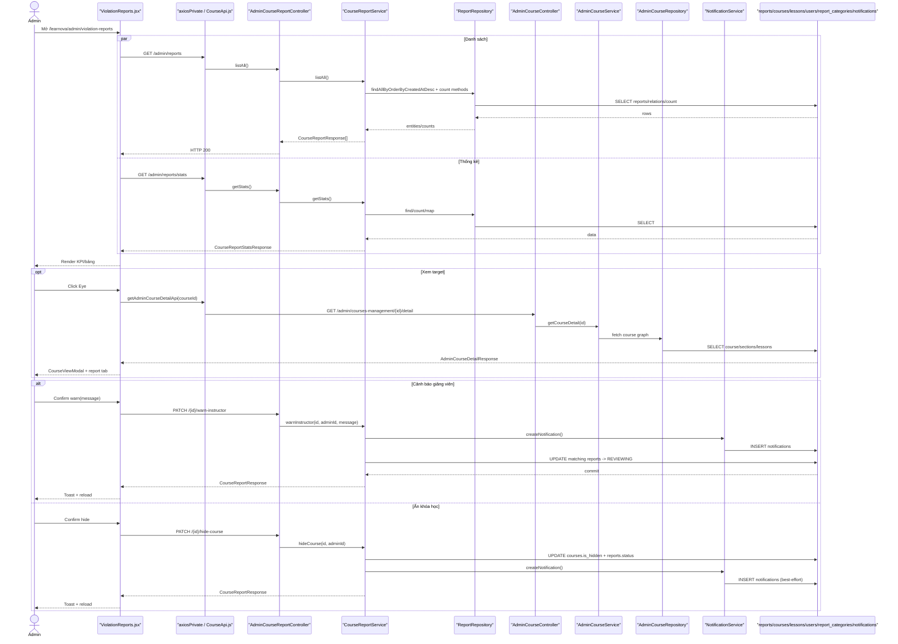
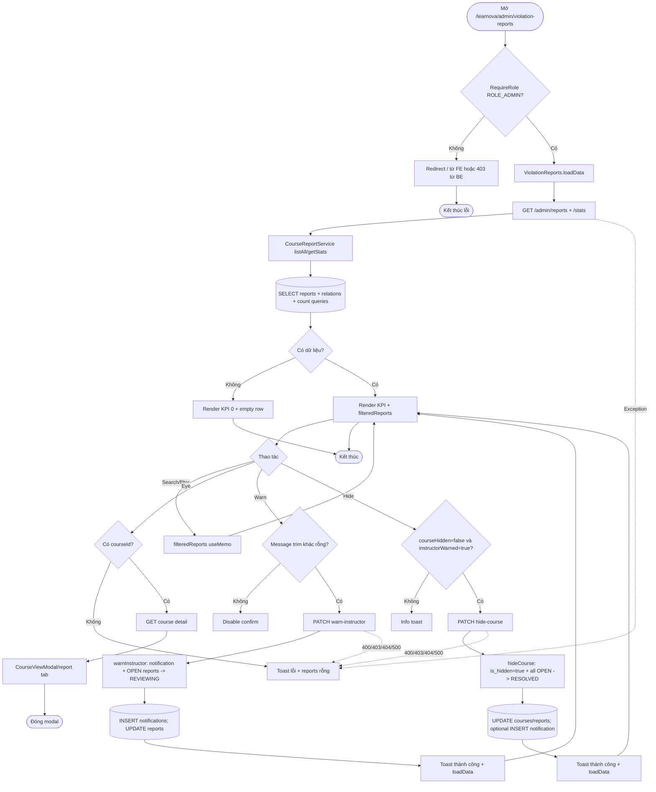

# Detailed Design As-Is — Violation Report Management

> Phạm vi: màn hình quản trị **Báo cáo vi phạm** tại `/learnova/admin/violation-reports`, gồm thống kê, danh sách, tìm/lọc, xem khóa học/bài học được báo cáo, cảnh báo giảng viên và ẩn khóa học.  
> Quy ước: **Đã xác minh từ code** = có bằng chứng trực tiếp; **Suy luận từ ảnh và code** = ảnh khớp nhánh render nhưng chưa chạy lại runtime; **Chưa xác minh** = chưa có đủ bằng chứng trong hai nguồn được phép.

## 1. Thông tin màn hình

| Thuộc tính | Nội dung |
| --- | --- |
| Tên màn hình | Quản lý báo cáo vi phạm / Violation Report Management |
| Mã màn hình | Không tìm thấy mã chính thức; component `ViolationReports` |
| Route/URL | `/learnova/admin/violation-reports` |
| Actor | Quản trị viên có `ROLE_ADMIN` |
| Mục đích | Theo dõi báo cáo khóa học/bài học, xem nội dung liên quan, cảnh báo giảng viên và ẩn khóa học khỏi catalog công khai |
| Nguồn phân tích | Ảnh màn hình + FE + BE |
| Loại tài liệu | Reverse-engineered DD – As-Is |
| Mức độ xác minh | Đã xác minh E2E cho tải danh sách/thống kê, xem chi tiết khóa học, cảnh báo giảng viên và ẩn khóa học; dữ liệu cụ thể trong ảnh chưa đối chiếu runtime DB |
| File DD | `docs/DD_ViolationReportManagement.md` |

## 2. Tổng quan chức năng

- Route được khai báo bên trong `RequireRole role="ROLE_ADMIN"` tại `front_end/src/app/routes/AppRoutes.jsx:73,89`; BE bảo vệ toàn bộ `/api/learnova/admin/**` bằng `hasRole("ADMIN")` tại `back_end/src/main/java/com/example/back_end/shared/config/SecurityConfig.java:79`.
- Khi mount, `ViolationReports.loadData()` gọi song song `GET /admin/reports` và `GET /admin/reports/stats`, map response vào `reports` và `stats`, rồi render bốn KPI và bảng (`ViolationReports.jsx:117-143,401-540`).
- Search, lọc status, lọc/count-sort đều chạy trong bộ nhớ FE; BE trả toàn bộ báo cáo theo `createdAt DESC`, không phân trang (`ViolationReports.jsx:195-235`; `ReportRepository.java:12`).
- Nút mắt tải `GET /admin/courses-management/{courseId}/detail` rồi mở `CourseViewModal`, tự chọn report tab và bài học mục tiêu; modal có thể xin signed URL để preview video khi bài học có `videoKey` (`ViolationReports.jsx:151-187,544-559`; `CourseTable.jsx:117-160`).
- Nút loa mở dialog cảnh báo. Xác nhận gọi `PATCH /admin/reports/{id}/warn-instructor`; service gửi notification, chuyển các báo cáo mở cùng course/reason/lesson phù hợp sang `REVIEWING` và trả DTO (`ViolationReports.jsx:254-301`; `CourseReportService.java:255-302`).
- Nút khóa chỉ được FE cho dùng sau khi `instructorWarned=true` và course chưa ẩn. Xác nhận gọi `PATCH /admin/reports/{id}/hide-course`; service đặt `courses.is_hidden=true`, resolve mọi báo cáo mở của course và cố gửi notification (`ViolationReports.jsx:257-285,514-533`; `CourseReportService.java:226-253`).
- Màn hình đọc `reports`, `report_categories`, `users`, `courses`, `lessons`; thao tác cảnh báo cập nhật `reports` và có thể insert `notifications`; thao tác ẩn cập nhật `courses`, `reports` và có thể insert `notifications`. Các mutation nằm trong transaction của `CourseReportService` (`CourseReportService.java:36-39`).
- Thành công/thất bại hiển thị toast. Không có export/download, thêm/sửa báo cáo, phân trang, checkbox/radio hay redirect sau mutation. Đóng modal hoặc render state mới là điểm kết thúc.

## 3. Đối chiếu ảnh với code

| STT | Thành phần trên ảnh | Loại control | File FE | Component/Method | Event/API | Nguồn dữ liệu | Xác minh |
| --: | --- | --- | --- | --- | --- | --- | --- |
| 1 | URL `/learnova/admin/violation-reports` | Route | `AppRoutes.jsx:73,89` | `<ViolationReports/>` | navigation | router | Đã xác minh từ code |
| 2 | `admin.violation_reports` | Header title | `Header.jsx:79-80` | `t("admin.violation_reports")` | route render | i18n | Đã xác minh; ảnh hiện raw key |
| 3 | Sidebar “Báo cáo vi phạm” active | NavLink | `SidebarAdmin.jsx` | admin menu | navigate | `admin.violationReports` | Đã xác minh từ code |
| 4 | KPI “Báo cáo đang mở” = 5 | Card | `ViolationReports.jsx:237-252,405-419` | `stats.openReports` | GET stats | PENDING/REVIEWING | Code xác minh; số 5 là dữ liệu ảnh |
| 5 | KPI “Khóa học bị báo cáo” = 3 | Card | cùng vùng | `stats.reportedCourses` | GET stats | distinct open course | Code xác minh; số 3 là dữ liệu ảnh |
| 6 | KPI “Ẩn do kiểm duyệt” = 1 | Card | cùng vùng | `stats.hiddenByModeration` | GET stats | distinct hidden course | Code xác minh; số 1 là dữ liệu ảnh |
| 7 | KPI “Đã xử lý” = 0 | Card | cùng vùng | `stats.resolvedCases` | GET stats | RESOLVED/DISMISSED | Code xác minh; số 0 là dữ liệu ảnh |
| 8 | “Tìm mã báo cáo hoặc tên khóa học...” | Text input | `ViolationReports.jsx:421-428` | `search/setSearch` | `onChange` | người dùng | Đã xác minh |
| 9 | “All statuses” | Hover select | `ViolationReports.jsx:195-198,429-435` | `selectedStatus` | local filter | status hiện có | Đã xác minh |
| 10 | “Report count” | Hover select | `ViolationReports.jsx:200-205,436-442` | `selectedCount` | local filter/sort | count duy nhất > 0 | Đã xác minh |
| 11 | REPORT CODE | Table column | `ViolationReports.jsx:447-451,468-472` | `reportCode/reportKey/id` | none | response | Đã xác minh |
| 12 | TARGET | Table column | `ViolationReports.jsx:473-482` | course/lesson/category/reason | none | response + FE label map | Đã xác minh |
| 13 | COUNT | Badge | `ViolationReports.jsx:483-485` | `reportCount` | none | count tất cả reports/course | Đã xác minh |
| 14 | STATUS | Badge | `ViolationReports.jsx:486-493` | `formatStatus(status)` | none | response status | Đã xác minh |
| 15 | Nút mắt | Icon button | `ViolationReports.jsx:494-503` | `openReportView` | GET course detail | `courseId` | Đã xác minh |
| 16 | Nút loa | Icon button | `ViolationReports.jsx:504-513` | `openWarnModal` | local → PATCH warn | row | Đã xác minh |
| 17 | Nút khóa | Icon button | `ViolationReports.jsx:514-533` | `openHideModal` | local → PATCH hide | `courseHidden/instructorWarned` | Đã xác minh |
| 18 | Rows RPT-1..RPT-5 | Table rows | `ViolationReports.jsx:465-538` | `filteredReports.map` | none | GET list | Code xác minh; nội dung cụ thể từ ảnh |
| 19 | Empty/loading rows | Table state | `ViolationReports.jsx:455-463` | conditional render | none | request state | Đã xác minh từ code; không xuất hiện ảnh |
| 20 | Modal xem course/report | Dialog | `ViolationReports.jsx:312-399,544-559`; `CourseTable.jsx:99-` | `CourseViewModal` | GET detail/video URL | course detail + selected report | Đã xác minh từ code |
| 21 | Dialog cảnh báo/ẩn | Dialog | `ModerationActionModal.jsx:13-105` | warn/hide branch | PATCH | row + message | Đã xác minh từ code |
| 22 | Toast success/error/info | Message | `ViolationReports.jsx:126-138,154-170,257-301` | `toast.*` | API/guard result | FE strings/API error | Đã xác minh |
| 23 | EN, chuông, settings, admin | Admin shell | `Header.jsx` | shell controls | auth/notification | runtime | Code xác minh; badge 34 chưa xác minh |

Không tìm thấy pagination, download/export, checkbox/radio hoặc thao tác tạo/sửa/xóa report trên màn hình. Từ khóa đã tìm: `pagination`, `download`, `export`, `checkbox`, `delete-lesson`, `dismiss`, `resolve`; thư mục đã kiểm tra: `front_end/src/features/admin/presentation/violation_reports`, `front_end/src/features/admin/infrastructure/api`, `back_end/src/main/java/com/example/back_end/{admin,assessment,course,notification}`.

## 4. Danh sách source liên quan

### Frontend — thứ tự chạy

| STT | Layer | Đường dẫn file | Class/Component | Method liên quan | Vai trò |
| --: | --- | --- | --- | --- | --- |
| 1 | Route | `front_end/src/app/routes/AppRoutes.jsx` | AppRoutes | admin route, line 89 | Guard và mount page |
| 2 | Guard | `front_end/src/app/routes/RequireRole.jsx` | RequireRole | component | Kiểm tra đăng nhập/role |
| 3 | Layout | `front_end/src/app/layouts/admin/DashboardLayout.jsx` | DashboardLayout | render Outlet | Shell admin |
| 4 | Navigation | `front_end/src/shared/components/sidebar/sidebar_admin/SidebarAdmin.jsx` | SidebarAdmin | menu render | Link/active state |
| 5 | Header | `front_end/src/shared/components/header/admin_header/Header.jsx` | Header | pathname mapping 79-80 | Tiêu đề màn hình |
| 6 | i18n | `front_end/src/app/i18n/locales/vi.json:23` | locale | `admin.violationReports` | Label tiếng Việt |
| 7 | HTTP | `front_end/src/shared/api-client/AxiosClient.js` | axiosClient | base/interceptors | Client HTTP |
| 8 | HTTP auth | `front_end/src/shared/hooks/useAxiosPrivate.js` | useAxiosPrivate | interceptors | Cookie/refresh request riêng tư |
| 9 | Page | `front_end/src/features/admin/presentation/violation_reports/ViolationReports.jsx` | ViolationReports | `loadData`, filters, handlers | Toàn bộ state/orchestration UI |
| 10 | Select | `front_end/src/features/admin/presentation/shared/AdminHoverSelect.jsx` | AdminHoverSelect | render/select | Bộ lọc status/count |
| 11 | Action modal | `front_end/src/features/admin/presentation/violation_reports/modal/ModerationActionModal.jsx` | ModerationActionModal | confirm/cancel | Cảnh báo/ẩn |
| 12 | API | `front_end/src/features/admin/infrastructure/api/CourseApi.js:8-12` | `getAdminCourseDetailApi` | GET detail | Xem target |
| 13 | Detail modal | `front_end/src/features/admin/presentation/course/courses_table/CourseTable.jsx:99-` | CourseViewModal | report tab/video preview | Render course/lesson/report |
| 14 | Report origin | `front_end/src/features/student/presentation/course-details/components/ReportModal.jsx` | ReportModal | submit/validation | Nguồn tạo dữ liệu upstream, không phải action admin |

### Backend/Database — thứ tự chạy

| STT | Layer | Đường dẫn file | Class/Component | Method liên quan | Vai trò |
| --: | --- | --- | --- | --- | --- |
| 1 | Security | `back_end/src/main/java/com/example/back_end/shared/config/SecurityConfig.java:79` | SecurityConfig | filter chain | Yêu cầu ADMIN |
| 2 | Controller | `back_end/src/main/java/com/example/back_end/admin/adapter/in/web/AdminCourseReportController.java:20-87` | AdminCourseReportController | list/stats/warn/hide | Report APIs |
| 3 | DTO | `back_end/src/main/java/com/example/back_end/assessment/adapter/in/web/dto/CourseReportResponse.java:5-31` | CourseReportResponse | record | Response list/action |
| 4 | DTO | `back_end/src/main/java/com/example/back_end/assessment/adapter/in/web/dto/CourseReportStatsResponse.java:3-8` | CourseReportStatsResponse | record | KPI response |
| 5 | DTO | `back_end/src/main/java/com/example/back_end/notification/adapter/in/web/dto/WarnInstructorRequest.java:3-5` | WarnInstructorRequest | record | Warn request |
| 6 | Service | `back_end/src/main/java/com/example/back_end/assessment/application/CourseReportService.java:36-527` | CourseReportService | listAll/getStats/warn/hide/toResponse | Business logic/transaction |
| 7 | Repository | `back_end/src/main/java/com/example/back_end/assessment/infrastructure/persistence/ReportRepository.java:10-28` | ReportRepository | find/count | ORM reports |
| 8 | Repository | `back_end/src/main/java/com/example/back_end/assessment/infrastructure/persistence/ReportCategoryRepository.java:8-9` | ReportCategoryRepository | `findByCode` | ORM category |
| 9 | Entity | `back_end/src/main/java/com/example/back_end/assessment/domain/Report.java:26-88` | Report | mappings | `reports` |
| 10 | Entity | `back_end/src/main/java/com/example/back_end/assessment/domain/ReportCategory.java:15-30` | ReportCategory | mappings | `report_categories` |
| 11 | Entity | `back_end/src/main/java/com/example/back_end/course/domain/Course.java:32-110` | Course | `isHidden` | `courses` |
| 12 | Entity | `back_end/src/main/java/com/example/back_end/course/domain/Lesson.java:20-91` | Lesson | `isDeleted` | `lessons` |
| 13 | Notification | `back_end/src/main/java/com/example/back_end/notification/application/NotificationService.java:30-41` | NotificationService | `createNotification` | Insert notification |
| 14 | Entity | `back_end/src/main/java/com/example/back_end/notification/domain/Notification.java:20-62` | Notification | mappings | `notifications` |
| 15 | Detail controller | `back_end/src/main/java/com/example/back_end/admin/adapter/in/web/AdminCourseController.java:43-46` | AdminCourseController | `getCourseDetail` | Course detail API |
| 16 | Detail service | `back_end/src/main/java/com/example/back_end/admin/application/AdminCourseService.java:70-74` | AdminCourseService | `getCourseDetail` | Map detail |
| 17 | Detail repository | `back_end/src/main/java/com/example/back_end/admin/infrastructure/persistence/AdminCourseRepository.java:98-108` | AdminCourseRepository | fetch detail JPQL | Course graph |
| 18 | Detail DTO | `back_end/src/main/java/com/example/back_end/admin/adapter/in/web/dto/AdminCourseDetailResponse.java:7-42` | AdminCourseDetailResponse | record | Course modal contract |
| 19 | Origin controller | `back_end/src/main/java/com/example/back_end/assessment/adapter/in/web/ReportController.java:17-32` | ReportController | `createReport` | Upstream POST report |
| 20 | Origin DTO | `back_end/src/main/java/com/example/back_end/assessment/adapter/in/web/dto/CourseReportRequest.java:7-12` | CourseReportRequest | validated request | Upstream validation |
| 21 | Exception | `back_end/src/main/java/com/example/back_end/shared/exception/GlobalExceptionHandler.java:25-117` | GlobalExceptionHandler | handlers | JSON 400/403/404/409/500 |
| 22 | Migration | `back_end/src/main/resources/db/migration/V3__report_table.sql:1-19` | Flyway V3 | DDL | Report tables/FKs |
| 23 | Migration | `back_end/src/main/resources/db/migration/V1__initial_schema.sql:815` | Flyway V1 | `courses.is_hidden` | Course hide column |

## 5. Thiết kế chi tiết UI

| STT | Label hiển thị | Tên trong code | Control | Kiểu dữ liệu | Bắt buộc | Mặc định | Nguồn dữ liệu | Điều kiện hiển thị | Event |
| --: | --- | --- | --- | --- | --- | --- | --- | --- | --- |
| 1 | 4 KPI | `statCards` | Read-only cards | number | Có | 0 | stats response | luôn | none |
| 2 | Tìm mã... | `search` | Text input | string | Không | `""` | user | luôn | local filter |
| 3 | All statuses | `selectedStatus` | Custom select | string | Không | All | status list | luôn | local filter |
| 4 | Report count | `selectedCount` | Custom select | number/string | Không | All | unique counts | luôn | filter + descending count sort |
| 5 | Report code | `reportCode` | Read-only cell | string | Có để nhận diện UI | fallback `RPT-id` | response | có rows | none |
| 6 | Target | `courseTitle/lessonTitle` | Read-only cell | string | Không | N/A/empty | response | có rows | none |
| 7 | Category/reason | `categoryLabel(reason)` | Read-only text | enum/string | Có | Course issue | FE map | có rows | none |
| 8 | Count | `reportCount` | Badge | long | Có | 0 | response | có rows | none |
| 9 | Status | `status` | Badge | enum | Có | Pending fallback | response | có rows | none |
| 10 | Eye | view button | Icon button | action | Không | enabled | row | luôn | `openReportView` |
| 11 | Megaphone | warn button | Icon button | action | Không | enabled | row | luôn | `openWarnModal` |
| 12 | Lock | hide button | Icon button | action | Không | disabled nếu chưa warned/đã hidden/loading | row | luôn | `openHideModal` |
| 13 | Message to instructor | `message` | Textarea | string | Có khi warn | câu tiếng Anh mặc định | local state | warn modal | trim + confirm |
| 14 | Send notification | warn confirm | Button | action | Có | enabled nếu message không blank | local | warn modal | PATCH warn |
| 15 | Confirm hide | hide confirm | Button | action | Có | enabled | local | hide modal | PATCH hide |
| 16 | Report detail | `extraTabs` | Read-only tab | object fields | Không | report tab | selected report | course modal | none |

Chi tiết control: search không thấy `maxLength` hay debounce; select lọc cục bộ; warn textarea `rows=4`, không `maxLength`, không có validation BE annotation; nút/modal bị disabled trong lúc submit. Click backdrop/X/Cancel đóng action modal trừ khi request đang chạy (`ModerationActionModal.jsx:25-105`; `ViolationReports.jsx:267-270`).

## 6. Điểm bắt đầu và điểm kết thúc

| Luồng | File/Method bắt đầu | Điều kiện bắt đầu | Các layer đi qua | File/Method kết thúc | Kết quả |
| --- | --- | --- | --- | --- | --- |
| Mở màn hình | `AppRoutes.jsx:89` | URL + admin | guard → layout → page | `ViolationReports` render | Page xuất hiện |
| Tải ban đầu | `ViolationReports.loadData:117` | mount | axios → controller → service → repository/DB | `setReports/setStats` | KPI/bảng hoặc toast lỗi |
| Tìm/lọc | `filteredReports:207` | thay search/select | FE useMemo | rows render | Không gọi DB |
| Xem target | `openReportView:151` | row có courseId | CourseApi → AdminCourseController/service/repository | CourseViewModal | Course/report tab hoặc toast |
| Cảnh báo | `submitWarn:287` | confirm + message | PATCH → controller → service → reports/notifications | reload `loadData` | toast + REVIEWING |
| Ẩn course | `submitHide:272` | FE warned && not hidden | PATCH → controller → service → courses/reports/notifications | reload `loadData` | toast + course hidden/reports resolved |
| Đóng modal | close handlers | click X/backdrop/Cancel | FE only | state null | modal biến mất |

## 7. Luồng khởi tạo màn hình

1. Router khớp child route `violation-reports` trong `/learnova/admin` (`AppRoutes.jsx:73,89`).
2. `RequireRole` xác nhận auth và `ROLE_ADMIN`; BE lặp lại permission tại `SecurityConfig.java:79`.
3. `ViolationReports` tạo state cho list, stats, loading, search, hai filter, selected report/course và action modal (`ViolationReports.jsx:95-115`).
4. `useEffect` gọi `loadData()` một lần (`ViolationReports.jsx:141-143`).
5. `loadData` dùng `Promise.all` gọi `GET /admin/reports` và `/admin/reports/stats` qua `axiosPrivate` (`ViolationReports.jsx:117-139`). Base URL thêm `/api/learnova` theo Axios client.
6. `AdminCourseReportController.listAll/getStats` nhận request (`AdminCourseReportController.java:27-35`).
7. Spring Security yêu cầu ADMIN; hai GET không có request DTO/field validation bổ sung.
8. `CourseReportService.listAll()` gọi `findAllByOrderByCreatedAtDesc()` và `toResponse`; `getStats()` lấy cùng danh sách rồi count theo status/course/hidden (`CourseReportService.java:186-216`).
9. ORM đọc `reports` cùng quan hệ `courses`, `lessons`, `users`, `report_categories`; mỗi DTO còn gọi hai count repository (`CourseReportService.java:396-451`).
10. Controller trả `List<CourseReportResponse>` và `CourseReportStatsResponse` HTTP 200.
11. FE chỉ nhận list nếu `Array.isArray`, merge stats với defaults, set loading false (`ViolationReports.jsx:126-139`).
12. `filteredReports` áp dụng filter/search/count và bảng render (`ViolationReports.jsx:207-235,443-540`).
13. Nếu query `?id=` tồn tại, effect tìm report theo id/key/code, gọi `openReportView`, rồi xóa `id` khỏi URL (`ViolationReports.jsx:173-187`).
14. Nếu một request trong `Promise.all` lỗi, FE clear reports, giữ/default stats hiện có, toast message chuẩn hóa và kết thúc loading.

## 8. Luồng từng thao tác

### 8.1 Tìm kiếm/lọc

| Bước | Layer | File | Method | Input | Xử lý | Output/Chuyển tiếp |
| ---: | --- | --- | --- | --- | --- | --- |
| 1 | UI | `ViolationReports.jsx:421-442` | setters | text/status/count | cập nhật state | re-render |
| 2 | FE | `ViolationReports.jsx:207-235` | `filteredReports` | reports + filters | lowercase contains; exact status/count; count sort | rows mới |

Không có FE validation, API, DB hay message. Search phủ report code, course/lesson/reporter, reason label và description.

### 8.2 Xem báo cáo và course

| Bước | Layer | File | Method | Input | Xử lý | Output/Chuyển tiếp |
| ---: | --- | --- | --- | --- | --- | --- |
| 1 | UI | `ViolationReports.jsx:494-503` | `openReportView` | report row | kiểm tra `courseId` | GET detail/toast |
| 2 | FE API | `CourseApi.js:8-12` | `getAdminCourseDetailApi` | courseId | GET `/admin/courses-management/{id}/detail` | Promise |
| 3 | Controller | `AdminCourseController.java:43-46` | `getCourseDetail` | path id | gọi service | DTO |
| 4 | Service/Repo | `AdminCourseService.java:70-74`; `AdminCourseRepository.java:98-108` | get/fetch | courseId | fetch course graph | detail |
| 5 | FE | `ViolationReports.jsx:162-171` | normalize/set state | response | chuẩn hóa nullable/arrays | CourseViewModal |
| 6 | Modal | `CourseTable.jsx:117-160` | focus/preview | lessonId/videoKey | chọn lesson, có thể xin signed URL | nội dung/video hoặc lỗi |

Thất bại: thiếu courseId hoặc request lỗi → toast, modal không mở; không thay DB.

### 8.3 Cảnh báo giảng viên

| Bước | Layer | File | Method | Input | Xử lý | Output/Chuyển tiếp |
| ---: | --- | --- | --- | --- | --- | --- |
| 1 | UI | `ViolationReports.jsx:254-256` | `openWarnModal` | report | mở warn modal | dialog |
| 2 | UI validation | `ModerationActionModal.jsx:67-102` | confirm | trimmed message | blank → disabled | `submitWarn` |
| 3 | FE API | `ViolationReports.jsx:287-301` | `submitWarn` | `{message: message || null}` | PATCH warn | wait |
| 4 | Security/controller | `AdminCourseReportController.java:69-78` | `warnInstructor` | id/body/auth | lấy adminId/message | service |
| 5 | Service | `CourseReportService.java:255-302` | `warnInstructor` | reportId/adminId/message | find report/course; default blank message; notification best-effort; matching OPEN reports → REVIEWING | response |
| 6 | DB | Report repo/JPA + NotificationService | dirty checking/save | reports/notification | UPDATE + optional INSERT trong transaction | commit |
| 7 | FE | `ViolationReports.jsx:294-300` | success/error | response/error | toast, close, `loadData` | bảng/KPI mới |

Permission error 403, not found 404/business 400 hoặc generic 500 đi qua `GlobalExceptionHandler`; FE lấy `response.data.message/error` rồi toast. Notification lỗi bị service bắt và không rollback moderation.

### 8.4 Ẩn khóa học

| Bước | Layer | File | Method | Input | Xử lý | Output/Chuyển tiếp |
| ---: | --- | --- | --- | --- | --- | --- |
| 1 | UI guard | `ViolationReports.jsx:257-265,514-533` | `openHideModal` | report | hidden → info; chưa warned → info; hợp lệ → dialog | hide modal/toast |
| 2 | UI | `ModerationActionModal.jsx:48-65,80-102` | confirm | report | không input | `submitHide` |
| 3 | FE API | `ViolationReports.jsx:272-285` | `submitHide` | report id | PATCH hide | wait |
| 4 | Security/controller | `AdminCourseReportController.java:60-67` | `hideCourse` | id/auth | lấy adminId | service |
| 5 | Service | `CourseReportService.java:226-253` | `hideCourse` | id/adminId | set course hidden; mọi OPEN report cùng course → RESOLVED; notify best-effort | DTO |
| 6 | DB | JPA | save/dirty checking | course/reports/notification | UPDATE `courses`, UPDATE reports, optional INSERT notification | commit |
| 7 | FE | `ViolationReports.jsx:278-284` | success/error | response/error | toast, đóng cả modal, reload | row/KPI mới |

BE không tái kiểm tra điều kiện “đã cảnh báo”; gọi trực tiếp endpoint có role ADMIN có thể ẩn ngay. Đây là hành vi code hiện tại.

### 8.5 Đóng modal

| Bước | Layer | File | Method | Input | Xử lý | Output/Chuyển tiếp |
| ---: | --- | --- | --- | --- | --- | --- |
| 1 | UI | `ViolationReports.jsx:267-270`; `ModerationActionModal.jsx:25-39,80-88` | close/onCancel | click | nếu submitting thì không đóng | state null/modal đóng |

## 9. API specification

| API | HTTP method | Nơi gọi | Controller | Request | Response | Mục đích |
| --- | --- | --- | --- | --- | --- | --- |
| `/api/learnova/admin/reports` | GET | `loadData` | `listAll` | none | `CourseReportResponse[]` | Danh sách |
| `/api/learnova/admin/reports/stats` | GET | `loadData` | `getStats` | none | `CourseReportStatsResponse` | KPI |
| `/api/learnova/admin/courses-management/{id}/detail` | GET | `openReportView` | `AdminCourseController.getCourseDetail` | path id | `AdminCourseDetailResponse` | Modal detail |
| `/api/learnova/admin/reports/{id}/warn-instructor` | PATCH | `submitWarn` | `warnInstructor` | path id; optional `{message}` | `CourseReportResponse` | Notify + REVIEWING |
| `/api/learnova/admin/reports/{id}/hide-course` | PATCH | `submitHide` | `hideCourse` | path id | `CourseReportResponse` | Hide + RESOLVED |

Tất cả dùng authenticated private Axios/cookie flow và phải có ROLE_ADMIN. Không có query parameter cho list/stats, không pagination. Warn body DTO chỉ có nullable `String message`, không annotation validation. Thành công là 200. `ResourceNotFoundException` → 404; `BusinessException` → 400; permission → 403; data conflict → 409; lỗi khác → 500 (`GlobalExceptionHandler.java:32-117`). FE toast lỗi và giữ người dùng trên màn hình.

Các endpoint tồn tại nhưng **không được UI màn hình gọi**: `GET /admin/reports/{id}`, `PATCH .../dismiss`, `.../resolve`, `.../delete-lesson` (`AdminCourseReportController.java:37-58,80-87`). Upstream `POST /api/learnova/reports` tạo dữ liệu nhưng không phải thao tác admin.

## 10. Backend processing

| Layer | File | Class | Method | Input | Xử lý | Gọi tiếp | Output |
| --- | --- | --- | --- | --- | --- | --- | --- |
| Security | `SecurityConfig.java:79` | SecurityConfig | chain | request | role ADMIN | controller | allow/403 |
| Controller | `AdminCourseReportController.java:27-35` | controller | list/stats | none | delegate | service | 200 DTO |
| Service | `CourseReportService.java:186-216` | service | list/stats | none | map/count | ReportRepository | list/stats |
| Controller | `AdminCourseReportController.java:69-78` | controller | warn | id/body/auth | extract principal | service | 200 DTO |
| Service | `CourseReportService.java:255-302` | service | warn | id/admin/message | notify + update matching reports | repos/notification | report DTO |
| Controller | `AdminCourseReportController.java:60-67` | controller | hide | id/auth | extract principal | service | 200 DTO |
| Service | `CourseReportService.java:226-253` | service | hide | id/admin | hide course + resolve open reports + notify | repos/notification | report DTO |
| Mapper | `CourseReportService.java:396-451` | service | `toResponse` | Report | derive code/count/severity/flags | count queries | CourseReportResponse |
| Exception | `GlobalExceptionHandler.java:32-117` | advice | handlers | exception | JSON mapping | client | 400/403/404/409/500 |

Transaction bắt đầu/kết thúc ở class-level `@Transactional` (`CourseReportService.java:36-39`); list/stats là read-only methods. Không có mapper class riêng. Notification exceptions được catch tại `CourseReportService.java:468-484`; mutation chính vẫn commit.

## 11. Database và query

| Bảng | Cột sử dụng | Mục đích | Thao tác | File/Method truy cập |
| --- | --- | --- | --- | --- |
| `reports` | id, reporter_id, course_id, lesson_id, reported_instructor_id, category_id, reason, description, status, teacher_visible, timestamps | list/filter/aggregate/moderate | SELECT, UPDATE | `ReportRepository`; `CourseReportService` |
| `report_categories` | category_id, name; entity còn đòi `code` | category relation/code lookup | SELECT/INSERT upstream | `ReportCategoryRepository.findByCode`; entity |
| `courses` | course_id, instructor_id, title, is_hidden... | target/detail/hide | SELECT, UPDATE is_hidden | CourseReportService/AdminCourseRepository |
| `lessons` | lesson_id, section_id, title, video_key, is_deleted... | target/focus/preview | SELECT | AdminCourseRepository/CourseViewModal API |
| `users` | user_id/name/email | reporter/instructor | SELECT | lazy relation/detail |
| `notifications` | user_id,title,content,type,link,metadata,is_read,created_at | side effect warn/hide | INSERT best-effort | NotificationService |

Query/ORM thực tế:

- List: `findAllByOrderByCreatedAtDesc()` → `ORDER BY created_at DESC` (`ReportRepository.java:12`).
- Count toàn course: `countByCourse_Id(courseId)`; không lọc reason/status (`ReportRepository.java:28`).
- Same reason: JPQL `course.id=:courseId AND reason=:reason AND (:lessonId IS NULL OR lesson.id IS NULL OR lesson.id=:lessonId)` (`ReportRepository.java:16-26`).
- Stats là stream/in-memory trên list đã map; open = PENDING/REVIEWING, closed = RESOLVED/DISMISSED, distinct course id; không GROUP BY SQL (`CourseReportService.java:198-216`).
- Warn/hide loop list report đã load và dựa vào JPA dirty checking; hide cập nhật tất cả OPEN report của course, không chỉ cùng reason/lesson.
- Không có DELETE trong các thao tác UI này. Null lesson được hỗ trợ; empty list trả bảng empty/KPI 0. Duplicate được chặn tại luồng tạo bằng `existsByReporter_IdAndCourse_IdAndStatus(...,"PENDING")` (`CourseReportService.java:88-183`).
- `V3__report_table.sql:1-19` có FK nhưng không index/sort/group DDL riêng. Migration chỉ tạo `report_categories(category_id,name)`, trong khi entity map cột bắt buộc `code` (`ReportCategory.java:24-26`).

## 12. Mapping dữ liệu FE–BE–DB

| Dữ liệu | UI field | FE variable | Request field | Backend DTO | Service/Repository | Table.Column | Response field | UI hiển thị |
| --- | --- | --- | --- | --- | --- | --- | --- | --- |
| Report ID/code | REPORT CODE | row.id/reportCode | path `id` cho action | Long/String | findById/toResponse | reports.report_id | id/reportCode/reportKey | RPT-n |
| Course | TARGET | courseId/courseTitle | path report id → relation | response fields | report.course | courses.course_id/title | courseId/courseTitle | title |
| Lesson | TARGET | lessonId/lessonTitle | focusLessonId | response fields | report.lesson | lessons.lesson_id/title | lessonId/lessonTitle | subtitle |
| Reason | target reason | reason | none | String | category/severity mapping | reports.reason | reason | FE English label |
| Description | report detail/search | description | none | String | entity | reports.description | description | tab/search |
| Status | STATUS | status | none | String | open/closed rules | reports.status | status | Pending/Reviewing/... |
| Count | COUNT | reportCount | none | long | countByCourse_Id | aggregate reports.course_id | reportCount | badge |
| Warn text | textarea | message | `message` | WarnInstructorRequest | NotificationService | notifications.content | response không echo message | toast/status |
| Hidden | lock state | courseHidden | path report id | Boolean | course.setIsHidden | courses.is_hidden | courseHidden | disable/info/KPI |
| Warned | lock state | instructorWarned | none | Boolean derived | status == REVIEWING | reports.status | instructorWarned | enable lock |
| KPIs | 4 cards | stats.* | none | stats record | list stream | reports/courses | four fields | numbers |

## 13. Business rule rút ra từ code

| ID | Business rule hiện tại | Điều kiện | File/Method | Khi đúng | Khi sai | Mức xác minh |
| --- | --- | --- | --- | --- | --- | --- |
| BR-01 | Open report là PENDING hoặc REVIEWING | status | `CourseReportService:77,198-216` | count/open action | closed | Đã xác minh |
| BR-02 | Closed là RESOLVED hoặc DISMISSED | status | cùng vùng | count resolvedCases | open | Đã xác minh |
| BR-03 | `reportCount` là tổng reports của course | courseId | `toResponse:396-451` | cùng count cho các row course | 0 | Đã xác minh |
| BR-04 | Warn chuyển các OPEN report cùng course/reason và lesson phù hợp sang REVIEWING | matching | `warnInstructor:255-302` | update | giữ status | Đã xác minh |
| BR-05 | FE chỉ cho hide sau cảnh báo | instructorWarned | `openHideModal:257-265` | mở modal | info toast | Đã xác minh FE |
| BR-06 | BE hide không kiểm tra đã cảnh báo | admin + report tồn tại | `hideCourse:226-253` | hide ngay | exception nếu missing | Đã xác minh |
| BR-07 | Hide resolve mọi OPEN report cùng course | course match | `hideCourse:226-253` | RESOLVED | giữ closed | Đã xác minh |
| BR-08 | Notification failure không hủy moderation | RuntimeException | `CourseReportService:468-484` | log/continue | notification lưu | Đã xác minh |
| BR-09 | High severity chỉ SENSITIVE_CONTENT/COPYRIGHT | reason | constants 70-76 | severity HIGH | NORMAL | Đã xác minh |
| BR-10 | Admin link từ report mới dùng `?id=` | created report | `createReport:88-183` | page auto-open | normal list | Đã xác minh |
| BR-11 | Mỗi reporter không tạo hai PENDING report cho cùng course | duplicate | `createReport:88-183` | BusinessException | save | Đã xác minh upstream |

## 14. Validation, permission và message

| Loại | Điều kiện | FE/BE | File/Method | Mã/Nội dung message | Hành vi |
| --- | --- | --- | --- | --- | --- |
| Permission | chưa auth/sai role | FE | `RequireRole.jsx` | redirect | không mount page |
| Permission | không ADMIN | BE | `SecurityConfig.java:79` | 403 JSON | FE toast |
| FE guard | missing courseId | FE | `openReportView` | “Course information is unavailable...” | không GET |
| FE guard | course đã hidden | FE | `openHideModal` | info toast | không modal |
| FE guard | chưa warned | FE | `openHideModal` | “Notify the instructor before hiding...” | không modal |
| FE validation | warn blank | FE | `ModerationActionModal` | confirm disabled | không PATCH |
| BE validation | report/course không tồn tại | BE | service/find | ResourceNotFound | 404 |
| BE request | warn body absent/blank | BE | controller/service | dùng default Vietnamese message | vẫn warn |
| Success | warn | FE | `submitWarn` | “Instructor notified successfully.” | close/reload |
| Success | hide | FE | `submitHide` | “Course hidden successfully.” | close/reload |
| API error | request fail | FE | `apiErrorMessage` | server message hoặc fallback | error toast |
| Exception | business/validation | BE | GlobalExceptionHandler | 400 JSON | response |
| Constraint | duplicate/data integrity | BE | GlobalExceptionHandler | 409 generic | response |
| Generic | unhandled | BE | GlobalExceptionHandler | 500 generic | response |

Database constraints trong V3: non-null reporter/course/category/reason/description/status/teacher_visible/timestamps và FKs; `lesson_id`, `reported_instructor_id` nullable. Không có Bean Validation trên `WarnInstructorRequest.message`, không max length FE/BE.

## 15. Mermaid sequence toàn bộ màn hình

## 16. Mermaid flowchart

## 17. Phân tích từng source trong cùng file DD

### File: `front_end/src/app/routes/AppRoutes.jsx`

- Layer: Router; liên quan tại import line 22 và route line 89. Được browser URL gọi, qua `RequireRole` rồi render `ViolationReports`; input là pathname, output là component/redirect.

### File: `front_end/src/app/routes/RequireRole.jsx`

- Layer: FE authorization; kiểm tra trạng thái auth và role trước Outlet/page. Ảnh hưởng: user không phải admin không vào màn hình; BE vẫn là chốt quyền cuối.

### File: `front_end/src/shared/components/header/admin_header/Header.jsx`

- Layer: shell UI; line 79-80 dùng `t("admin.violation_reports")`. Locale chỉ có `admin.violationReports` (`vi.json:23`), giải thích trực tiếp raw key trong ảnh.

### File: `front_end/src/features/admin/presentation/violation_reports/ViolationReports.jsx`

- Layer: Page/orchestrator. Methods: `loadData` 117-139, `openReportView` 151-171, filter 195-235, `openWarnModal/openHideModal` 254-265, `submitHide` 272-285, `submitWarn` 287-301, render 401-569.
- Được route gọi; gọi axios report endpoints, CourseApi, CourseViewModal và ModerationActionModal. Input: API data/user events/query `id`; output: state, table, modal, toast. Không có form create/edit/export/pagination.

### File: `front_end/src/features/admin/presentation/violation_reports/modal/ModerationActionModal.jsx`

- Layer: UI dialog; line 5-6 default warn text, 19-23 state/target, 67-78 textarea, 89-102 validation/confirm. Output message trim hoặc hide confirm; exception do parent xử lý.

### File: `front_end/src/features/admin/infrastructure/api/CourseApi.js`

- Layer: FE API; `getAdminCourseDetailApi` lines 8-12 GET detail. Report list/action APIs không có service wrapper, page gọi `axiosPrivate` trực tiếp.

### File: `front_end/src/features/admin/presentation/course/courses_table/CourseTable.jsx`

- Layer: shared course detail modal; `CourseViewModal` từ line 99, focus/video effect 117-160. Nhận course/report/focus lesson; có thể gọi file URL API; render report tab và preview.

### File: `back_end/src/main/java/com/example/back_end/admin/adapter/in/web/AdminCourseReportController.java`

- Layer: REST controller; base `/api/learnova/admin/reports` lines 20-25; list/stats 27-35; hide 60-67; warn 69-78. Không validation body ngoài deserialization; lấy admin principal cho mutation; output ResponseEntity 200.

### File: `back_end/src/main/java/com/example/back_end/assessment/application/CourseReportService.java`

- Layer: transactional business service. `listAll` 186-191; `getStats` 198-216; `hideCourse` 226-253; `warnInstructor` 255-302; `toResponse` 396-451; notification best-effort 468-484.
- Gọi ReportRepository, course repository, NotificationService; input report/admin/message; output DTO hoặc exceptions. Đây là nơi business logic chính và transaction bắt đầu/kết thúc.

### File: `back_end/src/main/java/com/example/back_end/assessment/infrastructure/persistence/ReportRepository.java`

- Layer: JPA repository; list desc line 12; duplicate line 14; JPQL same reason 16-26; count course line 28. Output entities/counts; DB exception truyền lên transaction/handler.

### File: `back_end/src/main/java/com/example/back_end/assessment/domain/Report.java`

- Layer: entity; lines 26-88 map `reports`, lazy FKs, status/visibility/timestamps. Dirty checking của service tạo UPDATE khi commit.

### File: `back_end/src/main/java/com/example/back_end/assessment/domain/ReportCategory.java`

- Layer: entity; lines 15-30 map `report_categories`, bắt buộc `code` và `name`. Cột `code` không tồn tại trong V3 hiện có.

### File: `back_end/src/main/java/com/example/back_end/notification/application/NotificationService.java`

- Layer: side-effect service; lines 30-41 tạo `Notification` và save. Được warn/hide gọi; lỗi bị caller catch nên không làm moderation thất bại.

### File: `back_end/src/main/java/com/example/back_end/admin/adapter/in/web/AdminCourseController.java`

- Layer: detail REST; `getCourseDetail` lines 43-46 nhận courseId, gọi `AdminCourseService`, trả DTO cho modal.

### File: `back_end/src/main/java/com/example/back_end/admin/application/AdminCourseService.java`

- Layer: detail service; lines 70-74 lấy course detail và map. Không mutation trong luồng xem.

### File: `back_end/src/main/java/com/example/back_end/admin/infrastructure/persistence/AdminCourseRepository.java`

- Layer: detail repository; JPQL lines 98-108 fetch instructor/tags/sections/lessons/categories; output course graph, không update.

### File: `back_end/src/main/java/com/example/back_end/shared/config/SecurityConfig.java`

- Layer: authorization; line 79 `requestMatchers("/api/learnova/admin/**").hasRole("ADMIN")`. Tất cả APIs màn hình nằm trong phạm vi.

### File: `back_end/src/main/java/com/example/back_end/shared/exception/GlobalExceptionHandler.java`

- Layer: exception mapping; lines 32-117 tạo JSON 404/400/401/403/409/500. FE dùng trường message/error để toast.

### File: `back_end/src/main/resources/db/migration/V3__report_table.sql`

- Layer: database DDL; lines 1-19 tạo `report_categories` và `reports` với FKs/defaults. Không có cột `report_categories.code`, index hay constraint status enum.

Các DTO/entity còn lại trong bảng source mục 4 là contract/mapping thuần: `CourseReportResponse` lines 5-31 chứa toàn bộ field FE dùng; `CourseReportStatsResponse` lines 3-8 chứa bốn KPI; `WarnInstructorRequest` lines 3-5 chỉ có message; `Course`, `Lesson`, `Notification`, `AdminCourseDetailResponse` cung cấp mapping/contract tương ứng, không thêm nhánh UI độc lập.

## 18. Rủi ro kỹ thuật

| Mức độ | File/Method | Vấn đề | Bằng chứng | Ảnh hưởng | Cách kiểm tra |
| --- | --- | --- | --- | --- | --- |
| Cao | `V3__report_table.sql:1-4` vs `ReportCategory.java:24-26` | Migration thiếu cột `code` entity bắt buộc | DDL chỉ id/name; entity/findByCode dùng code | schema validate/query/insert có thể lỗi | chạy Flyway + startup trên DB sạch |
| Cao | `hideCourse:226-253` | BE không enforce cảnh báo trước hide | chỉ FE guard | direct API có thể bỏ qua rule UI | PATCH hide khi report PENDING |
| Trung bình | `toResponse:396-451` | N+1 count queries | 2 count/reported row ngoài relation loads | list chậm khi nhiều report | SQL log/load test |
| Trung bình | `reportCount` | Count tất cả report của course, không cùng target/reason | `countByCourse_Id` | COUNT dễ bị hiểu là số report của row | tạo nhiều reason/lesson cùng course |
| Trung bình | warn matching/query | Null lesson được tính/match với lesson-specific report | JPQL OR `r.lesson.id IS NULL`; loop tương tự | cập nhật/count rộng hơn target | dữ liệu mixed course/lesson report |
| Trung bình | `loadData:117-139` | `Promise.all` fail toàn bộ nếu một API lỗi; stats có thể stale | catch clear list nhưng không reset stats | KPI/bảng không đồng nhất | làm hỏng một endpoint |
| Trung bình | row warn vs detail warn | Row warn không disable closed/hidden như detail action | lines 504-513 vs detail 312-399 | vẫn cảnh báo từ row closed/hidden | click row warn trạng thái RESOLVED |
| Trung bình | `createReport:88-183` | Không xác minh lesson thuộc course lúc tạo | find riêng course/lesson | dữ liệu target không nhất quán | POST lessonId của course khác |
| Thấp | `Header.jsx:80` | i18n key underscore không tồn tại | locale dùng camelCase | raw key như ảnh | đổi ngôn ngữ/reload |
| Thấp | `CourseReportService:468-484` | Notification lỗi bị nuốt | catch RuntimeException | moderation thành công nhưng instructor không biết | mock notification save lỗi |
| Thấp | report APIs in page | Không có FE API service/type contract | direct axios + runtime fields | drift response khó phát hiện | contract test/type check |
| Thấp | list/filter | Không server pagination/debounce | GET all/local filter | tải/render lớn | seed nhiều report |
| Thấp | `adminId` | Hide/dismiss/resolve không lưu audit admin | param không dùng trong mutation | thiếu trace actor | kiểm DB sau action |

## 19. Test case rút ra từ code

| ID | Chức năng | Tiền điều kiện | Thao tác | Input | Kết quả mong đợi theo code | File/Method |
| --- | --- | --- | --- | --- | --- | --- |
| TC-01 | Mở trang admin | ROLE_ADMIN | truy cập URL | none | mount, gọi 2 GET | AppRoutes/ViolationReports |
| TC-02 | Sai quyền | role khác/anonymous | truy cập/API | none | redirect hoặc 403 | RequireRole/SecurityConfig |
| TC-03 | Tải có dữ liệu | reports tồn tại | load | none | sort mới nhất, KPI/list | loadData/listAll/getStats |
| TC-04 | Không dữ liệu | DB reports empty | load | none | KPI 0, empty row | loadData/render |
| TC-05 | Một GET lỗi | stats hoặc list lỗi | load | none | toast, reports rỗng, loading false | loadData |
| TC-06 | Search code/course/lesson/reason | list loaded | nhập text | chuỗi partial/case | rows contains match | filteredReports |
| TC-07 | Filter status | mixed statuses | chọn Reviewing | REVIEWING | chỉ row matching | filteredReports |
| TC-08 | Filter count | mixed count | chọn count | number | exact rows, desc sort | filteredReports |
| TC-09 | Xem course | courseId hợp lệ | click mắt | row | detail modal/report tab | openReportView |
| TC-10 | Missing courseId | response thiếu id | click mắt | row | info/error toast, không API | openReportView |
| TC-11 | Detail DB/API lỗi | course missing | click mắt | id | toast, không modal | controller/handler |
| TC-12 | Warn happy path | open report/admin | nhập + confirm | nonblank message | notification attempt, matching open → REVIEWING, toast/reload | submitWarn/service |
| TC-13 | Warn blank | warn modal | xóa message | whitespace | confirm disabled | ModerationActionModal |
| TC-14 | Warn body null | gọi API trực tiếp | PATCH no body | null | default BE message, vẫn update | warnInstructor |
| TC-15 | Hide chưa warn | `instructorWarned=false` | click lock | row | disabled/info, không PATCH | openHideModal |
| TC-16 | Hide happy path | warned + visible | confirm | report id | course hidden, all open course reports resolved, toast/reload | submitHide/hideCourse |
| TC-17 | Hide direct bypass | admin + PENDING | PATCH endpoint | id | BE vẫn hide | hideCourse |
| TC-18 | Already hidden | courseHidden=true | click lock | row | disabled/info | openHideModal |
| TC-19 | Notification DB lỗi | moderation valid | warn/hide | id | main action vẫn commit, no notification | notification catch |
| TC-20 | Report not found | admin | PATCH | unknown id | 404 JSON, FE error toast | find/handler |
| TC-21 | Database error | force DB failure | GET/PATCH | valid | rollback mutation where applicable, 409/500 | transaction/handler |
| TC-22 | Duplicate pending upstream | same reporter/course pending | POST report | valid duplicate | 400 BusinessException | createReport |
| TC-23 | Null lesson | course-level report | load/warn | lesson null | render no lesson; matching follows null rule | toResponse/warn |
| TC-24 | Query focus | list contains report | open `?id=RPT-5` | id/key/code | auto-open detail, remove param | focus effect |
| TC-25 | Download/export | admin | inspect UI | none | không có control/flow | toàn FE screen |
| TC-26 | DB sạch với migrations | new DB | migrate/start | none | nguy cơ fail do missing category.code cần xác nhận runtime | V3/entity |

## 20. Kết luận End-to-End

- Chức năng bắt đầu tại `AppRoutes.jsx:89`, qua `RequireRole`, rồi mount `ViolationReports.jsx`.
- Khởi tạo đi theo `loadData()` → `GET /api/learnova/admin/reports` và `/stats` → `AdminCourseReportController` → `CourseReportService.listAll/getStats` → `ReportRepository` → bảng `reports` và các quan hệ → DTO → state FE → KPI/bảng.
- Xem target đi qua `CourseApi.getAdminCourseDetailApi` → `AdminCourseController.getCourseDetail` → `AdminCourseService` → `AdminCourseRepository` → `CourseViewModal`.
- Cảnh báo đi qua `submitWarn` → PATCH warn → `CourseReportService.warnInstructor`; business logic cập nhật báo cáo matching và cố insert notification. Ẩn đi qua `submitHide` → PATCH hide → `CourseReportService.hideCourse`; business logic cập nhật `courses.is_hidden`, resolve mọi báo cáo mở của course và cố insert notification.
- Response quay về FE dưới `CourseReportResponse`; FE đóng modal, toast và gọi lại `loadData`. Điểm kết thúc là UI đã refresh hoặc toast lỗi, không redirect/download.
- **Đã xác minh từ code:** route/permission, UI state/filter, 5 API màn hình, controller/service/repository/entity/migration, transaction, mapping, message và nhánh lỗi chính.
- **Suy luận từ ảnh và code:** số liệu 5/3/1/0 và các row RPT-1..RPT-5 là dữ liệu runtime khớp nhánh render nhưng không truy vấn DB đang chạy.
- **Chưa xác minh:** DB runtime có được bổ sung thủ công `report_categories.code` hay không; nội dung notification có thực sự đến client khi infrastructure notification lỗi; signed video URL/playback thực tế; badge notification 34. Điểm cuối truy vết chắc chắn là JPA mappings/Flyway V3 và response được render tại `ViolationReports.jsx`.
