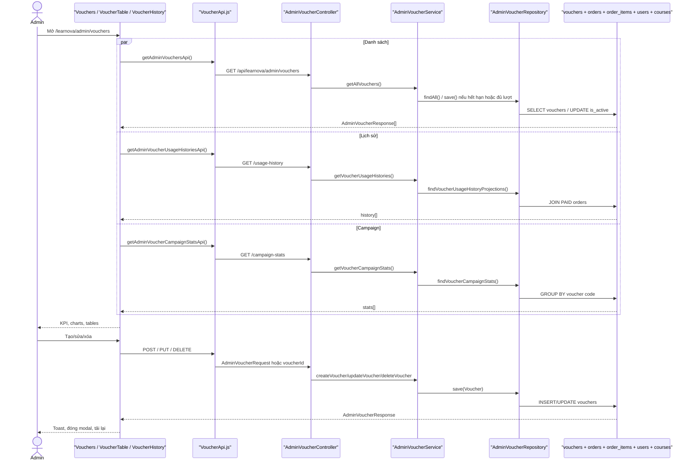
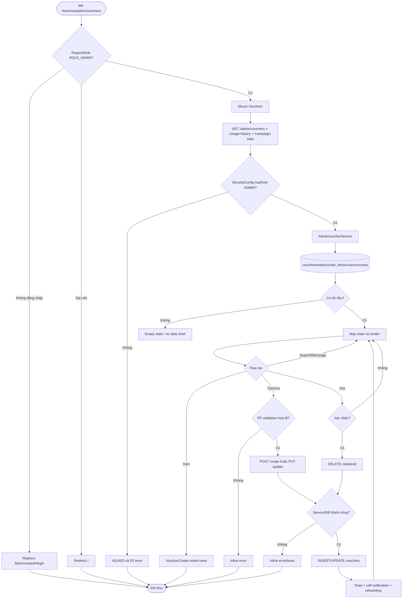

# Detailed Design As-Is — Quản lý mã giảm giá

## 1. Thông tin màn hình

| Thuộc tính | Nội dung |
| --- | --- |
| Tên màn hình | Quản lý mã giảm giá |
| Mã màn hình | Không có mã màn hình trong code |
| Route/URL | `/learnova/admin/vouchers`; route phụ đang khai báo: `/learnova/admin/vouchers/create` |
| Actor | Quản trị viên có `ROLE_ADMIN` |
| Mục đích | Theo dõi chỉ số mã giảm giá, xem kho mã và lịch sử sử dụng, tạo/xem/sửa/vô hiệu hóa mã |
| Nguồn phân tích | Ảnh màn hình + FE + BE |
| Loại tài liệu | Reverse-engineered DD – As-Is |
| Mức độ xác minh | Đã xác minh end-to-end từ route FE đến PostgreSQL migration; một số giá trị KPI chỉ là dữ liệu tĩnh FE |
| File DD | `docs/DD_VoucherManagement.md` |

Quy ước mức xác minh trong tài liệu:

- **Đã xác minh từ code**: có đường dẫn, method và vùng dòng trực tiếp.
- **Suy luận từ ảnh và code**: ảnh khớp cấu trúc render nhưng dữ liệu ảnh không thể tái tạo chỉ từ source.
- **Chưa xác minh**: không tìm thấy nhánh thực thi hoặc bằng chứng source đầy đủ.

## 2. Tổng quan chức năng

Màn hình được mount bởi `AppRoutes.jsx` tại route admin và được chặn ở cả FE lẫn BE bằng `ROLE_ADMIN` (`front_end/src/app/routes/AppRoutes.jsx:72-86`, `RequireRole.jsx:4-25`, `back_end/.../SecurityConfig.java:78-80`). `Vouchers` lần lượt render sáu KPI, hai biểu đồ, bảng voucher, lịch sử sử dụng và modal tạo/xem/sửa (`Vouchers.jsx:39-83`).

Dữ liệu nghiệp vụ được đọc qua bốn API: danh sách voucher, lịch sử sử dụng, thống kê tần suất và thống kê chiến dịch. Tuy nhiên FE hiện chỉ dùng danh sách voucher cho biểu đồ theo tháng hết hạn; API `usage-frequency` tồn tại nhưng không được component hiện tại gọi. Sáu KPI là chuỗi hard-code trong `VoucherCards.jsx:18-67`.

Người dùng có thể tìm/lọc/phân trang cục bộ, mở modal xem chi tiết, chuyển sang sửa, tạo mã mới và xác nhận vô hiệu hóa. Tạo/sửa/xóa làm thay đổi bảng `vouchers`; riêng thao tác xóa chỉ đặt `is_active=false`. Lịch sử và biểu đồ chiến dịch đọc `orders`, `order_items`, `users`, `courses`, `vouchers`. Sau mutation thành công, FE hiển thị toast, cố tạo self-notification và tăng `refreshKey` để tải lại các component (`VoucherCreate.jsx:147-165`, `VoucherTable.jsx:214-239`, `NotificationApi.js:25-36`). Không có export/download trên màn hình voucher. Ảnh biên lai ở route doanh thu không thuộc luồng voucher hiện tại và không được component voucher gọi.

## 3. Đối chiếu ảnh với code

| STT | Thành phần trên ảnh | Loại control | File FE | Component/Method | Event/API | Nguồn dữ liệu | Xác minh |
| --: | --- | --- | --- | --- | --- | --- | --- |
| 1 | Tiêu đề “Mã giảm giá” | Heading của layout | `Header.jsx:77-78` | `Header` | Theo pathname | i18n `admin.vouchers` | Đã xác minh từ code |
| 2 | 6 thẻ KPI | Cards read-only | `VoucherCards.jsx:18-113` | `VoucherCards` + 6 card con | Không có API | Giá trị hard-code `8, 6, 1, 1,634, $322.8, 68.1%` | Đã xác minh; không phải dữ liệu DB |
| 3 | “Tần suất sử dụng mã” | Line chart | `voucher_chart/VoucherChart.jsx:33-52,63-100,200-240` | `buildVoucherChartData`, `VoucherChart` | `GET /admin/vouchers` | Gom `endDate` theo tháng hiện tại | Đã xác minh; label ảnh không phản ánh đúng phép tính |
| 4 | “Chiến dịch mã giảm giá hàng đầu” | Horizontal bar chart | `voucher_campaign_chart/VoucherCampaignChart.jsx:31-64,66-171` | `fetchCampaignData` | `GET /admin/vouchers/campaign-stats` | PAID orders gom theo voucher | Đã xác minh từ code |
| 5 | “Tổng tiền giảm tích lũy” | Summary | Cùng file, dòng 168-209 | `totalRevenue` | Không có event | Tổng `discount_amount` của tối đa 4 campaign đã slice | Đã xác minh từ code |
| 6 | “Lưu trữ chương trình giảm giá” | Section heading | `VoucherTable.jsx:242-254` | `VoucherTable` | Không có | i18n | Đã xác minh từ code |
| 7 | Tìm mã/chiến dịch | Text input | `VoucherTable.jsx:161-174,258-264` | `filteredVouchers` | `onChange` | Lọc code, description, discount, used trên FE | Đã xác minh từ code |
| 8 | Tất cả trạng thái | Select | `VoucherTable.jsx:14-16,156-174,265-271` | `AdminHoverSelect` | `setSelectedStatus` | 5 option tĩnh | Đã xác minh từ code |
| 9 | Tạo mã giảm giá mới | Button | `VoucherTable.jsx:272-278`; `Vouchers.jsx:16-20` | `openCreate` | Mở modal create | Không đọc DB lúc mở | Đã xác minh từ code |
| 10 | Bảng voucher 7 cột | Table | `VoucherTable.jsx:281-360` | map `currentPageItems` | `GET /admin/vouchers` | `AdminVoucherResponse[]` | Đã xác minh từ code |
| 11 | Badge trạng thái | Derived label | `VoucherTable.jsx:107-153` | `normalizedVouchers` | Không có | `isActive`, `endDate`, `usedCount/usageLimit`, localStorage | Đã xác minh từ code |
| 12 | Eye / edit / delete | Buttons | `VoucherTable.jsx:326-352` | callback cha / `openDeleteModal` | Modal; DELETE API khi xác nhận | Voucher row | Đã xác minh từ code |
| 13 | Phân trang voucher | Buttons | `VoucherTable.jsx:176-203,362-397` | `setCurrentPage` | Không gọi API | Slice FE, 5 dòng/trang | Đã xác minh từ code |
| 14 | “Lịch sử sử dụng mã” | Section | `VoucherHistory.jsx:122-137` | `VoucherHistory` | `GET .../usage-history` | PAID orders có voucher | Đã xác minh từ code |
| 15 | Tìm lịch sử | Text input | `VoucherHistory.jsx:85-95,139-148` | `filteredHistories` | `onChange` | student/course/code trên FE | Đã xác minh từ code |
| 16 | Bảng lịch sử 7 cột | Table | `VoucherHistory.jsx:150-200` | map history | Không có row action | Projection BE | Đã xác minh từ code |
| 17 | Modal chi tiết | Modal/read-only form | `Vouchers.jsx:61-82`; `VoucherCreate.jsx:169-394` | mode=`view` | Eye button | Dữ liệu row đã tải, không gọi GET by id | Đã xác minh từ code |
| 18 | Chỉnh sửa / Đóng | Buttons modal | `VoucherCreate.jsx:324-353` | `onEdit`, `onClose` | Chuyển mode hoặc đóng | State cha | Đã xác minh từ code |
| 19 | Modal tạo/sửa | Form | `VoucherCreate.jsx:205-394` | `handleSubmit` | POST hoặc PUT | Form state | Đã xác minh từ code |
| 20 | Popup xác nhận xóa | Dialog | `VoucherTable.jsx:400-440` | `handleDelete` | DELETE `/admin/vouchers/delete/{id}` | Voucher được chọn | Đã xác minh từ code |
| 21 | Modal biên lai PAY-57 ở ảnh | Modal | Không thuộc module voucher | Không tìm thấy trong `presentation/vouchers` | Không có event từ voucher | Route `/revenue/transactions` | Chưa xác minh trong chức năng này; từ khóa: `PAY-57`, `receipt`, `download`; điểm cuối: ảnh thuộc màn hình doanh thu |

## 4. Danh sách source liên quan

| STT | Layer | Đường dẫn file | Class/Component | Method liên quan | Vai trò |
| --: | --- | --- | --- | --- | --- |
| 1 | FE route/auth | `front_end/src/app/routes/AppRoutes.jsx` | `AppRoutes` | routes dòng 73-86 | Khai báo route và `RequireRole` |
| 2 | FE auth | `front_end/src/app/routes/RequireRole.jsx` | `RequireRole` | dòng 4-25 | Redirect login/home nếu không có role |
| 3 | FE page | `front_end/src/features/admin/presentation/vouchers/Vouchers.jsx` | `Vouchers` | `openCreate/openView/openEdit/handleSaved` | Điều phối toàn màn hình và modal |
| 4 | FE KPI | `.../vouchers/voucher_card/VoucherCards.jsx` | `VoucherCards` | map `voucherCards` | Cấp dữ liệu tĩnh cho 6 card con |
| 5 | FE UI | Sáu file `.../voucher_card/*/*VoucherCard.jsx` | 6 card component | render props | Render KPI thuần trình bày |
| 6 | FE chart | `.../vouchers/voucher_chart/VoucherChart.jsx` | `VoucherChart` | `fetchVouchers`, `buildVoucherChartData` | Biểu đồ voucher theo tháng hết hạn |
| 7 | FE chart | `.../voucher_campaign_chart/VoucherCampaignChart.jsx` | `VoucherCampaignChart` | `fetchCampaignData` | Top 4 campaign theo số lần dùng |
| 8 | FE list | `.../voucher_table/VoucherTable.jsx` | `VoucherTable` | fetch/filter/delete/paging | Kho voucher và thao tác |
| 9 | FE history | `.../voucher_history/VoucherHistory.jsx` | `VoucherHistory` | fetch/filter/paging | Lịch sử sử dụng |
| 10 | FE modal/form | `.../voucher_create/VoucherCreate.jsx` | `VoucherCreate` | `handleSubmit`, `getPayload` | Tạo/xem/sửa và preview |
| 11 | FE API | `front_end/src/features/admin/infrastructure/api/VoucherApi.js` | API functions | 7 functions | HTTP client |
| 12 | FE side effect | `front_end/src/features/notification/infrastructure/api/NotificationApi.js` | `adminNotifySuccess` | dòng 25-36 | Toast và self-notification best-effort |
| 13 | FE HTTP | `front_end/src/shared/api-client/AxiosClient.js`; `.../hooks/useAxiosPrivate.js` | axios client/hook | interceptor | Cookie, retry 401 |
| 14 | BE security | `back_end/src/main/java/com/example/back_end/shared/config/SecurityConfig.java` | `SecurityConfig` | `securityFilterChain` | Chặn `/admin/**` cho ADMIN |
| 15 | BE controller | `.../admin/adapter/in/web/AdminVoucherController.java` | `AdminVoucherController` | 7 endpoint | Nhận/trả HTTP |
| 16 | BE DTO | `.../admin/adapter/in/web/dto/AdminVoucher*.java` | 4 response + 1 request records | record accessors | Contract API |
| 17 | BE service | `.../admin/application/AdminVoucherService.java` | `AdminVoucherService` | get/create/update/delete/sync | Business logic, transaction, mapping |
| 18 | BE repository | `.../admin/infrastructure/persistence/AdminVoucherRepository.java` | `AdminVoucherRepository` | JpaRepository + 3 native query | DB access |
| 19 | BE repository | `.../admin/infrastructure/persistence/AdminUserRepository.java` | `AdminUserRepository` | find email/id | Resolve creator |
| 20 | BE entity | `.../commerce/domain/Voucher.java` | `Voucher` | ORM fields | Map bảng `vouchers` |
| 21 | BE entity | `.../commerce/domain/Order.java`; `OrderItem.java` | `Order`, `OrderItem` | ORM fields | Bảng phục vụ lịch sử/thống kê |
| 22 | BE exception | `.../shared/exception/GlobalExceptionHandler.java` | `GlobalExceptionHandler` | handlers | Chuẩn hóa 400/404/409/500 |
| 23 | DB | `back_end/src/main/resources/db/migration/V1__initial_schema.sql` | DDL | vouchers constraints/FK | Schema thực tế |

## 5. Thiết kế chi tiết UI

| STT | Label hiển thị | Tên trong code | Control | Kiểu dữ liệu | Bắt buộc | Mặc định | Nguồn dữ liệu | Điều kiện hiển thị | Event |
| --: | --- | --- | --- | --- | --- | --- | --- | --- | --- |
| 1 | 6 KPI | `voucherCards` | Read-only card | string | N/A | Hằng số | FE | Luôn hiển thị | Không |
| 2 | Search voucher | `searchTerm` | Input text | string | Không | `""` | User | Luôn | Lọc tức thời |
| 3 | Status | `selectedStatus` | Select | enum string | Không | `All statuses` | FE options | Luôn | Lọc tức thời |
| 4 | Mã giảm giá | `form.code` | Input text | string | Có theo FE/DTO | `""` | Row hoặc user | Modal | `handleChange` |
| 5 | Tên chiến dịch | `form.description` | Input text | string | Có theo FE/DTO | `""` | Row hoặc user | Modal | `handleChange` |
| 6 | Loại giảm giá | `form.discountType` | Select | `Fixed/Percent` | Có | `Fixed` | FE options | Modal | Xóa giá trị discount khi đổi loại |
| 7 | Discount Amount/Percent | `form.discountValue` | Number | decimal, step .01 | Có, >0 | `""` | User/row | Modal | Validate ≤100 nếu Percent; ≤99,999,999.99 nếu Fixed |
| 8 | Giới hạn sử dụng | `form.usageLimit` | Number | integer mong đợi | BE yêu cầu >0 | `""` | User/row | Modal | FE chỉ chặn `<0`, input min=0 |
| 9 | Đang hoạt động | `form.isActive` | Select boolean | boolean | Có | `true` | User/row | Modal | Set boolean |
| 10 | Ngày bắt đầu/kết thúc | `startDate/endDate` | Date | `YYYY-MM-DD` | BE yêu cầu parse được | `""` | User/row | Modal | FE cho phép bằng nhau; BE không |
| 11 | Preview | summary card | Read-only | formatted | N/A | placeholder | Form state | Modal | Live update |
| 12 | Lịch sử search | `searchTerm` | Input | string | Không | `""` | User | Luôn | Lọc student/course/code |

Ở mode `view`, tất cả input/select/date bị disabled (`VoucherCreate.jsx:205-319`); ở create/edit chúng editable. Không có `maxLength` cho code/description. Bảng voucher và history đều phân trang client-side sau khi tải toàn bộ. Modal xuất hiện khi `isModalOpen=true`; popup delete khi `deleteTarget` khác null.

## 6. Điểm bắt đầu và điểm kết thúc

| Luồng | File/Method bắt đầu | Điều kiện bắt đầu | Các layer đi qua | File/Method kết thúc | Kết quả |
| --- | --- | --- | --- | --- | --- |
| Mở màn hình | `AppRoutes.jsx:73-86` | URL và ADMIN | RequireRole → Vouchers | React render | Trang hiển thị/loading |
| Tải danh sách | `VoucherTable.fetchVouchers` | mount/refreshKey | FE API → controller → service → repo | `setVouchers` | Bảng voucher |
| Tải chart | `VoucherChart.fetchVouchers`; `VoucherCampaignChart.fetchCampaignData` | mount/refresh | 2 API/BE query | Chart.js render | Line/bar chart |
| Tải lịch sử | `VoucherHistory.fetchVoucherUsageHistories` | mount/refresh | API → native JOIN | `setHistories` | History table |
| Search/filter/page | handlers FE | nhập/chọn/click | FE state/useMemo | render slice | Không chạm DB |
| Xem | `Vouchers.openView` | click eye | state cha → VoucherCreate view | modal | Không gọi API chi tiết |
| Tạo | `VoucherCreate.handleSubmit` | submit hợp lệ | POST → service → INSERT | `handleSaved` | toast, refresh, đóng modal |
| Sửa | `VoucherCreate.handleSubmit` | mode edit | PUT → service → UPDATE | `handleSaved` | toast, refresh, đóng modal |
| Xóa mềm | `VoucherTable.handleDelete` | xác nhận | DELETE → service → UPDATE | state/notification | `is_active=false` |

## 7. Luồng khởi tạo màn hình

1. Router khớp `/learnova/admin/vouchers` trong `AppRoutes.jsx:73-86`.
2. `RequireRole` kiểm tra đăng nhập và role; thiếu auth chuyển login, sai role chuyển `/` (`RequireRole.jsx:7-23`).
3. `Vouchers` tạo state modal, mode, voucher chọn và `refreshKey` (`Vouchers.jsx:10-14`).
4. Các component con mount đồng thời.
5. `VoucherChart` và `VoucherTable` cùng gọi `GET /admin/vouchers`; `VoucherCampaignChart` gọi `/campaign-stats`; `VoucherHistory` gọi `/usage-history`.
6. `AdminVoucherController` nhận các GET (`AdminVoucherController.java:32-50`).
7. `SecurityConfig` yêu cầu role ADMIN; GET không có request validation.
8. Service gọi `findAll` hoặc native queries (`AdminVoucherService.java:43-99`).
9. `getAllVouchers` gọi `syncVoucherAvailability`; voucher hết hạn/đủ lượt đang active bị ghi `is_active=false` ngay trong luồng GET (`AdminVoucherService.java:310-331`).
10. DB đọc `vouchers`; history JOIN `orders/users/vouchers/order_items/courses`; campaign JOIN `orders/vouchers`.
11. Service map entities/projections thành DTO records.
12. FE API trả `response.data`.
13. Components map/normalize/filter và gán state.
14. Chart.js và tables render; KPI render dữ liệu tĩnh.
15. Nếu lỗi, từng component hiển thị message riêng; 401 được interceptor thử refresh một lần rồi logout (`useAxiosPrivate.js:23-62`).

## 8. Luồng từng thao tác

### 8.1 Tìm kiếm, lọc, phân trang

| Bước | Layer | File | Method | Input | Xử lý | Output/Chuyển tiếp |
| ---: | --- | --- | --- | --- | --- | --- |
| 1 | FE | `VoucherTable.jsx:161-203` | `filteredVouchers` | keyword/status/page | Lọc và slice | 5 row/trang |
| 2 | FE | `VoucherHistory.jsx:85-120` | `filteredHistories` | keyword/page | Lọc và slice | 10 row/trang |

Không có FE validation và không gọi BE. Khi search/status thay đổi, logic xem trang hiện hành là 1 nhưng state pagination cũ được giữ theo cặp filter.

### 8.2 Xem chi tiết và đóng modal

| Bước | Layer | File | Method | Input | Xử lý | Output/Chuyển tiếp |
| ---: | --- | --- | --- | --- | --- | --- |
| 1 | FE | `VoucherTable.jsx:328-335` | eye onClick | `v.raw` | Gọi callback | `openView` |
| 2 | FE | `Vouchers.jsx:22-26` | `openView` | voucher | mode=view, open=true | Mount modal |
| 3 | FE | `VoucherCreate.jsx:62-72,205-394` | `getInitialForm` | voucher row | Bind disabled controls/preview | Hiển thị chi tiết |
| 4 | FE | `VoucherCreate.jsx:324-352` | edit/close | click | mode edit hoặc close | Kết thúc |

Không gọi `GET /admin/vouchers/{id}`; dữ liệu có thể cũ so với DB.

### 8.3 Tạo voucher

| Bước | Layer | File | Method | Input | Xử lý | Output/Chuyển tiếp |
| ---: | --- | --- | --- | --- | --- | --- |
| 1 | FE | `Vouchers.jsx:16-20` | `openCreate` | click | reset selected, mode=create | Modal |
| 2 | FE | `VoucherCreate.jsx:105-142` | `handleSubmit` | form | Validate user/code/description/value/limit/date | Error hoặc tiếp tục |
| 3 | FE API | `VoucherApi.js:23-25` | `createAdminVoucherApi` | payload | POST `/admin/vouchers/create` | JSON |
| 4 | Security | `SecurityConfig.java:78-80` | filter chain | token | ADMIN only | 401/403 hoặc controller |
| 5 | Controller | `AdminVoucherController.java:57-63` | `createVoucher` | Authentication + DTO | Gọi service | response |
| 6 | Service | `AdminVoucherService.java:125-192` | `createVoucher` | request | Validate type/value/date/limit, resolve user | `save` |
| 7 | DB | `AdminVoucherRepository`/`vouchers` | `save` | entity | INSERT trong transaction | entity có id |
| 8 | FE | `VoucherCreate.jsx:150-165`; `Vouchers.jsx:34-37` | success | response không dùng | toast/self-notification, refresh, close | Bảng/chart reload |

Thất bại: FE hiện `response.data.message` hoặc fallback. DTO annotations không chạy vì controller thiếu `@Valid`; service là lớp bảo vệ chính.

### 8.4 Sửa voucher

| Bước | Layer | File | Method | Input | Xử lý | Output/Chuyển tiếp |
| ---: | --- | --- | --- | --- | --- | --- |
| 1 | FE | `VoucherTable.jsx:336-343` hoặc view modal | edit callback | voucher | mode=edit | Editable modal |
| 2 | FE | `VoucherCreate.handleSubmit` | form | Cùng FE validation | PUT |
| 3 | Controller | `AdminVoucherController.java:65-71` | `updateVoucher` | id + DTO | Service | DTO |
| 4 | Service | `AdminVoucherService.java:213-261` | `updateVoucher` | request | Find voucher, parse type/date, validate date/limit, resolve creator | UPDATE |
| 5 | FE | `handleSaved` | success | notification + refresh | đóng modal | Kết thúc |

BE update không lặp validation `discountValue > 0` và `Percent <=100`; DB constraints chặn phần lớn giá trị sai, trả 409 qua global handler.

### 8.5 Xóa/vô hiệu hóa

| Bước | Layer | File | Method | Input | Xử lý | Output/Chuyển tiếp |
| ---: | --- | --- | --- | --- | --- | --- |
| 1 | FE | `VoucherTable.jsx:344-350,400-440` | `openDeleteModal` | row | Mở xác nhận | Cancel/confirm |
| 2 | FE API | `VoucherApi.js:33-35` | `deleteAdminVoucherApi` | id | DELETE | DTO |
| 3 | BE | `AdminVoucherController.java:73-76` | `deleteVoucher` | path id | Service | DTO |
| 4 | BE/DB | `AdminVoucherService.java:282-307` | `deleteVoucher` | id | find, set false, save | UPDATE `vouchers` |
| 5 | FE | `VoucherTable.jsx:220-239` | success | DTO | update state + localStorage id + refresh + notification | Badge “Đã xóa” |

Không xóa vật lý. Nút bị disabled nếu trạng thái FE là `Delete`. Lỗi hiển thị toast.

## 9. API specification

| API | HTTP method | Nơi gọi | Controller | Request | Response | Mục đích |
| --- | --- | --- | --- | --- | --- | --- |
| `/api/learnova/admin/vouchers` | GET | Table + line chart | `getAllVouchers` | Không body | `AdminVoucherResponse[]` | Danh sách; có thể auto-deactivate |
| `/api/learnova/admin/vouchers/usage-history` | GET | History | `getVoucherUsageHistories` | Không | `AdminVoucherUsageHistoryResponse[]` | PAID voucher orders |
| `/api/learnova/admin/vouchers/usage-frequency` | GET | Không có nơi gọi hiện tại | `getVoucherUsageFrequency` | Không | month/activations[] | Endpoint thống kê tồn tại nhưng unused |
| `/api/learnova/admin/vouchers/campaign-stats` | GET | Campaign chart | `getVoucherCampaignStats` | Không | code/usedCount/revenue[] | Top campaign |
| `/api/learnova/admin/vouchers/{voucherId}` | GET | Không có nơi gọi hiện tại | `getVoucherById` | Path `Long` | Voucher DTO | Chi tiết server |
| `/api/learnova/admin/vouchers/create` | POST | VoucherCreate | `createVoucher` | `AdminVoucherRequest` | Voucher DTO | INSERT |
| `/api/learnova/admin/vouchers/update/{voucherId}` | PUT | VoucherCreate | `updateVoucher` | path + request | Voucher DTO | UPDATE |
| `/api/learnova/admin/vouchers/delete/{voucherId}` | DELETE | VoucherTable | `deleteVoucher` | path | Voucher DTO | Soft delete |

Mọi API admin cần cookie/token hợp lệ và `ROLE_ADMIN`. FE client có `Content-Type: application/json`, `withCredentials=true` (`AxiosClient.js:3-10`). Request fields: `code`, `description`, `discountType`, `discountValue`, `minimumOrder`, `maximumDiscountAmount`, `usageLimit`, `startDate`, `endDate`, `isActive`, `createdById` (`AdminVoucherRequest.java:8-20`). Thành công controller dùng status mặc định 200, kể cả POST. Lỗi: 400 BusinessException, 404 not found, 409 DB integrity, 401/403 security, 500 generic (`GlobalExceptionHandler.java:32-117`). FE dùng `.message`; security 401 raw body dùng `error`, nên fallback có thể xuất hiện.

## 10. Backend processing

| Layer | File | Class | Method | Input | Xử lý | Gọi tiếp | Output |
| --- | --- | --- | --- | --- | --- | --- | --- |
| Security | `SecurityConfig.java` | SecurityConfig | `securityFilterChain` | request | ADMIN guard | Controller | permit/deny |
| Controller | `AdminVoucherController.java` | Controller | 7 methods | HTTP | Pass-through | Service | DTO/list |
| Service | `AdminVoucherService.java` | Service | getters | none/id | map + sync availability | Repository | DTO |
| Service | Cùng file | Service | create/update/delete | DTO | validation/mutation | Repository/UserRepo | DTO |
| Repository | `AdminVoucherRepository.java` | JpaRepository | find/save/native query | entity/query | ORM/SQL | PostgreSQL | entities/projections |
| Exception | `GlobalExceptionHandler.java` | Advice | handlers | exceptions | Map status/message | HTTP | ErrorResponse |

`@Transactional` đặt ở class service (`AdminVoucherService.java:28-30`), vì vậy cả GET và mutation đều chạy transaction; GET danh sách có thể ghi DB khi sync. Response được tạo thủ công trong service, không có mapper riêng.

## 11. Database và query

| Bảng | Cột sử dụng | Mục đích | Thao tác | File/Method truy cập |
| --- | --- | --- | --- | --- |
| `vouchers` | toàn bộ entity fields | list/detail/create/update/delete/status | SELECT/INSERT/UPDATE | `Voucher`, JpaRepository |
| `orders` | order_id,user_id,voucher_id,status,discount_amount,created_at | history/frequency/campaign | SELECT, WHERE PAID/voucher not null, GROUP/ORDER | 3 native queries |
| `order_items` | order_id,course_id,original_price,price | history amounts/course | JOIN SELECT | history query |
| `users` | user_id,full_name,email,is_deleted | student/creator | JOIN/find | history/create/update |
| `courses` | course_id,title | course history | JOIN SELECT | history query |

Query history (`AdminVoucherRepository.java:17-34`) inner-join 5 bảng, lọc `o.status='PAID' AND o.voucher_id IS NOT NULL`, sắp mới nhất; một order nhiều item sinh nhiều dòng và dùng cùng `o.discount_amount` cho từng item. Frequency (`:36-45`) đếm distinct order theo `date_trunc(month,o.created_at)`. Campaign (`:69-80`) đếm distinct order và sum discount, group code, sort số order giảm dần.

DDL `V1__initial_schema.sql:1609-1632` quy định numeric(10,2), `discount_value>0`, Percent≤100, `used_count<=usage_limit`, end>start, non-negative. `vouchers.code` unique (`V1:2170-2174`); FK order→voucher `ON DELETE SET NULL` (`V1:2948-2952`), voucher.created_by→users (`V1:3060-3064`). Null voucher không vào history. Không có DELETE SQL trong admin flow.

## 12. Mapping dữ liệu FE–BE–DB

| Dữ liệu | UI field | FE variable | Request field | Backend DTO | Service/Repository | Table.Column | Response field | UI hiển thị |
| --- | --- | --- | --- | --- | --- | --- | --- | --- |
| ID | hidden/row key | `voucher.id` | path id | `Long` | findById | vouchers.voucher_id | id | action target |
| Code | Mã | `form.code` | code | String | trim/set | vouchers.code | code | table/modal |
| Campaign | Tên chiến dịch | `description` | description | String | trim/set | vouchers.description | description | table/modal |
| Type | Loại | `discountType` | discountType | String→enum | valueOf | vouchers.discount_type | discountType | select/format |
| Value | Giảm giá | `discountValue` | discountValue | BigDecimal | validate/set | vouchers.discount_value | discountValue | `$x`/`x%` |
| Limit | Sức chứa | `usageLimit` | usageLimit | Integer | validate/set | vouchers.usage_limit | usageLimit | used/limit |
| Used | Đã dùng | row field | không gửi | Integer | read | vouchers.used_count | usedCount | used/limit |
| Dates | Ngày bắt/kết | form dates | ISO offset strings | String→OffsetDateTime | parse/set | start_date/end_date | OffsetDateTime | dd/mm/yyyy |
| Active | Trạng thái | `isActive/status` | isActive | Boolean | set/sync | vouchers.is_active | isActive | badge |
| Student | Học viên | history.student | N/A | usage response | native query | users.full_name | studentName | text |
| Course | Khóa học | history.course | N/A | usage response | native query | courses.title | registeredCourse | text |
| Amounts | Giá gốc/giảm/trả | formatted history | N/A | BigDecimal | native query | order_items.original_price, orders.discount_amount, order_items.price | corresponding fields | VND |

## 13. Business rule rút ra từ code

| ID | Business rule hiện tại | Điều kiện | File/Method | Khi đúng | Khi sai | Mức xác minh |
| --- | --- | --- | --- | --- | --- | --- |
| BR-01 | Chỉ ADMIN truy cập API | role ADMIN | `SecurityConfig:78-80` | xử lý | 403/401 | Đã xác minh |
| BR-02 | Voucher tự inactive khi hết hạn/đủ lượt | active và condition | `syncVoucherAvailability:310-331` | save false | giữ nguyên | Đã xác minh |
| BR-03 | Giá trị discount >0; percent≤100 khi tạo | create | `createVoucher:141-151` | tiếp tục | 400 | Đã xác minh |
| BR-04 | End phải sau start | create/update | service lines 153-165,227-239 | tiếp tục | 400 | Đã xác minh |
| BR-05 | Usage limit phải >0 ở BE | create/update | lines 167-169,241-243 | tiếp tục | 400 | Đã xác minh |
| BR-06 | Người tạo create lấy theo email auth, bỏ qua `createdById` request | create | lines 171-188 | set auth user | 404 | Đã xác minh |
| BR-07 | Update lại gán creator theo request `createdById` | update | lines 245-258 | đổi FK creator | 404 | Đã xác minh |
| BR-08 | Delete là deactivate | delete | lines 282-289 | is_active=false | 404 | Đã xác minh |
| BR-09 | History chỉ PAID + voucher | query | repo lines 17-34 | trả row | bỏ qua | Đã xác minh |
| BR-10 | Status “Delete” của FE gộp mọi `isActive=false` và localStorage id | normalization | `VoucherTable:121-132` | badge deleted | active/inactive derived | Đã xác minh |

## 14. Validation, permission và message

| Loại | Điều kiện | FE/BE | File/Method | Mã/Nội dung message | Hành vi |
| --- | --- | --- | --- | --- | --- |
| Auth | chưa login/sai role | FE | `RequireRole` | redirect | login hoặc `/` |
| Permission | không ADMIN | BE | `SecurityConfig` | Unauthorized/permission | 401/403 |
| Required | thiếu user id | FE | `handleSubmit` | “Không xác định được người dùng...” | dừng |
| Required | code/description rỗng | FE | `handleSubmit` | codeDescriptionRequired | dừng |
| Discount | ≤0, percent>100, fixed>max | FE | lines 119-132 | i18n messages | dừng |
| Usage | `<0` FE; `<=0` BE | FE/BE | lines 134-137; service | usage messages | dừng/400 |
| Date | FE end<start; BE end không sau start | FE/BE | lines 139-142; service | date invalid | dừng/400 |
| DTO | annotations | BE | `AdminVoucherRequest` | default validation message | **Không chạy ở controller do thiếu `@Valid`** |
| DB | unique/check/numeric/FK | DB | V1 migration | Global handler generic conflict | 409 hoặc specialized overflow 400 |
| Success | create/update/delete | FE | `adminNotifySuccess` | English toast | toast + best-effort notification |
| API failure | request error | FE | table/history/form handlers | response.message/fallback | inline/toast |

## 15. Mermaid sequence toàn bộ màn hình

## 16. Mermaid flowchart

## 17. Phân tích từng source trong cùng file DD

### File: `front_end/src/app/routes/AppRoutes.jsx` và `RequireRole.jsx`

- Layer: FE routing/authorization. Route voucher ở `AppRoutes.jsx:73-86`; `RequireRole:4-25` kiểm tra auth, roles và activeRole.
- Input/output: URL + auth context → component hoặc redirect. Không gọi API voucher.

### File: `front_end/src/features/admin/presentation/vouchers/Vouchers.jsx`

- Layer: Page orchestrator; methods `openCreate`, `openView`, `openEdit`, `handleSaved` (`:10-37`).
- Gọi các card/chart/table/history và modal (`:39-83`). Input là callbacks/state; output là toàn bộ UI. Không tự bắt exception.

### File: `front_end/src/features/admin/presentation/vouchers/voucher_card/VoucherCards.jsx` và sáu `*VoucherCard.jsx`

- Layer: UI. `VoucherCards:18-67` chứa toàn bộ KPI tĩnh; `:78-113` dịch label và truyền props. Sáu component con chỉ render `title/value/note/icon/accent`; không có API, điều kiện hay validation.
- Ảnh hưởng: tạo đúng sáu KPI trong ảnh nhưng không phản ánh DB.

### File: `front_end/src/features/admin/presentation/vouchers/voucher_chart/VoucherChart.jsx`

- Layer: FE chart. `fetchVouchers` (`:63-91`) gọi list API; `buildVoucherChartData` (`:33-52`) group theo `endDate`, không dùng lịch sử sử dụng.
- Output: Chart.js 12 tháng năm client hiện tại; lỗi/empty overlay ở `:224-238`.

### File: `front_end/src/features/admin/presentation/vouchers/voucher_campaign_chart/VoucherCampaignChart.jsx`

- Layer: FE chart. `fetchCampaignData` (`:31-64`) map/sort/slice top 4; Chart.js ở `:66-166`; tổng doanh thu của tập đã slice ở `:168-209`.
- Input/output: stats API → code/used/revenue → bar chart + VND summary.

### File: `front_end/src/features/admin/presentation/vouchers/voucher_table/VoucherTable.jsx`

- Layer: FE list/mutation. Fetch `:79-105`, derive status `:107-153`, filter/page `:161-203`, delete `:205-240`, render/action `:242-440`.
- Exception: inline load error; delete toast. Dùng localStorage `learnova.admin.deletedVoucherIds` (`:17-33`).

### File: `front_end/src/features/admin/presentation/vouchers/voucher_history/VoucherHistory.jsx`

- Layer: FE history. Fetch `:41-68`; normalize/format VND/date `:70-83`; filter/page `:85-120`; render `:122-242`.
- Input/output: usage API array → bảng; không có thao tác chi tiết/download.

### File: `front_end/src/features/admin/presentation/vouchers/voucher_create/VoucherCreate.jsx`

- Layer: modal/form. `getPayload:48-60`, initial form `:62-72`, validation/submit `:105-167`, controls/preview `:169-394`.
- Fixed payload: `minimumOrder=0`; Percent `maximumDiscountAmount=99,999,999.99`, Fixed=0. Dates ghép UTC đầu/cuối ngày. Response API không được dùng.

### File: `front_end/src/features/admin/infrastructure/api/VoucherApi.js`

- Layer: FE API; bảy methods tại `:3-35`. `getAdminVoucherUsageFrequencyApi` được export nhưng không có caller; GET by id không được khai báo ở FE API.

### File: `front_end/src/features/notification/infrastructure/api/NotificationApi.js`

- Layer: FE side effect. `adminNotifySuccess:25-36` hiển thị toast trước, POST `/notifications/self`, phát event; lỗi notification bị nuốt.

### File: `back_end/src/main/java/com/example/back_end/admin/adapter/in/web/AdminVoucherController.java`

- Layer: REST controller. Base `/api/learnova/admin/vouchers`; các method `:32-76`. Không có `@Valid`, không khai báo HTTP status riêng và không có permission annotation cục bộ; permission từ SecurityConfig.

### File: `back_end/src/main/java/com/example/back_end/admin/application/AdminVoucherService.java`

- Layer: transactional service. Getter/mapping `:43-123`, create `:125-211`, update `:213-280`, soft-delete `:282-308`, availability sync `:310-332`.
- Exception: BusinessException/ResourceNotFoundException. Không kiểm tra duplicate trước save; DB unique xử lý.

### File: `back_end/src/main/java/com/example/back_end/admin/infrastructure/persistence/AdminVoucherRepository.java`

- Layer: repository. `JpaRepository<Voucher,Long>` và `findByCode` (`:14-15`; method không được admin service dùng). Ba native query tại `:17-80`.
- Output: projection interfaces. Query không phân trang; toàn bộ dữ liệu trả về FE.

### File: các DTO `back_end/src/main/java/com/example/back_end/admin/adapter/in/web/dto/AdminVoucher*.java`

- `AdminVoucherRequest:8-20`: contract mutation với Jakarta annotations nhưng thiếu `@Valid` tại controller.
- `AdminVoucherResponse:9-25`: entity snapshot.
- `AdminVoucherUsageHistoryResponse:6-14`, `UsageFrequencyResponse:3-6`, `CampaignStatsResponse:9-13`: projection output.

### File: `back_end/src/main/java/com/example/back_end/commerce/domain/Voucher.java`, `Order.java`, `OrderItem.java`

- Layer: JPA entities. `Voucher:20-92` map bảng/quan hệ; `Order:23-78` map user/voucher/amount/status; `OrderItem:15-42` map course và giá.
- Ảnh hưởng: nguồn ORM/column cho list và nguồn bảng cho native history/stats.

### File: `back_end/src/main/java/com/example/back_end/shared/config/SecurityConfig.java` và `GlobalExceptionHandler.java`

- Security `:41-80`: stateless, CSRF off, admin-only. Exception handler `:32-117`: map not found/business/auth/integrity/generic.

### File: `back_end/src/main/resources/db/migration/V1__initial_schema.sql`

- Layer: DB DDL. Bảng/check `:1609-1632`, identity `:1640-1647`, unique code `:2170-2174`, order voucher FK `:2948-2952`, creator FK `:3060-3064`.

## 18. Rủi ro kỹ thuật

| Mức độ | File/Method | Vấn đề | Bằng chứng | Ảnh hưởng | Cách kiểm tra |
| --- | --- | --- | --- | --- | --- |
| Cao | `VoucherCards.jsx:18-67` | KPI hard-code | Không có state/API | Số liệu sai DB | Đổi DB và reload; KPI không đổi |
| Cao | `VoucherChart.jsx:33-52` | “Tần suất sử dụng” đếm voucher theo tháng hết hạn | group `item.endDate` | Biểu đồ sai ngữ nghĩa; API frequency unused | So sánh `/usage-frequency` với chart |
| Cao | `AdminVoucherService:180-182` + DB numeric(10,2) | Create Percent đặt max `999999999`, vượt tối đa numeric(10,2) | 9 chữ số nguyên, DB chỉ 8 | POST Percent có nguy cơ 400 overflow | Tạo voucher Percent hợp lệ |
| Cao | Controller mutation | DTO annotations không kích hoạt | `@RequestBody` thiếu `@Valid` | null code/date có thể thành NPE/500 | Gửi body thiếu fields |
| Trung bình | FE vs BE date/limit | FE cho usageLimit=0 và end=start; BE yêu cầu >0 và end>start | FE `:134-142`; BE `:163-169` | FE pass rồi BE 400 | Boundary tests |
| Trung bình | `updateVoucher:213-261` | Thiếu validation discount null/>0/percent≤100 | Không có logic như create | DB conflict 409 thay vì 400; null có thể lỗi | PUT invalid values |
| Trung bình | `VoucherTable:121-132` | Mọi inactive bị gắn “Đã xóa” | `item.isActive===false` | Không phân biệt inactive/expired/deleted | Set inactive bằng edit |
| Trung bình | localStorage deleted ids | Trạng thái delete phụ thuộc browser | lines 17-33,121-123 | Client khác không có dấu delete riêng | Xóa rồi mở browser khác |
| Trung bình | History query | Discount order lặp cho từng order item | select `o.discount_amount` sau join items | Tổng/row có thể gây hiểu nhầm | Order có nhiều course |
| Trung bình | GET list | GET có side effect UPDATE | sync + save trong getAll | Read request thay đổi DB | Voucher vừa hết hạn rồi GET |
| Thấp | Detail modal | Không gọi GET by id | dùng `v.raw`; endpoint detail unused | Có thể hiển thị stale | Sửa DB giữa load và open |
| Thấp | Route `/vouchers/create` | Component standalone không có `onSaved/onClose` | route `AppRoutes:86`; callbacks optional | Sau success không điều hướng/refresh; cancel không làm gì | Mở URL trực tiếp |
| Thấp | Campaign total | Tổng chỉ top 4 sau slice | `:41-45`, `:168-171` | Label “tích lũy” không phải toàn bộ | Có >4 campaign |
| Thấp | Currency | List/modal Fixed dùng USD, history/chart dùng VND | formatters khác nhau | Khó đối chiếu | Kiểm tra cùng voucher/order |

## 19. Test case rút ra từ code

| ID | Chức năng | Tiền điều kiện | Thao tác | Input | Kết quả mong đợi theo code | File/Method |
| --- | --- | --- | --- | --- | --- | --- |
| TC-01 | Route permission | Chưa login | Mở URL | N/A | Redirect login | `RequireRole` |
| TC-02 | Route permission | User không ADMIN | Mở URL/API | N/A | FE redirect; BE 403 | RequireRole/SecurityConfig |
| TC-03 | Load | ADMIN | Mở trang | N/A | 3 API chính; table/chart/history render | `Vouchers` children |
| TC-04 | Empty | API trả [] | Mở | N/A | Empty table/history/chart messages | component branches |
| TC-05 | Search/filter | Có data | Nhập/chọn | code/status | Danh sách client-side lọc, page 1 logic | `filteredVouchers` |
| TC-06 | View | Có voucher | Eye | row | Disabled modal, không gọi detail API | `openView` |
| TC-07 | Create happy path | ADMIN/currentUser | Submit | Fixed >0, limit>0, end>start | INSERT, toast, close, refresh | `handleSubmit/createVoucher` |
| TC-08 | Create Percent | Như trên | Submit | Percent 20 | Có nguy cơ DB numeric overflow do max amount | service create |
| TC-09 | Required | Modal | Submit | code/description rỗng | FE inline error | handleSubmit |
| TC-10 | Discount boundary | Modal | Submit | 0; Percent 100/100.01 | 0 và 100.01 lỗi; 100 qua FE | handleSubmit |
| TC-11 | Limit mismatch | Modal | Submit | 0 | FE cho qua, BE 400 | FE/BE validation |
| TC-12 | Date mismatch | Modal | Submit | start=end | FE cho qua, BE 400 | FE/BE validation |
| TC-13 | Duplicate | Code tồn tại | Create/update | same code | DB unique → 409 generic conflict | migration/global handler |
| TC-14 | Update not found | ADMIN | PUT | unknown id | 404 | updateVoucher |
| TC-15 | Delete | Active voucher | Confirm delete | id | DB is_active=false; badge deleted; toast | handleDelete/deleteVoucher |
| TC-16 | Delete cancel | Popup mở | Cancel/backdrop | N/A | đóng popup; DB không đổi | closeDeleteModal |
| TC-17 | Auto deactivate expiry | Active expired row | GET list | endDate≤now | GET cập nhật false | syncVoucherAvailability |
| TC-18 | History null/empty | Không PAID voucher order | Load | N/A | không row | native query |
| TC-19 | Backend exception | DB lỗi | Load/mutation | N/A | inline/toast fallback; 500 JSON | catch/global handler |
| TC-20 | Notification lỗi | Mutation đã thành công | self notification fail | N/A | success toast vẫn có, lỗi bị nuốt | adminNotifySuccess |
| TC-21 | Export/download | N/A | Tìm control | N/A | Không có control/API trong module | Chưa xác minh/không tồn tại trong code voucher |

## 20. Kết luận End-to-End

Chức năng bắt đầu tại `AppRoutes.jsx:73-86` và `RequireRole.jsx:4-25`, sau đó vào `Vouchers.jsx:10-88`. Các component gọi `VoucherApi.js`, đi qua `AdminVoucherController`, `AdminVoucherService`, `AdminVoucherRepository` đến `vouchers`, `orders`, `order_items`, `users`, `courses`. Business logic tập trung ở service: validation create/update, resolve creator, soft-delete và tự deactivate. Native SQL xử lý history/frequency/campaign.

Response DTO quay lại các component, được map thành chart/table state rồi render. Mutation kết thúc tại `handleSaved` hoặc `handleDelete`: hiển thị toast, cố tạo notification, tăng `refreshKey`, đóng modal hoặc cập nhật badge. Các phần đã xác minh gồm route, permission, toàn bộ API, transaction, query, constraints và UI handlers. Chưa xác minh trong chức năng voucher: ảnh modal biên lai PAY-57 vì thuộc `/revenue/transactions`; không có download/export voucher. API GET detail và usage-frequency đã xác minh tồn tại nhưng chưa có caller FE hiện tại.
